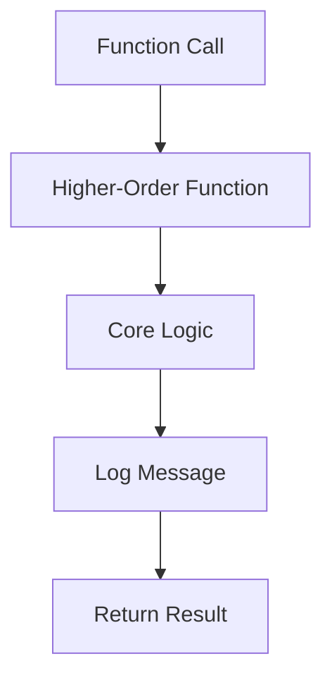

## 11.6 Structured Logging in Functional Code

In the realm of software development, logging is an indispensable tool for diagnosing issues, understanding application behavior, and ensuring system reliability. As experienced Java developers transitioning to Clojure, you may already appreciate the importance of logging in imperative programming. However, functional programming introduces unique challenges and opportunities for logging, particularly in maintaining purity and avoiding side effects. In this section, we will explore structured logging in functional code, focusing on best practices and tools available in Clojure.

### Importance of Logging

Logging serves as the eyes and ears of your application, providing insights into its operation and helping you troubleshoot issues. In production systems, where direct debugging is often impractical, logs become the primary source of information for diagnosing problems. Effective logging can help you:

- **Monitor Application Health**: Track performance metrics and detect anomalies.
- **Diagnose Issues**: Identify the root cause of errors and unexpected behavior.
- **Audit and Compliance**: Maintain records of application activity for compliance purposes.
- **Improve User Experience**: Quickly resolve issues that affect end-users.

In functional programming, logging must be handled carefully to preserve the principles of immutability and purity. Let's explore how to achieve this in Clojure.

### Functional Logging Practices

Incorporating logging into functional code requires a thoughtful approach to avoid introducing side effects. Here are some best practices to consider:

#### 1. Use Pure Functions

Ensure that your logging functions are pure, meaning they do not alter any state or produce side effects. Instead of directly writing logs within your business logic, consider returning log messages as part of your function's output. This approach allows you to separate logging from the core logic, maintaining purity.

```clojure
(defn process-data [data]
  (let [result (transform-data data)
        log-message (str "Processed data: " result)]
    {:result result
     :log log-message}))

;; Usage
(let [{:keys [result log]} (process-data input-data)]
  (println log)
  result)
```

#### 2. Leverage Higher-Order Functions

Higher-order functions can be used to wrap logging around your core logic. This technique allows you to inject logging behavior without modifying the original function.

```clojure
(defn with-logging [f]
  (fn [& args]
    (let [result (apply f args)]
      (println "Function called with args:" args "Result:" result)
      result)))

(defn add [x y]
  (+ x y))

(def logged-add (with-logging add))

(logged-add 3 4) ;; Logs: Function called with args: (3 4) Result: 7
```

#### 3. Use Contextual Logging

Contextual logging involves including additional context in your log messages to make them more informative. This can be achieved by passing context information through your functions and including it in your logs.

```clojure
(defn process-request [request context]
  (let [response (handle-request request)]
    (println "Request processed" {:request request :response response :context context})
    response))

(process-request {:id 1 :data "example"} {:user "admin" :session-id "abc123"})
```

### Logging Libraries

Clojure offers several libraries for structured logging, each with its own strengths. Let's explore two popular options: Timber and tools.logging.

#### Timber

[Timber](https://github.com/functionalbytes/timber) is a Clojure library designed for structured logging. It provides a simple API for logging messages with structured data, making it easy to include context and metadata in your logs.

```clojure
(require '[timber.core :as log])

(log/info {:event "user-login" :user-id 123 :timestamp (System/currentTimeMillis)})
```

Timber supports various log levels (e.g., `info`, `warn`, `error`) and allows you to configure log outputs, such as writing to files or external logging services.

#### tools.logging

[tools.logging](https://clojure.github.io/tools.logging/) is another popular library for logging in Clojure. It provides a simple interface for logging messages at different levels and integrates well with existing Java logging frameworks.

```clojure
(require '[clojure.tools.logging :as log])

(log/info "Application started")
(log/error "An error occurred" {:error-code 500 :details "Internal Server Error"})
```

tools.logging allows you to leverage Java's logging infrastructure, making it a great choice for projects that require interoperability with Java libraries.

### Contextual Logging

Contextual logging enhances the usefulness of log messages by including relevant context, such as user information, request IDs, or session data. This practice is particularly valuable in distributed systems, where tracing the flow of requests across services is crucial.

#### Implementing Contextual Logging

To implement contextual logging, you can pass context information through your functions and include it in your log messages. Here's an example using tools.logging:

```clojure
(defn process-order [order context]
  (log/info "Processing order" {:order-id (:id order) :context context})
  ;; Process the order
  )

(process-order {:id 42 :items ["item1" "item2"]} {:user "jdoe" :session-id "xyz789"})
```

In this example, the context includes user and session information, which is logged alongside the order details.

### Comparing Java and Clojure Logging

Java developers may be familiar with logging frameworks like Log4j or SLF4J. While these frameworks are powerful, they often involve configuration files and complex setups. In contrast, Clojure's logging libraries, such as tools.logging, offer a more straightforward approach, leveraging Clojure's dynamic nature and simplicity.

#### Java Logging Example

```java
import org.slf4j.Logger;
import org.slf4j.LoggerFactory;

public class Application {
    private static final Logger logger = LoggerFactory.getLogger(Application.class);

    public static void main(String[] args) {
        logger.info("Application started");
        try {
            // Application logic
        } catch (Exception e) {
            logger.error("An error occurred", e);
        }
    }
}
```

#### Clojure Logging Example

```clojure
(require '[clojure.tools.logging :as log])

(defn start-application []
  (log/info "Application started")
  (try
    ;; Application logic
    (catch Exception e
      (log/error e "An error occurred"))))

(start-application)
```

### Try It Yourself

Experiment with the following code snippets to deepen your understanding of structured logging in Clojure. Modify the examples to include additional context or change the log levels.

#### Exercise 1: Contextual Logging

1. Modify the `process-order` function to include additional context, such as the order total and customer email.
2. Log this information at the `debug` level.

#### Exercise 2: Higher-Order Logging

1. Create a higher-order function `with-timing` that logs the execution time of a given function.
2. Use this function to wrap the `process-order` function and log the time taken to process an order.

### Visual Aids

To better understand the flow of data through logging functions, consider the following diagram illustrating the use of higher-order functions for logging:



**Diagram Description**: This flowchart demonstrates how a higher-order function can wrap core logic to inject logging behavior, ensuring that logs are generated without modifying the original function.

### References and Links

- [Clojure Official Documentation](https://clojure.org/reference/documentation)
- [Timber GitHub Repository](https://github.com/functionalbytes/timber)
- [tools.logging Documentation](https://clojure.github.io/tools.logging/)
- [SLF4J Official Website](http://www.slf4j.org/)

### Knowledge Check

To reinforce your understanding of structured logging in functional code, consider the following questions:

1. What are the benefits of using pure functions for logging in functional programming?
2. How can higher-order functions be used to incorporate logging without modifying core logic?
3. What is the advantage of contextual logging in distributed systems?
4. Compare the logging practices in Java and Clojure. What are the key differences?
5. How can you implement structured logging using the Timber library in Clojure?

### Summary

Structured logging is a critical aspect of building scalable and maintainable applications. By following functional logging practices and leveraging Clojure's powerful libraries, you can implement effective logging without compromising the principles of functional programming. As you continue to explore Clojure, remember to experiment with different logging strategies and tools to find the best fit for your applications.

## Quiz: Mastering Structured Logging in Clojure



### What is a key benefit of using pure functions for logging in functional programming?

- [x] They avoid side effects and maintain function purity.
- [ ] They allow direct modification of global state.
- [ ] They simplify the logging configuration process.
- [ ] They automatically handle exceptions.

> **Explanation:** Pure functions do not produce side effects, which aligns with the principles of functional programming, ensuring that logging does not interfere with the core logic.

### How can higher-order functions be used in logging?

- [x] By wrapping core logic to inject logging behavior.
- [ ] By directly modifying the function's internal state.
- [ ] By replacing the original function with a logging function.
- [ ] By automatically generating log messages.

> **Explanation:** Higher-order functions can wrap existing functions, adding logging behavior without altering the original function's logic.

### What is the advantage of contextual logging?

- [x] It provides additional context, making logs more informative.
- [ ] It reduces the amount of log data generated.
- [ ] It simplifies the logging configuration.
- [ ] It automatically formats log messages.

> **Explanation:** Contextual logging includes relevant information, such as user and session data, which aids in debugging and tracing issues in distributed systems.

### Which Clojure library is known for structured logging?

- [x] Timber
- [ ] Log4j
- [ ] SLF4J
- [ ] Logback

> **Explanation:** Timber is a Clojure library designed for structured logging, allowing developers to include context and metadata in log messages.

### How does Clojure's logging approach differ from Java's?

- [x] Clojure's approach is more dynamic and simpler.
- [ ] Clojure requires complex configuration files.
- [ ] Java's approach is more dynamic and simpler.
- [ ] Java does not support structured logging.

> **Explanation:** Clojure's logging libraries, such as tools.logging, offer a straightforward approach, leveraging Clojure's dynamic nature, unlike Java's often complex configurations.

### What is the purpose of the `with-logging` higher-order function?

- [x] To add logging behavior to an existing function.
- [ ] To replace the original function with a logging function.
- [ ] To automatically generate log messages.
- [ ] To modify the function's internal state.

> **Explanation:** The `with-logging` higher-order function wraps an existing function, adding logging behavior without altering the original logic.

### What is a common use case for contextual logging?

- [x] Tracing requests in distributed systems.
- [ ] Reducing log data volume.
- [ ] Simplifying log message formatting.
- [ ] Automatically handling exceptions.

> **Explanation:** Contextual logging is particularly valuable in distributed systems, where tracing the flow of requests across services is crucial.

### Which log level is typically used for detailed debugging information?

- [x] Debug
- [ ] Info
- [ ] Warn
- [ ] Error

> **Explanation:** The `debug` log level is used for detailed information that is helpful during development and debugging.

### What is a benefit of using tools.logging in Clojure?

- [x] It integrates well with Java logging frameworks.
- [ ] It requires complex configuration files.
- [ ] It automatically formats log messages.
- [ ] It replaces Java logging frameworks.

> **Explanation:** tools.logging provides a simple interface for logging in Clojure and integrates well with existing Java logging frameworks.

### True or False: Structured logging can include metadata such as user information and request IDs.

- [x] True
- [ ] False

> **Explanation:** Structured logging allows the inclusion of metadata, making logs more informative and useful for debugging.


