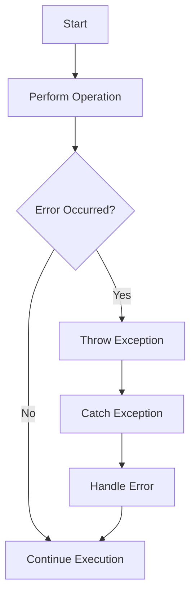

## 11.7 Best Practices for Error Reporting

Error reporting is a crucial aspect of software development, especially in functional programming with Clojure. As experienced Java developers transitioning to Clojure, understanding how to effectively report and handle errors can significantly enhance the robustness and maintainability of your applications. In this section, we will explore best practices for error reporting in Clojure, focusing on clear error messages, user-friendly errors, error codes, and centralized error handling.

### Clear Error Messages

Clear and informative error messages are essential for diagnosing and resolving issues quickly. In Clojure, as in Java, error messages should provide enough context to understand what went wrong and how to fix it.

#### Importance of Clear Error Messages

- **Actionable Information**: Error messages should guide developers towards a solution by providing actionable information.
- **Contextual Clarity**: Include relevant context, such as variable values or function names, to help pinpoint the source of the error.
- **Consistency**: Maintain a consistent format for error messages to make them easier to parse and understand.

#### Implementing Clear Error Messages in Clojure

In Clojure, you can use exceptions to convey error messages. Here's a simple example:

```clojure
(defn divide [numerator denominator]
  (if (zero? denominator)
    (throw (IllegalArgumentException. "Denominator cannot be zero."))
    (/ numerator denominator)))

;; Usage
(try
  (println (divide 10 0))
  (catch IllegalArgumentException e
    (println "Error:" (.getMessage e))))
```

In this example, we throw an `IllegalArgumentException` with a clear message when the denominator is zero. The `try-catch` block captures the exception and prints the error message.

#### Comparison with Java

In Java, you might use a similar approach with exceptions:

```java
public class Division {
    public static double divide(double numerator, double denominator) {
        if (denominator == 0) {
            throw new IllegalArgumentException("Denominator cannot be zero.");
        }
        return numerator / denominator;
    }

    public static void main(String[] args) {
        try {
            System.out.println(divide(10, 0));
        } catch (IllegalArgumentException e) {
            System.out.println("Error: " + e.getMessage());
        }
    }
}
```

Both Clojure and Java use exceptions to handle errors, but Clojure's syntax is more concise and expressive.

### User-Friendly Errors

Differentiating between errors intended for developers and those for end-users is crucial. While developers need detailed error messages, end-users require simple, user-friendly messages that do not expose internal details.

#### Strategies for User-Friendly Errors

- **Abstract Technical Details**: Hide technical details from end-users to prevent confusion and maintain security.
- **Provide Guidance**: Offer suggestions or next steps to help users recover from errors.
- **Use Friendly Language**: Employ language that is easy to understand and non-technical.

#### Implementing User-Friendly Errors in Clojure

You can create user-friendly errors by wrapping technical exceptions in more general messages:

```clojure
(defn safe-divide [numerator denominator]
  (try
    (divide numerator denominator)
    (catch IllegalArgumentException e
      {:error "An error occurred. Please check your input and try again."})))

;; Usage
(println (safe-divide 10 0))
```

In this example, the `safe-divide` function catches the technical exception and returns a user-friendly error message.

### Error Codes and Handling Strategies

Using error codes or types can enable structured error handling, making it easier to categorize and respond to different types of errors.

#### Benefits of Error Codes

- **Standardization**: Error codes provide a standardized way to identify and handle errors.
- **Automation**: Facilitate automated error handling and logging.
- **Localization**: Simplify the localization of error messages.

#### Implementing Error Codes in Clojure

You can define a map of error codes and messages to standardize error handling:

```clojure
(def error-codes
  {:division-by-zero {:code 1001 :message "Division by zero is not allowed."}
   :invalid-input    {:code 1002 :message "Invalid input provided."}})

(defn divide-with-codes [numerator denominator]
  (if (zero? denominator)
    (throw (ex-info "Error" {:error (get error-codes :division-by-zero)}))
    (/ numerator denominator)))

;; Usage
(try
  (println (divide-with-codes 10 0))
  (catch Exception e
    (let [error-data (ex-data e)]
      (println "Error Code:" (:code (:error error-data)))
      (println "Error Message:" (:message (:error error-data))))))
```

In this example, we use `ex-info` to throw an exception with structured error data, including an error code and message.

### Centralized Error Handling

Centralizing error handling logic can improve consistency and maintainability across your application.

#### Advantages of Centralized Error Handling

- **Consistency**: Ensure consistent error handling across different modules.
- **Maintainability**: Simplify maintenance by consolidating error handling logic.
- **Scalability**: Facilitate scaling by providing a single point of control for error handling.

#### Implementing Centralized Error Handling in Clojure

You can create a centralized error handler function to manage errors consistently:

```clojure
(defn handle-error [e]
  (let [error-data (ex-data e)]
    (println "Error Code:" (:code (:error error-data)))
    (println "Error Message:" (:message (:error error-data)))))

(defn divide-with-central-handler [numerator denominator]
  (try
    (divide-with-codes numerator denominator)
    (catch Exception e
      (handle-error e))))

;; Usage
(divide-with-central-handler 10 0)
```

Here, the `handle-error` function centralizes the error handling logic, making it reusable across different parts of the application.

### Visual Aids

To enhance understanding, let's visualize the flow of error handling in Clojure using a flowchart:



**Figure 1**: Flowchart illustrating the error handling process in Clojure.

### References and Links

For further reading on error handling in Clojure, consider the following resources:

- [Official Clojure Documentation](https://clojure.org/reference/documentation)
- [ClojureDocs](https://clojuredocs.org/)
- [GitHub - Clojure Error Handling Examples](https://github.com/clojure-examples/error-handling)

### Knowledge Check

Let's reinforce what we've learned with a few questions:

1. Why is it important to provide clear error messages in Clojure applications?
2. How can you differentiate between developer and user-friendly error messages?
3. What are the benefits of using error codes in error handling?
4. How does centralized error handling improve maintainability?
5. Can you create a simple Clojure function that demonstrates centralized error handling?

### Encouraging Tone

Now that we've explored best practices for error reporting in Clojure, let's apply these concepts to build more robust and user-friendly applications. Remember, effective error handling is key to creating scalable and maintainable software.

### Summary

In this section, we've covered the importance of clear error messages, strategies for user-friendly errors, the use of error codes, and the benefits of centralized error handling. By implementing these best practices, you can enhance the reliability and user experience of your Clojure applications.

## Quiz: Mastering Error Reporting in Clojure



### Why is it important to provide clear error messages in Clojure applications?

- [x] To help developers diagnose and fix issues quickly
- [ ] To confuse users
- [ ] To make the application more complex
- [ ] To hide errors from users

> **Explanation:** Clear error messages provide actionable information that helps developers diagnose and resolve issues efficiently.

### How can you differentiate between developer and user-friendly error messages?

- [x] By abstracting technical details for users
- [ ] By using the same message for both
- [ ] By making messages more technical for users
- [ ] By ignoring user-friendly messages

> **Explanation:** User-friendly messages should abstract technical details and provide guidance, while developer messages can include detailed technical information.

### What are the benefits of using error codes in error handling?

- [x] Standardization and automation
- [ ] Increased complexity
- [ ] Confusion for developers
- [ ] Less control over errors

> **Explanation:** Error codes standardize error identification and handling, facilitating automation and localization.

### How does centralized error handling improve maintainability?

- [x] By consolidating error handling logic
- [ ] By scattering error handling across modules
- [ ] By making error handling more complex
- [ ] By reducing consistency

> **Explanation:** Centralized error handling consolidates logic, ensuring consistency and simplifying maintenance.

### Can you create a simple Clojure function that demonstrates centralized error handling?

- [x] Yes
- [ ] No

> **Explanation:** Centralized error handling can be implemented by creating a reusable function to manage errors consistently.

### What is a key advantage of user-friendly error messages?

- [x] They provide guidance to users
- [ ] They expose internal details
- [ ] They are more technical
- [ ] They confuse users

> **Explanation:** User-friendly error messages provide guidance and use simple language to help users recover from errors.

### How can error codes facilitate localization?

- [x] By providing a standardized way to identify errors
- [ ] By making messages more complex
- [ ] By using technical jargon
- [ ] By ignoring localization

> **Explanation:** Error codes standardize error identification, making it easier to localize messages for different languages.

### What is the role of a centralized error handler function?

- [x] To manage errors consistently across the application
- [ ] To complicate error handling
- [ ] To handle errors in isolation
- [ ] To reduce maintainability

> **Explanation:** A centralized error handler function manages errors consistently, improving maintainability and scalability.

### How can you implement user-friendly errors in Clojure?

- [x] By wrapping technical exceptions in general messages
- [ ] By exposing technical details
- [ ] By using complex language
- [ ] By ignoring user needs

> **Explanation:** User-friendly errors can be implemented by wrapping technical exceptions in general, easy-to-understand messages.

### True or False: Centralized error handling reduces consistency in error management.

- [ ] True
- [x] False

> **Explanation:** Centralized error handling increases consistency by consolidating error management logic.


