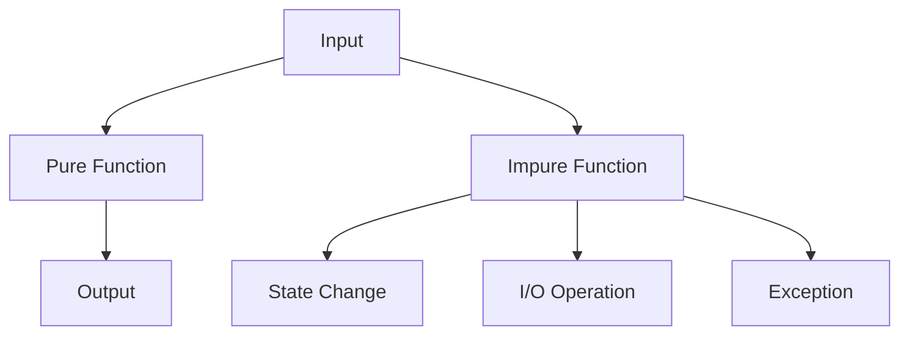

## 12.1 Understanding Side Effects and Purity

In the realm of functional programming, understanding the concepts of side effects and purity is crucial for building robust, scalable applications. As experienced Java developers transitioning to Clojure, you will find that these concepts are pivotal in distinguishing functional programming from imperative paradigms. This section will guide you through the intricacies of side effects and purity, providing you with the knowledge to write cleaner, more maintainable code.

### Definition of Side Effects

**Side effects** occur when a function interacts with the outside world or changes the state of the system. This can include:

- **I/O Operations**: Reading from or writing to a file, printing to the console, or interacting with a database.
- **State Changes**: Modifying a global variable or altering an object’s state.
- **Exception Throwing**: Raising exceptions that affect the flow of the program.

In contrast, a **pure function** is one that, given the same input, will always produce the same output without causing any observable side effects. Pure functions are deterministic and do not rely on or alter the state of the system.

### Pure vs. Impure Functions

#### Pure Functions

Pure functions are the cornerstone of functional programming. They offer several advantages:

- **Predictability**: Since pure functions always produce the same output for the same input, they are easier to reason about.
- **Testability**: Pure functions are straightforward to test because they do not depend on external state.
- **Concurrency**: Pure functions can be executed in parallel without concerns about shared state or race conditions.

#### Impure Functions

Impure functions, on the other hand, may produce different results given the same inputs due to their reliance on external state or their ability to cause side effects. While sometimes necessary, impure functions can complicate codebases by introducing unpredictability and making testing more challenging.

### Identifying Side Effects

Recognizing side effects in your code is the first step towards managing them effectively. Here are some common indicators:

- **State Mutation**: If a function modifies a variable or an object, it is likely causing a side effect.
- **I/O Operations**: Functions that perform input or output operations are inherently impure.
- **Randomness**: Functions that generate random numbers or rely on system time can produce different outputs for the same inputs.

#### Example: Identifying Side Effects in Java

Consider the following Java method:

```java
public class Counter {
    private int count = 0;

    public int increment() {
        return ++count;
    }
}
```

This method is impure because it modifies the state of the `count` variable. Each call to `increment()` will produce a different result, depending on the current state of `count`.

#### Example: Identifying Side Effects in Clojure

In Clojure, we can rewrite the above example to avoid side effects:

```clojure
(defn increment [count]
  (inc count))
```

Here, `increment` is a pure function. It takes a `count` as an argument and returns a new value without modifying any external state.

### Impact on Reasoning and Testing

Side effects can significantly complicate reasoning about code and testing. Let's explore how:

#### Reasoning

When functions have side effects, understanding the flow of data and control in a program becomes more challenging. This is because the function's behavior may depend on external factors, making it difficult to predict outcomes.

#### Testing

Testing impure functions often requires setting up specific environments or mocking external dependencies, which can be cumbersome and error-prone. In contrast, pure functions can be tested in isolation, with simple assertions based on input-output pairs.

### Managing Side Effects in Clojure

Clojure provides several mechanisms to manage side effects effectively:

- **Immutability**: By default, data structures in Clojure are immutable, reducing the likelihood of unintended state changes.
- **Functional Composition**: Clojure encourages composing small, pure functions to build complex behavior, minimizing the need for side effects.
- **Controlled Side Effects**: When side effects are necessary, Clojure offers constructs like `atom`, `ref`, and `agent` to manage state changes in a controlled manner.

#### Example: Managing Side Effects with Atoms

Atoms in Clojure provide a way to manage mutable state safely:

```clojure
(def counter (atom 0))

(defn increment-counter []
  (swap! counter inc))
```

In this example, `counter` is an atom that holds a mutable state. The `increment-counter` function uses `swap!` to update the state safely, ensuring that changes are atomic and thread-safe.

### Visualizing Side Effects and Purity

To better understand the flow of data and side effects, let's visualize these concepts using a flowchart.



**Caption**: This flowchart illustrates the difference between pure and impure functions. Pure functions transform input directly into output, while impure functions may cause state changes, perform I/O operations, or throw exceptions.

### Try It Yourself

To deepen your understanding, try modifying the following Clojure code to introduce and then eliminate side effects:

```clojure
(defn greet [name]
  (println "Hello," name))

(greet "Alice")
```

**Challenge**: Convert the `greet` function into a pure function that returns a greeting string instead of printing it.

### References and Further Reading

- [Official Clojure Documentation](https://clojure.org/reference/documentation)
- [ClojureDocs](https://clojuredocs.org/)
- [Functional Programming in Clojure](https://www.braveclojure.com/)

### Knowledge Check

To reinforce your understanding, consider the following questions:

- What are the key characteristics of a pure function?
- How do side effects impact the testability of code?
- What mechanisms does Clojure provide to manage state changes safely?

### Summary

In this section, we've explored the concepts of side effects and purity in functional programming. By understanding these principles, you can write more predictable, testable, and maintainable code in Clojure. As you continue your journey, remember to embrace the functional programming mindset and leverage Clojure's powerful features to manage side effects effectively.

## Quiz: Understanding Side Effects and Purity in Clojure



### What is a side effect in functional programming?

- [x] An operation that affects the state outside its local environment
- [ ] A function that returns a value
- [ ] A function that does not take any arguments
- [ ] An operation that only reads data

> **Explanation:** A side effect occurs when a function interacts with or changes the state outside its local environment, such as modifying a global variable or performing I/O operations.

### Which of the following is a characteristic of a pure function?

- [x] It always produces the same output for the same input
- [ ] It can modify global variables
- [ ] It can perform I/O operations
- [ ] It can throw exceptions

> **Explanation:** A pure function always produces the same output for the same input and does not cause any observable side effects.

### How do side effects impact code testing?

- [x] They make testing more complex due to dependencies on external state
- [ ] They simplify testing by reducing the number of test cases
- [ ] They have no impact on testing
- [ ] They eliminate the need for unit tests

> **Explanation:** Side effects complicate testing because they introduce dependencies on external state, making it harder to isolate and test functions.

### What is the primary benefit of using pure functions?

- [x] Predictability and ease of reasoning
- [ ] Increased code complexity
- [ ] Reduced performance
- [ ] More side effects

> **Explanation:** Pure functions are predictable and easier to reason about, as they always produce the same output for the same input.

### Which Clojure construct is used to manage mutable state safely?

- [x] Atom
- [ ] List
- [ ] Vector
- [ ] Map

> **Explanation:** Atoms in Clojure provide a way to manage mutable state safely, ensuring atomic and thread-safe updates.

### What is the impact of side effects on concurrency?

- [x] They complicate concurrency by introducing shared state
- [ ] They simplify concurrency by eliminating shared state
- [ ] They have no impact on concurrency
- [ ] They make concurrency impossible

> **Explanation:** Side effects complicate concurrency by introducing shared state, which can lead to race conditions and other issues.

### How can you identify a side effect in a function?

- [x] By checking if the function modifies external state or performs I/O
- [ ] By checking if the function returns a value
- [ ] By checking if the function takes arguments
- [ ] By checking if the function is recursive

> **Explanation:** A function has side effects if it modifies external state or performs I/O operations.

### What is the role of immutability in managing side effects?

- [x] It reduces the likelihood of unintended state changes
- [ ] It increases the likelihood of unintended state changes
- [ ] It has no impact on state changes
- [ ] It makes state changes impossible

> **Explanation:** Immutability reduces the likelihood of unintended state changes, as data structures cannot be modified once created.

### Which of the following is an example of an impure function?

- [x] A function that writes to a file
- [ ] A function that adds two numbers
- [ ] A function that returns a constant value
- [ ] A function that takes no arguments

> **Explanation:** A function that writes to a file is impure because it performs an I/O operation, which is a side effect.

### True or False: Pure functions can be executed in parallel without concerns about shared state.

- [x] True
- [ ] False

> **Explanation:** True. Pure functions can be executed in parallel without concerns about shared state because they do not rely on or modify external state.


