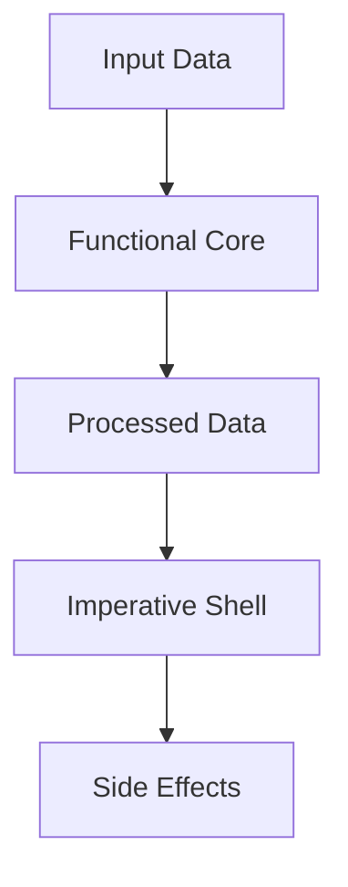

## 12.2 Strategies for Isolating Side Effects

In functional programming, isolating side effects is crucial for maintaining the purity and predictability of your code. This section will guide you through strategies to effectively manage and isolate side effects in Clojure, leveraging your existing Java knowledge to ease the transition.

### Functional Core, Imperative Shell

The concept of a "Functional Core, Imperative Shell" is a powerful design pattern that helps in isolating side effects. The idea is to keep the core logic of your application pure and free from side effects, while confining all side-effecting operations to the outer layers of your system.

#### Designing for Purity

**Explain the Importance of Purity**: Pure functions are deterministic and easier to test, reason about, and maintain. They always produce the same output for the same input and have no side effects.

**Guidelines for Designing Pure Applications**:
- **Identify Pure Logic**: Start by identifying parts of your application that can be expressed as pure functions. These are typically computations, data transformations, and business logic.
- **Separate Concerns**: Use functional decomposition to separate pure logic from side-effecting code. This can be achieved by designing your application in layers, where the core is purely functional and the outer layers handle side effects.
- **Use Immutable Data Structures**: Clojure's immutable data structures are ideal for maintaining purity. They prevent accidental state changes and make it easier to reason about your code.

**Example**: Consider a simple application that processes user data and writes results to a database. The data processing logic can be pure, while the database interaction is a side effect.

```clojure
;; Pure function for data processing
(defn process-user-data [user-data]
  (map #(assoc % :processed true) user-data))

;; Impure function for database interaction
(defn save-to-database [processed-data]
  ;; Simulate database save operation
  (println "Saving data to database:" processed-data))

;; Application logic
(defn process-and-save [user-data]
  (let [processed-data (process-user-data user-data)]
    (save-to-database processed-data)))
```

### Using Effect Systems

**Introduce Effect Systems**: Effect systems are advanced techniques used to manage side effects in functional programming. They allow you to describe and control side effects in a more structured way.

**Libraries and Tools**: While Clojure does not have a built-in effect system like some other functional languages, there are libraries and patterns that can help manage side effects. Libraries like `core.async` can be used to handle concurrency and side effects in a controlled manner.

**Example**: Using `core.async` to manage asynchronous operations.

```clojure
(require '[clojure.core.async :as async])

(defn async-save-to-database [processed-data]
  (async/go
    ;; Simulate asynchronous database save operation
    (println "Asynchronously saving data to database:" processed-data)))

(defn process-and-save-async [user-data]
  (let [processed-data (process-user-data user-data)]
    (async-save-to-database processed-data)))
```

### Example Refactoring

**Refactor Code for Separation**: Let's refactor a simple Java code snippet to demonstrate how to separate pure logic from side-effecting operations in Clojure.

**Java Example**:

```java
public class UserProcessor {
    public void processAndSave(List<User> users) {
        List<User> processedUsers = processUserData(users);
        saveToDatabase(processedUsers);
    }

    private List<User> processUserData(List<User> users) {
        return users.stream()
                    .map(user -> new User(user.getId(), user.getName(), true))
                    .collect(Collectors.toList());
    }

    private void saveToDatabase(List<User> users) {
        // Simulate database save operation
        System.out.println("Saving data to database: " + users);
    }
}
```

**Clojure Refactoring**:

```clojure
(defn process-user-data [users]
  (map #(assoc % :processed true) users))

(defn save-to-database [users]
  ;; Simulate database save operation
  (println "Saving data to database:" users))

(defn process-and-save [users]
  (let [processed-users (process-user-data users)]
    (save-to-database processed-users)))
```

**Key Differences**:
- **Immutability**: Clojure's data structures are immutable by default, reducing the risk of unintended state changes.
- **Higher-Order Functions**: Clojure's `map` function is a higher-order function that simplifies data transformation.
- **Conciseness**: Clojure's syntax is more concise, reducing boilerplate code.

### Visual Aids

To better understand the flow of data and separation of concerns, let's visualize the "Functional Core, Imperative Shell" pattern using a flowchart.



**Diagram Explanation**: The flowchart illustrates how input data is processed by the functional core, resulting in processed data. The imperative shell then handles side effects, such as database interactions or I/O operations.

### References and Links

- [Official Clojure Documentation](https://clojure.org/reference/documentation)
- [ClojureDocs](https://clojuredocs.org/)
- [core.async GitHub Repository](https://github.com/clojure/core.async)

### Knowledge Check

- **Question**: What is the primary benefit of isolating side effects in functional programming?
  - **Answer**: It enhances code maintainability and testability by keeping the core logic pure and predictable.

- **Exercise**: Refactor a Java method that performs both data processing and file I/O into separate pure and impure functions in Clojure.

### Encouraging Tone

Now that we've explored strategies for isolating side effects in Clojure, let's apply these concepts to build scalable and maintainable applications. By keeping your core logic pure and confining side effects to the edges, you'll create code that's easier to test, reason about, and extend.

### Best Practices for Tags

- "Clojure"
- "Functional Programming"
- "Side Effects"
- "Immutability"
- "Concurrency"
- "Java Interoperability"
- "Pure Functions"
- "Effect Systems"

## SEO optimized quiz title



### What is the main advantage of isolating side effects in functional programming?

- [x] Enhances code maintainability and testability
- [ ] Increases code complexity
- [ ] Reduces code readability
- [ ] Makes code execution slower

> **Explanation:** Isolating side effects enhances maintainability and testability by keeping the core logic pure and predictable.

### Which Clojure feature helps in maintaining purity?

- [x] Immutable data structures
- [ ] Mutable variables
- [ ] Dynamic typing
- [ ] Object-oriented programming

> **Explanation:** Immutable data structures prevent unintended state changes, maintaining purity.

### What is the purpose of the "Functional Core, Imperative Shell" pattern?

- [x] To separate pure logic from side-effecting operations
- [ ] To combine pure and impure logic
- [ ] To enhance code complexity
- [ ] To reduce code performance

> **Explanation:** The pattern separates pure logic from side-effecting operations, enhancing maintainability.

### Which Clojure library can help manage side effects in a controlled manner?

- [x] core.async
- [ ] clojure.java.jdbc
- [ ] clojure.spec
- [ ] clojure.test

> **Explanation:** core.async helps manage concurrency and side effects in a controlled manner.

### What is a pure function?

- [x] A function that always produces the same output for the same input
- [ ] A function that modifies global state
- [ ] A function that performs I/O operations
- [ ] A function that depends on external variables

> **Explanation:** A pure function is deterministic and has no side effects.

### How does Clojure's `map` function contribute to purity?

- [x] It transforms data without side effects
- [ ] It modifies the original data
- [ ] It performs I/O operations
- [ ] It relies on mutable state

> **Explanation:** The `map` function transforms data without side effects, contributing to purity.

### What is the role of the imperative shell in the "Functional Core, Imperative Shell" pattern?

- [x] To handle side effects
- [ ] To perform pure computations
- [ ] To increase code complexity
- [ ] To reduce code performance

> **Explanation:** The imperative shell handles side effects, keeping the core logic pure.

### Which of the following is NOT a benefit of pure functions?

- [ ] Easier to test
- [ ] More predictable
- [x] Modify global state
- [ ] Easier to reason about

> **Explanation:** Pure functions do not modify global state; they are easier to test, more predictable, and easier to reason about.

### How can you refactor Java code to separate pure logic from side effects in Clojure?

- [x] By using pure functions for logic and separate functions for side effects
- [ ] By combining logic and side effects in the same function
- [ ] By using mutable variables
- [ ] By relying on global state

> **Explanation:** Refactor by using pure functions for logic and separate functions for side effects.

### True or False: In Clojure, side effects should be confined to the core logic of the application.

- [ ] True
- [x] False

> **Explanation:** Side effects should be confined to the outer layers, not the core logic, to maintain purity.


