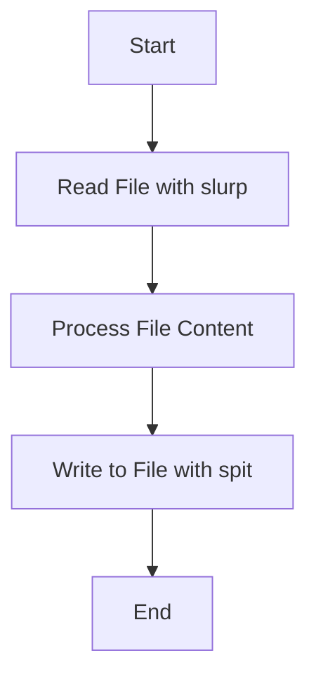

## 12.3 Handling Input/Output in Functional Programs

Handling input and output (I/O) in functional programming can be challenging due to the need to maintain functional purity. In this section, we will explore strategies for managing I/O operations in Clojure, a functional programming language that emphasizes immutability and pure functions. We will discuss how to handle I/O operations while preserving functional purity, leverage lazy evaluation, and utilize asynchronous techniques to manage I/O without blocking.

### Pure Approaches to I/O

In functional programming, pure functions are those that do not cause side effects and always produce the same output for the same input. However, I/O operations inherently involve side effects, such as reading from or writing to a file or making network requests. To handle I/O in a functional way, we can use strategies that minimize side effects and maintain functional purity.

#### Passing Data In and Out Explicitly

One approach to handling I/O in a functional manner is to pass data in and out of functions explicitly. This means that instead of performing I/O operations directly within a function, we can pass the necessary data to the function as an argument and return the result as a value. This approach allows us to separate the I/O operations from the core logic of the function, making it easier to test and reason about.

**Example: Reading from a File**

In Java, reading from a file typically involves creating a `BufferedReader` and reading lines in a loop. Here's a simple example:

```java
import java.io.BufferedReader;
import java.io.FileReader;
import java.io.IOException;

public class FileReaderExample {
    public static void main(String[] args) {
        try (BufferedReader reader = new BufferedReader(new FileReader("example.txt"))) {
            String line;
            while ((line = reader.readLine()) != null) {
                System.out.println(line);
            }
        } catch (IOException e) {
            e.printStackTrace();
        }
    }
}
```

In Clojure, we can achieve the same functionality using the `slurp` function, which reads the entire contents of a file into a string. We can then pass this string to a pure function for processing:

```clojure
(defn process-file [file-content]
  ;; Process the file content here
  (println file-content))

(defn read-file [file-path]
  (let [content (slurp file-path)]
    (process-file content)))

(read-file "example.txt")
```

In this example, the `read-file` function reads the file content using `slurp` and passes it to the `process-file` function, which is responsible for processing the content. This separation of concerns allows us to keep the I/O operation isolated from the processing logic.

#### Lazy Evaluation and I/O

Lazy evaluation is a powerful feature in Clojure that allows us to defer computation until the result is actually needed. This can be particularly useful for I/O operations, as it allows us to work with potentially large data sets without loading everything into memory at once.

**Example: Lazy Reading of a File**

In Clojure, we can use the `line-seq` function to lazily read lines from a file. This function returns a lazy sequence of lines, which can be processed one at a time:

```clojure
(defn process-lines [lines]
  (doseq [line lines]
    (println line)))

(defn lazy-read-file [file-path]
  (with-open [reader (clojure.java.io/reader file-path)]
    (process-lines (line-seq reader))))

(lazy-read-file "example.txt")
```

In this example, the `lazy-read-file` function uses `with-open` to ensure that the file is properly closed after reading. The `line-seq` function returns a lazy sequence of lines, which are processed one at a time by the `process-lines` function. This approach allows us to handle large files efficiently without loading the entire file into memory.

#### Using Callbacks and Futures

Asynchronous programming is another technique that can help us manage I/O operations without blocking. In Clojure, we can use callbacks and futures to perform I/O operations asynchronously.

**Example: Asynchronous File Reading with Futures**

A future is a construct that represents a value that will be available at some point in the future. We can use futures to perform I/O operations asynchronously, allowing other parts of the program to continue executing while waiting for the I/O operation to complete.

```clojure
(defn async-read-file [file-path]
  (future
    (let [content (slurp file-path)]
      (println content))))

(def file-future (async-read-file "example.txt"))

;; Do other work here

;; Wait for the future to complete and get the result
(deref file-future)
```

In this example, the `async-read-file` function returns a future that reads the file content asynchronously. We can continue executing other parts of the program while the file is being read. When we need the result, we can use `deref` to wait for the future to complete and get the result.

### Examples of I/O Operations

Let's explore some common I/O operations in Clojure, including reading from and writing to files, and handling network requests.

#### Reading from a File

As we saw earlier, we can use the `slurp` function to read the entire contents of a file into a string. For larger files, we can use `line-seq` to lazily read lines from a file.

#### Writing to a File

To write to a file in Clojure, we can use the `spit` function, which writes a string to a file:

```clojure
(defn write-to-file [file-path content]
  (spit file-path content))

(write-to-file "output.txt" "Hello, Clojure!")
```

In this example, the `write-to-file` function uses `spit` to write the given content to the specified file.

#### Handling Network Requests

Clojure provides several libraries for handling network requests, such as `clj-http` for making HTTP requests. Here's an example of making a GET request using `clj-http`:

```clojure
(require '[clj-http.client :as client])

(defn fetch-url [url]
  (let [response (client/get url)]
    (println (:body response))))

(fetch-url "http://example.com")
```

In this example, the `fetch-url` function uses `clj-http.client/get` to make a GET request to the specified URL and prints the response body.

### Try It Yourself

To reinforce your understanding of handling I/O in Clojure, try modifying the examples above:

- Change the file path in the `read-file` and `write-to-file` functions to read from and write to different files.
- Modify the `process-file` function to perform additional processing on the file content, such as counting the number of lines or words.
- Experiment with different URLs in the `fetch-url` function and explore the response data.

### Visual Aids

To help visualize the flow of data through I/O operations in Clojure, consider the following flowchart:



**Figure 1:** Flowchart illustrating the process of reading from a file, processing the content, and writing to a file in Clojure.

### References and Links

For more information on handling I/O in Clojure, check out the following resources:

- [Official Clojure Documentation](https://clojure.org/reference/documentation)
- [ClojureDocs](https://clojuredocs.org/)
- [clj-http GitHub Repository](https://github.com/dakrone/clj-http)

### Knowledge Check

To test your understanding of handling I/O in Clojure, consider the following questions:

1. What is the purpose of using `with-open` when reading from a file in Clojure?
2. How does lazy evaluation help with processing large files in Clojure?
3. What is a future in Clojure, and how can it be used for asynchronous I/O operations?
4. How can you handle network requests in Clojure?

### Exercises

1. Write a Clojure function that reads a file line by line and counts the number of lines containing a specific word.
2. Modify the `fetch-url` function to handle different HTTP methods, such as POST or PUT.
3. Implement a Clojure program that reads data from a file, processes it, and writes the result to a new file, using lazy evaluation to handle large files efficiently.

### Summary

In this section, we explored strategies for handling I/O operations in Clojure while maintaining functional purity. We discussed how to pass data in and out of functions explicitly, leverage lazy evaluation for efficient processing, and use asynchronous techniques like futures to manage I/O without blocking. By applying these techniques, you can handle I/O operations in a functional way, making your Clojure programs more robust and scalable.

## Quiz: Mastering I/O in Functional Programming with Clojure



### What is the primary benefit of using lazy evaluation for I/O operations in Clojure?

- [x] It allows processing of large data sets without loading everything into memory.
- [ ] It speeds up the execution of I/O operations.
- [ ] It simplifies the code structure.
- [ ] It ensures data security during I/O operations.

> **Explanation:** Lazy evaluation defers computation until the result is needed, which is beneficial for handling large data sets efficiently without consuming excessive memory.

### How does the `with-open` macro help in file operations in Clojure?

- [x] It ensures that resources are properly closed after use.
- [ ] It speeds up file reading operations.
- [ ] It allows reading multiple files simultaneously.
- [ ] It encrypts the file content during reading.

> **Explanation:** The `with-open` macro ensures that resources like file readers are closed automatically after the operation, preventing resource leaks.

### What is a future in Clojure?

- [x] A construct that represents a value that will be available in the future.
- [ ] A function that executes immediately.
- [ ] A data structure for storing future dates.
- [ ] A keyword for defining asynchronous functions.

> **Explanation:** A future is used to perform computations asynchronously, allowing other parts of the program to continue executing while waiting for the result.

### Which function is used to read the entire contents of a file into a string in Clojure?

- [x] `slurp`
- [ ] `spit`
- [ ] `read-line`
- [ ] `get-content`

> **Explanation:** The `slurp` function reads the entire contents of a file into a string, making it easy to work with file data in Clojure.

### What is the purpose of the `spit` function in Clojure?

- [x] To write a string to a file.
- [ ] To read a string from a file.
- [ ] To delete a file.
- [ ] To encrypt a file.

> **Explanation:** The `spit` function is used to write data to a file, making it a straightforward way to output data in Clojure.

### How can you handle network requests in Clojure?

- [x] By using libraries like `clj-http`.
- [ ] By using the `slurp` function.
- [ ] By using the `spit` function.
- [ ] By using the `future` construct.

> **Explanation:** Libraries like `clj-http` provide functions for making HTTP requests, allowing Clojure programs to interact with web services.

### What is the advantage of using asynchronous I/O operations?

- [x] They allow other parts of the program to continue executing while waiting for I/O operations to complete.
- [ ] They guarantee faster execution of I/O operations.
- [ ] They simplify error handling in I/O operations.
- [ ] They automatically handle network security.

> **Explanation:** Asynchronous I/O operations enable non-blocking execution, allowing programs to perform other tasks while waiting for I/O operations to finish.

### What is the role of the `line-seq` function in Clojure?

- [x] To lazily read lines from a file.
- [ ] To write lines to a file.
- [ ] To encrypt lines in a file.
- [ ] To count the number of lines in a file.

> **Explanation:** The `line-seq` function returns a lazy sequence of lines from a file, allowing efficient processing of large files.

### Which of the following is a strategy for maintaining functional purity in I/O operations?

- [x] Passing data in and out of functions explicitly.
- [ ] Performing I/O operations directly within functions.
- [ ] Using global variables for I/O data.
- [ ] Ignoring I/O operations in functional programs.

> **Explanation:** Passing data in and out of functions explicitly helps separate I/O operations from core logic, maintaining functional purity.

### True or False: In Clojure, futures can be used to perform computations synchronously.

- [ ] True
- [x] False

> **Explanation:** Futures are used for asynchronous computations, allowing other parts of the program to execute while waiting for the result.


