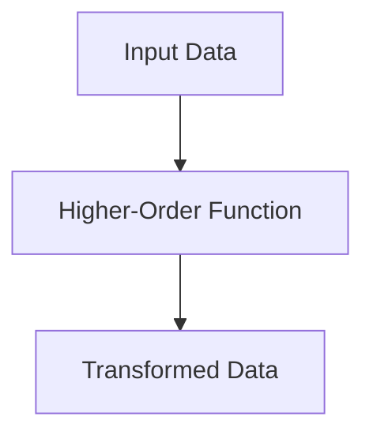
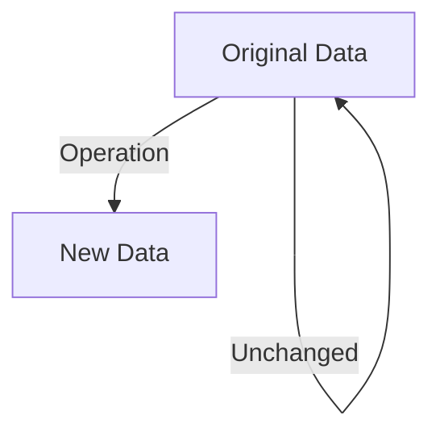

## 12.4 Managing State Changes Functionally

In functional programming, managing state changes is a critical aspect that can significantly impact the scalability and maintainability of applications. Clojure, with its emphasis on immutability and pure functions, offers a robust framework for handling state changes functionally. In this section, we will explore various patterns and techniques for managing state changes in a functional way, including the use of immutable data structures, pure functions, state monads, and event sourcing.

### State Management Patterns

Functional programming encourages the use of immutable data structures and pure functions to manage state changes. This approach not only simplifies reasoning about code but also enhances concurrency and parallelism, as immutable data can be safely shared across threads.

#### Immutable Data Structures

In Clojure, data structures such as lists, vectors, maps, and sets are immutable by default. This means that any operation on these structures returns a new structure rather than modifying the existing one. This immutability is a cornerstone of functional programming and is crucial for managing state changes functionally.

**Example: Immutable Data Structures in Clojure**

```clojure
;; Define an immutable vector
(def my-vector [1 2 3])

;; Add an element to the vector
(def new-vector (conj my-vector 4))

;; Original vector remains unchanged
(println my-vector)  ; Output: [1 2 3]
(println new-vector) ; Output: [1 2 3 4]
```

In this example, the `conj` function adds an element to the vector, returning a new vector without altering the original. This immutability ensures that state changes are predictable and traceable.

#### Pure Functions

Pure functions are functions that always produce the same output for the same input and have no side effects. They are essential for managing state changes functionally, as they allow us to reason about state transformations in isolation.

**Example: Pure Function in Clojure**

```clojure
;; Define a pure function to increment a number
(defn increment [x]
  (+ x 1))

;; Use the function
(println (increment 5)) ; Output: 6
```

The `increment` function is pure because it does not modify any external state and always returns the same result for the same input.

### State Monads

State monads provide a way to handle state changes functionally by encapsulating state transformations within a monadic structure. While Clojure does not have built-in support for monads, the concept can be implemented using libraries such as `cats`.

#### Conceptual Understanding of State Monads

A state monad allows you to thread state through a sequence of computations in a functional way. It encapsulates state transformations, making it easier to manage complex stateful computations without resorting to mutable state.

**Example: State Monad in Clojure**

```clojure
(require '[cats.monad.state :as state])

;; Define a stateful computation
(defn increment-state [state]
  (state/state
    (fn [s]
      [s (inc s)])))

;; Run the stateful computation
(def result (state/run-state (increment-state) 0))

(println result) ; Output: [0 1]
```

In this example, the `increment-state` function defines a stateful computation that increments the state. The `state/run-state` function executes the computation, returning the initial state and the new state.

### Event Sourcing

Event sourcing is a pattern for managing state changes by storing a sequence of immutable events. Each event represents a state change, and the current state can be reconstructed by replaying these events.

#### Introduction to Event Sourcing

In event sourcing, instead of storing the current state, we store a log of all state-changing events. This approach provides a complete history of state changes, making it easier to audit and debug applications.

**Example: Event Sourcing in Clojure**

```clojure
;; Define an event log
(def event-log (atom []))

;; Function to add an event
(defn add-event [event]
  (swap! event-log conj event))

;; Function to replay events and reconstruct state
(defn replay-events [events]
  (reduce (fn [state event]
            (case (:type event)
              :increment (inc state)
              :decrement (dec state)
              state))
          0
          events))

;; Add events
(add-event {:type :increment})
(add-event {:type :increment})
(add-event {:type :decrement})

;; Reconstruct state
(println (replay-events @event-log)) ; Output: 1
```

In this example, we use an atom to store an event log. The `add-event` function adds events to the log, and the `replay-events` function reconstructs the state by replaying the events.

### Examples of Functional State Management

Let's explore some practical examples of managing state changes functionally in Clojure.

#### Example 1: Banking System

Consider a simple banking system where we need to manage account balances. We can use immutable data structures and pure functions to handle state changes.

**Clojure Code Example**

```clojure
;; Define an account with an initial balance
(def account {:balance 1000})

;; Function to deposit money
(defn deposit [account amount]
  (update account :balance + amount))

;; Function to withdraw money
(defn withdraw [account amount]
  (update account :balance - amount))

;; Perform transactions
(def account-after-deposit (deposit account 200))
(def account-after-withdrawal (withdraw account-after-deposit 100))

(println account)                  ; Output: {:balance 1000}
(println account-after-deposit)    ; Output: {:balance 1200}
(println account-after-withdrawal) ; Output: {:balance 1100}
```

In this example, the `deposit` and `withdraw` functions are pure, and they return new account states without modifying the original account.

#### Example 2: Inventory Management

Let's consider an inventory management system where we need to track the stock levels of products.

**Clojure Code Example**

```clojure
;; Define an inventory with initial stock levels
(def inventory {:apple 50 :banana 30})

;; Function to add stock
(defn add-stock [inventory product quantity]
  (update inventory product + quantity))

;; Function to remove stock
(defn remove-stock [inventory product quantity]
  (update inventory product - quantity))

;; Update inventory
(def updated-inventory (-> inventory
                           (add-stock :apple 20)
                           (remove-stock :banana 10)))

(println inventory)         ; Output: {:apple 50, :banana 30}
(println updated-inventory) ; Output: {:apple 70, :banana 20}
```

In this example, we use the threading macro `->` to chain function calls, making the code more readable and expressive.

### Visual Aids

To enhance understanding, let's visualize the flow of data through higher-order functions and the concept of immutability.

**Data Flow in Higher-Order Functions**



**Immutability and Persistent Data Structures**



### References and Links

- [Official Clojure Documentation](https://clojure.org/reference)
- [ClojureDocs](https://clojuredocs.org/)
- [Cats Library for Monads in Clojure](https://github.com/funcool/cats)
- [Event Sourcing in Clojure](https://github.com/Yuppiechef/clojure-event-sourcing)

### Knowledge Check

To reinforce your understanding, consider the following questions and exercises:

1. What are the benefits of using immutable data structures for state management?
2. How do pure functions contribute to functional state management?
3. Implement a simple state monad in Clojure to manage a counter.
4. Describe how event sourcing can be used to manage state changes in a distributed system.
5. Modify the banking system example to include a transaction history.

### Encouraging Tone

Now that we've explored how to manage state changes functionally in Clojure, let's apply these concepts to build scalable and maintainable applications. Remember, the key to mastering functional programming is practice and experimentation. Don't hesitate to try out different approaches and see what works best for your specific use case.

### Best Practices for Tags

- "Clojure"
- "Functional Programming"
- "State Management"
- "Immutability"
- "Pure Functions"
- "Event Sourcing"
- "State Monads"
- "Java Interoperability"

## Quiz on Managing State Changes Functionally in Clojure



### What is a key benefit of using immutable data structures in Clojure?

- [x] They allow safe sharing across threads.
- [ ] They are faster than mutable data structures.
- [ ] They automatically handle concurrency.
- [ ] They require less memory.

> **Explanation:** Immutable data structures can be safely shared across threads because they cannot be modified, which eliminates race conditions.

### How do pure functions help in managing state changes?

- [x] They ensure predictable state transformations.
- [ ] They automatically manage state changes.
- [ ] They require less code.
- [ ] They are faster than impure functions.

> **Explanation:** Pure functions ensure predictable state transformations because they always produce the same output for the same input and have no side effects.

### What is a state monad used for?

- [x] Encapsulating state transformations.
- [ ] Automatically managing state.
- [ ] Making code faster.
- [ ] Reducing memory usage.

> **Explanation:** A state monad encapsulates state transformations, allowing state to be threaded through computations functionally.

### What is event sourcing?

- [x] A pattern for managing state changes through immutable events.
- [ ] A way to automatically manage state.
- [ ] A method for optimizing performance.
- [ ] A technique for reducing memory usage.

> **Explanation:** Event sourcing is a pattern for managing state changes by storing a sequence of immutable events, which can be replayed to reconstruct the current state.

### In the banking system example, what does the `deposit` function do?

- [x] Returns a new account state with the updated balance.
- [ ] Modifies the original account balance.
- [ ] Automatically logs the transaction.
- [ ] Sends a notification to the user.

> **Explanation:** The `deposit` function is pure and returns a new account state with the updated balance without modifying the original account.

### What is the purpose of the `->` threading macro in Clojure?

- [x] To chain function calls for readability.
- [ ] To optimize performance.
- [ ] To reduce memory usage.
- [ ] To automatically manage state.

> **Explanation:** The `->` threading macro is used to chain function calls, making the code more readable and expressive.

### How does event sourcing benefit distributed systems?

- [x] Provides a complete history of state changes.
- [ ] Automatically manages state across nodes.
- [ ] Reduces network latency.
- [ ] Increases memory efficiency.

> **Explanation:** Event sourcing provides a complete history of state changes, which is valuable for auditing and debugging in distributed systems.

### What is a key characteristic of a pure function?

- [x] It has no side effects.
- [ ] It is faster than impure functions.
- [ ] It uses less memory.
- [ ] It automatically manages state.

> **Explanation:** A pure function has no side effects and always produces the same output for the same input.

### How can you modify the banking system example to include a transaction history?

- [x] By storing each transaction as an event in a log.
- [ ] By modifying the account balance directly.
- [ ] By using a mutable data structure.
- [ ] By optimizing the `deposit` function.

> **Explanation:** You can modify the banking system example to include a transaction history by storing each transaction as an event in a log, which can be replayed to reconstruct the account state.

### True or False: In Clojure, data structures are mutable by default.

- [ ] True
- [x] False

> **Explanation:** False. In Clojure, data structures are immutable by default, which is a key feature of functional programming.


