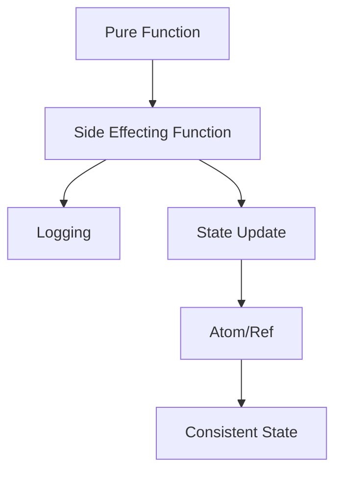

## 12.5 Best Practices for Managing Side Effects in Clojure

In functional programming, side effects are any operations that interact with the outside world or modify some state. While functional programming encourages minimizing side effects, they are often necessary for real-world applications. In this section, we will explore best practices for managing side effects in Clojure, a language that embraces functional programming principles while providing powerful tools for handling side effects safely and effectively.

### Isolate Side Effects

One of the core principles of functional programming is to isolate side effects from the rest of your code. This practice not only makes your code more predictable and easier to test but also enhances its readability and maintainability.

#### Why Isolate Side Effects?

- **Predictability**: Pure functions, which do not have side effects, always produce the same output for the same input. By isolating side effects, you can ensure that the majority of your code remains predictable.
- **Testability**: Pure functions are easier to test because they do not depend on external state or cause changes to it.
- **Maintainability**: Code with isolated side effects is easier to understand and modify, as the effects are confined to specific areas.

#### How to Isolate Side Effects

1. **Encapsulation**: Encapsulate side effects within specific functions or modules. This way, the rest of your codebase can remain pure.

2. **Functional Interfaces**: Use functional interfaces to interact with side-effecting code. For example, pass functions as arguments to handle side effects, allowing you to control when and how they occur.

3. **Boundary Layers**: Implement boundary layers in your application architecture where side effects are managed. This could be at the edges of your system, such as input/output operations, database interactions, or network communications.

**Example in Clojure**:

```clojure
(defn fetch-data [url]
  ;; Side effect: HTTP request
  (let [response (http/get url)]
    (:body response)))

(defn process-data [data]
  ;; Pure function: processes data without side effects
  (map #(update % :value inc) data))

(defn main []
  (let [data (fetch-data "http://example.com/data")]
    (process-data data)))
```

In this example, `fetch-data` is the only function with side effects, while `process-data` remains pure.

### Use of Atoms and Refs

Clojure provides several concurrency primitives to manage state changes safely, including Atoms and Refs. Understanding when and how to use these tools is crucial for handling side effects in a concurrent environment.

#### Atoms

Atoms are used for managing independent, synchronous state changes. They provide a way to safely update a single piece of state without locking.

- **Use Atoms** when you need to manage a single, independent piece of state that can be updated atomically.
- **Atomic Updates**: Atoms ensure that updates are atomic, meaning they are completed in a single step without interference from other operations.

**Example of Atoms**:

```clojure
(def counter (atom 0))

(defn increment-counter []
  ;; Atomically update the counter
  (swap! counter inc))

(increment-counter)
(println @counter) ;; Output: 1
```

#### Refs

Refs are used for coordinated, synchronous state changes across multiple pieces of state. They are part of Clojure's Software Transactional Memory (STM) system, which allows you to manage complex state changes safely.

- **Use Refs** when you need to update multiple pieces of state in a coordinated manner.
- **Transactions**: Refs use transactions to ensure that all updates are consistent and isolated from other operations.

**Example of Refs**:

```clojure
(def account-a (ref 100))
(def account-b (ref 200))

(defn transfer [amount from to]
  ;; Use a transaction to ensure both updates are consistent
  (dosync
    (alter from - amount)
    (alter to + amount)))

(transfer 50 account-a account-b)
(println @account-a @account-b) ;; Output: 50 250
```

### Idempotent Operations

Designing side-effecting operations to be idempotent is a best practice that can help you manage side effects more effectively.

#### What is Idempotency?

An operation is idempotent if performing it multiple times has the same effect as performing it once. This property is particularly useful in distributed systems and retry scenarios.

#### How to Achieve Idempotency

1. **State Checks**: Before performing an operation, check the current state to determine if the operation is necessary.
2. **Idempotent APIs**: Design APIs to be idempotent by ensuring that repeated requests do not cause additional side effects.

**Example of Idempotent Operation**:

```clojure
(defn update-user [user-id new-data]
  ;; Check if the update is necessary
  (let [current-data (get-user user-id)]
    (when (not= current-data new-data)
      (save-user user-id new-data))))
```

In this example, `update-user` only performs the update if the new data differs from the current data, making it idempotent.

### Logging and Monitoring

Adding logging and monitoring around side-effecting code is crucial for debugging and maintaining your applications.

#### Why Logging and Monitoring?

- **Debugging**: Logs provide valuable insights into the behavior of your application, especially when things go wrong.
- **Performance Monitoring**: Monitoring helps you track the performance of your application and identify bottlenecks.

#### Best Practices for Logging and Monitoring

1. **Structured Logging**: Use structured logging to capture detailed information about side effects, including input parameters and results.
2. **Log Levels**: Use appropriate log levels (e.g., DEBUG, INFO, WARN, ERROR) to categorize log messages based on their importance.
3. **Monitoring Tools**: Integrate monitoring tools to track application performance and health metrics.

**Example of Logging in Clojure**:

```clojure
(require '[clojure.tools.logging :as log])

(defn fetch-data [url]
  (log/info "Fetching data from" url)
  (try
    (let [response (http/get url)]
      (log/debug "Received response" response)
      (:body response))
    (catch Exception e
      (log/error e "Failed to fetch data from" url))))
```

### Try It Yourself

To reinforce your understanding of managing side effects in Clojure, try modifying the examples provided:

- **Modify the `fetch-data` function** to handle different types of HTTP responses and log them appropriately.
- **Experiment with Atoms and Refs** by creating a simple banking application that handles deposits and withdrawals.
- **Design an idempotent function** that updates a user's profile only if the new data is different from the existing data.

### Visual Aids

To better understand the flow of data and side effects in Clojure, consider the following diagram:



**Diagram Description**: This flowchart illustrates the interaction between pure functions and side-effecting functions in Clojure. Side effects are logged and managed through state updates using Atoms or Refs, ensuring consistent state.

### References and Links

- [Official Clojure Documentation](https://clojure.org/reference/documentation)
- [ClojureDocs](https://clojuredocs.org/)
- [Clojure Concurrency](https://clojure.org/reference/atoms)
- [Clojure Logging](https://github.com/clojure/tools.logging)

### Knowledge Check

To test your understanding of managing side effects in Clojure, consider the following questions and exercises:

1. **What are the benefits of isolating side effects in your code?**
2. **When should you use Atoms versus Refs in Clojure?**
3. **How can you ensure that an operation is idempotent?**
4. **What are some best practices for logging side-effecting code?**

### Summary

In this section, we've explored best practices for managing side effects in Clojure. By isolating side effects, using concurrency primitives like Atoms and Refs, designing idempotent operations, and implementing robust logging and monitoring strategies, you can build scalable and maintainable applications. Now that we've covered these concepts, let's apply them to manage side effects effectively in your Clojure projects.

## Quiz: Mastering Side Effects in Clojure



### What is one of the main benefits of isolating side effects in your code?

- [x] Predictability
- [ ] Increased complexity
- [ ] Reduced performance
- [ ] More side effects

> **Explanation:** Isolating side effects enhances predictability by ensuring that pure functions remain consistent and side effects are confined to specific areas.

### When should you use Atoms in Clojure?

- [x] For independent, synchronous state changes
- [ ] For coordinated state changes
- [ ] For asynchronous state changes
- [ ] For immutable data structures

> **Explanation:** Atoms are ideal for managing independent, synchronous state changes that require atomic updates.

### What is a key feature of Refs in Clojure?

- [x] Transactions for coordinated state changes
- [ ] Asynchronous updates
- [ ] Immutable state
- [ ] Single-threaded access

> **Explanation:** Refs use transactions to ensure coordinated and consistent state changes across multiple pieces of state.

### How can you make a side-effecting operation idempotent?

- [x] Check the current state before performing the operation
- [ ] Perform the operation multiple times
- [ ] Avoid using Atoms or Refs
- [ ] Use random values

> **Explanation:** Checking the current state before performing the operation ensures that it only occurs if necessary, making it idempotent.

### What is a best practice for logging side-effecting code?

- [x] Use structured logging
- [ ] Log everything at the DEBUG level
- [ ] Avoid logging side effects
- [ ] Use random log messages

> **Explanation:** Structured logging captures detailed information about side effects, making it easier to debug and monitor applications.

### Which Clojure primitive is part of the Software Transactional Memory system?

- [x] Refs
- [ ] Atoms
- [ ] Agents
- [ ] Vars

> **Explanation:** Refs are part of Clojure's Software Transactional Memory system, allowing for coordinated state changes.

### What is the purpose of using log levels?

- [x] To categorize log messages based on importance
- [ ] To increase the size of log files
- [ ] To avoid logging errors
- [ ] To make logs unreadable

> **Explanation:** Log levels help categorize messages based on their importance, aiding in debugging and monitoring.

### What is an example of a boundary layer in application architecture?

- [x] Input/output operations
- [ ] Pure functions
- [ ] Immutable data structures
- [ ] Random number generation

> **Explanation:** Boundary layers, such as input/output operations, are where side effects are managed in application architecture.

### What is a benefit of using monitoring tools?

- [x] Tracking application performance and health metrics
- [ ] Increasing application complexity
- [ ] Reducing code readability
- [ ] Avoiding state changes

> **Explanation:** Monitoring tools help track application performance and health metrics, identifying bottlenecks and issues.

### True or False: Pure functions can have side effects.

- [ ] True
- [x] False

> **Explanation:** Pure functions do not have side effects; they always produce the same output for the same input and do not interact with external state.


