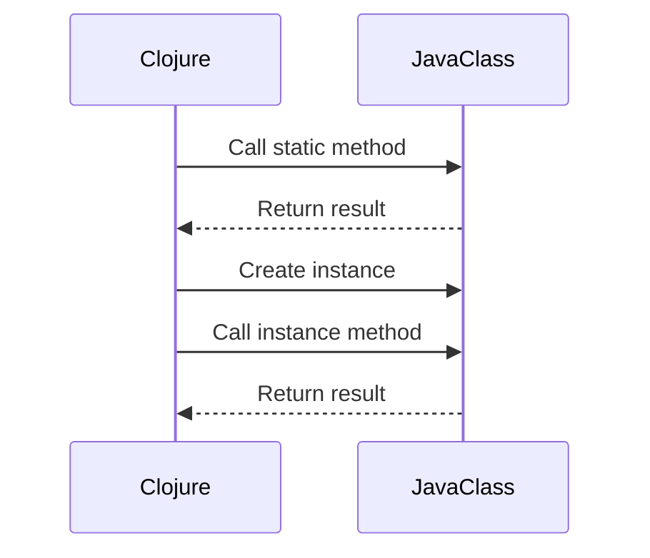

## 12.6 Interoperability with Java Libraries

As experienced Java developers, you are already familiar with the rich ecosystem of Java libraries that can significantly enhance your applications. Clojure, being a JVM language, offers seamless interoperability with Java, allowing you to leverage existing Java libraries while embracing the functional programming paradigm. In this section, we will explore how to effectively use Java classes and methods directly from Clojure, handle Java exceptions, and provide practical examples to illustrate these concepts.

### Java Interop Basics

Clojure's interoperability with Java is one of its most powerful features. It allows you to call Java methods, access fields, and create objects with ease. This capability is crucial for integrating Clojure into existing Java projects or utilizing Java libraries that provide functionality not natively available in Clojure.

#### Calling Java Methods

Clojure provides a straightforward syntax for calling Java methods. Let's break down the process of calling static and instance methods, accessing fields, and creating objects.

##### Static Methods

To call a static method in Java from Clojure, use the `.` operator followed by the method name. Here's an example using the `Math` class:

```clojure
;; Calling a static method from the Math class
(def pi-value (. Math PI))
(def sqrt-value (. Math sqrt 16))

(println "Value of PI:" pi-value)
(println "Square root of 16:" sqrt-value)
```

In this example, we access the static field `PI` and call the static method `sqrt` from the `Math` class. Notice how we use the `.` operator to specify the class and method.

##### Instance Methods

For instance methods, you first need to create an instance of the class and then call the method using the `.` operator:

```clojure
;; Creating an instance of the StringBuilder class
(def sb (StringBuilder. "Hello"))

;; Calling an instance method
(.append sb " World")
(.toString sb)
```

Here, we create an instance of `StringBuilder` and call its `append` and `toString` methods. The `.` operator is used to invoke instance methods on the object.

##### Accessing Fields

Accessing fields in Java objects is similar to calling methods. Use the `.` operator followed by the field name:

```clojure
;; Accessing fields in a Java object
(def point (java.awt.Point. 10 20))
(def x-value (.x point))
(def y-value (.y point))

(println "X coordinate:" x-value)
(println "Y coordinate:" y-value)
```

In this example, we create a `Point` object and access its `x` and `y` fields.

##### Creating Objects

Creating Java objects in Clojure is straightforward. Use the class name followed by a dot and parentheses to invoke the constructor:

```clojure
;; Creating a new instance of the ArrayList class
(def my-list (java.util.ArrayList.))

;; Adding elements to the list
(.add my-list "Clojure")
(.add my-list "Java")

(println "ArrayList contents:" my-list)
```

Here, we create an `ArrayList` and add elements to it using the `add` method.

### Exception Handling

Handling exceptions is an essential part of integrating Java libraries into Clojure applications. Clojure provides mechanisms to catch and handle Java exceptions using the `try`, `catch`, and `finally` constructs.

#### Catching Exceptions

To catch exceptions, use the `try` block followed by one or more `catch` clauses. Each `catch` clause specifies the exception type and a handler:

```clojure
;; Handling Java exceptions in Clojure
(try
  (let [result (/ 10 0)]
    (println "Result:" result))
  (catch ArithmeticException e
    (println "Caught an arithmetic exception:" (.getMessage e)))
  (catch Exception e
    (println "Caught a general exception:" (.getMessage e))))
```

In this example, we attempt to divide by zero, which throws an `ArithmeticException`. The `catch` clause handles this exception and prints an error message.

#### Using Finally

The `finally` block is optional and executes regardless of whether an exception is thrown. It's useful for cleanup operations:

```clojure
;; Using finally for cleanup
(try
  (let [result (/ 10 0)]
    (println "Result:" result))
  (catch ArithmeticException e
    (println "Caught an arithmetic exception:" (.getMessage e)))
  (finally
    (println "This block always executes")))
```

Here, the `finally` block executes after the `catch` block, ensuring that the cleanup code runs.

### Practical Examples

Let's explore some practical examples of using Java libraries from Clojure to solidify our understanding.

#### Example 1: Using Apache Commons Lang

Apache Commons Lang is a popular Java library that provides utility functions for the Java API. We'll use it to demonstrate how to call Java methods from Clojure.

```clojure
;; Importing the StringUtils class from Apache Commons Lang
(import 'org.apache.commons.lang3.StringUtils)

;; Using the isBlank method
(def empty-string "")
(def non-empty-string "Clojure")

(println "Is empty string blank?" (StringUtils/isBlank empty-string))
(println "Is non-empty string blank?" (StringUtils/isBlank non-empty-string))
```

In this example, we import the `StringUtils` class and use its `isBlank` method to check if strings are blank.

#### Example 2: Integrating with JavaFX

JavaFX is a powerful library for building graphical user interfaces. We'll create a simple JavaFX application using Clojure.

```clojure
;; Importing JavaFX classes
(import '(javafx.application Application)
        '(javafx.scene Scene)
        '(javafx.scene.control Button)
        '(javafx.scene.layout StackPane)
        '(javafx.stage Stage))

;; Defining a JavaFX application in Clojure
(gen-class
  :name HelloWorldApp
  :extends javafx.application.Application)

(defn -start [this stage]
  (let [button (Button. "Say 'Hello, World!'")
        root (StackPane.)]
    (.setOnAction button
                  (reify javafx.event.EventHandler
                    (handle [this event]
                      (println "Hello, World!"))))
    (.getChildren root)
    (.add root button)
    (.setScene stage (Scene. root 300 250))
    (.setTitle stage "Hello World")
    (.show stage)))

(defn -main [& args]
  (Application/launch HelloWorldApp args))
```

This example demonstrates how to create a simple JavaFX application in Clojure. We define a `HelloWorldApp` class that extends `Application` and implement the `-start` method to set up the UI.

### Try It Yourself

Now that we've explored how to use Java libraries in Clojure, try modifying the examples to experiment with different Java classes and methods. For instance, you could:

- Use a different Java library, such as Apache Commons IO, to perform file operations.
- Create a more complex JavaFX application with additional UI components.
- Handle different types of exceptions and implement custom error messages.

### Visual Aids

To enhance your understanding, let's visualize the process of calling Java methods from Clojure using a sequence diagram.



**Diagram Description:** This sequence diagram illustrates the interaction between Clojure and a Java class. Clojure calls a static method, creates an instance, and calls an instance method, receiving results from the Java class.

### References and Links

For further reading and exploration, consider the following resources:

- [Official Clojure Documentation](https://clojure.org/reference/java_interop)
- [ClojureDocs Java Interop Examples](https://clojuredocs.org/quickref#Java%20Interop)
- [Apache Commons Lang GitHub Repository](https://github.com/apache/commons-lang)
- [JavaFX Documentation](https://openjfx.io/)

### Knowledge Check

Let's reinforce what we've learned with some questions and exercises.

1. **Question:** How do you call a static method from a Java class in Clojure?
   - **Answer:** Use the `.` operator followed by the method name, e.g., `(. Math sqrt 16)`.

2. **Exercise:** Modify the JavaFX example to include a text field and display the entered text in a label when a button is clicked.

### Summary

In this section, we've explored how to leverage Java libraries in Clojure, enhancing your applications with Java's extensive ecosystem. We've covered calling Java methods, handling exceptions, and provided practical examples to solidify your understanding. By integrating Java libraries, you can build powerful, scalable applications while embracing the functional programming paradigm of Clojure.

## Quiz: Mastering Clojure and Java Interoperability



### How do you call a static method from a Java class in Clojure?

- [x] Use the `.` operator followed by the method name.
- [ ] Use the `->` operator followed by the method name.
- [ ] Use the `:` operator followed by the method name.
- [ ] Use the `@` operator followed by the method name.

> **Explanation:** In Clojure, you call a static method from a Java class using the `.` operator followed by the method name, such as `(. Math sqrt 16)`.

### What is the purpose of the `finally` block in exception handling?

- [x] To execute cleanup code regardless of whether an exception is thrown.
- [ ] To catch exceptions that are not handled by other `catch` blocks.
- [ ] To rethrow exceptions after they are caught.
- [ ] To terminate the program if an exception occurs.

> **Explanation:** The `finally` block is used to execute code that should run regardless of whether an exception is thrown, typically for cleanup operations.

### Which Java library is used in the example to demonstrate utility functions?

- [x] Apache Commons Lang
- [ ] JavaFX
- [ ] Spring Framework
- [ ] Hibernate

> **Explanation:** The example uses Apache Commons Lang to demonstrate utility functions, specifically the `StringUtils` class.

### How do you create a new instance of a Java class in Clojure?

- [x] Use the class name followed by a dot and parentheses.
- [ ] Use the `new` keyword followed by the class name.
- [ ] Use the `create` function with the class name.
- [ ] Use the `instantiate` function with the class name.

> **Explanation:** In Clojure, you create a new instance of a Java class by using the class name followed by a dot and parentheses, such as `(StringBuilder.)`.

### What is the output of the following Clojure code snippet?
```clojure
(def sb (StringBuilder. "Hello"))
(.append sb " World")
(.toString sb)
```

- [x] "Hello World"
- [ ] "Hello"
- [ ] " World"
- [ ] "HelloWorld"

> **Explanation:** The code creates a `StringBuilder` with "Hello", appends " World", and converts it to a string, resulting in "Hello World".

### Which construct is used to catch exceptions in Clojure?

- [x] `try` and `catch`
- [ ] `try` and `except`
- [ ] `try` and `rescue`
- [ ] `try` and `handle`

> **Explanation:** Clojure uses `try` and `catch` constructs to handle exceptions, similar to Java's try-catch mechanism.

### How can you access a field in a Java object from Clojure?

- [x] Use the `.` operator followed by the field name.
- [ ] Use the `->` operator followed by the field name.
- [ ] Use the `:` operator followed by the field name.
- [ ] Use the `@` operator followed by the field name.

> **Explanation:** In Clojure, you access a field in a Java object using the `.` operator followed by the field name, such as `(.x point)`.

### What is the role of the `gen-class` function in the JavaFX example?

- [x] To define a new Java class in Clojure.
- [ ] To import Java classes into Clojure.
- [ ] To create instances of Java classes.
- [ ] To call Java methods from Clojure.

> **Explanation:** The `gen-class` function is used to define a new Java class in Clojure, allowing you to extend Java classes and implement interfaces.

### True or False: Clojure can only call Java methods but cannot create Java objects.

- [ ] True
- [x] False

> **Explanation:** False. Clojure can both call Java methods and create Java objects, allowing seamless integration with Java libraries.



By mastering the interoperability between Clojure and Java, you can harness the strengths of both languages to build robust and scalable applications. Keep experimenting with different Java libraries and explore the vast possibilities that this integration offers.
