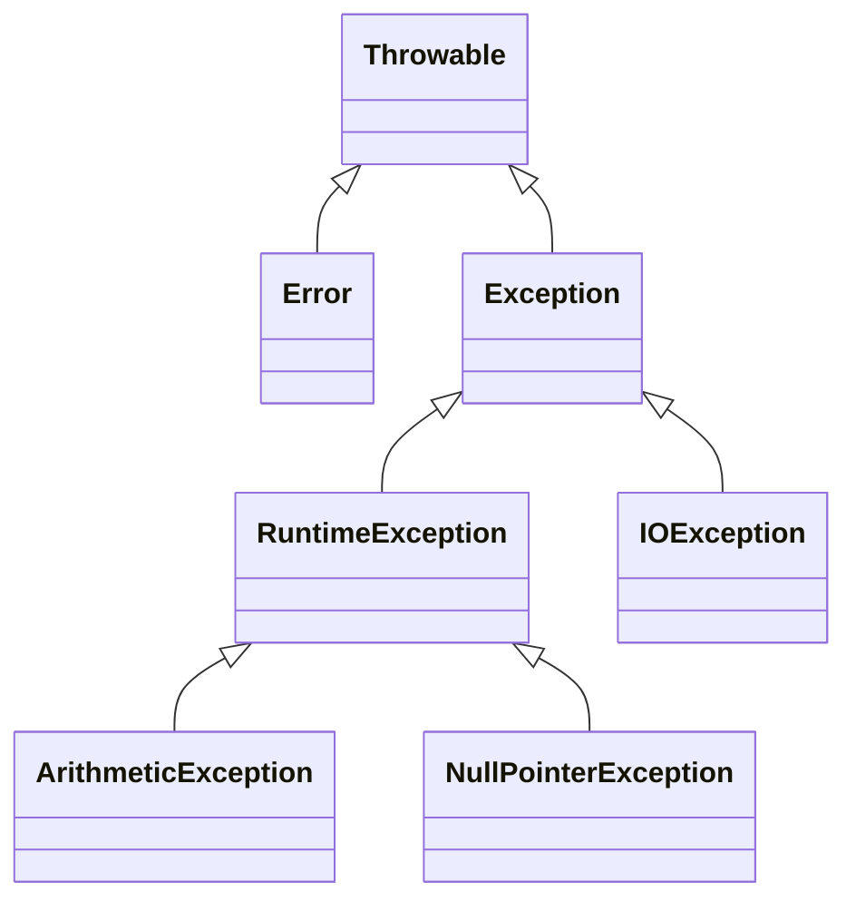

## 12.7 Handling Java Exceptions in Clojure

As experienced Java developers, you are already familiar with Java's robust exception handling mechanism. When transitioning to Clojure, a language that runs on the JVM, understanding how to handle Java exceptions becomes crucial. This section will guide you through the process of catching, interacting with, and re-throwing Java exceptions in Clojure, while also providing best practices for managing exceptions in a functional programming context.

### Catching Exceptions

In Java, exception handling is typically done using `try`, `catch`, and `finally` blocks. Clojure provides a similar mechanism, allowing you to catch exceptions thrown by Java code seamlessly. Let's explore how to catch exceptions in Clojure.

#### Using `try` and `catch` in Clojure

Clojure's `try` and `catch` forms are used to handle exceptions. The `try` block contains the code that might throw an exception, while the `catch` block specifies how to handle specific exceptions.

```clojure
(try
  ;; Code that might throw an exception
  (let [result (/ 10 0)]  ; Division by zero
    (println "Result:" result))
  (catch ArithmeticException e
    (println "Caught an ArithmeticException:" (.getMessage e)))
  (catch Exception e
    (println "Caught a general exception:" (.getMessage e))))
```

In this example, we attempt to divide by zero, which throws an `ArithmeticException`. The `catch` block captures this exception and prints a message. If a different type of exception is thrown, the general `Exception` catch block handles it.

#### Interacting with Java Exception Hierarchy

Java exceptions are organized in a hierarchy, with `Throwable` at the top, followed by `Exception` and `Error`. Understanding this hierarchy is essential when catching exceptions in Clojure.



**Diagram Description:** This diagram illustrates the Java exception hierarchy, showing how different exceptions inherit from `Throwable`.

When catching exceptions in Clojure, you can specify the exact type of exception you want to handle, just like in Java. This allows for precise control over error handling.

### Re-throwing Exceptions

Sometimes, you may need to re-throw an exception after catching it, either to propagate it up the call stack or to wrap it in a custom exception. Clojure allows you to re-throw exceptions using the `throw` form.

#### Re-throwing Exceptions in Clojure

```clojure
(try
  ;; Code that might throw an exception
  (let [result (/ 10 0)]
    (println "Result:" result))
  (catch ArithmeticException e
    (println "Caught an ArithmeticException, re-throwing...")
    (throw e)))
```

In this example, we catch an `ArithmeticException` and immediately re-throw it using `throw`. This is useful when you want to perform some logging or cleanup before letting the exception propagate.

#### Wrapping Exceptions

In some cases, you might want to wrap a caught exception in a custom exception type. This can provide additional context or simplify error handling in higher layers of your application.

```clojure
(defn wrap-exception [e]
  (Exception. (str "Wrapped exception: " (.getMessage e)) e))

(try
  ;; Code that might throw an exception
  (let [result (/ 10 0)]
    (println "Result:" result))
  (catch ArithmeticException e
    (println "Caught an ArithmeticException, wrapping it...")
    (throw (wrap-exception e))))
```

Here, we define a `wrap-exception` function that creates a new `Exception` with a custom message, wrapping the original exception. This wrapped exception is then thrown.

### Best Practices for Exception Handling

When working with exceptions in Clojure, especially when interoperating with Java, it's important to follow best practices to ensure robust and maintainable code.

#### Guidelines for Exception Handling

1. **Catch Specific Exceptions**: Always catch the most specific exception type possible. This allows you to handle different error conditions appropriately.

2. **Avoid Catching `Throwable`**: Catching `Throwable` can mask serious errors like `OutOfMemoryError`. Stick to catching `Exception` or more specific subclasses.

3. **Use `finally` for Cleanup**: If you need to perform cleanup actions, such as closing resources, use a `finally` block. Clojure supports `finally` just like Java.

4. **Log Exceptions**: Always log exceptions with sufficient context to aid in debugging. Use Clojure's logging libraries for structured logging.

5. **Avoid Silent Failures**: Do not catch exceptions without handling them. Silent failures can lead to difficult-to-diagnose bugs.

6. **Consider Functional Alternatives**: Where possible, use functional constructs like `either` or `try` monads to handle errors without exceptions.

#### Example: Using `finally` in Clojure

```clojure
(try
  ;; Code that might throw an exception
  (let [result (/ 10 0)]
    (println "Result:" result))
  (catch ArithmeticException e
    (println "Caught an ArithmeticException:" (.getMessage e)))
  (finally
    (println "Cleanup actions go here.")))
```

In this example, the `finally` block ensures that cleanup actions are executed regardless of whether an exception is thrown.

### Conclusion

Handling Java exceptions in Clojure is a crucial skill for developers transitioning from Java. By leveraging your existing knowledge of Java's exception hierarchy and applying best practices, you can effectively manage errors in your Clojure applications. Remember to catch specific exceptions, log errors, and use functional alternatives where appropriate.

### Knowledge Check

Now that we've covered handling Java exceptions in Clojure, let's test your understanding with a quiz.

## Quiz: Mastering Java Exception Handling in Clojure



### Which Clojure form is used to catch exceptions?

- [x] `catch`
- [ ] `try`
- [ ] `throw`
- [ ] `finally`

> **Explanation:** The `catch` form is used to handle exceptions in Clojure, similar to Java's `catch` block.

### What is the top-level class in the Java exception hierarchy?

- [ ] `Exception`
- [x] `Throwable`
- [ ] `Error`
- [ ] `RuntimeException`

> **Explanation:** `Throwable` is the top-level class in the Java exception hierarchy, from which all exceptions and errors derive.

### How can you re-throw an exception in Clojure?

- [x] Using the `throw` form
- [ ] Using the `catch` form
- [ ] Using the `finally` form
- [ ] Using the `try` form

> **Explanation:** The `throw` form is used to re-throw exceptions in Clojure.

### What should you avoid catching to prevent masking serious errors?

- [ ] `Exception`
- [x] `Throwable`
- [ ] `RuntimeException`
- [ ] `ArithmeticException`

> **Explanation:** Catching `Throwable` can mask serious errors like `OutOfMemoryError`, so it's best to avoid it.

### Which block is used for cleanup actions in Clojure?

- [ ] `catch`
- [ ] `throw`
- [ ] `try`
- [x] `finally`

> **Explanation:** The `finally` block is used for cleanup actions, ensuring they run regardless of exceptions.

### What is a best practice when catching exceptions?

- [x] Catch the most specific exception possible
- [ ] Catch `Throwable` to handle all errors
- [ ] Avoid logging exceptions
- [ ] Use silent failures

> **Explanation:** Catching the most specific exception possible allows for precise error handling.

### How can you wrap an exception in Clojure?

- [x] By creating a new exception with the original as the cause
- [ ] By using the `finally` block
- [ ] By using the `try` block
- [ ] By using the `catch` block

> **Explanation:** Wrapping an exception involves creating a new exception with the original as the cause.

### What is a functional alternative to exceptions?

- [x] Using `either` or `try` monads
- [ ] Using `finally` blocks
- [ ] Using `catch` blocks
- [ ] Using `throw` forms

> **Explanation:** Functional alternatives like `either` or `try` monads can handle errors without exceptions.

### Why is logging exceptions important?

- [x] It provides context for debugging
- [ ] It prevents exceptions from being thrown
- [ ] It catches all exceptions
- [ ] It silences errors

> **Explanation:** Logging exceptions provides context for debugging, making it easier to diagnose issues.

### True or False: Clojure can only catch exceptions thrown by Clojure code.

- [ ] True
- [x] False

> **Explanation:** Clojure can catch exceptions thrown by Java code, as it runs on the JVM.



By mastering exception handling in Clojure, you can build more robust and reliable applications, leveraging your Java expertise to manage errors effectively. Keep experimenting with the code examples and apply these concepts in your projects to deepen your understanding.
