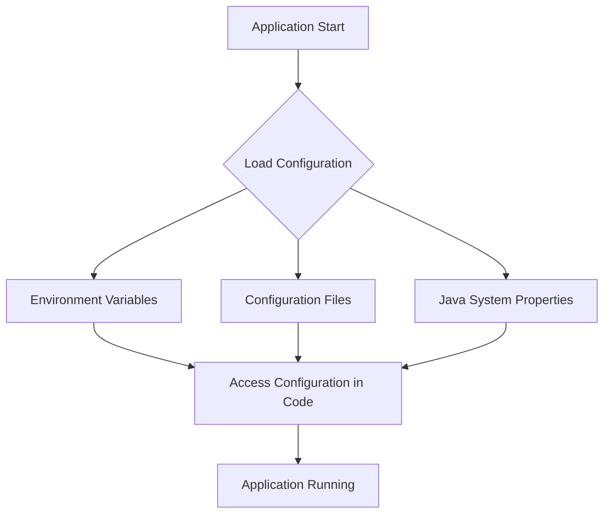

## 12.8 Configuration Management and Environment Handling

In the realm of software development, configuration management and environment handling are crucial for building scalable and maintainable applications. As experienced Java developers transitioning to Clojure, you may already be familiar with the importance of externalizing configuration to separate code from environment-specific settings. This section will guide you through the best practices and tools available in Clojure for managing configurations and handling different environments effectively.

### Externalizing Configuration

Externalizing configuration refers to the practice of keeping configuration settings outside the codebase. This approach offers several benefits, including:

- **Flexibility**: Easily change configurations without modifying the code.
- **Security**: Keep sensitive information like passwords and API keys out of the source code.
- **Scalability**: Manage different configurations for various environments (development, testing, production) without code duplication.

#### Environment Variables

Environment variables are a common way to externalize configuration. They are key-value pairs accessible to applications at runtime, providing a simple and secure method to manage configuration settings.

**Accessing Environment Variables in Clojure**

In Clojure, you can access environment variables using the `System/getenv` function. Here's a simple example:

```clojure
(def db-url (System/getenv "DATABASE_URL"))

(println "Database URL:" db-url)
```

This code retrieves the value of the `DATABASE_URL` environment variable and prints it. Using environment variables is a straightforward way to manage configuration, especially for sensitive information.

**Try It Yourself**: Modify the code to access a different environment variable, such as `API_KEY`, and print its value.

### Configuration Libraries

While environment variables are useful, they can become cumbersome when managing complex configurations. Clojure offers several libraries to simplify configuration management, such as [Environ](https://github.com/weavejester/environ) and [cprop](https://github.com/tolitius/cprop).

#### Environ

Environ is a popular library that provides a unified interface for accessing configuration data from various sources, including environment variables, Java system properties, and property files.

**Using Environ**

To use Environ, add it to your `project.clj` dependencies:

```clojure
:dependencies [[environ "1.2.0"]]
```

Then, create a `profiles.clj` file in your project root to define environment-specific configurations:

```clojure
{:dev  {:env {:database-url "jdbc:postgresql://localhost/devdb"}}
 :test {:env {:database-url "jdbc:postgresql://localhost/testdb"}}
 :prod {:env {:database-url "jdbc:postgresql://localhost/proddb"}}}
```

Access the configuration in your code using the `environ.core/env` map:

```clojure
(require '[environ.core :refer [env]])

(def db-url (env :database-url))

(println "Database URL:" db-url)
```

**Try It Yourself**: Add a new configuration setting for an API endpoint and access it using Environ.

#### cprop

[cprop](https://github.com/tolitius/cprop) is another powerful library for configuration management. It supports multiple configuration sources, including environment variables, system properties, and configuration files.

**Using cprop**

Add cprop to your `project.clj` dependencies:

```clojure
:dependencies [[cprop "0.1.17"]]
```

Create a `config.edn` file for your configuration settings:

```edn
{:database-url "jdbc:postgresql://localhost/defaultdb"
 :api-key "default-api-key"}
```

Load the configuration in your code:

```clojure
(require '[cprop.core :refer [load-config]])

(def config (load-config))

(def db-url (:database-url config))
(def api-key (:api-key config))

(println "Database URL:" db-url)
(println "API Key:" api-key)
```

**Try It Yourself**: Add a new configuration setting for a logging level and access it using cprop.

### Configuring Different Environments

Handling different configurations for development, testing, and production environments is essential for scalable applications. Clojure provides several strategies to manage these configurations effectively.

#### Profiles

Leverage Leiningen profiles to define environment-specific configurations. As shown in the Environ example, you can create a `profiles.clj` file to specify different settings for each environment.

#### Conditional Logic

Use conditional logic in your code to switch between configurations based on the environment. Here's an example using a simple `if` statement:

```clojure
(def db-url
  (if (= (System/getenv "ENV") "production")
    "jdbc:postgresql://localhost/proddb"
    "jdbc:postgresql://localhost/devdb"))

(println "Database URL:" db-url)
```

**Try It Yourself**: Extend the logic to handle a testing environment.

#### Environment-Specific Configuration Files

Create separate configuration files for each environment and load them based on the current environment. For example, you might have `config-dev.edn`, `config-test.edn`, and `config-prod.edn`.

```clojure
(defn load-env-config [env]
  (load-config :file (str "config-" env ".edn")))

(def config (load-env-config (System/getenv "ENV")))

(def db-url (:database-url config))

(println "Database URL:" db-url)
```

**Try It Yourself**: Implement a function to load the appropriate configuration file based on an environment variable.

### Security Considerations

Managing sensitive information like passwords and API keys requires careful consideration to ensure security.

#### Best Practices

- **Environment Variables**: Store sensitive information in environment variables rather than in code or configuration files.
- **Encryption**: Encrypt sensitive data at rest and in transit.
- **Access Control**: Limit access to configuration settings to only those who need it.
- **Secret Management Tools**: Use tools like HashiCorp Vault or AWS Secrets Manager to manage secrets securely.

#### Example: Using Environment Variables for Security

Here's an example of securely accessing a password stored in an environment variable:

```clojure
(def db-password (System/getenv "DB_PASSWORD"))

(println "Database Password:" db-password)
```

**Try It Yourself**: Set an environment variable for an API key and access it securely in your code.

### Visual Aids

To enhance your understanding, let's visualize the flow of configuration management using a diagram.



**Diagram Description**: This flowchart illustrates the process of loading configuration from various sources (environment variables, configuration files, Java system properties) and accessing it in the application code.

### References and Links

For further reading and deeper dives into configuration management in Clojure, consider the following resources:

- [Official Clojure Documentation](https://clojure.org/)
- [Environ GitHub Repository](https://github.com/weavejester/environ)
- [cprop GitHub Repository](https://github.com/tolitius/cprop)
- [Leiningen Documentation](https://leiningen.org/)

### Knowledge Check

To reinforce your understanding, consider the following questions:

1. What are the benefits of externalizing configuration in Clojure applications?
2. How can you access environment variables in Clojure?
3. What are the advantages of using libraries like Environ and cprop for configuration management?
4. How can you handle different configurations for development, testing, and production environments?
5. What are some best practices for managing sensitive information in configuration settings?

### Exercises

1. **Exercise 1**: Create a Clojure application that uses Environ to manage configuration settings for different environments. Implement a feature to switch between development and production configurations based on an environment variable.

2. **Exercise 2**: Use cprop to load configuration settings from a file and environment variables. Implement a function to print the current configuration settings.

3. **Exercise 3**: Securely manage an API key using environment variables. Implement a feature to access and print the API key in your application.

### Summary

In this section, we've explored the importance of configuration management and environment handling in Clojure applications. By externalizing configuration, using libraries like Environ and cprop, and following best practices for security, you can build scalable and maintainable applications. Remember to experiment with the code examples and exercises to solidify your understanding.

## Quiz: Mastering Configuration Management in Clojure



### What is the primary benefit of externalizing configuration in Clojure applications?

- [x] Flexibility to change configurations without modifying code
- [ ] Improved performance
- [ ] Increased code readability
- [ ] Easier debugging

> **Explanation:** Externalizing configuration allows you to change settings without altering the code, providing flexibility and ease of management.

### How can you access environment variables in Clojure?

- [x] Using `System/getenv`
- [ ] Using `System/getProperty`
- [ ] Using `clojure.core/env`
- [ ] Using `java.lang.System`

> **Explanation:** The `System/getenv` function is used to access environment variables in Clojure.

### Which library provides a unified interface for accessing configuration data from various sources?

- [x] Environ
- [ ] cprop
- [ ] Leiningen
- [ ] Ring

> **Explanation:** Environ provides a unified interface for accessing configuration data from environment variables, Java system properties, and property files.

### What is a recommended practice for managing sensitive information like passwords in configuration settings?

- [x] Store them in environment variables
- [ ] Hardcode them in the source code
- [ ] Use plain text files
- [ ] Share them in documentation

> **Explanation:** Storing sensitive information in environment variables is a secure practice to prevent exposure in the source code.

### Which tool can be used for secret management in Clojure applications?

- [x] HashiCorp Vault
- [ ] Leiningen
- [ ] Environ
- [ ] Ring

> **Explanation:** HashiCorp Vault is a tool used for managing secrets securely in applications.

### How can you handle different configurations for development and production environments in Clojure?

- [x] Use Leiningen profiles
- [ ] Use a single configuration file
- [ ] Hardcode configurations in the code
- [ ] Use only environment variables

> **Explanation:** Leiningen profiles allow you to define environment-specific configurations for development, testing, and production.

### What is the purpose of the `cprop` library in Clojure?

- [x] To manage configuration from multiple sources
- [ ] To handle HTTP requests
- [ ] To manage database connections
- [ ] To perform unit testing

> **Explanation:** The `cprop` library is used to manage configuration settings from environment variables, system properties, and configuration files.

### Which of the following is a security best practice for configuration management?

- [x] Encrypt sensitive data at rest and in transit
- [ ] Store passwords in plain text files
- [ ] Share API keys in documentation
- [ ] Use default passwords

> **Explanation:** Encrypting sensitive data at rest and in transit is a security best practice to protect information.

### What is the role of environment variables in configuration management?

- [x] To provide a secure and flexible way to manage configuration settings
- [ ] To improve application performance
- [ ] To increase code readability
- [ ] To simplify debugging

> **Explanation:** Environment variables provide a secure and flexible way to manage configuration settings, especially for sensitive information.

### True or False: Configuration management is only necessary for production environments.

- [ ] True
- [x] False

> **Explanation:** Configuration management is necessary for all environments, including development, testing, and production, to ensure consistency and scalability.


