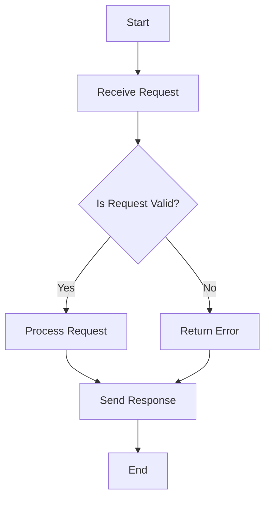

## 13.1 The Role of Concurrency in Functional Programming

Concurrency is a cornerstone of modern software development, enabling applications to perform multiple tasks simultaneously, thereby improving performance and responsiveness. In this section, we'll explore why concurrency is crucial in today's applications, how functional programming principles like immutability and pure functions simplify concurrent programming, and how Clojure, a functional programming language, leverages these principles to handle concurrency effectively.

### Importance of Concurrency

Concurrency is essential for building scalable and efficient applications. It allows programs to handle multiple operations at once, making it possible to perform tasks such as processing user requests, managing data streams, or executing background tasks without blocking the main application flow.

#### Handling Multiple Tasks Simultaneously

In a world where applications are expected to be responsive and efficient, concurrency plays a vital role. Consider a web server handling multiple client requests. Without concurrency, the server would process each request sequentially, leading to delays and poor user experience. Concurrency allows the server to handle multiple requests simultaneously, improving throughput and responsiveness.

#### Improving Performance

Concurrency can significantly enhance application performance by utilizing system resources more effectively. By distributing tasks across multiple threads or processes, applications can leverage multi-core processors to perform computations in parallel, reducing execution time and increasing efficiency.

### Functional Programming Benefits

Functional programming offers unique advantages for concurrent programming, primarily due to its emphasis on immutability and pure functions.

#### Immutability and Pure Functions

Immutability ensures that data cannot be changed once created. This eliminates the need for locks or synchronization mechanisms, which are often sources of complexity and bugs in concurrent programming. Pure functions, which do not have side effects and always produce the same output for the same input, further simplify concurrency by ensuring that functions can be executed independently without affecting shared state.

```clojure
;; Example of a pure function in Clojure
(defn add [x y]
  (+ x y))

;; This function is pure because it always returns the same result for the same inputs
```

In contrast, Java developers often deal with mutable state and side effects, requiring careful management of shared resources to avoid race conditions and deadlocks.

### Challenges in Concurrency

Despite its benefits, concurrency introduces several challenges, including race conditions, deadlocks, and synchronization issues.

#### Race Conditions

Race conditions occur when multiple threads access shared data simultaneously, leading to unpredictable results. In imperative programming, developers often use locks or other synchronization mechanisms to prevent race conditions, but these can be complex and error-prone.

#### Deadlocks

Deadlocks happen when two or more threads are waiting for each other to release resources, causing the program to freeze. Avoiding deadlocks requires careful design and management of resource dependencies.

#### Synchronization Issues

Synchronization is necessary to ensure that multiple threads can safely access shared resources. However, improper synchronization can lead to performance bottlenecks and increased complexity.

### Immutability Advantage

Immutability is a powerful tool in functional programming that addresses many concurrency challenges. By ensuring that data cannot be changed once created, immutability eliminates the need for locks and reduces the risk of race conditions and deadlocks.

#### Simplifying Concurrent Code

Immutable data structures allow developers to write concurrent code that is simpler and more predictable. Since data cannot be modified, there is no need to worry about one thread altering data that another thread is using.

```clojure
;; Example of using an immutable data structure in Clojure
(def my-list [1 2 3 4 5])

;; Adding an element to the list returns a new list, leaving the original unchanged
(def new-list (conj my-list 6))

;; my-list remains unchanged
```

In Java, developers often use synchronized collections or explicit locking to manage concurrent access to mutable data, which can be complex and error-prone.

### Real-World Examples

Concurrency is particularly beneficial in scenarios where applications need to handle multiple tasks simultaneously or process large volumes of data efficiently.

#### Handling Web Requests

Web servers often need to handle thousands of concurrent requests. By using concurrency, servers can process multiple requests in parallel, improving response times and user experience.

```clojure
;; Example of handling concurrent requests in Clojure using core.async
(require '[clojure.core.async :refer [go <! >! chan]])

(defn handle-request [request]
  (go
    (let [response (process-request request)]
      (>! response-channel response))))

;; This function processes requests concurrently using channels
```

#### Processing Data Streams

Applications that process data streams, such as real-time analytics systems, can benefit from concurrency by distributing data processing tasks across multiple threads or processes.

```clojure
;; Example of processing data streams concurrently in Clojure
(require '[clojure.core.async :refer [go-loop chan >! <!]])

(defn process-stream [stream]
  (let [output-chan (chan)]
    (go-loop []
      (when-let [data (<! stream)]
        (process-data data)
        (>! output-chan data)
        (recur)))
    output-chan))

;; This function processes data from a stream concurrently
```

### Visualizing Concurrency in Clojure

To better understand how concurrency works in Clojure, let's visualize the flow of data through concurrent processes using a Mermaid.js diagram.



**Diagram Description:** This flowchart illustrates a simple concurrent request handling process in Clojure. The process starts with receiving a request, checking its validity, processing it if valid, and sending a response.

### References and Links

- [Official Clojure Documentation](https://clojure.org/reference/documentation)
- [ClojureDocs](https://clojuredocs.org/)
- [Concurrency in Clojure](https://clojure.org/reference/concurrency)

### Knowledge Check

Let's reinforce what we've learned with a few questions:

1. What are the main benefits of using concurrency in applications?
2. How do immutability and pure functions simplify concurrent programming?
3. What are some common challenges associated with concurrency?
4. How does immutability help prevent race conditions and deadlocks?
5. Provide a real-world example where concurrency can enhance application performance.

### Encouraging Tone

Now that we've explored the role of concurrency in functional programming, let's apply these concepts to build scalable and efficient applications. By leveraging Clojure's strengths in immutability and pure functions, we can simplify concurrent programming and unlock the full potential of modern hardware.

### Quiz

## Understanding Concurrency in Functional Programming



### What is a primary benefit of concurrency in applications?

- [x] Handling multiple tasks simultaneously
- [ ] Reducing code complexity
- [ ] Eliminating bugs
- [ ] Improving code readability

> **Explanation:** Concurrency allows applications to handle multiple tasks simultaneously, improving performance and responsiveness.

### How does immutability simplify concurrent programming?

- [x] By eliminating the need for locks
- [ ] By increasing code complexity
- [ ] By introducing race conditions
- [ ] By requiring more memory

> **Explanation:** Immutability ensures that data cannot be changed, eliminating the need for locks and reducing the risk of race conditions.

### What is a common challenge in concurrent programming?

- [x] Race conditions
- [ ] Code readability
- [ ] Function composition
- [ ] Data immutability

> **Explanation:** Race conditions occur when multiple threads access shared data simultaneously, leading to unpredictable results.

### How does Clojure handle concurrent requests?

- [x] Using core.async for asynchronous processing
- [ ] By using synchronized collections
- [ ] By locking all resources
- [ ] By avoiding concurrency

> **Explanation:** Clojure uses core.async to handle concurrent requests asynchronously, allowing for efficient processing.

### What is a real-world example of concurrency enhancing performance?

- [x] Handling web requests
- [ ] Writing to a single file
- [ ] Reading a static configuration
- [ ] Calculating a single sum

> **Explanation:** Concurrency is beneficial in handling web requests, where multiple requests can be processed simultaneously.

### What is a deadlock in concurrent programming?

- [x] When two or more threads wait indefinitely for each other
- [ ] When a program runs out of memory
- [ ] When a function returns an incorrect result
- [ ] When a program executes too quickly

> **Explanation:** A deadlock occurs when two or more threads wait indefinitely for each other to release resources.

### How does Clojure's immutability help with concurrency?

- [x] By preventing data modification
- [ ] By increasing the need for synchronization
- [ ] By causing more race conditions
- [ ] By reducing performance

> **Explanation:** Immutability prevents data modification, reducing the need for synchronization and minimizing race conditions.

### What is the role of pure functions in concurrency?

- [x] They ensure functions can be executed independently
- [ ] They increase the need for locks
- [ ] They introduce side effects
- [ ] They complicate code

> **Explanation:** Pure functions do not have side effects and always produce the same output for the same input, allowing them to be executed independently.

### What is a benefit of using core.async in Clojure?

- [x] It allows for asynchronous processing
- [ ] It requires more memory
- [ ] It simplifies code readability
- [ ] It eliminates all bugs

> **Explanation:** core.async allows for asynchronous processing, enabling efficient handling of concurrent tasks.

### True or False: Immutability eliminates the need for synchronization in concurrent programming.

- [x] True
- [ ] False

> **Explanation:** Immutability ensures that data cannot be changed, eliminating the need for synchronization mechanisms like locks.



By understanding and leveraging the role of concurrency in functional programming, you can build applications that are not only efficient and scalable but also easier to maintain and reason about. Keep experimenting with Clojure's concurrency features to unlock new possibilities in your software development journey.
