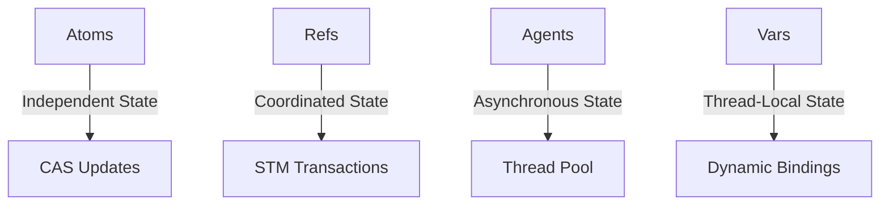

## 13.2 Clojure's Concurrency Primitives

Concurrency is a critical aspect of modern software development, especially when building scalable applications. Clojure, a functional programming language that runs on the Java Virtual Machine (JVM), offers a set of powerful concurrency primitives that simplify the management of shared state in concurrent applications. In this section, we will explore Clojure's concurrency primitives: Atoms, Refs, Agents, and Vars. These tools provide developers with the means to handle state changes in a controlled and efficient manner, leveraging Clojure's immutable data structures and functional programming paradigms.

### Overview of Concurrency Primitives

Clojure's concurrency model is designed to handle shared state changes safely and efficiently. Unlike traditional locking mechanisms in Java, Clojure's primitives offer a higher-level abstraction that minimizes the risk of race conditions and deadlocks. Let's delve into each of these primitives and understand their unique roles in managing concurrency.

### Atoms

Atoms in Clojure are used for managing independent, synchronous state changes. They provide a way to handle mutable state with compare-and-swap (CAS) semantics, ensuring that updates are atomic and consistent.

#### How Atoms Work

Atoms are ideal for managing state that is independent and doesn't require coordination with other state changes. They use CAS to ensure that updates are applied only if the current state matches the expected state. This mechanism is similar to Java's `AtomicReference`, but with a more functional approach.

```clojure
(def counter (atom 0))

;; Increment the counter atomically
(swap! counter inc)

;; Retrieve the current value
@counter ; => 1
```

In this example, `swap!` is used to apply a function (`inc`) to the current value of the atom. The operation is atomic, meaning that no other thread can modify the atom's state during the update.

#### Benefits of Using Atoms

- **Simplicity**: Atoms are straightforward and easy to use for independent state changes.
- **Thread Safety**: CAS ensures that updates are atomic and consistent.
- **No Locks**: Atoms do not require explicit locking, reducing the risk of deadlocks.

#### Try It Yourself

Experiment with atoms by creating a simple counter that multiple threads can increment. Observe how the state remains consistent without explicit locks.

### Refs and Software Transactional Memory (STM)

Refs in Clojure are used for coordinated, synchronous updates across multiple shared states. They leverage Software Transactional Memory (STM) to ensure that changes are applied consistently and atomically.

#### How Refs and STM Work

Refs are suitable for scenarios where multiple pieces of state need to be updated together. STM allows you to group these updates into transactions, ensuring that either all changes are applied or none at all.

```clojure
(def account1 (ref 100))
(def account2 (ref 200))

;; Transfer money between accounts
(dosync
  (alter account1 - 50)
  (alter account2 + 50))
```

In this example, `dosync` creates a transaction that updates both accounts. If any part of the transaction fails, no changes are applied, maintaining consistency.

#### Benefits of Using Refs and STM

- **Consistency**: STM ensures that all changes within a transaction are applied atomically.
- **Coordination**: Refs are ideal for managing interdependent state changes.
- **Automatic Retry**: STM automatically retries transactions that conflict with other updates.

#### Try It Yourself

Create a simple banking application that transfers funds between accounts using refs. Experiment with concurrent transactions to see how STM handles conflicts.

### Agents

Agents in Clojure are used for managing asynchronous, independent state changes. They process actions in a separate thread pool, allowing for non-blocking updates.

#### How Agents Work

Agents are ideal for tasks that can be performed asynchronously, such as background computations or I/O operations. They queue actions and execute them in a separate thread, ensuring that the main thread remains responsive.

```clojure
(def logger (agent []))

;; Log a message asynchronously
(send logger conj "Log entry 1")

;; Retrieve the current log
@logger ; => ["Log entry 1"]
```

In this example, `send` queues an action (`conj`) to be applied to the agent's state. The action is executed asynchronously, allowing the main thread to continue processing.

#### Benefits of Using Agents

- **Asynchronous Processing**: Agents enable non-blocking updates, improving application responsiveness.
- **Thread Safety**: Actions are applied in a controlled manner, ensuring consistency.
- **Error Handling**: Agents can handle errors gracefully, retrying actions if necessary.

#### Try It Yourself

Create a simple logging system using agents. Experiment with sending log messages from multiple threads and observe how the log remains consistent.

### Vars and Dynamic Bindings

Vars in Clojure can have thread-local bindings, making them useful for managing state that varies between threads.

#### How Vars Work

Vars are typically used for global state that can be overridden on a per-thread basis. This is useful for managing configuration or context-specific data.

```clojure
(def ^:dynamic *config* {:mode "production"})

;; Override the config in a specific thread
(binding [*config* {:mode "development"}]
  (println *config*)) ; => {:mode "development"}

;; Outside the binding, the original value is restored
(println *config*) ; => {:mode "production"}
```

In this example, `binding` temporarily overrides the value of `*config*` within a specific thread, allowing for context-specific configurations.

#### Benefits of Using Vars

- **Flexibility**: Vars provide a way to manage global state with thread-local overrides.
- **Context-Specific State**: Useful for managing configuration or context-sensitive data.

#### Try It Yourself

Experiment with vars by creating a simple application that uses different configurations for different threads. Observe how `binding` allows for context-specific overrides.

### Visualizing Concurrency Models

To better understand how these concurrency primitives interact, let's visualize their relationships and workflows.



**Diagram Description**: This diagram illustrates the relationships between Clojure's concurrency primitives. Atoms manage independent state changes using CAS. Refs coordinate state changes using STM transactions. Agents handle asynchronous state changes in a separate thread pool. Vars provide thread-local state with dynamic bindings.

### References and Further Reading

- [Official Clojure Documentation](https://clojure.org/reference/concurrency)
- [ClojureDocs: Atoms](https://clojuredocs.org/clojure.core/atom)
- [ClojureDocs: Refs and STM](https://clojuredocs.org/clojure.core/ref)
- [ClojureDocs: Agents](https://clojuredocs.org/clojure.core/agent)
- [ClojureDocs: Vars](https://clojuredocs.org/clojure.core/var)

### Knowledge Check

To reinforce your understanding of Clojure's concurrency primitives, try answering the following questions and challenges.

- What are the key differences between Atoms and Refs?
- How does STM ensure consistency in transactions?
- When would you choose to use an Agent over an Atom?
- How can Vars be used to manage configuration in a multi-threaded application?

### Exercises

1. **Atom Exercise**: Create a simple counter using atoms. Allow multiple threads to increment the counter and verify that the final count is consistent.

2. **Ref Exercise**: Implement a banking system using refs. Simulate concurrent transactions and ensure that account balances remain consistent.

3. **Agent Exercise**: Develop a logging system using agents. Send log messages from multiple threads and verify that the log is updated correctly.

4. **Var Exercise**: Create an application that uses different configurations for different threads. Use vars to manage these configurations and observe how `binding` affects the state.

### Summary

Clojure's concurrency primitives provide powerful tools for managing state in concurrent applications. By leveraging Atoms, Refs, Agents, and Vars, developers can build scalable and efficient systems that handle shared state safely and effectively. These primitives, combined with Clojure's immutable data structures and functional programming paradigms, offer a robust foundation for modern software development.

Now that we've explored Clojure's concurrency primitives, let's apply these concepts to build scalable applications that can handle the demands of modern computing environments.

## Clojure Concurrency Primitives Quiz



### What is the primary use of Atoms in Clojure?

- [x] Managing independent, synchronous state changes
- [ ] Coordinating multiple state changes
- [ ] Handling asynchronous state changes
- [ ] Providing thread-local bindings

> **Explanation:** Atoms are used for managing independent, synchronous state changes with compare-and-swap semantics.

### How do Refs ensure consistency in Clojure?

- [x] By using Software Transactional Memory (STM) for atomic transactions
- [ ] By using locks to synchronize access
- [ ] By queuing actions in a thread pool
- [ ] By providing dynamic bindings

> **Explanation:** Refs use STM to ensure that all changes within a transaction are applied atomically, maintaining consistency.

### When should you use Agents in Clojure?

- [x] For managing asynchronous, independent state changes
- [ ] For coordinating multiple state changes
- [ ] For providing thread-local bindings
- [ ] For managing synchronous state changes

> **Explanation:** Agents are used for managing asynchronous, independent state changes, processing actions in a separate thread pool.

### What is the role of Vars in Clojure concurrency?

- [x] Providing thread-local bindings
- [ ] Managing independent state changes
- [ ] Coordinating multiple state changes
- [ ] Handling asynchronous state changes

> **Explanation:** Vars can have thread-local bindings, making them useful for managing state that varies between threads.

### How does STM handle conflicting transactions?

- [x] By automatically retrying the transactions
- [ ] By locking the conflicting resources
- [ ] By discarding the conflicting transactions
- [ ] By queuing the transactions for later execution

> **Explanation:** STM automatically retries transactions that conflict with other updates, ensuring consistency.

### What mechanism do Atoms use to ensure atomic updates?

- [x] Compare-and-swap (CAS) semantics
- [ ] Locking mechanisms
- [ ] Thread pools
- [ ] Dynamic bindings

> **Explanation:** Atoms use compare-and-swap (CAS) semantics to ensure that updates are atomic and consistent.

### Which concurrency primitive is best suited for background computations?

- [x] Agents
- [ ] Atoms
- [ ] Refs
- [ ] Vars

> **Explanation:** Agents are ideal for tasks that can be performed asynchronously, such as background computations or I/O operations.

### What is the primary advantage of using Atoms over locks?

- [x] No risk of deadlocks
- [ ] Faster execution
- [ ] Easier to debug
- [ ] Better error handling

> **Explanation:** Atoms do not require explicit locking, reducing the risk of deadlocks.

### How can Vars be used in a multi-threaded application?

- [x] By providing thread-local overrides for global state
- [ ] By managing asynchronous state changes
- [ ] By coordinating multiple state changes
- [ ] By ensuring atomic updates

> **Explanation:** Vars provide a way to manage global state with thread-local overrides, useful for configuration or context-sensitive data.

### True or False: Agents in Clojure require explicit locking to ensure consistency.

- [ ] True
- [x] False

> **Explanation:** Agents do not require explicit locking; they process actions in a separate thread pool, ensuring consistency without locks.


