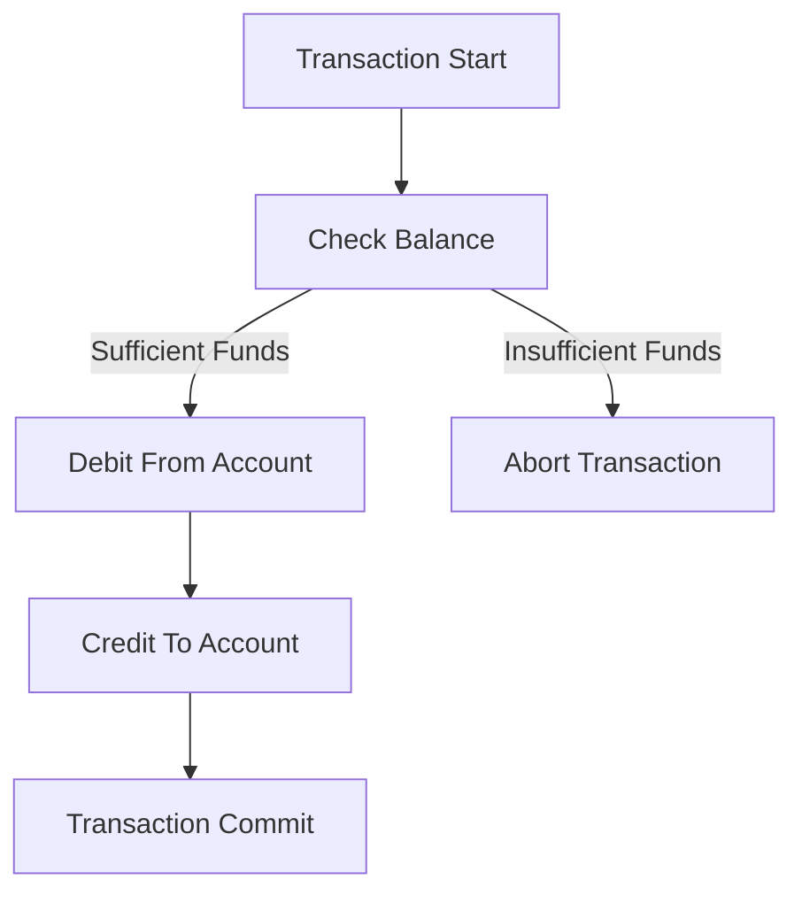
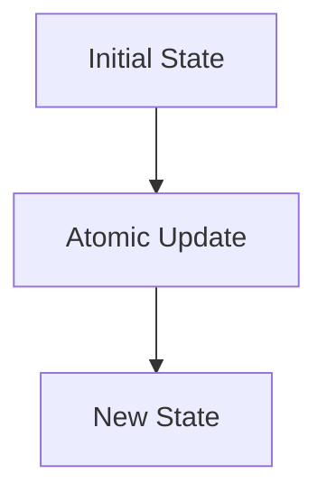

## 13.3 Managing State in Concurrent Applications

As experienced Java developers, you are likely familiar with the complexities of managing state in concurrent applications. In Java, shared mutable state can lead to issues such as race conditions, deadlocks, and inconsistent data. Clojure, with its functional programming paradigm, offers a refreshing approach to concurrency by emphasizing immutability and providing powerful concurrency primitives. In this section, we will explore how to manage state effectively in concurrent applications using Clojure's unique features.

### State Management Strategies

Managing state in concurrent applications requires careful consideration of how data is accessed and modified. Clojure provides several strategies to handle state in a way that minimizes the risks associated with concurrency.

#### Avoiding Shared Mutable State

One of the core principles of functional programming is immutability. In Clojure, data structures are immutable by default, which means that once a data structure is created, it cannot be changed. This immutability is a powerful tool for managing state in concurrent applications, as it eliminates the risks associated with shared mutable state.

**Why Avoid Shared Mutable State?**

- **Race Conditions**: When multiple threads attempt to modify the same piece of data simultaneously, it can lead to unpredictable results.
- **Deadlocks**: Threads waiting indefinitely for resources held by each other can cause the application to freeze.
- **Complexity**: Managing locks and synchronization can make the code complex and error-prone.

By using immutable data structures, Clojure ensures that data cannot be changed once it is created. Instead of modifying data, you create new data structures with the desired changes. This approach simplifies reasoning about state and eliminates many concurrency issues.

#### Coordinated vs. Independent State Changes

In Clojure, different concurrency primitives are used depending on whether state changes need to be coordinated or can occur independently.

**Coordinated State Changes with Refs**

Refs are used when multiple pieces of state need to be changed in a coordinated manner. Clojure's Software Transactional Memory (STM) system ensures that changes to Refs are atomic and consistent.

```clojure
(def account-balance (ref 1000))

(defn transfer [from to amount]
  (dosync
    (alter from - amount)
    (alter to + amount)))

;; Usage
(def account-a (ref 1000))
(def account-b (ref 500))

(transfer account-a account-b 100)
```

In the example above, the `transfer` function uses `dosync` to ensure that the changes to `account-a` and `account-b` are atomic. If any part of the transaction fails, the entire transaction is retried.

**Independent State Changes with Atoms and Agents**

Atoms are used for independent state changes that do not require coordination with other state changes. They provide a simple way to manage state with atomic updates.

```clojure
(def counter (atom 0))

(defn increment-counter []
  (swap! counter inc))

;; Usage
(increment-counter)
```

Agents are similar to Atoms but are designed for asynchronous updates. They are useful when you want to perform state changes in the background.

```clojure
(def log-agent (agent []))

(defn log-message [message]
  (send log-agent conj message))

;; Usage
(log-message "Starting process")
```

In this example, `log-agent` is used to accumulate log messages asynchronously.

### Example Implementations

Let's explore some practical examples of managing state in concurrent applications using Clojure's concurrency primitives.

#### Example 1: Bank Account Transfers with Refs

In this example, we will simulate a simple banking system where multiple accounts can transfer money between each other. We will use Refs to ensure that transfers are atomic and consistent.

```clojure
(defn create-account [initial-balance]
  (ref initial-balance))

(defn transfer [from-account to-account amount]
  (dosync
    (when (>= @from-account amount)
      (alter from-account - amount)
      (alter to-account + amount))))

;; Usage
(def account1 (create-account 1000))
(def account2 (create-account 500))

(transfer account1 account2 200)
```

In this example, the `transfer` function ensures that the transfer only occurs if the `from-account` has sufficient funds. The `dosync` block guarantees that the transfer is atomic.

#### Example 2: Real-Time Data Processing with Agents

Agents are well-suited for real-time data processing tasks where updates can occur asynchronously. In this example, we will use an Agent to process a stream of data.

```clojure
(def data-agent (agent []))

(defn process-data [data]
  (send data-agent conj data))

;; Simulate data stream
(doseq [i (range 10)]
  (process-data i))

;; Wait for all updates to complete
(await data-agent)

;; Check the processed data
@data-agent
```

In this example, `process-data` sends data to the `data-agent` asynchronously. The `await` function is used to wait for all updates to complete before checking the processed data.

### Visual Aids

To better understand the flow of data and state management in Clojure, let's look at some diagrams.

#### Diagram 1: Coordinated State Changes with Refs



*Caption*: This diagram illustrates the flow of a bank account transfer using Refs. The transaction ensures that both debit and credit operations are atomic.

#### Diagram 2: Independent State Changes with Atoms



*Caption*: This diagram shows the simple flow of state updates using Atoms, where each update is atomic and independent.

### References and Links

- [Clojure Official Documentation](https://clojure.org/reference)
- [ClojureDocs](https://clojuredocs.org/)
- [GitHub - Clojure](https://github.com/clojure/clojure)

### Knowledge Check

Let's reinforce your understanding with some questions and exercises.

1. **What are the benefits of using immutable data structures in concurrent applications?**
2. **How do Refs ensure atomicity in state changes?**
3. **What is the difference between Atoms and Agents in Clojure?**
4. **Try modifying the bank account transfer example to include a transaction fee.**

### Encouraging Tone

Now that we've explored how to manage state in concurrent applications using Clojure's powerful primitives, you're well-equipped to tackle complex concurrency challenges. Remember, the key is to embrace immutability and leverage Clojure's concurrency tools to simplify your code and ensure consistency.

### Best Practices for Tags

- "Clojure"
- "Functional Programming"
- "Concurrency"
- "State Management"
- "Immutable Data"
- "Atoms"
- "Refs"
- "Agents"

## Quiz: Mastering State Management in Concurrent Clojure Applications



### What is the primary advantage of using immutable data structures in concurrent applications?

- [x] They eliminate the risks associated with shared mutable state.
- [ ] They are faster than mutable data structures.
- [ ] They require less memory.
- [ ] They simplify the syntax of the code.

> **Explanation:** Immutable data structures prevent shared mutable state issues like race conditions and deadlocks, making concurrent applications more reliable.

### Which Clojure primitive is best suited for coordinated state changes?

- [x] Refs
- [ ] Atoms
- [ ] Agents
- [ ] Vars

> **Explanation:** Refs are used for coordinated state changes, ensuring atomicity and consistency through Clojure's STM.

### How do Atoms differ from Agents in Clojure?

- [x] Atoms are for synchronous updates, while Agents are for asynchronous updates.
- [ ] Atoms are for asynchronous updates, while Agents are for synchronous updates.
- [ ] Atoms require transactions, while Agents do not.
- [ ] Atoms are slower than Agents.

> **Explanation:** Atoms provide synchronous atomic updates, whereas Agents handle updates asynchronously.

### What function is used to ensure atomic transactions with Refs?

- [x] dosync
- [ ] swap!
- [ ] send
- [ ] alter

> **Explanation:** `dosync` is used to create a transaction context for atomic operations on Refs.

### In the context of Clojure, what is a common use case for Agents?

- [x] Asynchronous data processing
- [ ] Coordinated state changes
- [ ] Synchronous updates
- [ ] Managing configuration settings

> **Explanation:** Agents are ideal for asynchronous data processing tasks where updates can occur in the background.

### What is the purpose of the `await` function when working with Agents?

- [x] To wait for all pending actions on an Agent to complete
- [ ] To initiate an action on an Agent
- [ ] To cancel pending actions on an Agent
- [ ] To synchronize multiple Agents

> **Explanation:** `await` is used to block until all pending actions on an Agent have been processed.

### Which Clojure primitive would you use for independent state changes that do not require coordination?

- [x] Atoms
- [ ] Refs
- [ ] Agents
- [ ] Vars

> **Explanation:** Atoms are suitable for independent state changes with atomic updates.

### What is a potential drawback of using shared mutable state in concurrent applications?

- [x] It can lead to race conditions and data inconsistency.
- [ ] It simplifies code readability.
- [ ] It improves performance.
- [ ] It reduces memory usage.

> **Explanation:** Shared mutable state can cause race conditions and data inconsistency, making it problematic in concurrent applications.

### How does Clojure's STM system benefit concurrent programming?

- [x] It ensures atomicity and consistency in state changes.
- [ ] It increases the speed of data processing.
- [ ] It reduces the need for memory.
- [ ] It simplifies syntax.

> **Explanation:** Clojure's STM system provides atomicity and consistency, crucial for reliable concurrent programming.

### True or False: In Clojure, Refs can be used for asynchronous updates.

- [ ] True
- [x] False

> **Explanation:** Refs are used for synchronous, coordinated state changes, not for asynchronous updates.



By mastering these concepts, you'll be able to build scalable and reliable concurrent applications in Clojure, leveraging its functional programming strengths.
