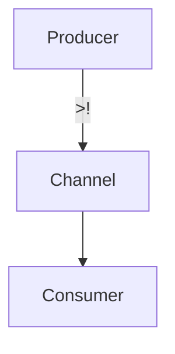
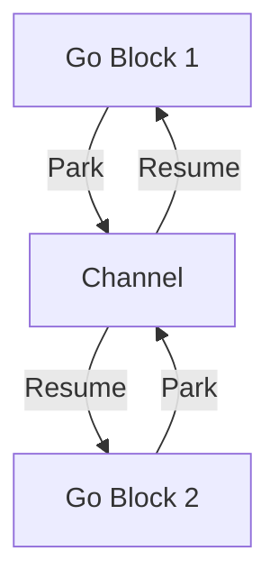

## 13.4 Utilizing `core.async` for Concurrent Tasks

In the realm of concurrent programming, Clojure's `core.async` library stands out as a powerful tool for managing asynchronous tasks. By leveraging channels and go blocks, `core.async` allows developers to write non-blocking, concurrent code that is both efficient and easy to understand. This section will guide you through the concepts and practical applications of `core.async`, helping you harness its full potential in your Clojure applications.

### Introduction to `core.async`

The [`core.async`](https://github.com/clojure/core.async) library is inspired by the Communicating Sequential Processes (CSP) model, which provides a way to structure concurrent programs using channels for communication. This model allows you to write asynchronous code that is more intuitive and less error-prone compared to traditional threading models.

#### Key Concepts

- **Channels**: Channels are the backbone of `core.async`, facilitating communication between different parts of your program. They act as conduits through which data can be passed between concurrent processes.
- **Go Blocks**: Go blocks are lightweight threads that allow you to execute code asynchronously. They enable you to write code that appears synchronous but is executed in a non-blocking manner.
- **Parking and Blocking**: Understanding the difference between parking and blocking is crucial when working with go blocks. Parking allows a go block to yield control without consuming a thread, while blocking can halt the execution of a thread.

### Channels in `core.async`

Channels in `core.async` are similar to queues in Java, but with additional capabilities for asynchronous communication. They can be thought of as conduits for data flow between different parts of your application.

#### Creating and Using Channels

To create a channel in `core.async`, you use the `chan` function:

```clojure
(require '[clojure.core.async :refer [chan >! <! go]])

;; Create a channel
(def my-channel (chan))

;; Put a value onto the channel
(go (>! my-channel "Hello, World!"))

;; Take a value from the channel
(go (println (<! my-channel)))
```

In this example, we create a channel `my-channel` and use go blocks to put and take values from it. The `>!` operator is used to put a value onto the channel, while `<!` is used to take a value from it.

#### Channel Types

Channels can be buffered or unbuffered:

- **Unbuffered Channels**: These channels block the sender until the receiver is ready to take the value.
- **Buffered Channels**: These channels have a fixed size buffer, allowing the sender to continue without waiting for the receiver, up to the buffer's capacity.

```clojure
;; Create a buffered channel with a capacity of 10
(def buffered-channel (chan 10))
```

Buffered channels are useful when you need to decouple the producer and consumer, allowing them to operate at different rates.

### Go Blocks and Asynchronous Execution

Go blocks in `core.async` are similar to Java's threads but are much lighter and more efficient. They allow you to write asynchronous code that looks synchronous, making it easier to reason about.

#### Writing Go Blocks

A go block is created using the `go` macro:

```clojure
(go
  (let [value (<! my-channel)]
    (println "Received:" value)))
```

In this example, the go block takes a value from `my-channel` and prints it. The `<!` operator is used to take a value from the channel, and the go block will park until a value is available.

#### Parking vs. Blocking

- **Parking**: When a go block encounters a `<!` or `>!` operation, it parks, yielding control without consuming a thread. This allows other go blocks to execute.
- **Blocking**: Blocking occurs when a thread is halted, preventing other operations from executing. `core.async` minimizes blocking by using parking, which is more efficient.

### Practical Examples with `core.async`

Let's explore some practical applications of `core.async`, including implementing pipelines, handling events, and coordinating concurrent tasks.

#### Implementing Pipelines

Pipelines are a common use case for `core.async`, allowing you to process data in stages.

```clojure
(defn process-data [input-channel output-channel]
  (go
    (while true
      (let [data (<! input-channel)]
        (when data
          (>! output-channel (str "Processed: " data)))))))

(def input (chan))
(def output (chan))

(process-data input output)

(go (>! input "Data 1"))
(go (println (<! output)))
```

In this example, we define a `process-data` function that reads from an `input-channel`, processes the data, and writes the result to an `output-channel`.

#### Event Handling with `core.async`

`core.async` can also be used for event handling, where events are represented as messages on a channel.

```clojure
(def event-channel (chan))

(defn handle-event [event]
  (println "Handling event:" event))

(go
  (while true
    (let [event (<! event-channel)]
      (handle-event event))))

(go (>! event-channel {:type :click :x 100 :y 200}))
```

Here, events are sent to `event-channel`, and a go block continuously reads and handles these events.

#### Coordinating Concurrent Tasks

`core.async` excels at coordinating tasks that need to run concurrently.

```clojure
(defn task [id]
  (go
    (println "Starting task" id)
    (<! (timeout 1000))
    (println "Completed task" id)))

(doseq [i (range 5)]
  (task i))
```

In this example, we define a `task` function that simulates a task taking one second to complete. We then start multiple tasks concurrently using a loop.

### Visualizing `core.async` Concepts

To better understand the flow of data and execution in `core.async`, let's visualize these concepts using diagrams.

#### Channel Communication



**Diagram 1**: This diagram illustrates the flow of data from a producer to a consumer through a channel.

#### Go Block Execution



**Diagram 2**: This diagram shows how go blocks park and resume execution based on channel operations.

### References and Further Reading

For more information on `core.async`, consider exploring the following resources:

- [Official `core.async` Documentation](https://github.com/clojure/core.async)
- [ClojureDocs: `core.async`](https://clojuredocs.org/clojure.core.async)
- [Clojure Programming: A Comprehensive Guide](https://www.clojurebook.com/)

### Knowledge Check

To reinforce your understanding of `core.async`, try answering the following questions:

1. What are the main differences between parking and blocking in `core.async`?
2. How do buffered channels differ from unbuffered channels?
3. Write a simple `core.async` program that uses a channel to pass messages between two go blocks.

### Exercises

1. Modify the pipeline example to include an additional processing stage.
2. Implement an event handling system using `core.async` that handles multiple types of events.
3. Create a concurrent task manager using `core.async` that can start, stop, and monitor tasks.

### Summary

In this section, we've explored the powerful capabilities of Clojure's `core.async` library for managing concurrent tasks. By understanding channels, go blocks, and the concepts of parking and blocking, you can write efficient, non-blocking code that is both easy to understand and maintain. As you continue to experiment with `core.async`, you'll discover new ways to leverage its features to build scalable, concurrent applications.

## Quiz: Mastering `core.async` for Concurrent Tasks



### What is the primary purpose of channels in `core.async`?

- [x] Facilitate communication between concurrent processes
- [ ] Store data persistently
- [ ] Manage memory allocation
- [ ] Synchronize threads

> **Explanation:** Channels in `core.async` are designed to facilitate communication between concurrent processes by acting as conduits for data flow.

### How do go blocks differ from traditional threads in Java?

- [x] Go blocks are lightweight and non-blocking
- [ ] Go blocks are heavier and blocking
- [ ] Go blocks require more memory
- [ ] Go blocks are slower than threads

> **Explanation:** Go blocks are lightweight and non-blocking, allowing for efficient asynchronous execution without consuming threads.

### What happens when a go block encounters a `<!` operation?

- [x] It parks, yielding control without consuming a thread
- [ ] It blocks, halting execution
- [ ] It throws an exception
- [ ] It terminates immediately

> **Explanation:** When a go block encounters a `<!` operation, it parks, allowing other go blocks to execute without consuming a thread.

### What is the advantage of using buffered channels?

- [x] They allow the producer and consumer to operate at different rates
- [ ] They increase memory usage
- [ ] They simplify code readability
- [ ] They reduce the need for go blocks

> **Explanation:** Buffered channels allow the producer and consumer to operate at different rates by providing a buffer that decouples their execution.

### Which operator is used to put a value onto a channel in `core.async`?

- [x] `>!`
- [ ] `<!`
- [ ] `put!`
- [ ] `take!`

> **Explanation:** The `>!` operator is used to put a value onto a channel in `core.async`.

### What is the purpose of the `go` macro in `core.async`?

- [x] To create lightweight threads for asynchronous execution
- [ ] To define new channels
- [ ] To synchronize threads
- [ ] To manage memory allocation

> **Explanation:** The `go` macro is used to create lightweight threads for asynchronous execution in `core.async`.

### How can you create a buffered channel with a capacity of 10?

- [x] `(chan 10)`
- [ ] `(buffered-chan 10)`
- [ ] `(create-channel 10)`
- [ ] `(new-channel 10)`

> **Explanation:** You can create a buffered channel with a capacity of 10 using the `(chan 10)` function.

### What is the role of the `<!` operator in `core.async`?

- [x] To take a value from a channel
- [ ] To put a value onto a channel
- [ ] To create a new channel
- [ ] To close a channel

> **Explanation:** The `<!` operator is used to take a value from a channel in `core.async`.

### What is the main benefit of using `core.async` for concurrent tasks?

- [x] It allows for non-blocking, asynchronous code execution
- [ ] It simplifies memory management
- [ ] It reduces code complexity
- [ ] It increases application size

> **Explanation:** The main benefit of using `core.async` is that it allows for non-blocking, asynchronous code execution, making concurrent programming more efficient.

### True or False: `core.async` channels can only be used within go blocks.

- [ ] True
- [x] False

> **Explanation:** While go blocks are commonly used with `core.async` channels, channels can also be used outside of go blocks in other parts of your program.


