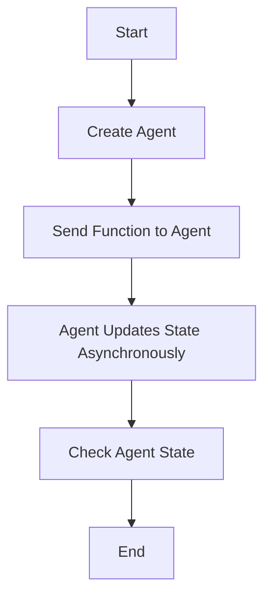
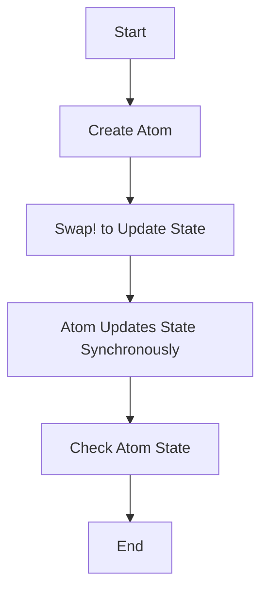
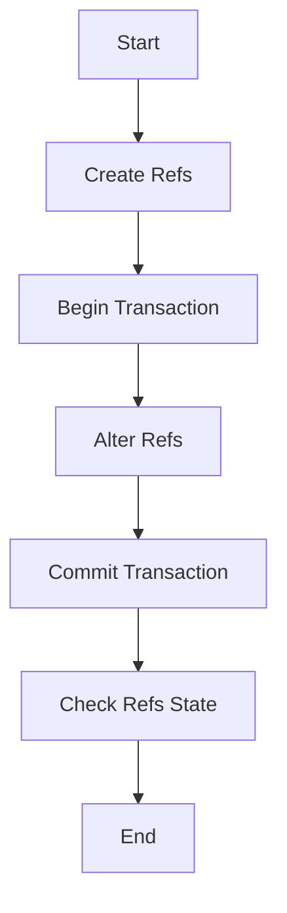

## 13.5 Agents, Atoms, and Refs in Depth

As Java developers transitioning to Clojure, understanding concurrency is crucial for building scalable applications. Clojure offers unique concurrency primitives—Agents, Atoms, and Refs—that provide powerful tools for managing state changes in a functional programming paradigm. In this section, we will delve into these primitives, exploring their advanced features and guiding you on choosing the right one for your application needs.

### Agents Detailed

Agents in Clojure provide a way to manage asynchronous state changes. They are ideal for tasks that are independent and can be executed in parallel without requiring immediate feedback. Let's explore how Agents work, including error handling, validators, and watcher functions.

#### How Agents Work

Agents encapsulate state and allow you to update it asynchronously. You send functions to an Agent, which are applied to its state in a separate thread. This makes Agents suitable for tasks that can be performed concurrently without blocking the main program flow.

```clojure
(def my-agent (agent 0))

;; Send a function to increment the agent's state
(send my-agent inc)

;; Check the agent's state
@my-agent ; => 1
```

In this example, we create an Agent with an initial state of `0`. We then send an `inc` function to the Agent, which increments its state asynchronously.

#### Error Handling in Agents

Agents handle errors gracefully by default. If an error occurs during the execution of a function sent to an Agent, the Agent's state is not updated, and the error is stored. You can retrieve this error using the `agent-error` function.

```clojure
;; Send a function that causes an error
(send my-agent (fn [x] (/ x 0)))

;; Check for errors
(agent-error my-agent) ; => #error {...}
```

To clear the error and resume normal operation, use the `clear-agent-errors` function.

```clojure
(clear-agent-errors my-agent)
```

#### Validators and Watcher Functions

Validators ensure that the state of an Agent remains valid after each update. You can define a validator function that throws an exception if the state is invalid.

```clojure
(def my-agent (agent 0 :validator pos?))

;; This will throw an exception because the state is not positive
(send my-agent dec)
```

Watcher functions allow you to observe state changes in an Agent. You can add a watcher function using `add-watch`.

```clojure
(add-watch my-agent :watcher
  (fn [key agent old-state new-state]
    (println "State changed from" old-state "to" new-state)))

(send my-agent inc) ; Output: State changed from 0 to 1
```

### Atoms Advanced Usage

Atoms provide a way to manage synchronous state changes. They are suitable for managing shared, mutable state in a thread-safe manner. Let's explore advanced Atom features like validators and watches for observing state changes.

#### Basic Usage of Atoms

Atoms are the simplest concurrency primitive in Clojure. They provide a way to manage shared state with atomic updates.

```clojure
(def my-atom (atom 0))

;; Update the atom's state
(swap! my-atom inc)

;; Read the atom's state
@my-atom ; => 1
```

#### Validators and Watches

Similar to Agents, Atoms can have validators to ensure state validity.

```clojure
(def my-atom (atom 0 :validator pos?))

;; This will throw an exception because the state is not positive
(swap! my-atom dec)
```

Watches allow you to observe state changes in an Atom.

```clojure
(add-watch my-atom :watcher
  (fn [key atom old-state new-state]
    (println "State changed from" old-state "to" new-state)))

(swap! my-atom inc) ; Output: State changed from 0 to 1
```

### Refs and Transactions

Refs provide a way to manage coordinated state changes across multiple variables. They use Software Transactional Memory (STM) to ensure consistency and atomicity.

#### Transactional Properties of Refs

Refs require all state changes to occur within a transaction, ensuring that changes are consistent and atomic.

```clojure
(def my-ref (ref 0))

;; Update the ref's state within a transaction
(dosync
  (alter my-ref inc))

;; Read the ref's state
@my-ref ; => 1
```

#### Ensuring Consistency Across Multiple State Changes

Refs are ideal for scenarios where multiple state changes need to be coordinated. All changes within a transaction are applied atomically.

```clojure
(def ref1 (ref 0))
(def ref2 (ref 0))

(dosync
  (alter ref1 inc)
  (alter ref2 inc))

;; Both refs are updated atomically
(println @ref1 @ref2) ; => 1 1
```

### Choosing the Right Primitive

Choosing the appropriate concurrency primitive depends on your application's requirements. Here's a quick guide:

- **Agents**: Use for asynchronous, independent tasks that do not require immediate feedback.
- **Atoms**: Use for synchronous, independent state changes that require immediate feedback.
- **Refs**: Use for coordinated state changes across multiple variables, ensuring consistency and atomicity.

### Visual Aids

To better understand how these concurrency primitives work, let's visualize their interactions using Mermaid.js diagrams.



**Diagram 1**: Flow of data through an Agent in Clojure.



**Diagram 2**: Flow of data through an Atom in Clojure.



**Diagram 3**: Flow of data through Refs in Clojure.

### References and Links

For further reading on Clojure's concurrency primitives, consider the following resources:

- [Official Clojure Documentation on Concurrency](https://clojure.org/reference/atoms)
- [ClojureDocs: Agents](https://clojuredocs.org/clojure.core/agent)
- [ClojureDocs: Atoms](https://clojuredocs.org/clojure.core/atom)
- [ClojureDocs: Refs](https://clojuredocs.org/clojure.core/ref)

### Knowledge Check

Let's reinforce your understanding of Clojure's concurrency primitives with some questions and exercises.

1. **What is the primary use case for Agents in Clojure?**
2. **How do you handle errors in Agents?**
3. **What is the difference between Atoms and Refs?**
4. **When should you use Refs over Atoms?**
5. **Try It Yourself**: Modify the Atom example to include a validator that only allows even numbers.

### Encouraging Tone

Now that we've explored how Clojure's concurrency primitives work, let's apply these concepts to manage state effectively in your applications. Remember, choosing the right primitive can greatly enhance the scalability and reliability of your concurrent applications.

### Best Practices for Tags

- "Clojure"
- "Concurrency"
- "Functional Programming"
- "Agents"
- "Atoms"
- "Refs"
- "State Management"
- "Java Interoperability"

## Quiz: Mastering Clojure's Concurrency Primitives



### What is the primary use case for Agents in Clojure?

- [x] Asynchronous, independent tasks
- [ ] Synchronous, independent tasks
- [ ] Coordinated state changes
- [ ] Immediate feedback tasks

> **Explanation:** Agents are used for asynchronous, independent tasks that do not require immediate feedback.

### How do you handle errors in Agents?

- [x] Use `agent-error` to retrieve errors
- [ ] Use `try-catch` blocks
- [ ] Use `throw` to handle errors
- [ ] Use `catch` to handle errors

> **Explanation:** Errors in Agents are stored and can be retrieved using the `agent-error` function.

### What is the difference between Atoms and Refs?

- [x] Atoms are for independent state changes; Refs are for coordinated changes
- [ ] Atoms are for coordinated changes; Refs are for independent changes
- [ ] Atoms are asynchronous; Refs are synchronous
- [ ] Atoms require transactions; Refs do not

> **Explanation:** Atoms are used for independent state changes, while Refs are used for coordinated changes across multiple variables.

### When should you use Refs over Atoms?

- [x] When multiple state changes need coordination
- [ ] When state changes are independent
- [ ] When tasks are asynchronous
- [ ] When immediate feedback is required

> **Explanation:** Refs should be used when multiple state changes need to be coordinated to ensure consistency.

### True or False: Agents require transactions for state changes.

- [ ] True
- [x] False

> **Explanation:** Agents do not require transactions; they handle state changes asynchronously.

### What function is used to update the state of an Atom?

- [x] `swap!`
- [ ] `send`
- [ ] `alter`
- [ ] `dosync`

> **Explanation:** The `swap!` function is used to update the state of an Atom.

### What function is used to update the state of a Ref?

- [ ] `swap!`
- [ ] `send`
- [x] `alter`
- [ ] `dosync`

> **Explanation:** The `alter` function is used to update the state of a Ref within a transaction.

### How can you observe state changes in an Atom?

- [x] Use `add-watch`
- [ ] Use `agent-error`
- [ ] Use `clear-agent-errors`
- [ ] Use `dosync`

> **Explanation:** The `add-watch` function allows you to observe state changes in an Atom.

### True or False: Validators can be used with both Atoms and Agents.

- [x] True
- [ ] False

> **Explanation:** Validators can be used with both Atoms and Agents to ensure state validity.

### What is the primary advantage of using Refs?

- [x] Ensuring consistency across multiple state changes
- [ ] Handling asynchronous tasks
- [ ] Providing immediate feedback
- [ ] Observing state changes

> **Explanation:** Refs ensure consistency across multiple state changes by using transactions.


