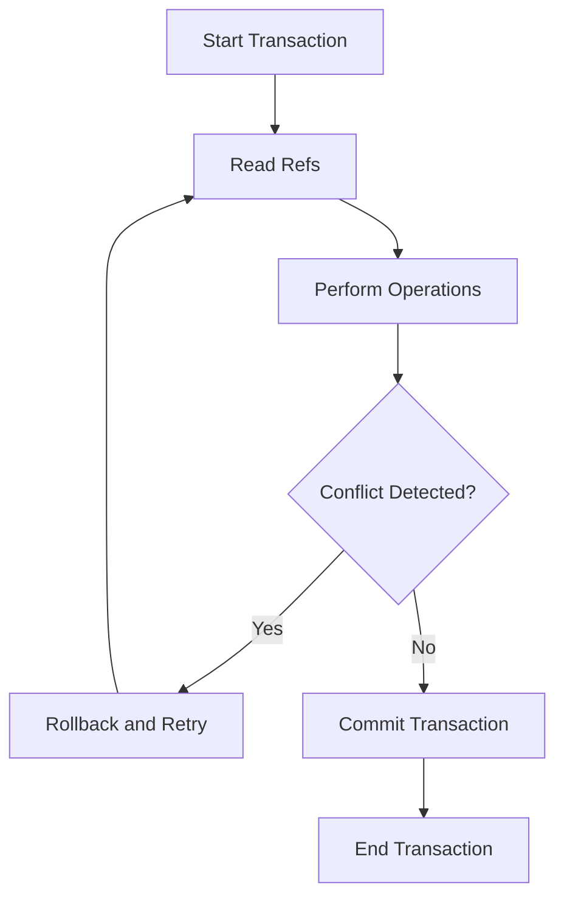

## 13.6 Software Transactional Memory Explained

As experienced Java developers, you are likely familiar with the challenges of managing concurrency in multi-threaded applications. Traditional locking mechanisms, such as `synchronized` blocks and `ReentrantLock`, can lead to complex and error-prone code. Clojure offers a powerful alternative: Software Transactional Memory (STM). In this section, we will explore STM in depth, highlighting its advantages, how it works in Clojure, and its limitations.

### Concept of Software Transactional Memory

Software Transactional Memory (STM) is a concurrency control mechanism that simplifies the management of shared state in concurrent applications. Unlike traditional locking mechanisms, STM allows multiple threads to operate on shared data without explicit locks, reducing the risk of deadlocks and race conditions.

#### Advantages of STM Over Traditional Locking

1. **Simplicity**: STM abstracts the complexity of lock management, allowing developers to focus on the logic of their applications rather than the intricacies of concurrency control.
2. **Composability**: Transactions in STM can be composed, making it easier to build complex operations from simpler ones.
3. **Optimistic Concurrency**: STM operates on the principle of optimistic concurrency, allowing transactions to proceed without locking resources upfront. Conflicts are detected and resolved automatically.
4. **Isolation**: STM ensures that transactions are isolated from each other, maintaining data consistency even in the presence of concurrent modifications.

### Transactional Boundaries with `dosync`

In Clojure, STM is implemented using Refs, which are mutable references to immutable data. Transactions are defined using the `dosync` macro, which establishes a transactional boundary for operations on Refs.

```clojure
(def account-balance (ref 1000))

(dosync
  (alter account-balance + 100))
```

In this example, the `dosync` block creates a transactional boundary around the operation that alters the `account-balance` Ref. This ensures that the operation is atomic and isolated from other transactions.

#### How `dosync` Works

- **Atomicity**: All operations within a `dosync` block are executed as a single atomic transaction. If any operation fails, the entire transaction is rolled back.
- **Consistency**: STM ensures that the state of Refs is consistent before and after a transaction.
- **Isolation**: Transactions are isolated from each other, preventing intermediate states from being visible to other transactions.

### Consistency and Isolation in STM

STM in Clojure guarantees consistency and isolation through a mechanism known as Multiversion Concurrency Control (MVCC). Each transaction operates on a snapshot of the data, ensuring that changes made by other transactions do not affect its execution.

#### Ensuring Data Consistency

- **Versioning**: Each Ref maintains a version number, which is incremented with each successful transaction. Transactions operate on the latest version of the data.
- **Validation**: Before committing, a transaction validates that the Refs it has read have not been modified by other transactions. If a conflict is detected, the transaction is retried.

#### Isolation Between Transactions

- **Snapshot Isolation**: Transactions work with a consistent snapshot of the data, ensuring that they do not interfere with each other.
- **Visibility**: Changes made by a transaction are not visible to other transactions until it successfully commits.

### Retry and Retries in STM

One of the key features of STM is its ability to handle conflicts through automatic retries. When a transaction detects a conflict, it is rolled back and retried until it succeeds.

#### Handling Conflicts

- **Conflict Detection**: STM detects conflicts by comparing the version numbers of Refs read by a transaction with their current versions.
- **Automatic Retries**: If a conflict is detected, the transaction is automatically retried. This process continues until the transaction can be committed without conflicts.

#### Example of Conflict Resolution

Consider two transactions attempting to update the same Ref:

```clojure
(def counter (ref 0))

(future
  (dosync
    (alter counter inc)))

(future
  (dosync
    (alter counter inc)))
```

In this example, both transactions attempt to increment the `counter` Ref. STM will detect the conflict and retry one of the transactions, ensuring that the final value of `counter` is consistent.

### Limitations of STM

While STM offers significant advantages over traditional locking mechanisms, it is not without limitations.

#### Side Effects Within Transactions

- **Prohibition of Side Effects**: Transactions should not perform side effects, such as I/O operations, as they may be retried multiple times. This can lead to unintended consequences if side effects are not idempotent.

#### Performance Considerations

- **Overhead**: STM introduces some overhead due to versioning and conflict detection, which can impact performance in highly contentious scenarios.
- **Scalability**: While STM scales well for read-heavy workloads, write-heavy workloads may experience contention and reduced performance.

### Visualizing STM in Clojure

To better understand how STM works in Clojure, let's visualize the process using a flowchart.



**Figure 1**: Flowchart illustrating the STM transaction process in Clojure.

### References and Further Reading

- [Official Clojure Documentation on STM](https://clojure.org/reference/refs)
- [ClojureDocs: STM Examples](https://clojuredocs.org/clojure.core/dosync)
- [GitHub Repository: Clojure STM Examples](https://github.com/clojure-examples/stm)

### Knowledge Check

Let's reinforce our understanding of STM with some questions and exercises.

- **Question**: What is the primary advantage of using STM over traditional locking mechanisms?
- **Exercise**: Modify the `counter` example to include a third transaction and observe how STM handles the additional conflict.

### Summary

In this section, we've explored the concept of Software Transactional Memory in Clojure, its advantages over traditional locking mechanisms, and how it ensures data consistency and isolation in concurrent applications. STM simplifies concurrency management, allowing developers to focus on building scalable and reliable applications.

Now that we've delved into STM, let's continue our journey by exploring other concurrency primitives in Clojure, such as Agents and Atoms, to further enhance our understanding of concurrent programming in functional languages.

## Quiz: Test Your Knowledge on Software Transactional Memory in Clojure



### What is the primary advantage of STM over traditional locking mechanisms?

- [x] Simplifies concurrency management
- [ ] Increases execution speed
- [ ] Reduces memory usage
- [ ] Eliminates the need for data validation

> **Explanation:** STM simplifies concurrency management by abstracting the complexity of lock management and providing automatic conflict resolution.

### How does STM ensure data consistency?

- [x] By using version numbers and validating transactions
- [ ] By locking all resources upfront
- [ ] By allowing only one transaction at a time
- [ ] By using a single-threaded execution model

> **Explanation:** STM uses version numbers to track changes and validates transactions to ensure data consistency.

### What is the role of `dosync` in Clojure's STM?

- [x] It creates a transactional boundary for Ref operations
- [ ] It locks all Refs involved in a transaction
- [ ] It ensures that transactions are executed sequentially
- [ ] It performs I/O operations within a transaction

> **Explanation:** `dosync` establishes a transactional boundary, ensuring atomicity and isolation for operations on Refs.

### What happens when a conflict is detected in STM?

- [x] The transaction is rolled back and retried
- [ ] The transaction is aborted permanently
- [ ] The transaction is committed with partial changes
- [ ] The transaction is paused until the conflict is resolved

> **Explanation:** When a conflict is detected, STM automatically rolls back and retries the transaction until it can be committed without conflicts.

### Why should side effects be avoided within STM transactions?

- [x] Because transactions may be retried multiple times
- [ ] Because side effects are not supported in Clojure
- [ ] Because side effects increase execution speed
- [ ] Because side effects are automatically committed

> **Explanation:** Side effects should be avoided because transactions may be retried, leading to unintended consequences if side effects are not idempotent.

### What is a limitation of STM in write-heavy workloads?

- [x] Increased contention and reduced performance
- [ ] Inability to handle concurrent reads
- [ ] Lack of support for immutable data structures
- [ ] Requirement for explicit locks

> **Explanation:** STM may experience increased contention and reduced performance in write-heavy workloads due to conflict detection and retries.

### How does STM handle retries in case of conflicts?

- [x] Automatically retries the transaction until it succeeds
- [ ] Requires manual intervention to retry
- [ ] Aborts the transaction permanently
- [ ] Uses a backoff strategy to delay retries

> **Explanation:** STM automatically retries the transaction until it can be committed without conflicts.

### What is the purpose of version numbers in STM?

- [x] To track changes and detect conflicts
- [ ] To increase execution speed
- [ ] To reduce memory usage
- [ ] To ensure transactions are executed sequentially

> **Explanation:** Version numbers are used to track changes and detect conflicts, ensuring data consistency.

### What is the impact of STM on read-heavy workloads?

- [x] STM scales well for read-heavy workloads
- [ ] STM reduces performance in read-heavy workloads
- [ ] STM requires explicit locks for read operations
- [ ] STM increases memory usage in read-heavy workloads

> **Explanation:** STM scales well for read-heavy workloads as it allows concurrent reads without contention.

### True or False: STM transactions can perform I/O operations safely.

- [ ] True
- [x] False

> **Explanation:** STM transactions should not perform I/O operations as they may be retried, leading to unintended consequences.


