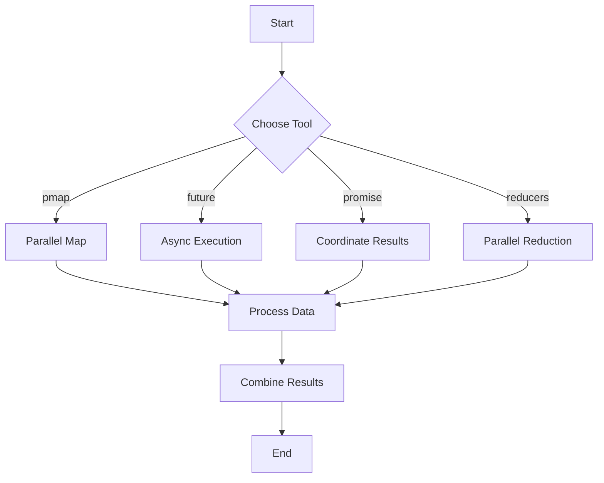

## 13.7 Parallel Processing in Clojure

In this section, we will delve into the realm of parallel processing in Clojure, a critical aspect of building scalable and efficient applications. As experienced Java developers, you might be familiar with concurrency and parallelism concepts, but Clojure offers unique tools and paradigms that can enhance your development process. Let's explore these concepts and tools in detail.

### Difference Between Concurrency and Parallelism

Before diving into the tools and techniques, it's essential to clarify the distinction between concurrency and parallelism:

- **Concurrency** refers to the ability of a system to handle multiple tasks at once. It is about dealing with lots of things at once and is more about the structure of the program.
- **Parallelism**, on the other hand, is about performing many computations simultaneously. It focuses on speeding up computations by dividing tasks across multiple processors.

In Java, concurrency is often managed using threads, `ExecutorService`, and `CompletableFuture`. Clojure, however, provides a more functional approach to these concepts, emphasizing immutability and functional purity.

### Parallelism Tools in Clojure

Clojure offers several tools for parallel processing, each suited for different scenarios:

- **`pmap`**: A parallel version of `map` that processes elements in parallel.
- **`future`**: Executes a block of code asynchronously, returning a reference to the result.
- **`promise`**: Acts as a placeholder for a value that will be delivered later.
- **Reducers**: A library for parallel reductions over collections, using the `fold` function.

Let's explore each of these tools in detail.

### Using `pmap`

The `pmap` function in Clojure is a parallel version of the `map` function. It applies a function to each element of a collection in parallel, leveraging multiple CPU cores to improve performance.

#### Example: Parallel Mapping with `pmap`

Consider a scenario where we need to perform a computationally intensive operation on a large dataset. Using `pmap`, we can distribute the workload across multiple threads:

```clojure
(defn expensive-computation [x]
  (Thread/sleep 1000) ; Simulate a time-consuming task
  (* x x))

(def data (range 1 10))

(defn parallel-process []
  (time (doall (pmap expensive-computation data))))

(parallel-process)
```

In this example, `expensive-computation` is applied to each element of `data` in parallel. The `doall` function is used to force the realization of the lazy sequence returned by `pmap`, ensuring that all computations are completed.

### Futures and Promises

Futures and promises in Clojure provide a way to execute code asynchronously and coordinate results.

#### Futures

A `future` in Clojure is a way to execute a block of code in a separate thread, returning a reference to the result. You can retrieve the result using `deref` or the `@` reader macro.

```clojure
(defn async-task []
  (future
    (Thread/sleep 2000) ; Simulate a long-running task
    "Task Completed"))

(def result (async-task))

(println "Doing other work...")
(println "Result:" @result)
```

In this example, the `async-task` function returns a future that completes after 2 seconds. Meanwhile, the main thread can continue executing other tasks.

#### Promises

A `promise` is a placeholder for a value that will be delivered later. It allows you to coordinate between different threads or asynchronous tasks.

```clojure
(defn deliver-result [p]
  (Thread/sleep 1000) ; Simulate a delay
  (deliver p "Promise Fulfilled"))

(def my-promise (promise))

(future (deliver-result my-promise))

(println "Waiting for promise...")
(println "Promise result:" @my-promise)
```

Here, `my-promise` is a promise that is fulfilled by the `deliver-result` function running in a separate thread. The main thread waits for the promise to be delivered.

### Reducers and `fold`

Reducers provide a way to perform parallel reductions over collections. The `fold` function is a key component, allowing you to split a collection into parts, process them in parallel, and combine the results.

#### Example: Parallel Reduction with `fold`

```clojure
(require '[clojure.core.reducers :as r])

(defn parallel-sum [coll]
  (r/fold + coll))

(def large-data (range 1 1000000))

(time (println "Parallel sum:" (parallel-sum large-data)))
```

In this example, `fold` is used to sum a large range of numbers in parallel. This approach can significantly reduce computation time for large datasets.

### Visualizing Parallel Processing

To better understand how these tools work together, let's visualize the flow of data and tasks in parallel processing using a Mermaid.js diagram:



**Diagram Description**: This flowchart illustrates the decision-making process for choosing a parallel processing tool in Clojure. Depending on the task, you can use `pmap`, `future`, `promise`, or reducers to process data in parallel and combine the results.

### Try It Yourself

To deepen your understanding, try modifying the code examples:

- Experiment with different data sizes and observe the performance impact.
- Combine `future` and `promise` to handle more complex asynchronous workflows.
- Use `pmap` with different functions to see how it handles various workloads.

### Key Takeaways

- **Concurrency vs. Parallelism**: Understand the difference between handling multiple tasks and speeding up computations.
- **Clojure Tools**: Leverage `pmap`, `future`, `promise`, and reducers for parallel processing.
- **Performance**: Use these tools to improve the performance of computationally intensive tasks.

### References and Further Reading

- [Official Clojure Documentation](https://clojure.org/reference)
- [ClojureDocs](https://clojuredocs.org/)
- [GitHub - Clojure Reducers](https://github.com/clojure/core.reducers)

### Knowledge Check

Let's test your understanding of parallel processing in Clojure with a quiz.

## Quiz: Mastering Parallel Processing in Clojure



### What is the primary difference between concurrency and parallelism?

- [x] Concurrency is about handling many tasks at once, while parallelism is about speeding up computations.
- [ ] Concurrency and parallelism are the same concepts.
- [ ] Concurrency is only used in single-threaded applications.
- [ ] Parallelism is about handling tasks sequentially.

> **Explanation:** Concurrency involves managing multiple tasks simultaneously, whereas parallelism focuses on executing computations concurrently to speed up processing.

### Which Clojure function is used for parallel mapping over collections?

- [ ] map
- [x] pmap
- [ ] reduce
- [ ] filter

> **Explanation:** `pmap` is the parallel version of `map`, allowing for concurrent processing of collection elements.

### How do you retrieve the result of a future in Clojure?

- [ ] Using the `get` function
- [x] Using `deref` or the `@` reader macro
- [ ] Using `await`
- [ ] Using `resolve`

> **Explanation:** The result of a future can be obtained using `deref` or the `@` reader macro, which blocks until the future is complete.

### What is the purpose of a promise in Clojure?

- [ ] To execute code in parallel
- [ ] To handle exceptions
- [x] To act as a placeholder for a value that will be delivered later
- [ ] To manage state changes

> **Explanation:** A promise serves as a placeholder for a value that will be provided at a later time, allowing for coordination between threads.

### Which function is used for parallel reductions in Clojure?

- [ ] map
- [ ] filter
- [x] fold
- [ ] apply

> **Explanation:** The `fold` function is part of the reducers library and is used for performing parallel reductions over collections.

### What is the role of `doall` in the `pmap` example?

- [ ] To delay the execution of the sequence
- [x] To force the realization of the lazy sequence
- [ ] To parallelize the computation
- [ ] To handle exceptions

> **Explanation:** `doall` forces the realization of a lazy sequence, ensuring that all computations are completed.

### How can you combine `future` and `promise` in Clojure?

- [ ] By using `map`
- [x] By using `future` to execute code and `promise` to coordinate results
- [ ] By using `reduce`
- [ ] By using `filter`

> **Explanation:** `future` can be used to execute code asynchronously, while `promise` can be used to coordinate the results of these asynchronous tasks.

### What is the benefit of using reducers for parallel processing?

- [ ] They simplify code readability
- [ ] They are only used for small datasets
- [x] They allow for efficient parallel reductions over large datasets
- [ ] They are faster than all other Clojure functions

> **Explanation:** Reducers enable efficient parallel reductions, making them suitable for processing large datasets.

### True or False: `pmap` is always faster than `map`.

- [ ] True
- [x] False

> **Explanation:** `pmap` can be slower than `map` for small datasets due to the overhead of managing parallel threads. It is beneficial for computationally intensive tasks on large datasets.



Now that we've explored parallel processing in Clojure, you're equipped to build more efficient and scalable applications. Continue experimenting with these tools to discover their full potential in your projects.
