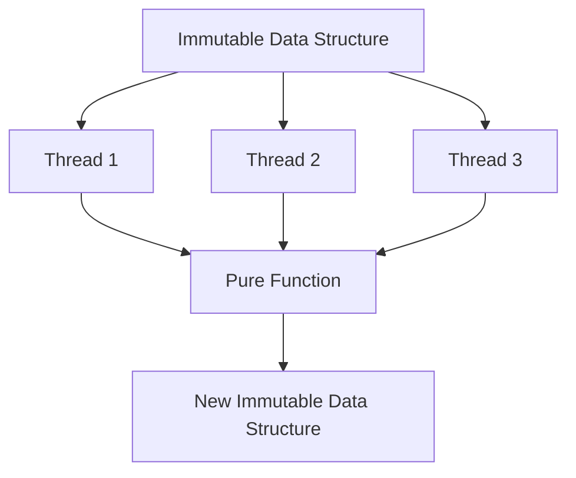

## 13.8 Thread Safety and Immutability

In the realm of concurrent programming, ensuring thread safety is paramount. Clojure, with its immutable data structures and functional programming paradigms, offers a robust solution to the challenges of concurrency. In this section, we will explore how immutability in Clojure eliminates the need for locks, prevents synchronization issues, and enhances performance in thread-safe applications.

### Immutability for Thread Safety

Immutability is a cornerstone of Clojure's approach to concurrency. By ensuring that data structures cannot be modified after they are created, Clojure eliminates the need for locks when sharing data between threads. This is a stark contrast to Java, where mutable objects often require complex synchronization mechanisms to ensure thread safety.

#### Immutable Data Structures

In Clojure, all core data structures—such as lists, vectors, maps, and sets—are immutable. This means that any operation that appears to modify a data structure actually returns a new version of the structure with the desired changes, leaving the original unchanged.

```clojure
(def original-vector [1 2 3])
(def new-vector (conj original-vector 4))

(println original-vector) ; Output: [1 2 3]
(println new-vector)      ; Output: [1 2 3 4]
```

In this example, `conj` adds an element to the vector, but instead of altering `original-vector`, it returns a new vector `new-vector`.

#### Benefits of Immutability

1. **No Locks Required**: Since immutable data cannot be changed, there is no risk of concurrent modifications, eliminating the need for locks.
2. **Simplified Reasoning**: With immutable data, you can reason about your program's state without worrying about unexpected changes.
3. **Safe Sharing**: Immutable data can be freely shared between threads without synchronization, as there is no risk of data races.

### Avoiding Synchronization Issues

Synchronization issues, such as race conditions and deadlocks, are common pitfalls in concurrent programming. Clojure's functional approach, combined with immutability, helps prevent these issues.

#### Pure Functions

Pure functions, which always produce the same output for the same input and have no side effects, are inherently thread-safe. By relying on pure functions, you can avoid many synchronization problems.

```clojure
(defn add [a b]
  (+ a b))

(println (add 2 3)) ; Output: 5
```

In this example, the `add` function is pure and can be safely called from multiple threads without any risk of interference.

#### Avoiding Side Effects

Side effects, such as modifying a global variable or performing I/O operations, can lead to synchronization issues. By minimizing side effects, you can ensure that your functions remain thread-safe.

```clojure
(def counter (atom 0))

(defn increment-counter []
  (swap! counter inc))

(increment-counter)
(println @counter) ; Output: 1
```

Here, the use of an `atom` ensures that updates to `counter` are atomic, preventing race conditions.

### Best Practices for Ensuring Thread Safety

To ensure thread safety in your Clojure applications, consider the following best practices:

1. **Minimize Side Effects**: Strive to write pure functions and minimize side effects wherever possible.
2. **Use Immutable Data Structures**: Leverage Clojure's immutable data structures to avoid synchronization issues.
3. **Careful Use of Stateful Constructs**: When state is necessary, use Clojure's state management constructs, such as atoms, refs, and agents, to manage state changes safely.

#### Atoms, Refs, and Agents

Clojure provides several constructs for managing state in a thread-safe manner:

- **Atoms**: For managing independent, synchronous state changes.
- **Refs**: For coordinated, synchronous state changes.
- **Agents**: For asynchronous state changes.

```clojure
;; Using an atom for independent state changes
(def counter (atom 0))

(defn increment-counter []
  (swap! counter inc))

;; Using a ref for coordinated state changes
(def account-balance (ref 1000))

(defn withdraw [amount]
  (dosync
    (alter account-balance - amount)))

;; Using an agent for asynchronous state changes
(def logger (agent []))

(defn log-message [message]
  (send logger conj message))
```

### Performance Implications

While immutability and thread safety offer significant benefits, they also have performance implications. Understanding these implications is crucial for designing efficient, scalable applications.

#### Structural Sharing

Clojure's immutable data structures use structural sharing to minimize memory usage and improve performance. When a new version of a data structure is created, it shares as much of its structure as possible with the original, rather than duplicating it entirely.

```clojure
(def original-map {:a 1 :b 2})
(def new-map (assoc original-map :c 3))

(println original-map) ; Output: {:a 1, :b 2}
(println new-map)      ; Output: {:a 1, :b 2, :c 3}
```

In this example, `new-map` shares the structure of `original-map`, with only the new entry added.

#### Performance Considerations

1. **Memory Usage**: While structural sharing reduces memory usage, creating many versions of a data structure can still lead to increased memory consumption.
2. **Garbage Collection**: Frequent creation of new data structures can increase the load on the garbage collector.
3. **Algorithmic Complexity**: Consider the algorithmic complexity of operations on immutable data structures, as some operations may be less efficient than their mutable counterparts.

### Visualizing Immutability and Thread Safety

To better understand how immutability and thread safety work in Clojure, let's visualize the flow of data through immutable data structures and the concurrency model.



**Diagram Description**: This diagram illustrates how an immutable data structure can be safely shared across multiple threads. Each thread can operate on the data using pure functions, resulting in a new immutable data structure without affecting the original.

### Knowledge Check

Let's reinforce our understanding of thread safety and immutability with a few questions and exercises:

- **Question**: What are the primary benefits of using immutable data structures in concurrent programming?
- **Exercise**: Modify the `increment-counter` function to use a ref instead of an atom. What changes are necessary?

### Conclusion

By embracing immutability and functional programming paradigms, Clojure provides a powerful foundation for building thread-safe, scalable applications. As you continue to explore Clojure, remember to leverage these concepts to simplify concurrency and enhance the performance of your applications.

Now that we've explored how immutable data structures work in Clojure, let's apply these concepts to manage state effectively in your applications. For further reading, consider exploring the [Official Clojure Documentation](https://clojure.org/reference/documentation) and [ClojureDocs](https://clojuredocs.org/).

## Quiz: Mastering Thread Safety and Immutability in Clojure



### What is a primary benefit of using immutable data structures in Clojure?

- [x] They eliminate the need for locks in concurrent programming.
- [ ] They increase memory usage.
- [ ] They make data structures mutable.
- [ ] They require complex synchronization mechanisms.

> **Explanation:** Immutable data structures cannot be modified, eliminating the need for locks when sharing data between threads.

### How do pure functions contribute to thread safety?

- [x] They have no side effects and always produce the same output for the same input.
- [ ] They modify global variables.
- [ ] They perform I/O operations.
- [ ] They require synchronization.

> **Explanation:** Pure functions are inherently thread-safe because they do not modify any state or have side effects.

### Which Clojure construct is used for asynchronous state changes?

- [ ] Atom
- [ ] Ref
- [x] Agent
- [ ] Var

> **Explanation:** Agents are used for managing asynchronous state changes in Clojure.

### What is structural sharing in Clojure?

- [x] A technique to minimize memory usage by sharing parts of data structures.
- [ ] A method to duplicate entire data structures.
- [ ] A way to make data structures mutable.
- [ ] A synchronization mechanism.

> **Explanation:** Structural sharing allows new data structures to share parts of their structure with the original, reducing memory usage.

### What is the role of an atom in Clojure?

- [x] To manage independent, synchronous state changes.
- [ ] To coordinate state changes across multiple threads.
- [ ] To handle asynchronous state changes.
- [ ] To perform I/O operations.

> **Explanation:** Atoms are used for managing independent, synchronous state changes in Clojure.

### Why is immutability important in concurrent programming?

- [x] It prevents data races and eliminates the need for locks.
- [ ] It increases the complexity of code.
- [ ] It requires more memory.
- [ ] It makes data structures mutable.

> **Explanation:** Immutability ensures that data cannot be changed, preventing data races and eliminating the need for locks.

### Which of the following is a best practice for ensuring thread safety in Clojure?

- [x] Minimize side effects and use pure functions.
- [ ] Use mutable data structures.
- [ ] Avoid using atoms, refs, and agents.
- [ ] Perform I/O operations in every function.

> **Explanation:** Minimizing side effects and using pure functions are best practices for ensuring thread safety.

### How does Clojure's concurrency model differ from Java's?

- [x] Clojure uses immutable data structures and functional paradigms to ensure thread safety.
- [ ] Clojure requires complex synchronization mechanisms.
- [ ] Clojure uses mutable objects for concurrency.
- [ ] Clojure does not support concurrency.

> **Explanation:** Clojure's concurrency model relies on immutable data structures and functional paradigms, unlike Java's mutable objects and synchronization mechanisms.

### What is the purpose of using refs in Clojure?

- [x] To coordinate synchronous state changes across multiple threads.
- [ ] To manage asynchronous state changes.
- [ ] To perform I/O operations.
- [ ] To make data structures mutable.

> **Explanation:** Refs are used for coordinating synchronous state changes across multiple threads in Clojure.

### True or False: Immutability in Clojure eliminates the need for locks in concurrent programming.

- [x] True
- [ ] False

> **Explanation:** Immutability ensures that data cannot be modified, eliminating the need for locks when sharing data between threads.


