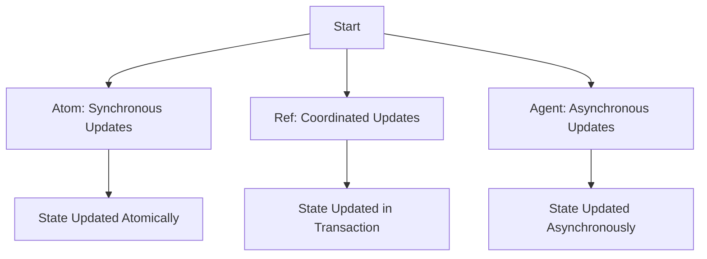

## 13.9 Dealing with Shared Resources

In the realm of concurrent programming, managing shared resources is a critical challenge. Whether you're dealing with files, databases, or network connections, ensuring that these resources are accessed safely and efficiently is paramount. In this section, we will explore various strategies to handle shared resources in Clojure, drawing parallels with Java where applicable.

### Resource Contention

**Resource contention** occurs when multiple threads or processes attempt to access a shared resource simultaneously, leading to potential conflicts or performance bottlenecks. In Java, this is often managed using synchronization primitives like `synchronized` blocks or `ReentrantLock`. Clojure, with its emphasis on immutability and functional programming, offers different paradigms for handling such scenarios.

#### Challenges of Managing Shared Resources

1. **Data Consistency**: Ensuring that shared resources remain in a consistent state despite concurrent access.
2. **Deadlocks**: Avoiding situations where two or more threads are waiting indefinitely for resources held by each other.
3. **Performance**: Minimizing the overhead introduced by synchronization mechanisms.
4. **Scalability**: Ensuring that the application can handle increased load without degradation in performance.

### Locking Mechanisms

While Clojure encourages immutability, there are scenarios where mutable state is necessary, particularly when dealing with shared resources. In such cases, locking mechanisms can be employed to ensure safe access.

#### When to Use Locks

Locks should be used when:

- **Mutable State**: You have mutable state that needs to be accessed by multiple threads.
- **Critical Sections**: There are critical sections of code that must not be executed concurrently by multiple threads.

#### How to Use Locks in Clojure

Clojure provides several constructs for managing state and concurrency, including `atoms`, `refs`, and `agents`. These constructs abstract away the complexity of locks, but understanding how they work under the hood is beneficial.

##### Atoms

Atoms provide a way to manage shared, synchronous, independent state. They are ideal for scenarios where you need to manage a single piece of state that can be updated atomically.

```clojure
(def counter (atom 0))

;; Increment the counter atomically
(swap! counter inc)
```

##### Refs and Software Transactional Memory (STM)

Refs are used for coordinated, synchronous updates to multiple pieces of state. They leverage Clojure's Software Transactional Memory (STM) to ensure consistency.

```clojure
(def account1 (ref 100))
(def account2 (ref 200))

;; Transfer money between accounts
(dosync
  (alter account1 - 50)
  (alter account2 + 50))
```

##### Agents

Agents are designed for managing asynchronous state changes. They are useful when you want to perform updates in the background without blocking the main thread.

```clojure
(def log-agent (agent []))

;; Add a log entry asynchronously
(send log-agent conj "New log entry")
```

### Connection Pools

Managing database connections or network sockets efficiently is crucial in any application. Connection pooling is a technique used to maintain a pool of connections that can be reused, reducing the overhead of establishing new connections.

#### Introducing Connection Pools

Connection pools allow multiple threads to share a set of pre-established connections, improving performance and resource utilization. In Java, libraries like HikariCP or Apache Commons DBCP are commonly used. In Clojure, you can leverage these Java libraries directly or use Clojure-specific libraries like `c3p0`.

#### Implementing Connection Pools in Clojure

Here's an example of setting up a connection pool using `c3p0` in Clojure:

```clojure
(require '[clojure.java.jdbc :as jdbc])

(def db-spec
  {:classname "org.postgresql.Driver"
   :subprotocol "postgresql"
   :subname "//localhost:5432/mydb"
   :user "user"
   :password "password"
   :datasource (doto (com.mchange.v2.c3p0.ComboPooledDataSource.)
                 (.setDriverClass "org.postgresql.Driver")
                 (.setJdbcUrl "jdbc:postgresql://localhost:5432/mydb")
                 (.setUser "user")
                 (.setPassword "password")
                 (.setMinPoolSize 5)
                 (.setMaxPoolSize 20))})

;; Use the connection pool
(jdbc/query db-spec ["SELECT * FROM my_table"])
```

### Managing Side Effects

In functional programming, side effects are changes in state or interactions with the outside world that occur during the execution of a function. Managing side effects in a thread-safe manner is crucial for building reliable concurrent applications.

#### Strategies for Handling Side Effects

1. **Isolation**: Encapsulate side effects within specific functions or modules, minimizing their impact on the rest of the application.
2. **Immutability**: Use immutable data structures to prevent unintended modifications.
3. **Concurrency Primitives**: Leverage Clojure's concurrency primitives (`atoms`, `refs`, `agents`) to manage state changes safely.

#### Example: Safely Managing Shared Resources

Let's consider a scenario where we need to log messages to a file from multiple threads. We'll use an `agent` to manage the file writing asynchronously.

```clojure
(def log-agent (agent (java.io.FileWriter. "log.txt" true)))

(defn log-message [message]
  (send log-agent
        (fn [writer]
          (.write writer (str message "\n"))
          writer)))

;; Log messages from different threads
(log-message "Thread 1: Starting process")
(log-message "Thread 2: Process completed")
```

### Visualizing Concurrency Models

To better understand how Clojure's concurrency models work, let's visualize the flow of data through these constructs.



**Diagram Description**: This flowchart illustrates the different concurrency models in Clojure. Atoms handle synchronous updates, refs manage coordinated updates using transactions, and agents perform asynchronous updates.

### References and Links

- [Clojure Official Documentation](https://clojure.org/reference)
- [ClojureDocs](https://clojuredocs.org/)
- [HikariCP GitHub Repository](https://github.com/brettwooldridge/HikariCP)
- [Apache Commons DBCP](https://commons.apache.org/proper/commons-dbcp/)

### Knowledge Check

- What are the primary challenges of managing shared resources in concurrent applications?
- How do atoms, refs, and agents differ in managing state in Clojure?
- What is the purpose of connection pooling, and how can it be implemented in Clojure?
- How can side effects be managed in a thread-safe manner in functional programming?

### Exercises

1. **Implement a Connection Pool**: Set up a connection pool using `c3p0` or another library and perform a database query.
2. **Manage State with Atoms**: Create a simple counter using an atom and update it from multiple threads.
3. **Asynchronous Logging**: Use an agent to log messages to a file asynchronously from different threads.

### Summary

In this section, we've explored the complexities of dealing with shared resources in concurrent applications. By leveraging Clojure's concurrency primitives and understanding the nuances of resource contention, you can build scalable and efficient applications. Remember to isolate side effects, use connection pools, and choose the appropriate concurrency model for your needs.

Now that we've delved into managing shared resources, let's continue our journey by exploring functional reactive programming in Clojure.

## Quiz: Mastering Shared Resources in Clojure



### What is resource contention?

- [x] A situation where multiple threads attempt to access a shared resource simultaneously
- [ ] A method for managing state in Clojure
- [ ] A type of concurrency primitive in Clojure
- [ ] A technique for optimizing database queries

> **Explanation:** Resource contention occurs when multiple threads or processes try to access a shared resource at the same time, leading to potential conflicts or performance issues.

### Which Clojure construct is used for managing asynchronous state changes?

- [ ] Atom
- [ ] Ref
- [x] Agent
- [ ] Lock

> **Explanation:** Agents in Clojure are designed for managing asynchronous state changes, allowing updates to occur in the background without blocking the main thread.

### What is the primary benefit of using connection pools?

- [x] Improved performance and resource utilization
- [ ] Simplified code structure
- [ ] Enhanced security
- [ ] Easier debugging

> **Explanation:** Connection pools improve performance and resource utilization by maintaining a pool of pre-established connections that can be reused by multiple threads.

### How do refs ensure data consistency in Clojure?

- [ ] By using locks
- [x] By leveraging Software Transactional Memory (STM)
- [ ] By using asynchronous updates
- [ ] By using immutable data structures

> **Explanation:** Refs in Clojure use Software Transactional Memory (STM) to ensure data consistency by coordinating updates to multiple pieces of state within a transaction.

### What is a common strategy for managing side effects in functional programming?

- [ ] Using mutable data structures
- [x] Encapsulating side effects within specific functions or modules
- [ ] Avoiding concurrency primitives
- [ ] Using global variables

> **Explanation:** Encapsulating side effects within specific functions or modules is a common strategy in functional programming to minimize their impact on the rest of the application.

### Which concurrency model in Clojure is best suited for synchronous updates?

- [x] Atom
- [ ] Ref
- [ ] Agent
- [ ] Thread

> **Explanation:** Atoms in Clojure are best suited for managing synchronous updates to a single piece of state, allowing atomic changes.

### What is the purpose of the `dosync` block in Clojure?

- [ ] To manage asynchronous updates
- [x] To execute a series of operations within a transaction
- [ ] To create a new thread
- [ ] To lock a resource

> **Explanation:** The `dosync` block in Clojure is used to execute a series of operations within a transaction, ensuring that all changes are applied atomically.

### How can you safely log messages to a file from multiple threads in Clojure?

- [ ] By using a global variable
- [ ] By using a synchronized block
- [x] By using an agent
- [ ] By using a ref

> **Explanation:** An agent can be used to safely log messages to a file from multiple threads in Clojure, as it manages asynchronous updates.

### What is a potential drawback of using locks in concurrent programming?

- [ ] Increased performance
- [x] Potential for deadlocks
- [ ] Simplified code structure
- [ ] Enhanced security

> **Explanation:** A potential drawback of using locks in concurrent programming is the risk of deadlocks, where two or more threads are waiting indefinitely for resources held by each other.

### True or False: Clojure's emphasis on immutability eliminates the need for managing shared resources.

- [ ] True
- [x] False

> **Explanation:** While Clojure's emphasis on immutability reduces the complexity of managing shared resources, there are still scenarios where mutable state and resource management are necessary, particularly when dealing with external systems like databases or files.


