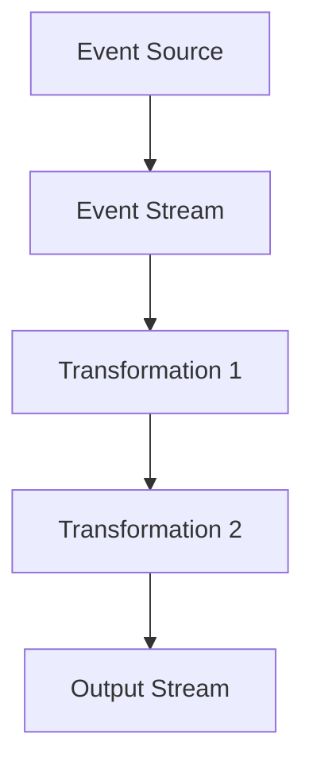

## 14.1 Introduction to Reactive Programming Concepts

As we delve into the world of functional reactive programming (FRP), it's essential to understand the foundational concepts that make this paradigm both powerful and transformative. Reactive programming is a programming paradigm oriented around data flows and the propagation of change. This approach is particularly beneficial in applications where responsiveness and real-time data processing are crucial.

### Reactive Programming Defined

Reactive programming is a declarative programming paradigm concerned with data streams and the propagation of change. It allows developers to express dynamic behavior in a system as a series of transformations on data streams. This paradigm is particularly useful for handling asynchronous data flows, making it easier to build applications that are responsive and resilient to change.

#### Event Streams

At the heart of reactive programming are event streams. An event stream is a sequence of events ordered in time, which can be thought of as a continuous flow of data. These streams can represent anything from user inputs, sensor data, or network requests. In reactive programming, we can transform, filter, and combine these streams to derive new streams that represent the desired behavior of our application.

**Example in Clojure:**

```clojure
(require '[clojure.core.async :refer [chan >!! <!! go]])

;; Create a channel to represent an event stream
(def event-stream (chan))

;; Function to process events
(defn process-event [event]
  (println "Processing event:" event))

;; Simulate event generation
(go
  (doseq [event (range 5)]
    (>!! event-stream event)))

;; Consume and process events
(go
  (while true
    (let [event (<!! event-stream)]
      (process-event event))))
```

In this example, we use Clojure's `core.async` library to create a channel that acts as an event stream. Events are generated and processed asynchronously, demonstrating how reactive programming can handle streams of data.

#### Functional Reactive Programming (FRP)

Functional Reactive Programming (FRP) combines the principles of functional programming with reactive programming models. It provides a way to work with time-varying values in a functional manner, allowing developers to express the logic of their applications as transformations on streams of data.

FRP abstracts away the complexities of managing state and side effects, enabling developers to focus on the relationships between data and how it changes over time. This approach leads to more predictable and maintainable code, as the behavior of the system is defined in terms of pure functions and data transformations.

**Example in Clojure:**

```clojure
(require '[clojure.core.async :refer [chan >!! <!! go]])

;; Define a function to transform events
(defn transform-event [event]
  (* event 2))

;; Create a channel for transformed events
(def transformed-stream (chan))

;; Transform events from the original stream
(go
  (while true
    (let [event (<!! event-stream)]
      (>!! transformed-stream (transform-event event)))))

;; Consume and print transformed events
(go
  (while true
    (let [event (<!! transformed-stream)]
      (println "Transformed event:" event))))
```

In this example, we extend the previous code to include a transformation step, demonstrating how FRP can be used to process and transform streams of data functionally.

#### Benefits of Reactive Programming

Reactive programming offers several benefits, especially in the context of modern, data-driven applications:

- **Easier Reasoning About Asynchronous Data**: By treating data as streams, reactive programming simplifies the handling of asynchronous data flows, making it easier to reason about and manage.
- **More Responsive Applications**: Reactive systems can react to changes in data in real-time, leading to more responsive and interactive applications.
- **Improved Scalability**: By decoupling data producers and consumers, reactive programming can improve the scalability of applications, allowing them to handle larger volumes of data and more concurrent users.
- **Simplified Error Handling**: Reactive programming provides mechanisms for handling errors in a consistent and declarative manner, reducing the complexity of error management in asynchronous systems.

#### Real-World Applications

Reactive programming is particularly beneficial in scenarios where responsiveness and real-time data processing are critical. Some common applications include:

- **Graphical User Interfaces (GUIs)**: Reactive programming can simplify the development of GUIs by allowing developers to express the behavior of the interface as transformations on streams of user inputs.
- **Real-Time Data Processing**: Applications that process real-time data, such as financial trading systems or IoT platforms, can benefit from the responsiveness and scalability of reactive programming.
- **Networked Applications**: Reactive programming can improve the performance and scalability of networked applications by efficiently managing asynchronous network requests and responses.

### Visualizing Reactive Programming Concepts

To better understand the flow of data in reactive programming, let's visualize how data streams and transformations work together to create a reactive system.



**Diagram Description**: This diagram illustrates a simple reactive system where an event source generates an event stream. The stream undergoes two transformations before producing an output stream. Each transformation represents a functional operation applied to the data, showcasing the declarative nature of reactive programming.

### Knowledge Check

To reinforce your understanding of reactive programming concepts, consider the following questions and exercises:

1. **Question**: What are the main components of a reactive system?
   - **Answer**: Event streams, transformations, and output streams.

2. **Exercise**: Modify the provided Clojure code examples to include an additional transformation step that filters out odd numbers from the event stream.

3. **Question**: How does reactive programming improve the scalability of applications?
   - **Answer**: By decoupling data producers and consumers, allowing for more efficient handling of data flows.

4. **Exercise**: Create a new Clojure project that uses `core.async` to simulate a real-time data processing system, such as a stock ticker application.

### Encouraging Tone

Now that we've explored the foundational concepts of reactive programming, you're well-equipped to start integrating these principles into your Clojure applications. By leveraging the power of FRP, you can build more responsive, scalable, and maintainable systems. As you continue your journey, remember to experiment with the code examples and explore the vast possibilities that reactive programming offers.

### References and Links

For further reading and exploration of reactive programming concepts, consider the following resources:

- [Official Clojure Documentation](https://clojure.org/)
- [ClojureDocs](https://clojuredocs.org/)
- [ReactiveX - An API for Asynchronous Programming with Observable Streams](http://reactivex.io/)
- [Clojure's core.async Library](https://clojure.github.io/core.async/)

### Quiz Time!

## Test Your Knowledge on Reactive Programming Concepts



### What is the primary focus of reactive programming?

- [x] Data flows and the propagation of changes
- [ ] Object-oriented design patterns
- [ ] Procedural programming techniques
- [ ] Static data structures

> **Explanation:** Reactive programming is centered around data flows and how changes in data propagate through a system.

### Which of the following best describes an event stream?

- [x] A sequence of events ordered in time
- [ ] A static collection of data
- [ ] A single event occurring at a specific time
- [ ] A function that processes data

> **Explanation:** An event stream is a sequence of events that occur over time, representing a continuous flow of data.

### How does functional reactive programming (FRP) enhance application development?

- [x] By combining functional programming with reactive models
- [ ] By focusing solely on object-oriented principles
- [ ] By eliminating the need for asynchronous data handling
- [ ] By using imperative programming techniques

> **Explanation:** FRP combines the principles of functional programming with reactive models to handle time-varying values effectively.

### What is a key benefit of using reactive programming?

- [x] Easier reasoning about asynchronous data
- [ ] Increased complexity in error handling
- [ ] Reduced application responsiveness
- [ ] Limited scalability

> **Explanation:** Reactive programming simplifies the handling of asynchronous data, making it easier to reason about and manage.

### In which scenarios is reactive programming particularly beneficial?

- [x] GUI applications and real-time data processing
- [ ] Static data analysis
- [ ] Batch processing of data
- [ ] Simple command-line tools

> **Explanation:** Reactive programming is beneficial in scenarios where responsiveness and real-time data processing are critical, such as GUI applications.

### What does an event stream represent in reactive programming?

- [x] A continuous flow of data
- [ ] A single static value
- [ ] A collection of unrelated events
- [ ] A function call

> **Explanation:** An event stream represents a continuous flow of data, capturing events as they occur over time.

### How can reactive programming improve application scalability?

- [x] By decoupling data producers and consumers
- [ ] By increasing the complexity of data handling
- [ ] By reducing the number of concurrent users
- [ ] By focusing on synchronous data processing

> **Explanation:** Reactive programming improves scalability by decoupling data producers and consumers, allowing for more efficient handling of data flows.

### What is a common use case for functional reactive programming?

- [x] Building responsive user interfaces
- [ ] Performing static data analysis
- [ ] Writing low-level system code
- [ ] Developing simple scripts

> **Explanation:** Functional reactive programming is commonly used to build responsive user interfaces that can react to changes in data in real-time.

### Which library in Clojure is commonly used for reactive programming?

- [x] core.async
- [ ] clojure.spec
- [ ] clojure.java.jdbc
- [ ] clojure.test

> **Explanation:** The `core.async` library in Clojure is commonly used for reactive programming, providing tools for handling asynchronous data flows.

### Reactive programming is primarily concerned with:

- [x] True
- [ ] False

> **Explanation:** Reactive programming is primarily concerned with data flows and the propagation of changes, making it a powerful paradigm for handling asynchronous data.



By understanding and applying these reactive programming concepts, you can enhance your Clojure applications, making them more responsive and capable of handling complex data flows efficiently. Keep experimenting and exploring the possibilities that reactive programming offers, and you'll be well on your way to mastering this powerful paradigm.
