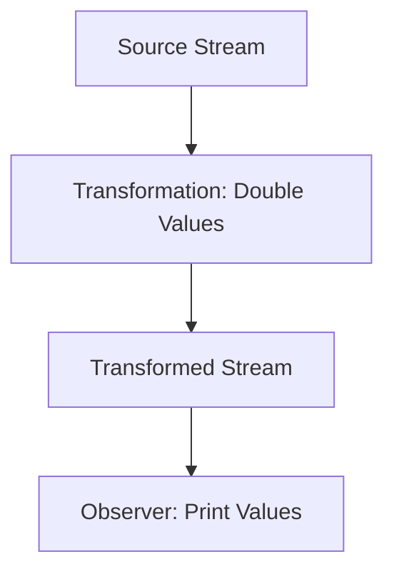

## 14.2 Implementing Functional Reactive Programming (FRP) in Clojure

Functional Reactive Programming (FRP) is a paradigm that combines functional programming with reactive programming to handle asynchronous data streams and the propagation of change. In Clojure, FRP can be implemented using libraries such as Reagi and RxJava, which provide tools to work with streams, signals, and observers. This section will guide you through the core concepts of FRP and demonstrate how to implement them in Clojure.

### Clojure's Approach to FRP

Clojure, with its emphasis on immutability and functional programming, is well-suited for reactive programming patterns. FRP in Clojure allows developers to create systems that respond to changes in data over time, making it ideal for applications that require real-time updates, such as user interfaces, data processing pipelines, and more.

#### Libraries for FRP

1. **Reagi**: A Clojure library inspired by Reactive Extensions (Rx) that provides a simple and expressive API for FRP. It allows you to create and manipulate streams of data, making it easy to build reactive applications.

   - **GitHub Repository**: [Reagi](https://github.com/weavejester/reagi)

2. **RxJava**: Although primarily a Java library, RxJava can be used in Clojure to implement FRP. It provides a rich set of operators for composing asynchronous and event-based programs using observable sequences.

   - **GitHub Repository**: [RxJava](https://github.com/ReactiveX/RxJava)

### Core Concepts of FRP

To effectively implement FRP in Clojure, it's essential to understand the core concepts:

- **Signals**: Represent values that change over time. In FRP, signals are the primary means of representing dynamic data.

- **Behaviors**: Functions or expressions that depend on signals. They automatically update when the signals they depend on change.

- **Observers**: Entities that subscribe to signals or behaviors to react to changes. Observers are notified whenever the data they are observing changes.

### Basic Implementation in Clojure

Let's explore how to implement reactive streams and transformations in Clojure using Reagi and RxJava.

#### Implementing Reactive Streams with Reagi

Reagi provides a straightforward API to create and manipulate streams. Here's a basic example of creating a stream and applying transformations:

```clojure
(require '[reagi.core :as r])

;; Create a stream
(def my-stream (r/stream))

;; Subscribe to the stream and print values
(r/subscribe my-stream println)

;; Emit values to the stream
(r/emit! my-stream 1)
(r/emit! my-stream 2)
(r/emit! my-stream 3)

;; Transform the stream by doubling each value
(def transformed-stream (r/map #(* 2 %) my-stream))

;; Subscribe to the transformed stream
(r/subscribe transformed-stream println)

;; Emit more values
(r/emit! my-stream 4)
(r/emit! my-stream 5)
```

In this example, we create a stream `my-stream` and subscribe to it to print emitted values. We then transform the stream using `r/map` to double each value and subscribe to the transformed stream.

#### Implementing Reactive Streams with RxJava

Using RxJava in Clojure involves leveraging its rich set of operators. Here's an example:

```clojure
(import '[io.reactivex Observable])

;; Create an observable
(def my-observable (Observable/just 1 2 3 4 5))

;; Subscribe and print each item
(.subscribe my-observable println)

;; Transform the observable by doubling each value
(def transformed-observable (.map my-observable #(* 2 %)))

;; Subscribe to the transformed observable
(.subscribe transformed-observable println)
```

This example demonstrates creating an observable sequence using `Observable/just` and applying a transformation with `.map`.

### Visualizing Data Flow in FRP

To better understand how data flows through reactive streams, let's visualize the process using a flowchart.



**Figure 1**: Data flow in a reactive stream where values are doubled before being observed.

### Try It Yourself

Experiment with the provided code examples by modifying the transformations or adding new observers. For instance, try filtering the stream to only include even numbers before doubling them.

### Knowledge Check

- What are the core concepts of FRP?
- How does Reagi differ from RxJava in implementing FRP in Clojure?
- Can you create a reactive stream that filters out odd numbers and then squares the remaining values?

### Summary

In this section, we've explored how to implement Functional Reactive Programming in Clojure using libraries like Reagi and RxJava. We've covered core FRP concepts such as signals, behaviors, and observers, and provided examples of creating and transforming reactive streams. By understanding these concepts and tools, you can build responsive and efficient applications that handle asynchronous data streams effectively.

### Further Reading

- [Official Clojure Documentation](https://clojure.org/reference/documentation)
- [Reagi GitHub Repository](https://github.com/weavejester/reagi)
- [RxJava GitHub Repository](https://github.com/ReactiveX/RxJava)

## Quiz: Test Your Knowledge on Implementing FRP in Clojure



### What is a signal in FRP?

- [x] A value that changes over time
- [ ] A static value
- [ ] A function that never changes
- [ ] A type of observer

> **Explanation:** In FRP, a signal represents a value that changes over time, allowing for dynamic data representation.

### Which library is specifically designed for FRP in Clojure?

- [x] Reagi
- [ ] RxJava
- [ ] ClojureScript
- [ ] Leiningen

> **Explanation:** Reagi is a Clojure library specifically designed for implementing Functional Reactive Programming.

### What is the role of an observer in FRP?

- [x] To react to changes in signals or behaviors
- [ ] To emit values to a stream
- [ ] To transform data
- [ ] To create static data

> **Explanation:** Observers subscribe to signals or behaviors and react to changes, allowing for responsive applications.

### How do you create a stream in Reagi?

- [x] Using `r/stream`
- [ ] Using `Observable/just`
- [ ] Using `defn`
- [ ] Using `map`

> **Explanation:** In Reagi, you create a stream using the `r/stream` function.

### What is the purpose of the `r/map` function in Reagi?

- [x] To transform each value in a stream
- [ ] To create a new stream
- [ ] To subscribe to a stream
- [ ] To emit values to a stream

> **Explanation:** The `r/map` function is used to apply a transformation to each value in a stream.

### Can RxJava be used in Clojure?

- [x] True
- [ ] False

> **Explanation:** RxJava, although a Java library, can be used in Clojure to implement FRP due to Clojure's interoperability with Java.

### What does the `Observable/just` method do in RxJava?

- [x] Creates an observable sequence from given items
- [ ] Transforms data in a stream
- [ ] Subscribes to a stream
- [ ] Emits values to a stream

> **Explanation:** The `Observable/just` method creates an observable sequence from the provided items.

### What is the main advantage of using FRP in applications?

- [x] It allows for responsive and real-time updates
- [ ] It simplifies static data handling
- [ ] It eliminates the need for functions
- [ ] It makes code less readable

> **Explanation:** FRP enables applications to handle asynchronous data streams and respond to changes in real-time, enhancing responsiveness.

### Which of the following is NOT a core concept of FRP?

- [x] Static variables
- [ ] Signals
- [ ] Behaviors
- [ ] Observers

> **Explanation:** Static variables are not a core concept of FRP, which focuses on dynamic data representation.

### Is it possible to transform data in a reactive stream?

- [x] True
- [ ] False

> **Explanation:** Reactive streams can be transformed using functions like `r/map` in Reagi or `.map` in RxJava, allowing for data manipulation.


