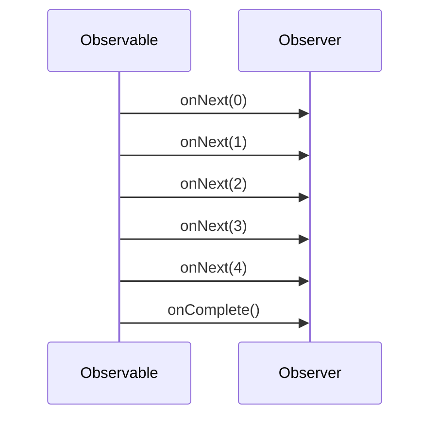

## 14.3 Working with Streams and Observables

In this section, we delve into the world of Functional Reactive Programming (FRP) with a focus on streams and observables. As experienced Java developers, you may already be familiar with the observer pattern and the concept of streams. Here, we will explore how these concepts are utilized in Clojure to build scalable and efficient applications.

### Understanding Streams in FRP

**Streams** in the context of FRP are sequences of data that are processed over time. Unlike traditional collections that are static, streams are dynamic and can represent a continuous flow of data. This is particularly useful in scenarios where data is being generated or received in real-time, such as user interactions, sensor data, or network requests.

#### Characteristics of Streams

- **Asynchronous**: Streams can handle data asynchronously, allowing for non-blocking operations.
- **Lazy Evaluation**: Similar to lazy sequences in Clojure, streams can be evaluated lazily, processing elements only when needed.
- **Composable**: Streams can be transformed and combined using various operators, enabling complex data processing pipelines.

### Observables: The Heart of Reactive Programming

**Observables** are a core concept in reactive programming, representing a data source that emits items to subscribers, known as observers. This pattern is an extension of the traditional observer pattern, where observers register interest in an observable and receive notifications when the observable emits new data.

#### The Observer Pattern in FRP

In FRP, the observer pattern is enhanced to support asynchronous data streams. Observables can emit three types of events:

1. **Next**: Represents a new data item emitted by the observable.
2. **Error**: Indicates an error has occurred, terminating the stream.
3. **Complete**: Signals that the observable has finished emitting data.

### Reactive Extensions (Rx)

**Reactive Extensions (Rx)** is a library that provides a model for working with asynchronous data streams using observables. It offers a rich set of operators for transforming, filtering, and combining streams, making it a powerful tool for building reactive applications.

#### Key Concepts in Rx

- **Observable**: Represents a stream of data that can be observed.
- **Observer**: Consumes data emitted by an observable.
- **Operators**: Functions that allow you to manipulate and transform data streams.
- **Schedulers**: Control the execution context of observables, enabling concurrency and parallelism.

### Example Using RxJava

RxJava is a popular implementation of Reactive Extensions for the Java Virtual Machine (JVM). It allows you to create and manipulate observables in a Java environment, and with Clojure's Java interoperability, you can leverage RxJava to build reactive applications in Clojure.

#### Creating and Subscribing to Observables

Let's explore how to create and subscribe to observables using RxJava in Clojure.

```clojure
(ns example.rxjava
  (:import [io.reactivex Observable Observer]
           [io.reactivex.disposables Disposable]))

(defn create-observable []
  (Observable/create
    (fn [emitter]
      (doseq [i (range 5)]
        (.onNext emitter i))
      (.onComplete emitter))))

(defn create-observer []
  (reify Observer
    (onSubscribe [this disposable]
      (println "Subscribed"))
    (onNext [this item]
      (println "Received item:" item))
    (onError [this error]
      (println "Error occurred:" error))
    (onComplete [this]
      (println "Completed"))))

(defn run-example []
  (let [observable (create-observable)
        observer (create-observer)]
    (.subscribe observable observer)))

(run-example)
```

**Explanation:**

- **Observable Creation**: We create an observable using `Observable/create`, which emits a sequence of integers from 0 to 4.
- **Observer Implementation**: We define an observer using `reify` to implement the `Observer` interface, handling `onNext`, `onError`, and `onComplete` events.
- **Subscription**: The observer subscribes to the observable, receiving and printing each emitted item.

### Try It Yourself

Experiment with the code above by modifying the range of emitted items or introducing an error condition to see how the observer handles it. This hands-on approach will deepen your understanding of observables and their behavior.

### Visualizing Streams and Observables

To better understand the flow of data in streams and observables, let's visualize the process using a sequence diagram.



**Diagram Explanation:**

- **Observable**: Emits a sequence of integers to the observer.
- **Observer**: Receives each item and processes it, followed by a completion signal.

### Advanced Concepts in RxJava

#### Combining Observables

RxJava provides operators to combine multiple observables, allowing you to merge, zip, or concatenate streams.

```clojure
(defn combine-observables []
  (let [obs1 (Observable/just 1 2 3)
        obs2 (Observable/just 4 5 6)]
    (.subscribe (Observable/merge obs1 obs2)
                (fn [item] (println "Merged item:" item)))))

(combine-observables)
```

**Explanation:**

- **Merge Operator**: Combines two observables into a single stream, emitting items from both sources.

#### Error Handling

Handling errors in reactive streams is crucial for building robust applications. RxJava provides operators like `onErrorResumeNext` to recover from errors.

```clojure
(defn error-handling-example []
  (let [observable (Observable/create
                     (fn [emitter]
                       (.onNext emitter 1)
                       (.onError emitter (Exception. "Test error"))))]
    (.subscribe observable
                (fn [item] (println "Received:" item))
                (fn [error] (println "Handled error:" (.getMessage error))))))

(error-handling-example)
```

**Explanation:**

- **Error Emission**: The observable emits an error, which is handled by the observer's error handler.

### Best Practices for Using Streams and Observables

- **Avoid Side Effects**: Ensure that your observables and observers are pure functions without side effects.
- **Use Backpressure**: Implement backpressure strategies to handle high-frequency data streams efficiently.
- **Leverage Schedulers**: Use schedulers to control the execution context and manage concurrency effectively.

### Knowledge Check

Before we conclude, let's test your understanding with a few questions:

1. What are the three types of events that an observable can emit?
2. How does lazy evaluation benefit streams in FRP?
3. What is the role of schedulers in RxJava?
4. How can you handle errors in reactive streams?

### Summary

In this section, we've explored the fundamentals of streams and observables in functional reactive programming. By leveraging RxJava and Clojure's interoperability, you can build scalable and efficient applications that process data in real-time. Remember to experiment with the provided code examples and apply these concepts to your projects.

### Further Reading

For more information on reactive programming and RxJava, consider exploring the following resources:

- [RxJava GitHub Repository](https://github.com/ReactiveX/RxJava)
- [Official Clojure Documentation](https://clojure.org/reference/documentation)
- [ClojureDocs](https://clojuredocs.org/)

---

## Quiz: Mastering Streams and Observables in Clojure



### What are the three types of events that an observable can emit?

- [x] Next, Error, Complete
- [ ] Start, Stop, Error
- [ ] Begin, End, Error
- [ ] Open, Close, Error

> **Explanation:** Observables emit three types of events: Next for new data items, Error for errors, and Complete when the stream finishes.


### How does lazy evaluation benefit streams in FRP?

- [x] It processes elements only when needed, improving efficiency.
- [ ] It processes all elements immediately, reducing latency.
- [ ] It caches elements for faster access.
- [ ] It duplicates elements for redundancy.

> **Explanation:** Lazy evaluation processes elements only when needed, which can improve efficiency by avoiding unnecessary computations.


### What is the role of schedulers in RxJava?

- [x] They control the execution context of observables.
- [ ] They manage memory allocation for observables.
- [ ] They handle error propagation in observables.
- [ ] They optimize the performance of observables.

> **Explanation:** Schedulers in RxJava control the execution context, allowing for concurrency and parallelism in data processing.


### How can you handle errors in reactive streams?

- [x] Use operators like `onErrorResumeNext`.
- [ ] Ignore errors and continue processing.
- [ ] Use try-catch blocks around observables.
- [ ] Restart the observable from the beginning.

> **Explanation:** Operators like `onErrorResumeNext` allow you to handle errors gracefully and continue processing.


### Which operator can combine multiple observables into a single stream?

- [x] Merge
- [ ] Split
- [ ] Filter
- [ ] Map

> **Explanation:** The Merge operator combines multiple observables into a single stream, emitting items from all sources.


### What is the primary advantage of using observables in FRP?

- [x] They allow for asynchronous data processing.
- [ ] They simplify synchronous data processing.
- [ ] They increase data redundancy.
- [ ] They reduce data latency.

> **Explanation:** Observables enable asynchronous data processing, which is a key advantage in reactive programming.


### What is a key characteristic of streams in FRP?

- [x] They are sequences of data processed over time.
- [ ] They are static collections of data.
- [ ] They are immutable data structures.
- [ ] They are synchronous data processors.

> **Explanation:** Streams in FRP are sequences of data that are processed over time, allowing for dynamic data handling.


### How do you create an observable in RxJava?

- [x] Use `Observable/create`.
- [ ] Use `Observable/new`.
- [ ] Use `Observable/init`.
- [ ] Use `Observable/start`.

> **Explanation:** You create an observable in RxJava using `Observable/create`, which allows you to define the data emission logic.


### What is the purpose of the observer in the observer pattern?

- [x] To consume data emitted by an observable.
- [ ] To produce data for an observable.
- [ ] To manage the lifecycle of an observable.
- [ ] To optimize the performance of an observable.

> **Explanation:** The observer consumes data emitted by an observable, processing each item as it is received.


### True or False: Observables in RxJava can only emit data synchronously.

- [ ] True
- [x] False

> **Explanation:** Observables in RxJava can emit data both synchronously and asynchronously, depending on the use case and configuration.


