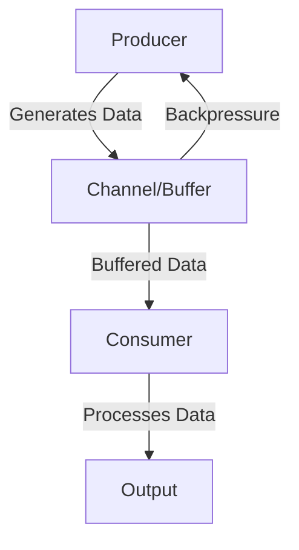

## 14.5 Handling Backpressure and Flow Control

In the realm of functional reactive programming, managing the flow of data efficiently is crucial to building scalable and robust applications. As experienced Java developers transitioning to Clojure, you may already be familiar with the challenges of handling asynchronous data streams. In this section, we will delve into the concepts of backpressure and flow control, exploring how Clojure's functional paradigms can be leveraged to address these challenges effectively.

### Challenges in Asynchronous Systems

Asynchronous systems often involve producers generating data at varying rates and consumers processing this data. A common challenge arises when producers generate data faster than consumers can process it, leading to potential resource exhaustion and system instability. This phenomenon is known as backpressure.

#### Key Challenges:

- **Overwhelming Consumers**: When consumers are inundated with more data than they can handle, it can lead to increased latency, memory overflow, and even system crashes.
- **Resource Exhaustion**: Uncontrolled data flow can exhaust system resources, such as memory and CPU, leading to degraded performance.
- **Data Loss**: In some cases, data may be dropped or lost if the system cannot handle the incoming flow efficiently.

### Backpressure Mechanisms

To address these challenges, various backpressure mechanisms can be employed. Let's explore some common strategies:

#### Buffering

Buffering involves temporarily storing data in a buffer until the consumer is ready to process it. This approach can help smooth out spikes in data flow but requires careful management to avoid buffer overflow.

```clojure
(require '[clojure.core.async :refer [chan >!! <!! buffer]])

;; Create a buffered channel with a capacity of 10
(def buffered-chan (chan (buffer 10)))

;; Producer: Puts data into the channel
(dotimes [i 20]
  (>!! buffered-chan i))

;; Consumer: Takes data from the channel
(dotimes [_ 20]
  (println "Consumed:" (<!! buffered-chan)))
```

#### Throttling

Throttling limits the rate at which data is produced or consumed, ensuring that the system operates within its capacity. This can be achieved using time-based controls.

```clojure
(require '[clojure.core.async :refer [chan go >! <! timeout]])

(defn throttled-producer [ch]
  (go
    (dotimes [i 10]
      (>! ch i)
      (<! (timeout 1000))))) ; Throttle by 1 second

(defn consumer [ch]
  (go
    (loop []
      (when-let [val (<! ch)]
        (println "Consumed:" val)
        (recur)))))

(let [ch (chan)]
  (throttled-producer ch)
  (consumer ch))
```

#### Dropping Data

In scenarios where data loss is acceptable, dropping excess data can be a viable strategy. This approach is often used in systems where only the latest data is relevant.

```clojure
(require '[clojure.core.async :refer [chan sliding-buffer >!! <!!]])

;; Create a channel with a sliding buffer of size 5
(def sliding-chan (chan (sliding-buffer 5)))

;; Producer: Puts data into the channel
(dotimes [i 10]
  (>!! sliding-chan i))

;; Consumer: Takes data from the channel
(dotimes [_ 5]
  (println "Consumed:" (<!! sliding-chan)))
```

### Implementation in Clojure

Clojure's `core.async` library provides powerful tools for managing backpressure and flow control in asynchronous systems. Let's explore how to implement these mechanisms using `core.async`.

#### Using `core.async` for Backpressure Control

`core.async` offers channels, buffers, and transducers that can be used to implement backpressure strategies effectively.

- **Channels**: Channels are the primary means of communication between producers and consumers. They can be buffered or unbuffered, depending on the application's needs.
- **Buffers**: Buffers determine how data is stored in a channel. Options include fixed buffers, sliding buffers, and dropping buffers.
- **Transducers**: Transducers allow for efficient data transformation and can be applied to channels to process data as it flows through the system.

#### Example: Managing Backpressure with `core.async`

Let's consider a practical example where we manage backpressure using a combination of buffering and throttling.

```clojure
(require '[clojure.core.async :refer [chan go >! <! timeout buffer]])

(defn producer [ch]
  (go
    (dotimes [i 20]
      (println "Produced:" i)
      (>! ch i)
      (<! (timeout 500))))) ; Produce data every 500ms

(defn consumer [ch]
  (go
    (loop []
      (when-let [val (<! ch)]
        (println "Consumed:" val)
        (<! (timeout 1000)) ; Consume data every 1000ms
        (recur)))))

(let [ch (chan (buffer 10))]
  (producer ch)
  (consumer ch))
```

In this example, the producer generates data every 500 milliseconds, while the consumer processes data every 1000 milliseconds. The buffered channel helps manage the flow, preventing the consumer from being overwhelmed.

### Examples of Managing Backpressure in Reactive Streams

Reactive streams provide a robust framework for handling asynchronous data flows with backpressure support. In Clojure, libraries like [manifold](https://github.com/clj-commons/manifold) and [aleph](https://github.com/ztellman/aleph) offer advanced capabilities for managing reactive streams.

#### Example: Using Manifold for Backpressure

Manifold is a Clojure library that provides abstractions for asynchronous programming, including support for backpressure.

```clojure
(require '[manifold.stream :as s])

(defn manifold-example []
  (let [stream (s/stream 10)] ; Create a stream with a buffer size of 10
    (s/consume #(println "Consumed:" %) stream) ; Consumer
    (dotimes [i 20]
      (s/put! stream i)))) ; Producer

(manifold-example)
```

In this example, we create a stream with a buffer size of 10. The consumer processes data from the stream, while the producer adds data to it. Manifold automatically handles backpressure, ensuring that the consumer is not overwhelmed.

### Visualizing Backpressure and Flow Control

To better understand the flow of data and backpressure mechanisms, let's visualize the process using a flowchart.



**Caption**: This flowchart illustrates the interaction between a producer, a buffered channel, and a consumer. Backpressure is managed by controlling the flow of data from the producer to the consumer.

### References and Links

- [Clojure Official Documentation](https://clojure.org/reference/documentation)
- [ClojureDocs](https://clojuredocs.org/)
- [core.async GitHub Repository](https://github.com/clojure/core.async)
- [Manifold GitHub Repository](https://github.com/clj-commons/manifold)
- [Aleph GitHub Repository](https://github.com/ztellman/aleph)

### Knowledge Check

Let's reinforce what we've learned with some questions and exercises.

- **Question**: What is backpressure, and why is it important in asynchronous systems?
- **Exercise**: Modify the `core.async` example to use a sliding buffer instead of a fixed buffer. Observe how the behavior changes.
- **Question**: How does throttling help manage data flow in a system?
- **Exercise**: Implement a simple reactive stream using Manifold and experiment with different buffer sizes.

### Encouraging Tone

Now that we've explored how to handle backpressure and flow control in Clojure, you're well-equipped to manage asynchronous data flows in your applications. Remember, the key to success is understanding the needs of your system and choosing the appropriate backpressure strategy. Keep experimenting and refining your approach to build scalable and resilient applications.

### Summary

In this section, we've covered the challenges of backpressure in asynchronous systems and explored various mechanisms to manage it effectively. By leveraging Clojure's `core.async` and libraries like Manifold, you can implement robust flow control strategies that ensure your applications remain performant and stable.

## Quiz: Mastering Backpressure and Flow Control in Clojure



### What is backpressure in the context of asynchronous systems?

- [x] A mechanism to prevent overwhelming consumers with too much data.
- [ ] A method to increase the speed of data processing.
- [ ] A technique to reduce memory usage.
- [ ] A strategy to enhance data security.

> **Explanation:** Backpressure is a mechanism used to prevent overwhelming consumers by controlling the flow of data in asynchronous systems.

### Which Clojure library provides tools for managing backpressure?

- [x] core.async
- [ ] clojure.spec
- [ ] clojure.test
- [ ] clojure.java.jdbc

> **Explanation:** The `core.async` library in Clojure provides tools such as channels and buffers for managing backpressure.

### What is the purpose of a buffer in a channel?

- [x] To temporarily store data until the consumer is ready to process it.
- [ ] To permanently store data for future use.
- [ ] To encrypt data before transmission.
- [ ] To convert data into a different format.

> **Explanation:** A buffer in a channel temporarily stores data to manage the flow between producers and consumers.

### How does throttling help in managing data flow?

- [x] By limiting the rate at which data is produced or consumed.
- [ ] By increasing the speed of data transmission.
- [ ] By compressing data to save space.
- [ ] By encrypting data for security.

> **Explanation:** Throttling helps manage data flow by limiting the rate at which data is produced or consumed, ensuring the system operates within its capacity.

### Which of the following is a valid backpressure strategy?

- [x] Buffering
- [x] Throttling
- [ ] Encryption
- [ ] Compression

> **Explanation:** Buffering and throttling are valid strategies for managing backpressure in asynchronous systems.

### What is the role of a consumer in a reactive stream?

- [x] To process data from the stream.
- [ ] To generate data for the stream.
- [ ] To encrypt data in the stream.
- [ ] To store data permanently.

> **Explanation:** The consumer's role in a reactive stream is to process data as it flows through the system.

### How can data be dropped in a Clojure channel?

- [x] By using a sliding buffer.
- [x] By using a dropping buffer.
- [ ] By using an encryption buffer.
- [ ] By using a compression buffer.

> **Explanation:** Sliding and dropping buffers in Clojure channels can be used to drop data when necessary.

### What is the benefit of using Manifold for backpressure?

- [x] It provides abstractions for asynchronous programming with backpressure support.
- [ ] It encrypts data for secure transmission.
- [ ] It compresses data to save space.
- [ ] It converts data into different formats.

> **Explanation:** Manifold provides abstractions for asynchronous programming, including support for managing backpressure.

### What does the `timeout` function do in `core.async`?

- [x] It creates a delay for a specified period.
- [ ] It encrypts data for security.
- [ ] It compresses data to save space.
- [ ] It converts data into a different format.

> **Explanation:** The `timeout` function in `core.async` creates a delay for a specified period, useful for throttling data flow.

### True or False: Backpressure is only relevant in synchronous systems.

- [ ] True
- [x] False

> **Explanation:** Backpressure is particularly relevant in asynchronous systems where data flow needs to be managed to prevent overwhelming consumers.



By mastering these concepts, you can effectively manage backpressure and flow control in your Clojure applications, ensuring they remain scalable and performant.
