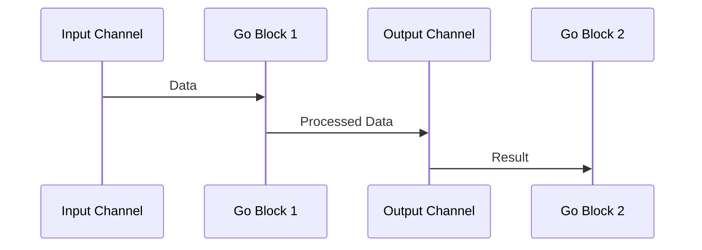

## 14.6 Asynchronous Programming with `core.async`

Asynchronous programming is a cornerstone of modern software development, enabling applications to handle multiple tasks concurrently without blocking the main execution thread. In Clojure, `core.async` provides a powerful toolkit for building asynchronous workflows, leveraging channels, go blocks, and transducers. This section will guide you through the intricacies of `core.async`, offering insights and practical examples to help you master asynchronous programming in Clojure.

### Deep Dive into `core.async`

`core.async` is a Clojure library inspired by Communicating Sequential Processes (CSP), a formal language for describing patterns of interaction in concurrent systems. It introduces channels as a means of communication between different parts of a program, allowing for asynchronous data flow and coordination.

#### Channels and Transducers

Channels in `core.async` are akin to queues that can be used to pass messages between different threads or go blocks. They can be buffered or unbuffered, and they support operations like `put!`, `take!`, and `close!`.

**Example: Basic Channel Operations**

```clojure
(require '[clojure.core.async :refer [chan put! take! close!]])

;; Create a channel
(def my-channel (chan))

;; Put a value onto the channel
(put! my-channel "Hello, core.async!")

;; Take a value from the channel
(take! my-channel println)

;; Close the channel
(close! my-channel)
```

**Transducers** are composable algorithmic transformations. They can be applied to channels to process data efficiently as it flows through the channel.

**Example: Using Transducers with Channels**

```clojure
(require '[clojure.core.async :refer [chan put! take! close!]])
(require '[clojure.core.async :as async])

;; Create a channel with a transducer that doubles each number
(def xform (map #(* 2 %)))
(def my-channel (chan 10 xform))

;; Put values onto the channel
(put! my-channel 1)
(put! my-channel 2)
(put! my-channel 3)

;; Take values from the channel
(take! my-channel println) ; Outputs 2
(take! my-channel println) ; Outputs 4
(take! my-channel println) ; Outputs 6

;; Close the channel
(close! my-channel)
```

### Multithreading with `core.async`

`core.async` provides two primary constructs for managing concurrency: **go blocks** and **threads**. Go blocks are lightweight, non-blocking constructs that allow you to write asynchronous code in a synchronous style. Threads, on the other hand, are more traditional and can be used for CPU-bound tasks.

#### Go Blocks

Go blocks use a process called **parking** to yield control when waiting for a channel operation to complete. This allows other go blocks to execute in the meantime, making efficient use of system resources.

**Example: Using Go Blocks**

```clojure
(require '[clojure.core.async :refer [go chan <! >!]])

(def my-channel (chan))

;; Go block that puts a value onto the channel
(go
  (>! my-channel "Hello from go block"))

;; Go block that takes a value from the channel
(go
  (let [value (<! my-channel)]
    (println "Received:" value)))
```

#### Threads

Threads in `core.async` are used for tasks that require blocking operations or when you need to leverage multiple CPU cores.

**Example: Using Threads**

```clojure
(require '[clojure.core.async :refer [thread chan <!! >!!]])

(def my-channel (chan))

;; Thread that puts a value onto the channel
(thread
  (>!! my-channel "Hello from thread"))

;; Thread that takes a value from the channel
(thread
  (let [value (<!! my-channel)]
    (println "Received:" value)))
```

### Error Handling

Handling errors in asynchronous workflows can be challenging due to the decoupled nature of the operations. `core.async` provides mechanisms to manage errors gracefully.

#### Strategies for Error Handling

1. **Error Channels**: Use separate channels to communicate errors between go blocks.
2. **Try-Catch Blocks**: Wrap channel operations in try-catch blocks to handle exceptions.
3. **Supervision**: Implement supervision strategies to restart or recover from failed operations.

**Example: Error Handling with Error Channels**

```clojure
(require '[clojure.core.async :refer [go chan <! >!]])

(def data-channel (chan))
(def error-channel (chan))

;; Go block that processes data and handles errors
(go
  (try
    (let [data (<! data-channel)]
      (if (nil? data)
        (throw (Exception. "Data is nil"))
        (println "Processing data:" data)))
    (catch Exception e
      (>! error-channel (.getMessage e)))))

;; Go block that handles errors
(go
  (let [error (<! error-channel)]
    (println "Error occurred:" error)))
```

### Examples: Complex Asynchronous Workflows

Let's explore a more complex example that demonstrates a real-world asynchronous workflow using `core.async`.

**Example: Asynchronous Data Processing Pipeline**

```clojure
(require '[clojure.core.async :refer [go chan <! >! close!]])

(defn process-data [data]
  (println "Processing data:" data))

(def input-channel (chan))
(def output-channel (chan))

;; Go block that reads from input-channel, processes data, and writes to output-channel
(go
  (loop []
    (when-let [data (<! input-channel)]
      (process-data data)
      (>! output-channel data)
      (recur))))

;; Go block that reads from output-channel
(go
  (loop []
    (when-let [result (<! output-channel)]
      (println "Result:" result)
      (recur))))

;; Simulate data input
(go
  (doseq [i (range 5)]
    (>! input-channel i))
  (close! input-channel))
```

### Visual Aids

To better understand the flow of data through channels and go blocks, let's visualize the process using a sequence diagram.



**Diagram Description**: This sequence diagram illustrates the flow of data from the input channel through the first go block, which processes the data and sends it to the output channel. The second go block then receives the processed data from the output channel.

### References and Links

- [Official Clojure Documentation](https://clojure.org/reference/async)
- [ClojureDocs - core.async](https://clojuredocs.org/clojure.core.async)
- [GitHub - core.async](https://github.com/clojure/core.async)

### Knowledge Check

To reinforce your understanding of `core.async`, consider the following questions and exercises:

1. What are the primary differences between go blocks and threads in `core.async`?
2. How can transducers be used to optimize data processing in channels?
3. Implement a simple error handling mechanism using error channels in a `core.async` workflow.
4. Modify the asynchronous data processing pipeline example to include error handling for invalid data inputs.

### Encouraging Tone

Now that we've delved into the world of asynchronous programming with `core.async`, you're well-equipped to build scalable and efficient applications in Clojure. Remember, practice makes perfect, so don't hesitate to experiment with the examples provided and explore new ways to leverage `core.async` in your projects.

### Best Practices for Tags

- "Clojure"
- "Functional Programming"
- "Concurrency"
- "Asynchronous Programming"
- "core.async"
- "Multithreading"
- "Error Handling"
- "Java Interoperability"

---

## Quiz: Mastering Asynchronous Programming with `core.async`



### What is the primary purpose of `core.async` in Clojure?

- [x] To provide a toolkit for building asynchronous workflows
- [ ] To replace all synchronous operations in Clojure
- [ ] To manage database connections
- [ ] To handle user interface events

> **Explanation:** `core.async` is designed to facilitate asynchronous programming by providing constructs like channels and go blocks for managing concurrent workflows.

### How do go blocks differ from threads in `core.async`?

- [x] Go blocks are lightweight and non-blocking, while threads are used for blocking operations
- [ ] Go blocks are used for blocking operations, while threads are non-blocking
- [ ] Both go blocks and threads are used for the same purpose
- [ ] Go blocks are faster than threads in all scenarios

> **Explanation:** Go blocks are lightweight constructs that use parking to manage concurrency without blocking, whereas threads are used for tasks that require blocking operations.

### Which function is used to create a channel in `core.async`?

- [x] `chan`
- [ ] `create-channel`
- [ ] `make-channel`
- [ ] `new-channel`

> **Explanation:** The `chan` function is used to create a new channel in `core.async`.

### What is the role of transducers in `core.async`?

- [x] To transform data as it flows through channels
- [ ] To manage error handling in channels
- [ ] To create new channels
- [ ] To close channels automatically

> **Explanation:** Transducers are used to apply transformations to data as it flows through channels, optimizing data processing.

### Which of the following is a strategy for handling errors in `core.async`?

- [x] Using error channels
- [ ] Ignoring errors
- [x] Wrapping operations in try-catch blocks
- [ ] Relying on automatic error handling

> **Explanation:** Error channels and try-catch blocks are effective strategies for managing errors in asynchronous workflows.

### What does the `<!` operator do in a go block?

- [x] Takes a value from a channel
- [ ] Puts a value onto a channel
- [ ] Closes a channel
- [ ] Opens a channel

> **Explanation:** The `<!` operator is used within a go block to take a value from a channel.

### How can you close a channel in `core.async`?

- [x] Using the `close!` function
- [ ] Using the `end-channel` function
- [x] Using the `terminate-channel` function
- [ ] Using the `stop-channel` function

> **Explanation:** The `close!` function is used to close a channel in `core.async`.

### What is the benefit of using channels in `core.async`?

- [x] They enable asynchronous data flow between different parts of a program
- [ ] They automatically handle all errors
- [ ] They replace the need for functions
- [ ] They are faster than all other data structures

> **Explanation:** Channels facilitate asynchronous communication between different parts of a program, enabling efficient data flow.

### Which of the following is true about go blocks?

- [x] They allow writing asynchronous code in a synchronous style
- [ ] They are used for CPU-bound tasks
- [ ] They block the main execution thread
- [ ] They are slower than threads

> **Explanation:** Go blocks allow developers to write asynchronous code that looks synchronous, improving code readability and maintainability.

### True or False: Transducers can only be used with channels in `core.async`.

- [ ] True
- [x] False

> **Explanation:** Transducers are a general-purpose concept in Clojure and can be used with other data structures, not just channels.


