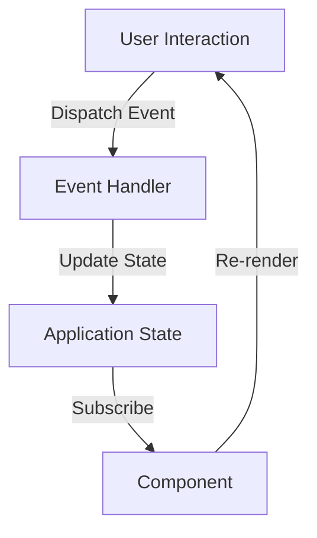

## 14.8 State Management in Web and Mobile Apps

In the realm of web and mobile app development, managing application state efficiently is crucial for building responsive and scalable applications. Clojure and its JavaScript counterpart, ClojureScript, offer powerful tools and frameworks that embrace functional programming principles to tackle state management challenges. In this section, we will explore how to manage state in web and mobile applications using Clojure, focusing on frameworks like Reagent and re-frame, which leverage reactive programming principles.

### React and Reagent

React is a popular JavaScript library for building user interfaces, known for its component-based architecture and efficient rendering. Reagent is a ClojureScript interface to React, allowing developers to write React components using ClojureScript. Reagent brings the benefits of Clojure's immutable data structures and functional programming to the React ecosystem.

#### Key Features of Reagent

- **Reactive Components**: Reagent components are reactive, meaning they automatically re-render when their data changes. This is achieved through the use of ClojureScript's atom, which is a reference type that holds state and can be watched for changes.
- **Simplicity and Conciseness**: Reagent allows you to write concise and expressive UI code using ClojureScript's syntax and data structures.
- **Interoperability with React**: Reagent seamlessly interoperates with React, allowing you to use existing React components and libraries.

#### Example: Creating a Simple Reagent Component

Let's start by creating a simple Reagent component that displays a counter and a button to increment it.

```clojure
(ns my-app.core
  (:require [reagent.core :as r]))

(defn counter-component []
  (let [count (r/atom 0)] ; Create an atom to hold the state
    (fn [] ; Return a function that renders the component
      [:div
       [:p "Current count: " @count] ; Dereference the atom to get the current value
       [:button {:on-click #(swap! count inc)} "Increment"]])))

(defn mount-root []
  (r/render [counter-component] (.getElementById js/document "app")))

(defn init []
  (mount-root))
```

In this example, we define a `counter-component` that uses an atom to hold the count state. The component re-renders automatically whenever the atom's value changes, thanks to Reagent's reactivity.

### Managing Application State

Managing state in a reactive front-end application involves handling both local component state and global application state. Reagent provides atoms for local state, but for more complex applications, a global state management solution is often necessary.

#### Local State with Atoms

Atoms are ideal for managing local component state. They are mutable references that can be updated and watched for changes. In Reagent, atoms are used to trigger re-renders when their state changes.

#### Global State with re-frame

For managing global application state, re-frame is a popular framework built on top of Reagent. It provides a structured way to manage state and side effects in a ClojureScript application.

##### Key Concepts in re-frame

- **Event-Driven Architecture**: re-frame uses an event-driven architecture where state changes are triggered by events.
- **Unidirectional Data Flow**: re-frame enforces a unidirectional data flow, similar to the Flux architecture, where data flows in a single direction through the application.
- **Subscriptions and Reactions**: re-frame uses subscriptions to access state and reactions to automatically update components when state changes.

#### Example: Managing Global State with re-frame

Let's create a simple re-frame application that manages a global counter state.

```clojure
(ns my-app.core
  (:require [re-frame.core :as rf]
            [reagent.core :as r]))

;; Define an event to increment the counter
(rf/reg-event-db
 :increment-counter
 (fn [db _]
   (update db :counter inc)))

;; Define a subscription to access the counter state
(rf/reg-sub
 :counter
 (fn [db _]
   (:counter db)))

;; Define a component that uses the subscription
(defn counter-component []
  (let [counter @(rf/subscribe [:counter])]
    (fn []
      [:div
       [:p "Current count: " counter]
       [:button {:on-click #(rf/dispatch [:increment-counter])} "Increment"]])))

(defn mount-root []
  (r/render [counter-component] (.getElementById js/document "app")))

(defn init []
  (rf/dispatch-sync [:initialize-db]) ; Initialize the application state
  (mount-root))
```

In this example, we define an event `:increment-counter` to update the counter state and a subscription `:counter` to access the state. The `counter-component` uses the subscription to display the current counter value and dispatches the `:increment-counter` event when the button is clicked.

### Unidirectional Data Flow

Unidirectional data flow is a core principle in re-frame applications. It ensures that data flows in a single direction, making the application more predictable and easier to debug.

#### Data Flow in re-frame

1. **Events**: User interactions or other triggers dispatch events.
2. **Event Handlers**: Event handlers update the application state based on the dispatched events.
3. **Subscriptions**: Components subscribe to parts of the application state.
4. **Reactions**: Components automatically re-render when the subscribed state changes.



*Diagram: Unidirectional Data Flow in re-frame*

### Real-Time Data Updates

Handling real-time data updates is essential for building interactive user interfaces. In ClojureScript, you can use WebSockets or other real-time data sources to update the application state.

#### Example: Real-Time Updates with WebSockets

Let's create a simple example that updates the application state in real-time using WebSockets.

```clojure
(ns my-app.core
  (:require [re-frame.core :as rf]
            [reagent.core :as r]
            [cljs.core.async :refer [<!]]
            [cljs-http.client :as http]))

;; Define an event to update the state with new data
(rf/reg-event-db
 :update-data
 (fn [db [_ new-data]]
   (assoc db :data new-data)))

;; Define a subscription to access the data
(rf/reg-sub
 :data
 (fn [db _]
   (:data db)))

;; Define a component that displays the data
(defn data-component []
  (let [data @(rf/subscribe [:data])]
    (fn []
      [:div
       [:p "Real-time data: " data]])))

(defn mount-root []
  (r/render [data-component] (.getElementById js/document "app")))

(defn init []
  ;; Simulate receiving data from a WebSocket
  (go-loop []
    (let [response (<! (http/get "/api/data"))]
      (rf/dispatch [:update-data (:body response)])
      (<! (timeout 1000)) ; Wait for 1 second before fetching new data
      (recur)))
  (mount-root))
```

In this example, we simulate receiving real-time data from a WebSocket by periodically fetching data from an API and updating the application state using the `:update-data` event.

### Cross-Platform Development

Clojure and ClojureScript can be used for cross-platform development, allowing you to build web and mobile applications using the same codebase. Libraries like React Native and frameworks like Expo enable ClojureScript to be used for mobile app development.

#### Using ClojureScript with React Native

React Native allows you to build mobile applications using JavaScript and React. With ClojureScript, you can leverage the same functional programming principles and libraries to build mobile apps.

##### Example: Building a Simple Mobile App with Reagent and React Native

```clojure
(ns my-app.core
  (:require [reagent.core :as r]
            [reagent.react-native :as rn]))

(defn app-root []
  (let [count (r/atom 0)]
    (fn []
      [rn/view
       [rn/text {:style {:font-size 20}} "Hello, ClojureScript!"]
       [rn/button {:title "Increment"
                   :on-press #(swap! count inc)}]
       [rn/text {:style {:font-size 20}} (str "Count: " @count)]])))

(defn init []
  (rn/register-root-component "MyApp" app-root))
```

In this example, we create a simple mobile app using Reagent and React Native. The app displays a button that increments a counter, demonstrating how to manage state in a mobile application using ClojureScript.

### Conclusion

State management in web and mobile applications is a critical aspect of building scalable and responsive user interfaces. By leveraging Clojure and ClojureScript, along with frameworks like Reagent and re-frame, you can apply functional programming principles to manage state effectively. Whether you're building web applications with Reagent or mobile apps with React Native, ClojureScript provides the tools and libraries to create robust and maintainable applications.

### Knowledge Check

Now that we've explored state management in web and mobile apps using Clojure, let's test your understanding with a quiz.

## Quiz: Mastering State Management in Clojure Web and Mobile Apps



### What is Reagent in the context of ClojureScript?

- [x] A ClojureScript interface to React
- [ ] A JavaScript library for managing state
- [ ] A database management tool
- [ ] A CSS framework

> **Explanation:** Reagent is a ClojureScript interface to React, allowing developers to write React components using ClojureScript.

### How does Reagent achieve reactivity in components?

- [x] By using ClojureScript's atom
- [ ] By using JavaScript's `setTimeout`
- [ ] By using CSS animations
- [ ] By using HTML templates

> **Explanation:** Reagent components are reactive because they use ClojureScript's atom, which holds state and can be watched for changes.

### What is the primary architecture pattern used in re-frame?

- [x] Unidirectional data flow
- [ ] Bidirectional data flow
- [ ] MVC (Model-View-Controller)
- [ ] MVVM (Model-View-ViewModel)

> **Explanation:** re-frame uses a unidirectional data flow architecture, similar to the Flux architecture, where data flows in a single direction through the application.

### Which of the following is NOT a key concept in re-frame?

- [ ] Events
- [ ] Subscriptions
- [ ] Reactions
- [x] CSS selectors

> **Explanation:** CSS selectors are not a concept in re-frame. Key concepts include events, subscriptions, and reactions.

### How can real-time data updates be handled in ClojureScript applications?

- [x] Using WebSockets
- [x] Using HTTP polling
- [ ] Using CSS transitions
- [ ] Using HTML forms

> **Explanation:** Real-time data updates can be handled using WebSockets or HTTP polling to update the application state.

### What is the benefit of using unidirectional data flow in applications?

- [x] It makes the application more predictable
- [ ] It allows for bidirectional data binding
- [ ] It simplifies CSS styling
- [ ] It reduces the need for JavaScript

> **Explanation:** Unidirectional data flow makes the application more predictable and easier to debug by ensuring data flows in a single direction.

### Which library allows ClojureScript to be used for mobile app development?

- [x] React Native
- [ ] Bootstrap
- [ ] jQuery
- [ ] AngularJS

> **Explanation:** React Native allows ClojureScript to be used for mobile app development by providing a platform for building mobile applications using JavaScript and React.

### What is the role of atoms in Reagent components?

- [x] To hold local component state
- [ ] To style components
- [ ] To manage global application state
- [ ] To handle HTTP requests

> **Explanation:** Atoms in Reagent components are used to hold local component state and trigger re-renders when their state changes.

### How does re-frame handle state changes?

- [x] Through event handlers
- [ ] Through CSS animations
- [ ] Through HTML forms
- [ ] Through JavaScript alerts

> **Explanation:** re-frame handles state changes through event handlers that update the application state based on dispatched events.

### True or False: ClojureScript can only be used for web development.

- [ ] True
- [x] False

> **Explanation:** False. ClojureScript can be used for both web and mobile development, leveraging libraries like React Native for mobile applications.



By mastering these concepts, you can effectively manage state in your web and mobile applications using Clojure and ClojureScript. Keep experimenting with the examples provided, and explore the rich ecosystem of libraries and tools available to Clojure developers.
