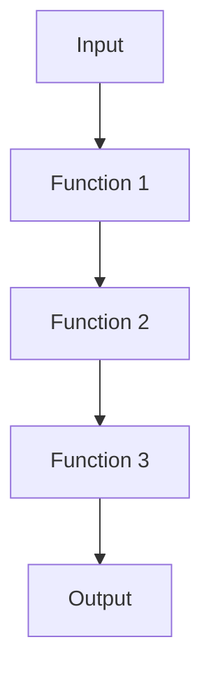
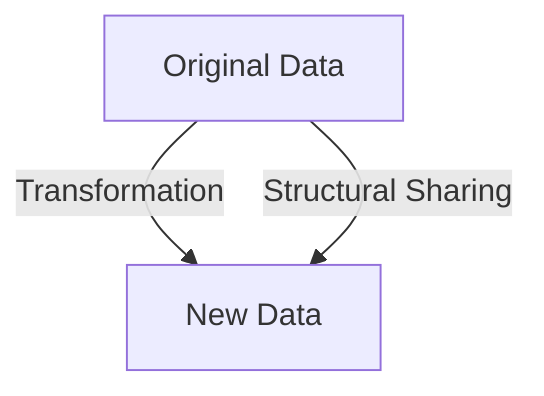

## 15.1 Introduction to Functional Design Patterns

Design patterns are a crucial aspect of software engineering, providing reusable solutions to common problems. They serve as templates that guide developers in structuring their code effectively. In this section, we will explore the role of design patterns in functional programming, particularly in Clojure, and how they differ from traditional object-oriented patterns.

### Purpose of Design Patterns

Design patterns emerged from the need to address recurring problems in software design. They encapsulate best practices and provide a shared vocabulary for developers to communicate complex ideas succinctly. In object-oriented programming (OOP), patterns like Singleton, Factory, and Observer are widely used to manage object creation, structure, and behavior.

#### Shift from OOP to FP Patterns

As we transition from OOP to functional programming (FP), the nature of design patterns changes. Functional programming emphasizes immutability, first-class functions, and declarative code, which leads to different approaches to solving problems. While some OOP patterns have direct counterparts in FP, others are reimagined or become unnecessary due to the paradigms' inherent differences.

For example, the Singleton pattern, which ensures a class has only one instance, is less relevant in FP due to immutability and statelessness. Instead, FP focuses on patterns like Higher-Order Functions, Function Composition, and Monads, which leverage functions and immutable data to achieve similar goals.

#### Importance in Clojure

Understanding functional design patterns is essential for writing idiomatic Clojure code. Clojure, a modern Lisp dialect, embraces FP principles and provides powerful abstractions for managing state, concurrency, and data transformation. By mastering these patterns, developers can build scalable, maintainable applications that leverage Clojure's strengths.

### Overview of Patterns

In this chapter, we will cover several functional design patterns that are particularly relevant to Clojure:

- **Higher-Order Functions**: Functions that take other functions as arguments or return them as results, enabling powerful abstractions and code reuse.
- **Function Composition**: Combining simple functions to build more complex ones, promoting modularity and readability.
- **Currying and Partial Application**: Techniques for transforming functions to accept arguments incrementally, enhancing flexibility and composability.
- **Memoization**: Caching function results to optimize performance, especially for expensive computations.
- **Monads and Applicative Functors**: Abstracting computation patterns, such as handling side effects and chaining operations.
- **Functional Reactive Programming (FRP)**: Managing asynchronous data streams and event-driven systems in a functional style.

Each pattern will be explored in detail, with examples and comparisons to Java where applicable. Let's dive into the world of functional design patterns and discover how they can transform your Clojure applications.

---

### Higher-Order Functions

Higher-order functions (HOFs) are a cornerstone of functional programming. They allow us to abstract over actions, not just data, by taking functions as arguments or returning them as results. This capability leads to more flexible and reusable code.

#### Key Concepts

- **First-Class Functions**: In Clojure, functions are first-class citizens, meaning they can be passed around like any other data type.
- **Abstraction and Reusability**: HOFs enable us to abstract common patterns and reuse code across different contexts.

#### Example: `map`, `filter`, and `reduce`

Let's explore how HOFs work in Clojure with the classic trio: `map`, `filter`, and `reduce`.

```clojure
;; Define a simple function to square a number
(defn square [x]
  (* x x))

;; Use map to apply the square function to each element in a list
(def squares (map square [1 2 3 4 5]))
;; => (1 4 9 16 25)

;; Use filter to select even numbers from a list
(def evens (filter even? [1 2 3 4 5 6]))
;; => (2 4 6)

;; Use reduce to sum a list of numbers
(def sum (reduce + [1 2 3 4 5]))
;; => 15
```

In Java, achieving similar functionality would require more boilerplate code, often involving loops or iterators. Clojure's HOFs provide a concise and expressive way to manipulate collections.

#### Try It Yourself

Experiment with different functions and collections. Try creating a function that doubles a number and use it with `map` to transform a list of numbers.

### Function Composition

Function composition is the process of combining simple functions to build more complex ones. It promotes modularity and readability by allowing us to express complex operations as a series of transformations.

#### Key Concepts

- **Composability**: Functions can be composed to create new functions, enabling a declarative style of programming.
- **Modularity**: Breaking down complex operations into smaller, reusable functions.

#### Example: `comp` Function

Clojure provides the `comp` function to compose functions. Let's see it in action:

```clojure
;; Define two simple functions
(defn inc [x] (+ x 1))
(defn double [x] (* x 2))

;; Compose the functions to create a new function
(def inc-and-double (comp double inc))

;; Apply the composed function
(inc-and-double 3)
;; => 8
```

In Java, function composition is less straightforward, often requiring anonymous classes or lambda expressions. Clojure's `comp` function simplifies this process, making it easy to chain transformations.

#### Try It Yourself

Create your own composed functions using `comp`. For example, try composing a function that squares a number and then adds one.

### Currying and Partial Application

Currying and partial application are techniques for transforming functions to accept arguments incrementally. They enhance flexibility and composability by allowing functions to be partially applied and reused in different contexts.

#### Key Concepts

- **Currying**: Transforming a function that takes multiple arguments into a series of functions that each take a single argument.
- **Partial Application**: Fixing a number of arguments to a function, producing another function of smaller arity.

#### Example: Partial Application with `partial`

Clojure provides the `partial` function to facilitate partial application:

```clojure
;; Define a function that takes two arguments
(defn add [x y] (+ x y))

;; Create a partially applied function
(def add-five (partial add 5))

;; Use the partially applied function
(add-five 10)
;; => 15
```

In Java, achieving similar functionality would require creating custom classes or using lambda expressions. Clojure's `partial` function provides a straightforward way to create partially applied functions.

#### Try It Yourself

Experiment with `partial` by creating a function that multiplies two numbers and partially applying it to create a function that doubles a number.

### Memoization

Memoization is a technique for caching the results of expensive function calls to optimize performance. It is particularly useful for recursive functions or functions with expensive computations.

#### Key Concepts

- **Caching**: Storing the results of function calls to avoid redundant computations.
- **Performance Optimization**: Reducing the time complexity of functions by reusing previously computed results.

#### Example: Memoization with `memoize`

Clojure provides the `memoize` function to easily memoize functions:

```clojure
;; Define a recursive function to compute Fibonacci numbers
(defn fib [n]
  (if (<= n 1)
    n
    (+ (fib (- n 1)) (fib (- n 2)))))

;; Memoize the Fibonacci function
(def memo-fib (memoize fib))

;; Compute Fibonacci numbers
(memo-fib 40)
;; => 102334155
```

In Java, memoization would typically require custom caching logic. Clojure's `memoize` function simplifies this process, making it easy to optimize performance.

#### Try It Yourself

Memoize a function that computes factorials and observe the performance improvement for large inputs.

### Monads and Applicative Functors

Monads and applicative functors are powerful abstractions for managing computation patterns, such as handling side effects and chaining operations. They provide a way to structure programs in a functional style.

#### Key Concepts

- **Monads**: Abstractions that encapsulate computation patterns, allowing for the chaining of operations.
- **Applicative Functors**: Generalizations of monads that allow for the application of functions in a context.

#### Example: Using Monads with `core.async`

Clojure's `core.async` library provides monadic abstractions for managing asynchronous computations:

```clojure
(require '[clojure.core.async :as async])

;; Create a channel
(def ch (async/chan))

;; Put a value onto the channel
(async/>!! ch 42)

;; Take a value from the channel
(async/<!! ch)
;; => 42
```

In Java, managing asynchronous computations often involves complex threading logic. Clojure's `core.async` provides a monadic interface for handling concurrency in a functional style.

#### Try It Yourself

Create a channel and use `go` blocks to perform asynchronous computations. Experiment with different operations and observe how `core.async` simplifies concurrency.

### Functional Reactive Programming (FRP)

Functional Reactive Programming (FRP) is a paradigm for managing asynchronous data streams and event-driven systems in a functional style. It provides a way to handle dynamic data flows and build reactive systems.

#### Key Concepts

- **Streams**: Continuous flows of data that can be transformed and combined.
- **Reactivity**: Automatically updating computations in response to changes in data.

#### Example: Building Reactive Systems with `re-frame`

ClojureScript's `re-frame` library provides an FRP framework for building reactive web applications:

```clojure
(ns my-app.core
  (:require [re-frame.core :as re-frame]))

;; Define an event handler
(re-frame/reg-event-db
  :increment-counter
  (fn [db _]
    (update db :counter inc)))

;; Define a subscription
(re-frame/reg-sub
  :counter
  (fn [db _]
    (:counter db)))

;; Use the subscription in a component
(defn counter-component []
  (let [counter (re-frame/subscribe [:counter])]
    [:div "Counter: " @counter]))
```

In Java, building reactive systems often involves complex observer patterns or reactive libraries. ClojureScript's `re-frame` provides a functional approach to managing state and reactivity.

#### Try It Yourself

Build a simple counter application using `re-frame`. Experiment with different events and subscriptions to understand how FRP simplifies state management.

---

### Visual Aids

To enhance understanding, let's incorporate some visual aids using Hugo-compatible Mermaid.js diagrams.

#### Function Composition Flowchart



*Caption*: This flowchart illustrates the process of function composition, where the output of one function becomes the input of the next.

#### Immutability and Persistent Data Structures



*Caption*: This diagram shows how Clojure's persistent data structures leverage structural sharing to efficiently create new data from existing data.

### References and Links

For further reading and deeper dives into the topics covered, consider the following resources:

- [Official Clojure Documentation](https://clojure.org/)
- [ClojureDocs](https://clojuredocs.org/)
- [ClojureScript and re-frame](https://github.com/day8/re-frame)
- [core.async Guide](https://clojure.github.io/core.async/)

### Knowledge Check

To reinforce your understanding, consider the following questions:

1. What are higher-order functions, and how do they differ from regular functions?
2. How does function composition promote modularity and readability in Clojure?
3. Explain the difference between currying and partial application.
4. How does memoization improve the performance of recursive functions?
5. What role do monads play in managing side effects in functional programming?

### Exercises

1. Implement a function that filters and transforms a list of numbers using higher-order functions.
2. Compose a series of functions to process a collection of strings, such as trimming whitespace and converting to uppercase.
3. Use `partial` to create a function that adds a fixed percentage to a price.
4. Memoize a function that computes the nth Fibonacci number and compare its performance to the non-memoized version.
5. Build a simple reactive application using `re-frame` that updates a counter based on user input.

### Encouraging Tone

Now that we've explored the foundational concepts of functional design patterns, you're well-equipped to apply these techniques in your Clojure projects. Embrace the power of functional programming to build scalable, maintainable applications. Remember, practice makes perfect, so keep experimenting and refining your skills.

### Formatting and Structure

This section is organized with clear headings and subheadings to guide you through each concept. Bullet points and numbered lists break down complex information, while bold and italic text highlight important terms. Consistent formatting ensures a smooth reading experience.

### Writing Style

We've used first-person plural to create a collaborative feel, avoiding gender-specific pronouns to maintain inclusivity. Acronyms and abbreviations are defined upon first use, and the language is professional and instructional, suitable for expert developers.

### Best Practices for Tags

The tags for this section are specific and relevant, reflecting the key topics and technologies discussed. They are wrapped in double quotes and avoid special characters, ensuring consistency and clarity.

---

## Quiz: Test Your Knowledge on Functional Design Patterns in Clojure



### What is a higher-order function?

- [x] A function that takes other functions as arguments or returns them as results
- [ ] A function that only operates on numbers
- [ ] A function that is defined within another function
- [ ] A function that cannot be composed

> **Explanation:** Higher-order functions are functions that take other functions as arguments or return them as results, enabling powerful abstractions and code reuse.


### How does function composition benefit code structure?

- [x] It promotes modularity and readability
- [ ] It makes code execution faster
- [ ] It reduces the number of lines of code
- [ ] It eliminates the need for variables

> **Explanation:** Function composition allows for the creation of complex operations by combining simple functions, promoting modularity and readability.


### What is the primary purpose of memoization?

- [x] To cache function results for performance optimization
- [ ] To increase the complexity of a function
- [ ] To simplify function definitions
- [ ] To ensure functions are pure

> **Explanation:** Memoization caches the results of expensive function calls to optimize performance, especially for recursive functions.


### What is currying in functional programming?

- [x] Transforming a function to take arguments incrementally
- [ ] Combining multiple functions into one
- [ ] Creating a function that returns another function
- [ ] Simplifying a function to one line

> **Explanation:** Currying transforms a function that takes multiple arguments into a series of functions that each take a single argument.


### How does `core.async` simplify concurrency in Clojure?

- [x] By providing monadic abstractions for asynchronous computations
- [ ] By eliminating the need for threads
- [ ] By automatically parallelizing code
- [ ] By using global variables for state management

> **Explanation:** `core.async` provides monadic abstractions for managing asynchronous computations, simplifying concurrency in a functional style.


### What is the role of applicative functors?

- [x] To allow the application of functions in a context
- [ ] To replace monads in functional programming
- [ ] To simplify function definitions
- [ ] To eliminate side effects

> **Explanation:** Applicative functors generalize monads by allowing the application of functions in a context, enabling structured computation patterns.


### How does `re-frame` facilitate building reactive systems?

- [x] By providing an FRP framework for managing state and reactivity
- [ ] By eliminating the need for event handling
- [ ] By using global variables for state management
- [ ] By automatically updating the DOM

> **Explanation:** `re-frame` provides an FRP framework for building reactive web applications, managing state and reactivity in a functional style.


### What is the significance of immutability in functional programming?

- [x] It ensures data consistency and thread safety
- [ ] It makes code execution faster
- [ ] It reduces memory usage
- [ ] It eliminates the need for variables

> **Explanation:** Immutability ensures data consistency and thread safety, as data cannot be changed once created, preventing unintended side effects.


### How do persistent data structures benefit Clojure applications?

- [x] By providing efficient data manipulation with structural sharing
- [ ] By reducing the number of lines of code
- [ ] By eliminating the need for functions
- [ ] By automatically parallelizing code

> **Explanation:** Persistent data structures provide efficient data manipulation by leveraging structural sharing, allowing for immutable data transformations.


### True or False: Functional design patterns are only applicable in Clojure.

- [ ] True
- [x] False

> **Explanation:** Functional design patterns are applicable in any functional programming language, not just Clojure. They provide reusable solutions to common problems in functional programming.



---
