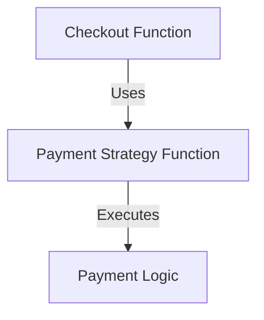

## 15.2 The Strategy Pattern in Functional Context

The Strategy Pattern is a behavioral design pattern that enables selecting an algorithm's behavior at runtime. In traditional object-oriented programming (OOP), this pattern is implemented by defining a family of algorithms, encapsulating each one, and making them interchangeable. This allows the algorithm to vary independently from the clients that use it.

### Strategy Pattern Basics

In Java, the Strategy Pattern is typically implemented using interfaces and classes. Here's a brief overview of how it works:

- **Intent**: Define a family of algorithms, encapsulate each one, and make them interchangeable. Strategy lets the algorithm vary independently from clients that use it.
- **Key Participants**:
  - **Strategy Interface**: Declares an interface common to all supported algorithms.
  - **Concrete Strategies**: Implement the algorithm using the Strategy interface.
  - **Context**: Maintains a reference to a Strategy object and delegates the algorithm to the Strategy object.

#### Java Example

Let's consider a simple example in Java where we have a `PaymentStrategy` interface and different payment methods like `CreditCardPayment` and `PayPalPayment`.

```java
// Strategy Interface
public interface PaymentStrategy {
    void pay(int amount);
}

// Concrete Strategy 1
public class CreditCardPayment implements PaymentStrategy {
    @Override
    public void pay(int amount) {
        System.out.println("Paid " + amount + " using Credit Card.");
    }
}

// Concrete Strategy 2
public class PayPalPayment implements PaymentStrategy {
    @Override
    public void pay(int amount) {
        System.out.println("Paid " + amount + " using PayPal.");
    }
}

// Context
public class ShoppingCart {
    private PaymentStrategy paymentStrategy;

    public void setPaymentStrategy(PaymentStrategy paymentStrategy) {
        this.paymentStrategy = paymentStrategy;
    }

    public void checkout(int amount) {
        paymentStrategy.pay(amount);
    }
}
```

In this example, the `ShoppingCart` class can use different payment strategies without changing its code.

### Functional Implementation in Clojure

In functional programming, particularly in Clojure, the Strategy Pattern is naturally implemented using higher-order functions. Instead of creating interfaces and classes, we pass functions as parameters to achieve the same flexibility.

#### Clojure Example

Let's translate the Java example into Clojure using functions:

```clojure
;; Define payment strategies as functions
(defn credit-card-payment [amount]
  (println (str "Paid " amount " using Credit Card.")))

(defn paypal-payment [amount]
  (println (str "Paid " amount " using PayPal.")))

;; Context function that takes a payment strategy
(defn checkout [payment-strategy amount]
  (payment-strategy amount))

;; Usage
(checkout credit-card-payment 100)
(checkout paypal-payment 200)
```

In this Clojure example, `credit-card-payment` and `paypal-payment` are functions that encapsulate the payment logic. The `checkout` function takes a payment strategy function and an amount, demonstrating the Strategy Pattern in a functional context.

### Advantages of Functional Strategy Pattern

Implementing the Strategy Pattern using functions in Clojure offers several advantages:

- **Simplicity**: The code is more concise and easier to understand without the boilerplate of interfaces and classes.
- **Flexibility**: Functions can be easily passed around and composed, allowing for dynamic behavior changes.
- **Ease of Testing**: Functions are inherently easier to test due to their stateless nature and lack of side effects.

### Visualizing the Strategy Pattern

To better understand how the Strategy Pattern works in Clojure, let's visualize the flow of data and function calls.



**Diagram Description**: This diagram illustrates how the `checkout` function uses a payment strategy function to execute the payment logic. The strategy function is passed as an argument, allowing for flexible and interchangeable behavior.

### Try It Yourself

To deepen your understanding, try modifying the Clojure example:

1. **Add a new payment method**: Implement a new payment strategy function, such as `bank-transfer-payment`.
2. **Change the checkout logic**: Modify the `checkout` function to apply a discount before executing the payment strategy.
3. **Test different scenarios**: Use different payment strategies and amounts to see how the behavior changes.

### Knowledge Check

Let's reinforce what we've learned with a few questions:

- What is the primary purpose of the Strategy Pattern?
- How does Clojure's use of functions simplify the implementation of the Strategy Pattern?
- What are the benefits of using higher-order functions in implementing design patterns?

### Conclusion

The Strategy Pattern in Clojure exemplifies how functional programming can simplify traditional design patterns. By leveraging higher-order functions, we can create flexible, testable, and concise code. This approach not only aligns with functional programming principles but also enhances the scalability and maintainability of applications.

### Further Reading

For more information on Clojure and functional programming, consider exploring these resources:

- [Official Clojure Documentation](https://clojure.org/reference)
- [ClojureDocs](https://clojuredocs.org/)
- [Functional Programming in Clojure](https://www.braveclojure.com/)

Now that we've explored the Strategy Pattern in a functional context, let's continue to apply these concepts to build scalable and efficient applications.

## Quiz: Mastering the Strategy Pattern in Functional Programming



### What is the primary purpose of the Strategy Pattern?

- [x] To define a family of algorithms and make them interchangeable
- [ ] To encapsulate object creation logic
- [ ] To provide a way to access elements of a collection sequentially
- [ ] To ensure a class has only one instance

> **Explanation:** The Strategy Pattern is used to define a family of algorithms, encapsulate each one, and make them interchangeable, allowing the algorithm to vary independently from clients that use it.

### How does Clojure implement the Strategy Pattern differently from Java?

- [x] By using higher-order functions instead of interfaces and classes
- [ ] By using macros to define strategies
- [ ] By using multimethods for dispatching
- [ ] By using records to encapsulate strategies

> **Explanation:** Clojure uses higher-order functions to implement the Strategy Pattern, allowing functions to be passed as parameters to achieve interchangeable behavior without the need for interfaces and classes.

### What is a key advantage of using functions for the Strategy Pattern in Clojure?

- [x] Functions are easier to test due to their stateless nature
- [ ] Functions require more boilerplate code
- [ ] Functions are less flexible than classes
- [ ] Functions cannot be composed

> **Explanation:** Functions are easier to test because they are stateless and do not have side effects, making them ideal for implementing the Strategy Pattern in a functional context.

### Which of the following is a benefit of the Strategy Pattern?

- [x] It allows algorithms to vary independently from clients
- [ ] It reduces the number of classes in a program
- [ ] It simplifies object creation
- [ ] It provides a way to iterate over collections

> **Explanation:** The Strategy Pattern allows algorithms to vary independently from clients that use them, providing flexibility and interchangeability.

### In Clojure, how can you modify the behavior of a function at runtime?

- [x] By passing different functions as arguments
- [ ] By using macros to change the function definition
- [ ] By modifying the function's metadata
- [ ] By using dynamic variables

> **Explanation:** In Clojure, you can modify the behavior of a function at runtime by passing different functions as arguments, allowing for dynamic behavior changes.

### What is a higher-order function?

- [x] A function that takes other functions as arguments or returns a function
- [ ] A function that is defined at a higher level of abstraction
- [ ] A function that is more complex than others
- [ ] A function that is executed in parallel

> **Explanation:** A higher-order function is one that takes other functions as arguments or returns a function, enabling flexible and dynamic behavior in functional programming.

### How can you test different strategies in Clojure?

- [x] By passing different functions to a context function and observing the output
- [ ] By using a testing framework to simulate different strategies
- [ ] By creating mock objects for each strategy
- [ ] By using reflection to inspect strategy implementations

> **Explanation:** In Clojure, you can test different strategies by passing different functions to a context function and observing the output, allowing for easy testing of interchangeable behaviors.

### What is the role of the context in the Strategy Pattern?

- [x] To maintain a reference to a strategy and delegate algorithm execution
- [ ] To define the interface for all strategies
- [ ] To implement the algorithm for each strategy
- [ ] To provide a default strategy implementation

> **Explanation:** The context in the Strategy Pattern maintains a reference to a strategy and delegates the algorithm execution to the strategy object or function.

### How does the Strategy Pattern enhance code flexibility?

- [x] By allowing algorithms to be changed without modifying the client code
- [ ] By reducing the number of classes in a program
- [ ] By simplifying object creation
- [ ] By providing a way to iterate over collections

> **Explanation:** The Strategy Pattern enhances code flexibility by allowing algorithms to be changed without modifying the client code, enabling dynamic behavior changes.

### True or False: In Clojure, the Strategy Pattern requires defining interfaces and classes.

- [ ] True
- [x] False

> **Explanation:** False. In Clojure, the Strategy Pattern is implemented using higher-order functions, eliminating the need for interfaces and classes.


