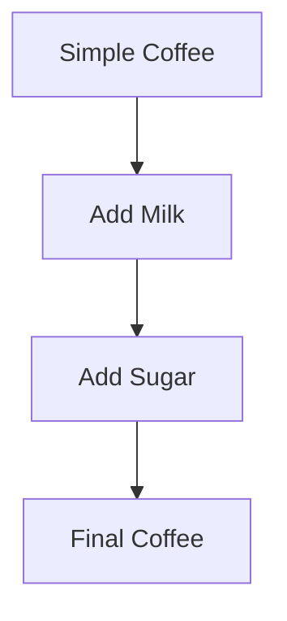

## 15.3 Applying the Decorator Pattern Functionally

In this section, we will delve into the Decorator Pattern and explore how it can be applied functionally in Clojure. As experienced Java developers, you may be familiar with the traditional object-oriented approach to the Decorator Pattern. Here, we'll contrast that with a functional approach, leveraging Clojure's powerful features like higher-order functions and immutability.

### Decorator Pattern Explained

The Decorator Pattern is a structural design pattern used to add new behavior to objects dynamically. In Java, this is typically achieved by creating a set of decorator classes that wrap the original object, allowing for additional functionality without modifying the object's code.

#### Java Example of the Decorator Pattern

Let's consider a simple example in Java where we have a `Coffee` interface and a `SimpleCoffee` class. We can add functionality like milk or sugar using decorators.

```java
interface Coffee {
    double cost();
    String description();
}

class SimpleCoffee implements Coffee {
    public double cost() {
        return 5.0;
    }

    public String description() {
        return "Simple Coffee";
    }
}

class MilkDecorator implements Coffee {
    private final Coffee coffee;

    public MilkDecorator(Coffee coffee) {
        this.coffee = coffee;
    }

    public double cost() {
        return coffee.cost() + 1.5;
    }

    public String description() {
        return coffee.description() + ", Milk";
    }
}

class SugarDecorator implements Coffee {
    private final Coffee coffee;

    public SugarDecorator(Coffee coffee) {
        this.coffee = coffee;
    }

    public double cost() {
        return coffee.cost() + 0.5;
    }

    public String description() {
        return coffee.description() + ", Sugar";
    }
}
```

In this example, `MilkDecorator` and `SugarDecorator` are used to add milk and sugar to the coffee, respectively.

### Functional Approach

In functional programming, we can achieve similar behavior using higher-order functions. Instead of wrapping objects, we compose functions to add behavior. This approach is more flexible and aligns with the principles of immutability and function composition.

#### Clojure Example of the Decorator Pattern

Let's translate the coffee example into Clojure using a functional approach.

```clojure
(defn simple-coffee []
  {:cost 5.0 :description "Simple Coffee"})

(defn add-milk [coffee]
  (update coffee :cost + 1.5)
  (update coffee :description #(str % ", Milk")))

(defn add-sugar [coffee]
  (update coffee :cost + 0.5)
  (update coffee :description #(str % ", Sugar")))

;; Usage
(def coffee (-> (simple-coffee)
                add-milk
                add-sugar))

(println (:cost coffee))        ;; 7.0
(println (:description coffee)) ;; "Simple Coffee, Milk, Sugar"
```

In this Clojure example, we define functions `add-milk` and `add-sugar` that take a coffee map and return a new map with updated cost and description. We use the threading macro `->` to apply these functions in sequence, demonstrating function composition.

### Higher-Order Functions

Higher-order functions are functions that take other functions as arguments or return them as results. They are a cornerstone of functional programming and enable powerful abstractions like the Decorator Pattern.

#### Modifying Behavior with Higher-Order Functions

Let's explore how we can use higher-order functions to modify or enhance the behavior of other functions.

```clojure
(defn with-logging [f]
  (fn [& args]
    (println "Calling function with args:" args)
    (let [result (apply f args)]
      (println "Function returned:" result)
      result)))

(defn add [x y]
  (+ x y))

(def logged-add (with-logging add))

(logged-add 2 3) ;; Logs: Calling function with args: (2 3)
                 ;;       Function returned: 5
```

In this example, `with-logging` is a higher-order function that takes a function `f` and returns a new function that logs its arguments and result. We apply it to the `add` function to create `logged-add`, which logs its operations.

### Examples: Adding Logging and Caching

Let's look at more examples of using higher-order functions to add logging and caching to functions.

#### Adding Logging

```clojure
(defn with-logging [f]
  (fn [& args]
    (println "Calling function with args:" args)
    (let [result (apply f args)]
      (println "Function returned:" result)
      result)))

(defn multiply [x y]
  (* x y))

(def logged-multiply (with-logging multiply))

(logged-multiply 4 5) ;; Logs: Calling function with args: (4 5)
                      ;;       Function returned: 20
```

#### Adding Caching

```clojure
(defn with-caching [f]
  (let [cache (atom {})]
    (fn [& args]
      (if-let [cached-result (get @cache args)]
        cached-result
        (let [result (apply f args)]
          (swap! cache assoc args result)
          result)))))

(defn expensive-computation [x]
  (Thread/sleep 1000) ;; Simulate a long computation
  (* x x))

(def cached-computation (with-caching expensive-computation))

(cached-computation 10) ;; Takes time on first call
(cached-computation 10) ;; Returns instantly on subsequent calls
```

In the caching example, `with-caching` is a higher-order function that uses an atom to store results of previous computations. This way, repeated calls with the same arguments return cached results, improving performance.

### Visualizing Function Composition

To better understand how function composition works in Clojure, let's visualize the flow of data through these composed functions.



**Diagram Description:** This flowchart illustrates how the `simple-coffee` function is transformed by `add-milk` and `add-sugar`, resulting in the final coffee with added milk and sugar.

### Key Takeaways

- **Decorator Pattern in Functional Programming**: In functional programming, we use function composition to achieve the same dynamic behavior addition as the Decorator Pattern in object-oriented programming.
- **Higher-Order Functions**: These are essential tools for modifying and enhancing function behavior, allowing for flexible and reusable code.
- **Clojure's Immutability**: By leveraging immutable data structures, we ensure that our functions are pure and side-effect-free, which is a key advantage over traditional object-oriented approaches.

### Try It Yourself

Experiment with the provided code examples by modifying the `add-milk` and `add-sugar` functions to add different ingredients or change their costs. Try creating your own higher-order functions to add other behaviors, such as timing the execution of functions or handling errors gracefully.

### Knowledge Check

To reinforce your understanding, let's test your knowledge with a quiz.

## Mastering the Decorator Pattern Functionally in Clojure Quiz



### What is the primary purpose of the Decorator Pattern?

- [x] To add behavior to objects dynamically
- [ ] To create a new class hierarchy
- [ ] To encapsulate object creation
- [ ] To simplify object interfaces

> **Explanation:** The Decorator Pattern is used to add new behavior to objects dynamically without altering their structure.

### How does the functional approach to the Decorator Pattern differ from the object-oriented approach?

- [x] It uses function composition instead of wrapping objects
- [ ] It requires creating multiple classes
- [ ] It relies on inheritance
- [ ] It does not support dynamic behavior addition

> **Explanation:** In functional programming, we use function composition to add behavior, avoiding the need for wrapping objects as in object-oriented programming.

### What is a higher-order function?

- [x] A function that takes other functions as arguments or returns them
- [ ] A function that is defined inside another function
- [ ] A function that operates on numbers
- [ ] A function that is called recursively

> **Explanation:** Higher-order functions are functions that can take other functions as arguments or return them as results, enabling powerful abstractions.

### Which Clojure feature ensures that functions remain pure and side-effect-free?

- [x] Immutability
- [ ] Macros
- [ ] Multimethods
- [ ] Protocols

> **Explanation:** Immutability in Clojure ensures that data structures cannot be modified, keeping functions pure and side-effect-free.

### What is the purpose of the `with-caching` higher-order function in the example?

- [x] To store results of previous computations for faster access
- [ ] To log function calls
- [ ] To handle errors
- [ ] To modify function arguments

> **Explanation:** The `with-caching` function stores results of previous computations in a cache, allowing for faster access on subsequent calls with the same arguments.

### How can you visualize the flow of data through composed functions in Clojure?

- [x] Using flowcharts
- [ ] Using UML diagrams
- [ ] Using class diagrams
- [ ] Using sequence diagrams

> **Explanation:** Flowcharts can be used to visualize the flow of data through composed functions, illustrating how functions transform data step by step.

### What is the benefit of using the threading macro `->` in Clojure?

- [x] It allows for cleaner and more readable function composition
- [ ] It enables parallel execution of functions
- [ ] It simplifies error handling
- [ ] It automatically caches function results

> **Explanation:** The threading macro `->` allows for cleaner and more readable function composition by threading the result of one function call into the next.

### Which of the following is NOT a benefit of using higher-order functions?

- [ ] They enable code reuse
- [ ] They allow for dynamic behavior modification
- [x] They require less memory
- [ ] They promote function composition

> **Explanation:** While higher-order functions enable code reuse, dynamic behavior modification, and promote function composition, they do not inherently require less memory.

### What is the role of the `atom` in the `with-caching` function?

- [x] To store cached results
- [ ] To log function calls
- [ ] To handle errors
- [ ] To modify function arguments

> **Explanation:** The `atom` is used to store cached results, allowing the `with-caching` function to return previously computed results quickly.

### True or False: Function composition in Clojure can replace the need for object-oriented design patterns like the Decorator Pattern.

- [x] True
- [ ] False

> **Explanation:** True. Function composition in Clojure can effectively replace the need for object-oriented design patterns like the Decorator Pattern by dynamically adding behavior to functions.



By mastering the functional approach to the Decorator Pattern in Clojure, you can create flexible, reusable, and efficient code that leverages the full power of functional programming. Keep experimenting with higher-order functions and function composition to enhance your Clojure skills and build scalable applications.
