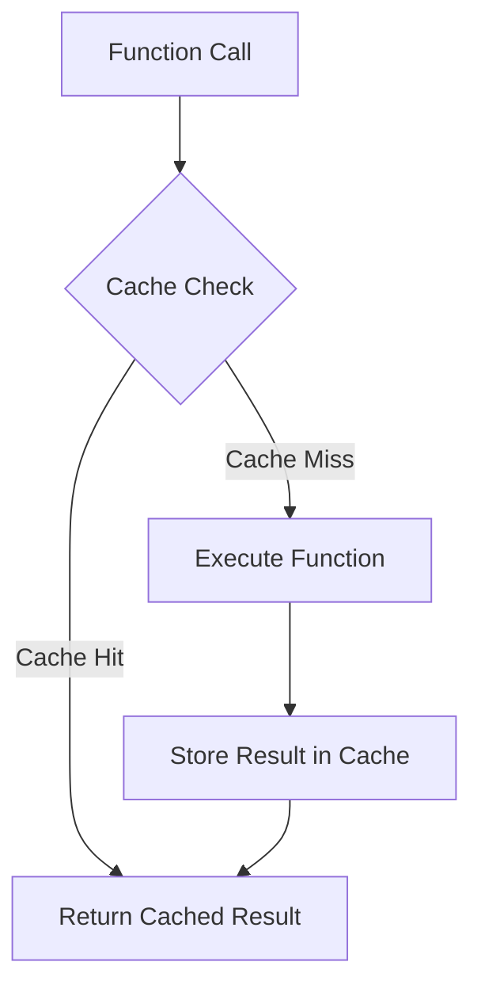

## 15.6 Memoization Techniques

Memoization is a powerful technique used in functional programming to optimize performance by caching the results of expensive function calls and reusing them when the same inputs occur again. This can significantly reduce computation time, especially in recursive functions or functions with costly operations. In this section, we will explore memoization in Clojure, including the built-in `memoize` function, custom memoization strategies, and practical use cases. We will also discuss the limitations and considerations when using memoization.

### Purpose of Memoization

Memoization is particularly useful in scenarios where functions are deterministic, meaning they produce the same output for the same input every time. By storing the results of these function calls, we can avoid redundant calculations, thereby improving the efficiency of our programs.

#### Key Benefits of Memoization:

- **Performance Optimization**: Reduces the time complexity of functions by avoiding repeated calculations.
- **Resource Efficiency**: Saves computational resources, which is crucial in large-scale applications.
- **Enhanced Responsiveness**: Improves the responsiveness of applications, particularly those with recursive or computationally intensive functions.

### Clojure's `memoize` Function

Clojure provides a built-in `memoize` function that makes it easy to apply memoization to any function. This function wraps another function and caches its results based on the arguments it receives.

#### Using `memoize` in Clojure

Let's start by looking at a simple example of how to use the `memoize` function in Clojure:

```clojure
(defn slow-fib [n]
  (if (<= n 1)
    n
    (+ (slow-fib (- n 1)) (slow-fib (- n 2)))))

(def memoized-fib (memoize slow-fib))

;; Usage
(memoized-fib 40) ;; Much faster than calling slow-fib directly
```

In this example, `slow-fib` is a naive recursive implementation of the Fibonacci sequence. Without memoization, this function recalculates the same values multiple times, leading to exponential time complexity. By wrapping it with `memoize`, we cache the results of each call, drastically improving performance.

#### How `memoize` Works

The `memoize` function creates a cache (typically a map) that stores the results of function calls. When the memoized function is called with a set of arguments, it first checks if the result is already in the cache. If it is, the cached result is returned. If not, the function is executed, and the result is stored in the cache for future use.

### Implementing Custom Memoization

While Clojure's `memoize` function is convenient, there are scenarios where custom memoization strategies might be necessary. Custom implementations allow for more control over the caching mechanism, such as specifying cache size, eviction policies, or handling complex data types.

#### Custom Memoization Strategy

Let's implement a custom memoization function that allows us to specify a maximum cache size:

```clojure
(defn custom-memoize [f max-size]
  (let [cache (atom {})]
    (fn [& args]
      (if-let [cached-result (get @cache args)]
        cached-result
        (let [result (apply f args)]
          (swap! cache
                 (fn [c]
                   (if (>= (count c) max-size)
                     (dissoc c (first (keys c)))
                     c))
                 (assoc args result))
          result)))))

(def custom-memoized-fib (custom-memoize slow-fib 100))

;; Usage
(custom-memoized-fib 40) ;; Uses custom memoization with a cache size of 100
```

In this example, `custom-memoize` creates an atom to store the cache and limits its size to `max-size`. When the cache exceeds this size, the oldest entry is removed. This approach provides more flexibility in managing the cache.

### Use Cases for Memoization

Memoization is particularly beneficial in scenarios involving:

- **Recursive Functions**: Functions like the Fibonacci sequence, factorial calculations, or dynamic programming problems.
- **Expensive Calculations**: Functions that involve complex computations or data processing.
- **Repeated Function Calls**: Functions that are called frequently with the same arguments.

#### Example: Optimizing Recursive Functions

Consider a function that calculates the nth Fibonacci number. Without memoization, the function recalculates the same values multiple times, leading to inefficiency. By applying memoization, we can optimize this process:

```clojure
(defn fib [n]
  (if (<= n 1)
    n
    (+ (fib (- n 1)) (fib (- n 2)))))

(def memoized-fib (memoize fib))

;; Usage
(memoized-fib 50) ;; Efficiently calculates the 50th Fibonacci number
```

In this example, memoization drastically reduces the number of recursive calls, improving performance from exponential to linear time complexity.

### Limitations and Considerations

While memoization can significantly enhance performance, it is essential to consider its limitations and potential pitfalls:

- **Memory Consumption**: Caching results can lead to increased memory usage, especially for functions with a large number of unique inputs.
- **Cache Invalidation**: In some cases, cached results may become stale or invalid, requiring a strategy for cache invalidation.
- **Thread Safety**: In concurrent environments, care must be taken to ensure that the cache is accessed and modified safely.

#### Memory Consumption

Memoization stores results in memory, which can be problematic if the function has a large input space. It's crucial to monitor memory usage and implement strategies to manage cache size, such as using a least-recently-used (LRU) eviction policy.

#### Cache Invalidation

In scenarios where the underlying data or logic changes, cached results may become outdated. Implementing a mechanism to invalidate or refresh the cache can help maintain accuracy.

#### Thread Safety

In multi-threaded applications, ensure that the cache is thread-safe. Clojure's `atom` provides a simple way to manage state changes safely, but more complex scenarios may require additional synchronization mechanisms.

### Visualizing Memoization

To better understand how memoization works, let's visualize the process using a flowchart:



**Figure 1**: Memoization Flowchart - This diagram illustrates the process of checking the cache before executing the function and storing the result for future use.

### Try It Yourself

Experiment with the provided code examples by modifying the cache size or implementing different eviction policies. Observe how these changes affect performance and memory usage.

### Knowledge Check

To reinforce your understanding of memoization techniques, try answering the following questions:

1. What is the primary purpose of memoization in functional programming?
2. How does Clojure's `memoize` function improve performance?
3. What are some potential limitations of using memoization?
4. How can custom memoization strategies provide more control over caching?
5. In what scenarios is memoization particularly beneficial?

### Summary

Memoization is a valuable technique in functional programming, offering significant performance improvements by caching function results. Clojure's built-in `memoize` function provides a simple way to apply memoization, while custom strategies offer more control. However, it is essential to consider memory consumption, cache invalidation, and thread safety when implementing memoization.

By understanding and applying memoization techniques, you can optimize your Clojure applications, making them more efficient and responsive. Continue exploring these concepts and experiment with different strategies to find the best fit for your specific use cases.

## Quiz: Mastering Memoization Techniques in Clojure



### What is the primary purpose of memoization in functional programming?

- [x] To optimize performance by caching function results
- [ ] To improve code readability
- [ ] To enhance security
- [ ] To simplify code syntax

> **Explanation:** Memoization is used to cache the results of expensive function calls, optimizing performance by avoiding redundant calculations.

### How does Clojure's `memoize` function work?

- [x] It caches function results based on input arguments
- [ ] It modifies the function to run faster
- [ ] It compiles the function to machine code
- [ ] It reduces the function's memory usage

> **Explanation:** Clojure's `memoize` function wraps another function and caches its results based on the arguments it receives, improving performance by reusing cached results.

### What is a potential limitation of memoization?

- [x] Increased memory consumption
- [ ] Decreased code readability
- [ ] Reduced security
- [ ] Slower execution time

> **Explanation:** Memoization can lead to increased memory usage due to caching results, especially for functions with a large number of unique inputs.

### Why might you implement a custom memoization strategy?

- [x] To have more control over cache size and eviction policies
- [ ] To make the code more complex
- [ ] To reduce the function's execution time
- [ ] To improve code readability

> **Explanation:** Custom memoization strategies allow for more control over the caching mechanism, such as specifying cache size and eviction policies.

### In which scenario is memoization particularly beneficial?

- [x] Recursive functions
- [ ] Simple arithmetic operations
- [ ] String concatenation
- [ ] File I/O operations

> **Explanation:** Memoization is beneficial in recursive functions, where it can significantly reduce the number of redundant calculations.

### What is a common strategy for managing cache size in custom memoization?

- [x] Implementing a least-recently-used (LRU) eviction policy
- [ ] Increasing the cache size indefinitely
- [ ] Using a fixed-size cache without eviction
- [ ] Disabling caching for certain inputs

> **Explanation:** An LRU eviction policy helps manage cache size by removing the least recently used entries when the cache exceeds its limit.

### How can you ensure thread safety in a memoized function?

- [x] Use Clojure's `atom` to manage cache state
- [ ] Disable caching in multi-threaded environments
- [ ] Use global variables for caching
- [ ] Avoid using memoization altogether

> **Explanation:** Clojure's `atom` provides a thread-safe way to manage state changes, ensuring that the cache is accessed and modified safely in concurrent environments.

### What is a potential drawback of using memoization in a dynamic environment?

- [x] Cached results may become stale or invalid
- [ ] It can lead to slower execution times
- [ ] It makes the code harder to read
- [ ] It reduces the function's accuracy

> **Explanation:** In dynamic environments, cached results may become outdated, requiring a strategy for cache invalidation to maintain accuracy.

### What is the time complexity improvement when using memoization in a naive recursive Fibonacci function?

- [x] From exponential to linear
- [ ] From linear to constant
- [ ] From constant to logarithmic
- [ ] From logarithmic to exponential

> **Explanation:** Memoization reduces the time complexity of a naive recursive Fibonacci function from exponential to linear by caching previously computed results.

### True or False: Memoization is only useful for recursive functions.

- [ ] True
- [x] False

> **Explanation:** While memoization is particularly beneficial for recursive functions, it can also be useful for any deterministic function with expensive or repeated calculations.


