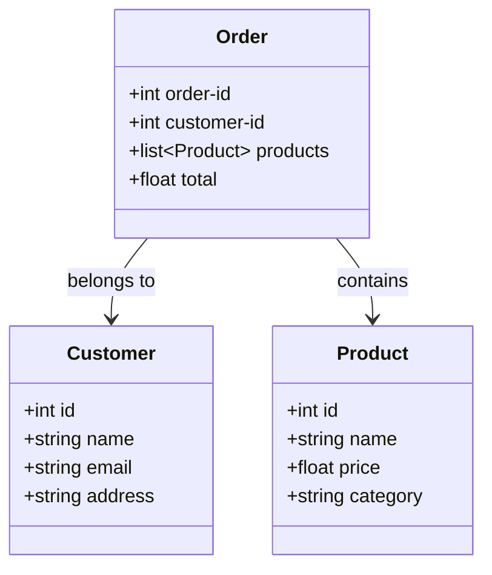

## 15.7 Functional Domain Modeling

In this section, we delve into the art of functional domain modeling using Clojure. As experienced Java developers, you are likely familiar with object-oriented domain modeling, where classes and objects are used to represent entities and their behaviors. In contrast, functional domain modeling emphasizes the use of data structures and pure functions to represent and manipulate business domains. This approach not only aligns with the principles of functional programming but also offers significant advantages in terms of scalability, maintainability, and simplicity.

### Modeling with Data

Functional domain modeling begins with the premise that data is central to representing a business domain. In Clojure, data structures such as maps, vectors, and sets are used to model entities and their relationships. This approach contrasts with Java's class-based modeling, where behavior and state are encapsulated within objects.

#### Emphasizing Data Structures

In Clojure, we model domains using data structures that are both flexible and expressive. Let's consider an example of modeling an e-commerce system. In a typical e-commerce domain, we have entities such as `Product`, `Customer`, and `Order`. Each of these entities can be represented using Clojure's data structures.

```clojure
(def product
  {:id 101
   :name "Laptop"
   :price 999.99
   :category "Electronics"})

(def customer
  {:id 202
   :name "Alice"
   :email "alice@example.com"
   :address "123 Elm Street"})

(def order
  {:order-id 303
   :customer-id 202
   :products [{:product-id 101 :quantity 1}]
   :total 999.99})
```

In this example, we use maps to represent entities. Each map contains key-value pairs that describe the attributes of the entity. This approach is simple yet powerful, allowing us to easily manipulate and transform data.

#### Advantages of Data-Centric Modeling

1. **Simplicity**: Using data structures to model domains reduces complexity by separating data from behavior. This separation makes it easier to reason about the system and understand how data flows through it.

2. **Flexibility**: Data structures are inherently flexible, allowing us to easily modify and extend models without the need for complex inheritance hierarchies or design patterns.

3. **Interoperability**: Data structures can be easily serialized and deserialized, making them ideal for communication between different parts of a system or across network boundaries.

### Pure Functions for Business Logic

In functional domain modeling, business logic is expressed as pure functions that operate on data models. Pure functions are deterministic and side-effect-free, making them easier to test, debug, and reason about.

#### Writing Pure Functions

Let's continue with our e-commerce example and write a pure function to calculate the total price of an order.

```clojure
(defn calculate-total
  [order products]
  (reduce
    (fn [total {:keys [product-id quantity]}]
      (let [product (some #(when (= (:id %) product-id) %) products)]
        (+ total (* (:price product) quantity))))
    0
    (:products order)))
```

In this function, `calculate-total` takes an `order` and a list of `products` as arguments. It uses `reduce` to iterate over the products in the order, calculating the total price by multiplying the price of each product by its quantity. This function is pure because it does not modify any external state and always produces the same output for the same input.

#### Benefits of Pure Functions

1. **Testability**: Pure functions are easy to test because they do not depend on external state. We can write unit tests that verify the correctness of the function by providing known inputs and checking the outputs.

2. **Composability**: Pure functions can be composed to build more complex operations. This composability allows us to build complex business logic by combining simple functions.

3. **Predictability**: Pure functions are predictable and reliable, reducing the likelihood of bugs and making the system more robust.

### Immutability in Models

Immutability is a cornerstone of functional programming and plays a crucial role in functional domain modeling. In Clojure, data structures are immutable by default, meaning that once they are created, they cannot be changed. Instead, any modification results in a new data structure.

#### Benefits of Immutability

1. **Thread Safety**: Immutable data structures are inherently thread-safe, eliminating the need for locks or synchronization when accessing shared data in concurrent applications.

2. **Consistency**: Immutability ensures that data remains consistent throughout its lifecycle, reducing the risk of unintended side effects and making it easier to reason about the system.

3. **Ease of Debugging**: Immutable data structures simplify debugging by ensuring that data does not change unexpectedly. This predictability makes it easier to trace the flow of data and identify the source of errors.

#### Example: Updating an Order

Let's see how immutability works in practice by updating an order in our e-commerce system.

```clojure
(defn add-product-to-order
  [order product-id quantity]
  (update order :products conj {:product-id product-id :quantity quantity}))

(def updated-order
  (add-product-to-order order 102 2))
```

In this example, `add-product-to-order` is a pure function that takes an `order`, a `product-id`, and a `quantity` as arguments. It uses `update` to add a new product to the order's products list. The original `order` remains unchanged, and a new `updated-order` is returned.

### Examples: Modeling an E-commerce System

To illustrate functional domain modeling in action, let's build a simple e-commerce system using Clojure. We'll model the domain using data structures, implement business logic as pure functions, and leverage immutability to ensure consistency and thread safety.

#### Defining the Domain

We'll start by defining the core entities of our e-commerce system: `Product`, `Customer`, and `Order`.

```clojure
(def products
  [{:id 101 :name "Laptop" :price 999.99 :category "Electronics"}
   {:id 102 :name "Smartphone" :price 499.99 :category "Electronics"}
   {:id 103 :name "Headphones" :price 199.99 :category "Accessories"}])

(def customers
  [{:id 201 :name "Alice" :email "alice@example.com" :address "123 Elm Street"}
   {:id 202 :name "Bob" :email "bob@example.com" :address "456 Oak Avenue"}])

(def orders
  [{:order-id 301 :customer-id 201 :products [{:product-id 101 :quantity 1}] :total 999.99}
   {:order-id 302 :customer-id 202 :products [{:product-id 102 :quantity 2}] :total 999.98}])
```

#### Implementing Business Logic

Next, we'll implement some business logic using pure functions. We'll start with a function to find a customer by their ID.

```clojure
(defn find-customer
  [customers customer-id]
  (some #(when (= (:id %) customer-id) %) customers))
```

This function uses `some` to iterate over the list of customers and return the customer with the matching ID.

#### Calculating Order Totals

We'll also implement a function to calculate the total price of an order, as we did earlier.

```clojure
(defn calculate-order-total
  [order products]
  (reduce
    (fn [total {:keys [product-id quantity]}]
      (let [product (some #(when (= (:id %) product-id) %) products)]
        (+ total (* (:price product) quantity))))
    0
    (:products order)))
```

#### Updating Orders

Finally, we'll implement a function to add a product to an order, demonstrating immutability in action.

```clojure
(defn add-product
  [order product-id quantity]
  (update order :products conj {:product-id product-id :quantity quantity}))

(def updated-order
  (add-product (first orders) 103 1))
```

### Visualizing Functional Domain Modeling

To better understand the flow of data and the relationships between entities in our e-commerce system, let's visualize the domain model using a diagram.



This diagram represents the relationships between `Product`, `Customer`, and `Order` in our e-commerce system. Each `Order` belongs to a `Customer` and contains one or more `Products`.

### Key Takeaways

- **Data-Centric Modeling**: Use data structures to represent entities and their relationships, simplifying the domain model and enhancing flexibility.
- **Pure Functions**: Implement business logic as pure functions to improve testability, composability, and predictability.
- **Immutability**: Leverage immutable data structures to ensure thread safety, consistency, and ease of debugging.

### Knowledge Check

To reinforce your understanding of functional domain modeling in Clojure, try answering the following questions and challenges:

1. How does functional domain modeling differ from object-oriented domain modeling?
2. What are the benefits of using data structures to model business domains?
3. Write a pure function to update a customer's email address in the e-commerce system.
4. How does immutability contribute to thread safety in concurrent applications?
5. Modify the `calculate-order-total` function to apply a discount to the total price.

### Encouragement and Next Steps

Now that we've explored functional domain modeling in Clojure, you're well-equipped to apply these concepts to build scalable and maintainable applications. Embrace the power of data-centric modeling, pure functions, and immutability to create robust systems that are easy to reason about and extend. As you continue your journey, consider exploring more advanced topics such as functional design patterns and concurrency models in Clojure.

For further reading, check out the [Official Clojure Documentation](https://clojure.org/reference/documentation) and [ClojureDocs](https://clojuredocs.org/) for more examples and insights into functional programming with Clojure.

## Quiz: Test Your Knowledge on Functional Domain Modeling



### How does functional domain modeling differ from object-oriented domain modeling?

- [x] It uses data structures instead of classes to represent entities.
- [ ] It relies heavily on inheritance and polymorphism.
- [ ] It encapsulates behavior within objects.
- [ ] It uses interfaces to define entity behavior.

> **Explanation:** Functional domain modeling emphasizes using data structures to represent entities, separating data from behavior, unlike object-oriented modeling which encapsulates behavior within objects.

### What is a key benefit of using pure functions in domain modeling?

- [x] Improved testability and predictability.
- [ ] Increased complexity in code.
- [ ] Dependency on external state.
- [ ] Difficulty in composing functions.

> **Explanation:** Pure functions are deterministic and side-effect-free, making them easier to test and predict, which enhances the reliability of the system.

### Why is immutability important in functional domain modeling?

- [x] It ensures thread safety and consistency.
- [ ] It allows for mutable state changes.
- [ ] It complicates debugging.
- [ ] It requires complex synchronization mechanisms.

> **Explanation:** Immutability ensures that data remains consistent and thread-safe, eliminating the need for locks or synchronization in concurrent applications.

### Which Clojure data structure is commonly used to represent entities in domain modeling?

- [x] Maps
- [ ] Classes
- [ ] Arrays
- [ ] Interfaces

> **Explanation:** Maps are commonly used in Clojure to represent entities, as they allow for flexible and expressive modeling of data.

### How can you update an immutable data structure in Clojure?

- [x] By creating a new data structure with the desired changes.
- [ ] By modifying the existing data structure directly.
- [ ] By using synchronized blocks.
- [ ] By applying inheritance.

> **Explanation:** In Clojure, you update an immutable data structure by creating a new one with the desired changes, leaving the original unchanged.

### What is the role of `reduce` in functional programming?

- [x] To aggregate data by applying a function iteratively.
- [ ] To filter data based on a predicate.
- [ ] To map data to a new form.
- [ ] To create side effects.

> **Explanation:** `reduce` is used to aggregate data by applying a function iteratively, combining elements into a single result.

### How does functional domain modeling enhance flexibility?

- [x] By allowing easy modification and extension of models.
- [ ] By enforcing strict class hierarchies.
- [ ] By limiting the use of data structures.
- [ ] By requiring complex design patterns.

> **Explanation:** Functional domain modeling enhances flexibility by using data structures that can be easily modified and extended without complex hierarchies.

### What is a common use case for pure functions in domain modeling?

- [x] Implementing business logic.
- [ ] Managing mutable state.
- [ ] Creating side effects.
- [ ] Synchronizing threads.

> **Explanation:** Pure functions are ideal for implementing business logic as they are deterministic and side-effect-free, ensuring reliable operations.

### How does immutability simplify debugging?

- [x] By ensuring data does not change unexpectedly.
- [ ] By allowing direct modification of data.
- [ ] By introducing complex synchronization.
- [ ] By creating mutable state.

> **Explanation:** Immutability ensures that data does not change unexpectedly, making it easier to trace and debug the flow of data in the system.

### True or False: Functional domain modeling in Clojure relies on encapsulating behavior within objects.

- [ ] True
- [x] False

> **Explanation:** False. Functional domain modeling in Clojure separates data from behavior, using data structures and pure functions instead of encapsulating behavior within objects.


