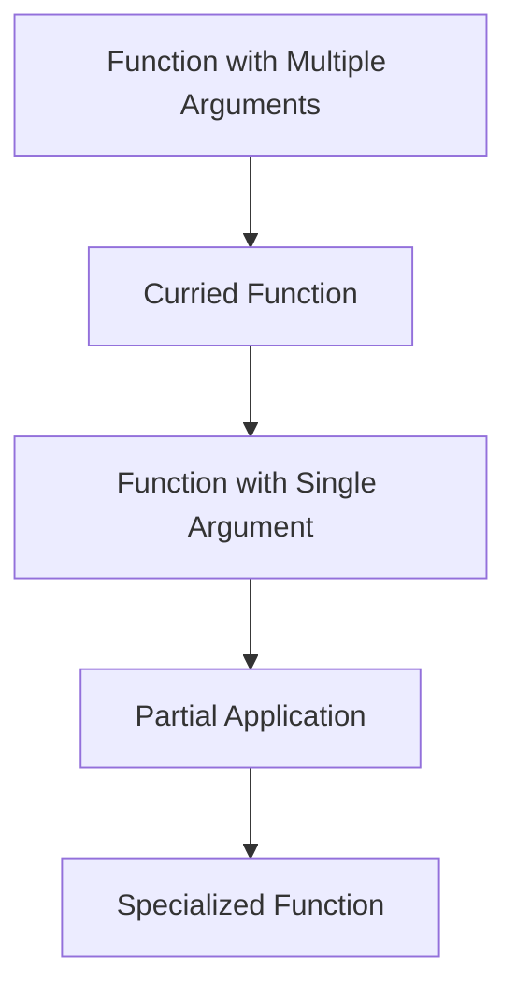

## 15.8 Currying and Partial Application Techniques

As experienced Java developers, you are likely familiar with the concept of functions and methods that take multiple arguments. In functional programming, particularly in Clojure, we often encounter the concepts of **currying** and **partial application**. These techniques allow us to transform functions and enhance their reusability and readability. In this section, we will explore these concepts in depth, providing you with the knowledge to leverage them effectively in your Clojure applications.

### Currying Explained

**Currying** is a functional programming technique that transforms a function with multiple arguments into a sequence of functions, each taking a single argument. This transformation allows for more flexible function composition and reuse.

#### Understanding Currying

In Java, a typical method might look like this:

```java
public int add(int a, int b) {
    return a + b;
}
```

In a curried form, this method would be transformed into a series of functions, each taking one argument:

```java
Function<Integer, Function<Integer, Integer>> curriedAdd = a -> b -> a + b;
```

Here, `curriedAdd` is a function that takes an integer `a` and returns another function that takes an integer `b`, which then returns the sum of `a` and `b`.

#### Currying in Clojure

Clojure does not natively support currying in the same way some other functional languages do, but we can achieve similar behavior using higher-order functions. Here's how you can implement currying in Clojure:

```clojure
(defn curried-add [a]
  (fn [b]
    (+ a b)))

;; Usage
(def add-five (curried-add 5))
(println (add-five 10)) ;; Output: 15
```

In this example, `curried-add` is a function that returns another function. When we call `(curried-add 5)`, it returns a new function that adds 5 to its argument.

### Partial Application

**Partial application** is a related concept where we fix a number of arguments to a function, producing another function of fewer arguments. This is particularly useful for creating specialized functions from more general ones.

#### Partial Application in Java

In Java, partial application can be simulated using anonymous classes or lambdas. Consider the following example:

```java
Function<Integer, Integer> addFive = b -> add(5, b);
```

Here, `addFive` is a partially applied function that always adds 5 to its argument.

#### Partial Application in Clojure

Clojure provides a built-in function `partial` to facilitate partial application:

```clojure
(def add-five (partial + 5))

;; Usage
(println (add-five 10)) ;; Output: 15
```

The `partial` function takes a function and some arguments, returning a new function that takes the remaining arguments.

### Currying in Clojure: Achieving Currying with Higher-Order Functions

While Clojure does not have built-in currying, we can achieve it using higher-order functions. Let's explore how to implement currying manually in Clojure.

#### Implementing Currying

To manually curry a function in Clojure, we can create a higher-order function that returns a series of functions:

```clojure
(defn curry [f]
  (fn [a]
    (fn [b]
      (f a b))))

;; Usage
(def curried-add (curry +))
(def add-five (curried-add 5))
(println (add-five 10)) ;; Output: 15
```

In this example, `curry` is a higher-order function that takes a two-argument function `f` and returns a curried version of it.

### Examples: Enhancing Code Reusability and Readability

Currying and partial application can significantly enhance the reusability and readability of your code. Let's explore some practical examples.

#### Example 1: Filtering with Partial Application

Suppose we have a list of numbers and we want to filter out numbers greater than a certain threshold. We can use partial application to create a reusable filter function:

```clojure
(defn greater-than [threshold]
  (fn [n]
    (> n threshold)))

(def numbers [1 2 3 4 5 6 7 8 9 10])
(def greater-than-five (partial filter (greater-than 5)))

(println (greater-than-five numbers)) ;; Output: (6 7 8 9 10)
```

Here, `greater-than` is a function that returns a predicate function. We use `partial` to create `greater-than-five`, a specialized filter function.

#### Example 2: Currying for Function Composition

Currying can simplify function composition by allowing us to create intermediate functions:

```clojure
(defn multiply [a b]
  (* a b))

(def curried-multiply (curry multiply))
(def double (curried-multiply 2))

(println (double 5)) ;; Output: 10
```

In this example, `curried-multiply` is a curried version of `multiply`, and `double` is a specialized function that doubles its argument.

### Visual Aids

To better understand the flow of data through curried and partially applied functions, let's visualize it using a flowchart.



**Figure 1**: Flowchart illustrating the transformation of a function with multiple arguments into curried and partially applied functions.

### References and Links

For further reading on currying and partial application, consider the following resources:

- [Official Clojure Documentation](https://clojure.org/reference)
- [ClojureDocs](https://clojuredocs.org/)
- [Functional Programming in Clojure](https://www.braveclojure.com/)

### Knowledge Check

To reinforce your understanding of currying and partial application, consider the following questions:

- What is the difference between currying and partial application?
- How can you achieve currying in Clojure?
- Provide an example where partial application improves code readability.

### Encouraging Tone

Now that we've explored currying and partial application techniques in Clojure, let's apply these concepts to enhance the reusability and readability of your functional code. Experiment with these techniques in your projects and see how they can simplify complex logic.

### Best Practices for Tags

- Use specific and relevant tags such as "Clojure", "Functional Programming", "Currying", "Partial Application", "Higher-Order Functions", "Code Reusability", "Java Interoperability", and "Functional Design Patterns".

---

## Quiz: Mastering Currying and Partial Application in Clojure



### What is currying in functional programming?

- [x] Transforming a function with multiple arguments into a sequence of functions with single arguments
- [ ] Combining multiple functions into one
- [ ] Applying a function to all elements in a collection
- [ ] Creating a new function by fixing some arguments

> **Explanation:** Currying transforms a function with multiple arguments into a sequence of functions, each taking a single argument.

### How can you achieve currying in Clojure?

- [x] By using higher-order functions to return a series of functions
- [ ] By using the `curry` function in Clojure
- [ ] By using the `partial` function
- [ ] By using macros

> **Explanation:** Clojure does not have built-in currying, but it can be achieved using higher-order functions to return a series of functions.

### What is partial application?

- [x] Fixing a number of arguments to a function, producing another function of fewer arguments
- [ ] Transforming a function with multiple arguments into a sequence of functions with single arguments
- [ ] Applying a function to all elements in a collection
- [ ] Creating a new function by combining multiple functions

> **Explanation:** Partial application involves fixing some arguments of a function to create a new function with fewer arguments.

### Which Clojure function is used for partial application?

- [x] `partial`
- [ ] `curry`
- [ ] `apply`
- [ ] `map`

> **Explanation:** The `partial` function in Clojure is used to fix some arguments of a function, creating a new function with fewer arguments.

### What is the output of the following Clojure code: `(def add-five (partial + 5)) (add-five 10)`?

- [x] 15
- [ ] 5
- [ ] 10
- [ ] 50

> **Explanation:** The `partial` function creates a new function `add-five` that adds 5 to its argument. `(add-five 10)` results in 15.

### How does currying enhance code reusability?

- [x] By allowing functions to be composed and reused with different arguments
- [ ] By reducing the number of functions needed
- [ ] By making functions immutable
- [ ] By increasing the number of arguments a function can take

> **Explanation:** Currying enhances code reusability by allowing functions to be composed and reused with different arguments.

### What is the main difference between currying and partial application?

- [x] Currying transforms a function into a series of single-argument functions, while partial application fixes some arguments
- [ ] Currying combines functions, while partial application splits them
- [ ] Currying is used for collections, while partial application is used for numbers
- [ ] Currying is a Clojure-specific concept, while partial application is not

> **Explanation:** Currying transforms a function into a series of single-argument functions, while partial application fixes some arguments to create a new function.

### Which of the following is a benefit of using partial application?

- [x] It allows for the creation of specialized functions from general ones
- [ ] It reduces the number of arguments a function can take
- [ ] It increases the complexity of code
- [ ] It is only useful in Clojure

> **Explanation:** Partial application allows for the creation of specialized functions from general ones, enhancing code flexibility and reuse.

### True or False: Currying and partial application are the same concept.

- [ ] True
- [x] False

> **Explanation:** Currying and partial application are related but distinct concepts. Currying transforms a function into a series of single-argument functions, while partial application fixes some arguments to create a new function.


