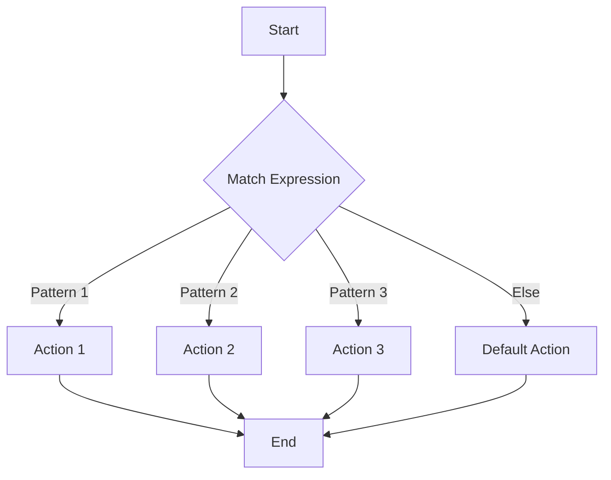

## 15.9 Pattern Matching with `core.match`

### Introduction to Pattern Matching

Pattern matching is a powerful concept in functional programming that allows developers to simplify complex conditional logic by directly expressing the structure of the data they are working with. Unlike traditional conditional statements, such as `if` or `switch` in Java, pattern matching provides a more declarative approach to handling different data forms, making the code more readable and maintainable.

In Clojure, pattern matching is not built into the core language but is available through the `core.match` library. This library extends Clojure's capabilities by allowing developers to match against complex data structures, making it easier to write concise and expressive code.

### Using `core.match`

The [`core.match`](https://github.com/clojure/core.match) library is a powerful tool for pattern matching in Clojure. It allows you to match against various data structures, such as lists, vectors, maps, and even custom data types. By using `core.match`, you can replace verbose conditional logic with clear and concise pattern matching expressions.

To get started with `core.match`, you need to include it in your project dependencies. If you're using Leiningen, add the following to your `project.clj`:

```clojure
:dependencies [[org.clojure/core.match "1.0.0"]]
```

Once you have added the dependency, you can start using `core.match` in your Clojure code.

### Syntax and Features

The syntax of `core.match` is straightforward and intuitive. It uses the `match` macro to define pattern matching expressions. Here's a basic example to illustrate the syntax:

```clojure
(require '[clojure.core.match :refer [match]])

(defn process-message [msg]
  (match msg
    [:text content] (str "Text message: " content)
    [:image url] (str "Image URL: " url)
    [:video url] (str "Video URL: " url)
    :else "Unknown message type"))
```

In this example, the `process-message` function uses `match` to handle different types of messages. The `match` macro takes a value to match against and a series of pattern-action pairs. Each pattern is checked in order, and the corresponding action is executed when a match is found.

#### Matching on Data Structures

One of the key features of `core.match` is its ability to match on complex data structures. This is particularly useful when working with nested data or when you need to destructure data within a pattern. Here's an example:

```clojure
(defn handle-request [request]
  (match request
    {:type :get :resource resource} (str "Fetching resource: " resource)
    {:type :post :resource resource :data data} (str "Posting data to: " resource)
    :else "Unsupported request type"))
```

In this example, the `handle-request` function matches against maps with specific keys and values. This allows you to handle different request types in a clean and organized manner.

#### Advanced Features

`core.match` also supports more advanced features, such as:

- **Guard Clauses**: Allow you to add additional conditions to patterns.
- **Pattern Variables**: Capture parts of the data for use in the action.
- **Nested Patterns**: Match deeply nested data structures.

Here's an example demonstrating some of these features:

```clojure
(defn evaluate-expression [expr]
  (match expr
    ['+ a b] (+ a b)
    ['- a b] (- a b)
    ['* a b] (* a b)
    ['/ a b :when (not= b 0)] (/ a b)
    :else "Invalid expression"))
```

In this example, the `evaluate-expression` function matches against arithmetic expressions represented as lists. It uses a guard clause to ensure division by zero is avoided.

### Examples

Let's explore some practical examples of pattern matching with `core.match`.

#### Example 1: Processing Different Message Types

Suppose you are building a messaging application that needs to handle various message types. You can use `core.match` to simplify the logic:

```clojure
(defn process-message [msg]
  (match msg
    [:text content] (str "Text message: " content)
    [:image url] (str "Image URL: " url)
    [:video url] (str "Video URL: " url)
    :else "Unknown message type"))

;; Test the function
(println (process-message [:text "Hello, World!"]))
(println (process-message [:image "http://example.com/image.jpg"]))
(println (process-message [:video "http://example.com/video.mp4"]))
```

This example demonstrates how pattern matching can make the code more readable and maintainable by clearly expressing the different message types and their corresponding actions.

#### Example 2: Handling HTTP Requests

In a web application, you often need to handle different types of HTTP requests. Pattern matching can simplify this process:

```clojure
(defn handle-request [request]
  (match request
    {:method :get :path path} (str "GET request for " path)
    {:method :post :path path :body body} (str "POST request to " path " with body " body)
    :else "Unsupported request"))

;; Test the function
(println (handle-request {:method :get :path "/home"}))
(println (handle-request {:method :post :path "/submit" :body "data"}))
```

This example shows how pattern matching can be used to handle different HTTP request types, making the code more concise and easier to understand.

### Benefits of Pattern Matching

Pattern matching offers several benefits that can significantly improve the quality of your code:

- **Readability**: By expressing the structure of the data directly, pattern matching makes the code easier to read and understand.
- **Maintainability**: With pattern matching, you can handle different cases in a single expression, reducing the complexity of the code and making it easier to maintain.
- **Error Reduction**: Pattern matching can help reduce errors by ensuring all possible cases are handled explicitly.
- **Expressiveness**: Pattern matching allows you to express complex logic in a concise and declarative manner.

### Try It Yourself

To get hands-on experience with pattern matching in Clojure, try modifying the examples provided above. For instance, add new message types or request methods and see how `core.match` handles them. Experiment with nested patterns and guard clauses to explore the full potential of pattern matching.

### Visual Aids

To better understand how pattern matching works, let's visualize the flow of data through a pattern matching expression using a flowchart:



**Figure 1**: Flowchart illustrating the flow of data through a pattern matching expression.

### References and Links

For more information on `core.match` and pattern matching in Clojure, check out the following resources:

- [Official Clojure Documentation](https://clojure.org/reference/documentation)
- [ClojureDocs](https://clojuredocs.org/)
- [core.match GitHub Repository](https://github.com/clojure/core.match)

### Knowledge Check

To reinforce your understanding of pattern matching with `core.match`, try answering the following questions and exercises.

## Quiz: Mastering Pattern Matching with `core.match`



### What is the primary benefit of using pattern matching in Clojure?

- [x] Simplifies complex conditional logic
- [ ] Increases code execution speed
- [ ] Reduces memory usage
- [ ] Enhances graphical user interfaces

> **Explanation:** Pattern matching simplifies complex conditional logic by allowing developers to express the structure of the data directly.

### Which library provides pattern matching capabilities in Clojure?

- [x] core.match
- [ ] core.async
- [ ] clojure.spec
- [ ] clojure.java.jdbc

> **Explanation:** The `core.match` library provides pattern matching capabilities in Clojure.

### How do you include `core.match` in a Leiningen project?

- [x] Add `[org.clojure/core.match "1.0.0"]` to the `:dependencies` in `project.clj`
- [ ] Import `core.match` in the Clojure file
- [ ] Use `require` to load `core.match`
- [ ] Add `[org.clojure/core.match "1.0.0"]` to the `:plugins` in `project.clj`

> **Explanation:** To include `core.match` in a Leiningen project, add `[org.clojure/core.match "1.0.0"]` to the `:dependencies` in `project.clj`.

### What is the syntax used to define pattern matching expressions in `core.match`?

- [x] match
- [ ] case
- [ ] cond
- [ ] if

> **Explanation:** The `match` macro is used to define pattern matching expressions in `core.match`.

### Which feature of `core.match` allows you to add additional conditions to patterns?

- [x] Guard Clauses
- [ ] Pattern Variables
- [ ] Nested Patterns
- [ ] Pattern Actions

> **Explanation:** Guard clauses allow you to add additional conditions to patterns in `core.match`.

### What does the following pattern match expression return for the input `[:text "Hello"]`?

```clojure
(match [:text "Hello"]
  [:text content] (str "Text: " content)
  [:image url] (str "Image: " url)
  :else "Unknown")
```

- [x] "Text: Hello"
- [ ] "Image: Hello"
- [ ] "Unknown"
- [ ] "Text: "

> **Explanation:** The pattern `[:text content]` matches the input `[:text "Hello"]`, and the action returns "Text: Hello".

### Which of the following is NOT a benefit of pattern matching?

- [ ] Readability
- [ ] Maintainability
- [ ] Error Reduction
- [x] Increased Execution Speed

> **Explanation:** While pattern matching improves readability, maintainability, and error reduction, it does not inherently increase execution speed.

### How can you handle division by zero in a pattern match expression?

- [x] Use a guard clause with `:when`
- [ ] Use a `try-catch` block
- [ ] Use an `if` statement
- [ ] Use a `cond` expression

> **Explanation:** You can use a guard clause with `:when` to handle division by zero in a pattern match expression.

### What is the output of the following expression?

```clojure
(match {:method :get :path "/home"}
  {:method :get :path path} (str "GET request for " path)
  {:method :post :path path :body body} (str "POST request to " path " with body " body)
  :else "Unsupported request")
```

- [x] "GET request for /home"
- [ ] "POST request to /home with body "
- [ ] "Unsupported request"
- [ ] "GET request for "

> **Explanation:** The pattern `{:method :get :path path}` matches the input, and the action returns "GET request for /home".

### True or False: Pattern matching in Clojure can only be used with lists and vectors.

- [ ] True
- [x] False

> **Explanation:** False. Pattern matching in Clojure can be used with various data structures, including lists, vectors, maps, and custom data types.



By mastering pattern matching with `core.match`, you can write more expressive and maintainable Clojure code. Keep experimenting and exploring the possibilities to fully leverage this powerful feature in your functional programming journey.
