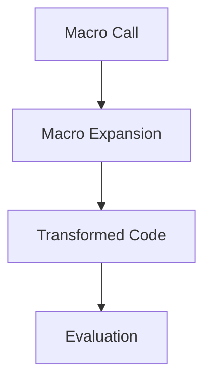

## 16.1 Introduction to Macros in Clojure

As experienced Java developers transitioning to Clojure, you may find yourself intrigued by the concept of macros. In Clojure, macros are powerful constructs that allow you to transform code before it is evaluated. This capability opens up a world of possibilities for creating more expressive, efficient, and flexible programs. In this section, we'll delve into what macros are, how they differ from functions, and why they are an essential tool in the Clojure programmer's toolkit.

### What Are Macros?

Macros in Clojure are a form of metaprogramming that enable you to write code that writes code. They operate at compile time, transforming the code before it is executed. This allows you to extend the language with new syntactic constructs or embed domain-specific languages (DSLs) within your Clojure programs.

#### Macros vs. Functions

At first glance, macros and functions might seem similar, as both are used to encapsulate reusable logic. However, they serve different purposes and operate at different stages of the code lifecycle.

- **Functions**: Functions are runtime constructs. They take arguments, perform computations, and return results. In Java, methods are analogous to functions in Clojure. Functions are evaluated when they are called during program execution.

- **Macros**: Macros, on the other hand, are compile-time constructs. They receive unevaluated code as their arguments and return transformed code. This transformed code is then evaluated in place of the original macro call. This allows macros to manipulate the structure of the code itself, something functions cannot do.

Here's a simple comparison to illustrate the difference:

```clojure
;; Function example
(defn add [x y]
  (+ x y))

;; Usage
(add 2 3) ; => 5

;; Macro example
(defmacro unless [condition body]
  `(if (not ~condition)
     ~body))

;; Usage
(unless false (println "This will print")) ; => This will print
```

In the macro example, `unless` is a macro that transforms the code into an `if` statement with a negated condition. The body of the macro is not evaluated until the macro itself is expanded into its final form.

### Why Use Macros?

Macros are particularly useful in scenarios where you need to:

- **Create Domain-Specific Languages (DSLs)**: Macros allow you to define new language constructs that are tailored to specific problem domains. This can make your code more expressive and easier to understand.

- **Implement Syntactic Abstractions**: You can use macros to introduce new syntax or simplify existing syntax, making your code more concise and readable.

- **Optimize Performance**: By transforming code at compile time, macros can eliminate unnecessary computations or introduce optimizations that are not possible with functions alone.

- **Encapsulate Repeated Patterns**: Macros can encapsulate complex code patterns that are repeated throughout your codebase, reducing duplication and potential errors.

### Code as Data: The Power of Homoiconicity

One of the key features of Clojure that makes macros so powerful is its homoiconicity. This means that Clojure code is represented as data structures that the language itself can manipulate. In Clojure, code is data, and data is code. This allows macros to easily manipulate the code they receive as input.

Consider the following example:

```clojure
;; A simple macro to log expressions
(defmacro log [expr]
  `(let [result# ~expr]
     (println "Evaluating:" '~expr "Result:" result#)
     result#))

;; Usage
(log (+ 1 2)) ; => Evaluating: (+ 1 2) Result: 3
```

In this example, the `log` macro takes an expression, evaluates it, and prints both the expression and its result. The use of backticks (`) and tildes (~) allows us to construct a new code structure that includes both the original expression and additional logging logic.

### Understanding Macro Expansion

When you write a macro, it's important to understand how it expands. Macro expansion is the process by which the macro's code is transformed into its final form before being evaluated. You can use the `macroexpand` function in Clojure to see how a macro call is expanded:

```clojure
;; Macro expansion example
(macroexpand '(unless false (println "This will print")))
;; => (if (not false) (println "This will print"))
```

This shows how the `unless` macro is transformed into an `if` statement with a negated condition.

### Best Practices for Writing Macros

Writing macros requires careful consideration to avoid common pitfalls. Here are some best practices to keep in mind:

- **Avoid Overusing Macros**: Use macros only when necessary. If a function can achieve the same result, prefer using a function.

- **Ensure Hygiene**: Macros should avoid introducing variable name conflicts. Use `gensym` or the `#` suffix to generate unique symbols.

- **Test Macro Expansion**: Always test the expanded form of your macros to ensure they produce the expected code.

- **Document Macros Thoroughly**: Macros can be complex and difficult to understand. Provide clear documentation and examples for users.

### Try It Yourself

To deepen your understanding of macros, try modifying the `unless` macro to support an `else` clause. Experiment with different macro transformations and observe how they affect the resulting code.

### Visualizing Macro Expansion

To help visualize how macros transform code, consider the following diagram illustrating the macro expansion process:



This flowchart shows the stages of macro processing, from the initial macro call to the final evaluation of the transformed code.

### References and Further Reading

- [Official Clojure Documentation on Macros](https://clojure.org/reference/macros)
- [ClojureDocs: Macros](https://clojuredocs.org/quickref#macros)
- [Clojure Programming: Macros](https://www.braveclojure.com/writing-macros/)

### Knowledge Check

To reinforce your understanding of macros, consider the following questions and exercises:

1. What is the primary difference between macros and functions in Clojure?
2. How does homoiconicity enable powerful macro capabilities in Clojure?
3. Write a macro that implements a simple `when` construct, similar to `if`, but without an `else` clause.
4. Use `macroexpand` to explore the expansion of a macro you write.
5. Discuss scenarios where using a macro would be more beneficial than a function.

### Summary

In this section, we've explored the fundamentals of macros in Clojure, understanding their role in code transformation and metaprogramming. We've seen how macros differ from functions, the scenarios where they are most beneficial, and the power of homoiconicity in enabling code manipulation. By mastering macros, you can unlock new levels of expressiveness and flexibility in your Clojure programs.

## Quiz: Test Your Understanding of Clojure Macros



### What is the primary role of macros in Clojure?

- [x] Transform code before evaluation
- [ ] Execute code at runtime
- [ ] Manage state changes
- [ ] Handle exceptions

> **Explanation:** Macros in Clojure are used to transform code before it is evaluated, allowing for compile-time code manipulation.

### How do macros differ from functions in Clojure?

- [x] Macros operate at compile time, while functions operate at runtime
- [ ] Macros and functions are identical in Clojure
- [ ] Functions can transform code, but macros cannot
- [ ] Macros are used for input/output operations

> **Explanation:** Macros operate at compile time, transforming code before it is executed, whereas functions are evaluated at runtime.

### What is homoiconicity in Clojure?

- [x] The property that code is represented as data structures
- [ ] The ability to execute code in parallel
- [ ] The use of immutable data structures
- [ ] The capability to handle exceptions

> **Explanation:** Homoiconicity refers to the property of Clojure where code is represented as data structures, allowing for code manipulation.

### Why might you use a macro instead of a function?

- [x] To create new syntactic constructs
- [ ] To perform runtime calculations
- [ ] To manage state changes
- [ ] To handle exceptions

> **Explanation:** Macros are used to create new syntactic constructs and perform compile-time code transformations.

### Which of the following is a best practice when writing macros?

- [x] Ensure hygiene by avoiding variable name conflicts
- [ ] Use macros for all code transformations
- [ ] Avoid testing macro expansions
- [ ] Use macros for input/output operations

> **Explanation:** Ensuring hygiene by avoiding variable name conflicts is a best practice when writing macros.

### What function can you use to see how a macro expands?

- [x] `macroexpand`
- [ ] `eval`
- [ ] `apply`
- [ ] `reduce`

> **Explanation:** The `macroexpand` function is used to see how a macro expands into its final form.

### What is a common use case for macros in Clojure?

- [x] Creating domain-specific languages
- [ ] Performing arithmetic operations
- [ ] Managing state changes
- [ ] Handling exceptions

> **Explanation:** A common use case for macros is creating domain-specific languages and new syntactic constructs.

### What is the purpose of the `gensym` function in macros?

- [x] To generate unique symbols and avoid name conflicts
- [ ] To evaluate expressions at runtime
- [ ] To manage state changes
- [ ] To handle exceptions

> **Explanation:** The `gensym` function generates unique symbols to avoid name conflicts in macros.

### How can macros improve performance?

- [x] By optimizing code at compile time
- [ ] By executing code in parallel
- [ ] By managing state changes
- [ ] By handling exceptions

> **Explanation:** Macros can improve performance by optimizing code at compile time, eliminating unnecessary computations.

### True or False: Macros in Clojure can be used to manage state changes.

- [ ] True
- [x] False

> **Explanation:** Macros are not used to manage state changes; they are used for compile-time code transformations.


