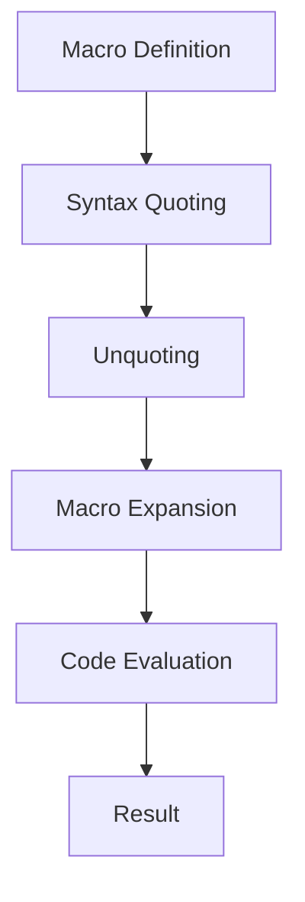

## 16.2 Writing Basic Macros

Welcome to the world of Clojure macros, a powerful feature that allows you to extend the language and create custom syntactic constructs. As experienced Java developers, you may be familiar with the concept of metaprogramming, but Clojure takes it to a new level with its macro system. In this section, we'll explore how to define basic macros, understand quoting and syntax quoting, and see how macros handle arguments. By the end of this guide, you'll be equipped to write your own macros and leverage them to build more expressive and concise Clojure code.

### Defining Macros

In Clojure, macros are defined using the `defmacro` construct. Macros operate on the code itself, transforming it before it is evaluated. This allows you to create new language constructs and control the evaluation process. Let's start by defining a simple macro and understanding its structure.

```clojure
(defmacro my-macro [arg]
  `(println "The argument is:" ~arg))
```

In this example, `my-macro` is a macro that takes a single argument `arg`. The body of the macro uses syntax quoting (`` ` ``) to construct a new expression. The tilde (`~`) is used to unquote `arg`, allowing its value to be inserted into the quoted expression.

#### Key Points:

- **Macros are defined using `defmacro`.**
- **Macros transform code before evaluation.**
- **Syntax quoting (`` ` ``) and unquoting (`~`) are used to construct new expressions.**

### Quoting and Syntax Quoting

Quoting is a crucial concept in macros, as it allows you to treat code as data. In Clojure, there are two types of quoting: regular quoting (`'`) and syntax quoting (`` ` ``). Understanding the difference between them is essential for writing effective macros.

#### Regular Quoting

Regular quoting is done using the single quote (`'`). It prevents the evaluation of an expression, treating it as a literal list.

```clojure
'(1 2 3) ; => (1 2 3)
```

In this example, the list `(1 2 3)` is not evaluated; it's treated as a literal list.

#### Syntax Quoting

Syntax quoting (`` ` ``) is more powerful than regular quoting. It not only prevents evaluation but also resolves symbols to their fully qualified names, ensuring that the code is evaluated in the correct context.

```clojure
`(println "Hello, World!") ; => (clojure.core/println "Hello, World!")
```

Here, `println` is resolved to `clojure.core/println`, ensuring that the correct function is called.

#### Unquoting

Within a syntax-quoted expression, you can use unquoting (`~`) to evaluate specific parts of the expression.

```clojure
(defmacro greet [name]
  `(println "Hello," ~name))

(greet "Alice") ; => Hello, Alice
```

In this macro, `~name` is unquoted, allowing its value to be inserted into the syntax-quoted expression.

### Macro Arguments

One of the unique aspects of macros is that they receive unevaluated code as their arguments. This allows macros to manipulate the code itself, providing powerful metaprogramming capabilities.

Consider the following example:

```clojure
(defmacro debug [expr]
  `(do
     (println "Evaluating:" '~expr)
     (let [result# ~expr]
       (println "Result:" result#)
       result#)))

(debug (+ 1 2)) ; => Evaluating: (+ 1 2)
                ; => Result: 3
                ; => 3
```

In this macro, `expr` is received as unevaluated code. The macro prints the expression, evaluates it, and then prints the result. The `result#` symbol is generated using a gensym to ensure it is unique, preventing any naming conflicts.

### Examples of Basic Macros

Let's explore some simple macros to solidify our understanding. We'll start with a custom `when` macro, which is a common example used to demonstrate macro capabilities.

#### Custom `when` Macro

The `when` macro in Clojure is a conditional construct that executes a body of code only if a condition is true. Let's implement a simplified version of it.

```clojure
(defmacro my-when [condition & body]
  `(if ~condition
     (do ~@body)))

(my-when true
  (println "This will be printed.")
  (println "So will this."))

(my-when false
  (println "This will not be printed."))
```

In this macro, `my-when` takes a `condition` and a variable number of `body` expressions. The `&` symbol is used to collect the remaining arguments into a list. The `~@` syntax is used to splice the `body` expressions into the `do` form.

#### Try It Yourself

Experiment with the `my-when` macro by modifying the condition and adding more expressions to the body. Observe how the macro expands and executes the code.

### Visual Aids

To better understand the flow of data and control in macros, let's visualize the process using a flowchart.



**Figure 1:** The flow of data and control in a Clojure macro.

### References and Links

For further reading and deeper dives into Clojure macros, consider exploring the following resources:

- [Official Clojure Documentation on Macros](https://clojure.org/reference/macros)
- [ClojureDocs: Macros](https://clojuredocs.org/quickref#macros)
- [Clojure Programming by Chas Emerick, Brian Carper, and Christophe Grand](https://www.oreilly.com/library/view/clojure-programming/9781449310387/)

### Knowledge Check

Let's test your understanding of Clojure macros with a few questions and challenges.

1. **What is the purpose of syntax quoting in macros?**
2. **How does unquoting differ from quoting?**
3. **Write a macro that logs the execution time of an expression.**

### Exercises

1. **Create a macro that repeats an expression a specified number of times.**
2. **Implement a macro that swaps the values of two variables.**

### Summary

In this section, we've explored the basics of writing macros in Clojure. We've learned how to define macros using `defmacro`, use quoting and syntax quoting, and handle macro arguments. By practicing with simple examples, you can start leveraging macros to create more expressive and concise Clojure code. As you continue your journey, remember that macros are a powerful tool, but they should be used judiciously to maintain code clarity and readability.

## Quiz: Mastering Clojure Macros



### What is the primary purpose of a macro in Clojure?

- [x] To transform code before it is evaluated
- [ ] To execute code immediately
- [ ] To optimize code performance
- [ ] To handle exceptions

> **Explanation:** Macros in Clojure are used to transform code before it is evaluated, allowing for custom syntactic constructs and metaprogramming.

### How does syntax quoting differ from regular quoting in Clojure?

- [x] Syntax quoting resolves symbols to their fully qualified names
- [ ] Syntax quoting prevents evaluation entirely
- [ ] Syntax quoting is used only for strings
- [ ] Syntax quoting is a deprecated feature

> **Explanation:** Syntax quoting resolves symbols to their fully qualified names, ensuring the correct context for evaluation.

### What does the tilde (`~`) symbol do in a syntax-quoted expression?

- [x] It unquotes an expression, allowing it to be evaluated
- [ ] It comments out the expression
- [ ] It concatenates strings
- [ ] It multiplies numbers

> **Explanation:** The tilde (`~`) unquotes an expression within a syntax-quoted expression, allowing it to be evaluated.

### In a macro, how are arguments received?

- [x] As unevaluated code
- [ ] As evaluated results
- [ ] As strings
- [ ] As integers

> **Explanation:** Macros receive arguments as unevaluated code, allowing them to manipulate the code itself.

### Which of the following is a valid use of a macro?

- [x] Creating new language constructs
- [ ] Handling runtime exceptions
- [ ] Optimizing memory usage
- [ ] Managing database connections

> **Explanation:** Macros are used to create new language constructs by transforming code before evaluation.

### What is the purpose of the `defmacro` construct?

- [x] To define a macro
- [ ] To define a function
- [ ] To define a variable
- [ ] To define a class

> **Explanation:** The `defmacro` construct is used to define a macro in Clojure.

### How can you ensure a unique symbol in a macro to avoid naming conflicts?

- [x] Use `gensym` to generate a unique symbol
- [ ] Use a global variable
- [ ] Use a local variable
- [ ] Use a constant

> **Explanation:** `gensym` is used to generate a unique symbol in a macro, preventing naming conflicts.

### What is the result of the following macro call: `(my-when false (println "Hello"))`?

- [x] No output
- [ ] "Hello"
- [ ] An error
- [ ] "False"

> **Explanation:** The `my-when` macro will not execute the body if the condition is false, resulting in no output.

### Which of the following is a benefit of using macros in Clojure?

- [x] They allow for code transformation and custom syntactic constructs
- [ ] They improve runtime performance
- [ ] They simplify exception handling
- [ ] They reduce memory usage

> **Explanation:** Macros allow for code transformation and the creation of custom syntactic constructs, enhancing expressiveness.

### True or False: Macros in Clojure can execute code immediately.

- [ ] True
- [x] False

> **Explanation:** Macros do not execute code immediately; they transform code before it is evaluated.



By mastering the basics of macros, you're well on your way to becoming proficient in Clojure's metaprogramming capabilities. Keep experimenting and exploring the possibilities that macros offer to enhance your functional programming skills.
