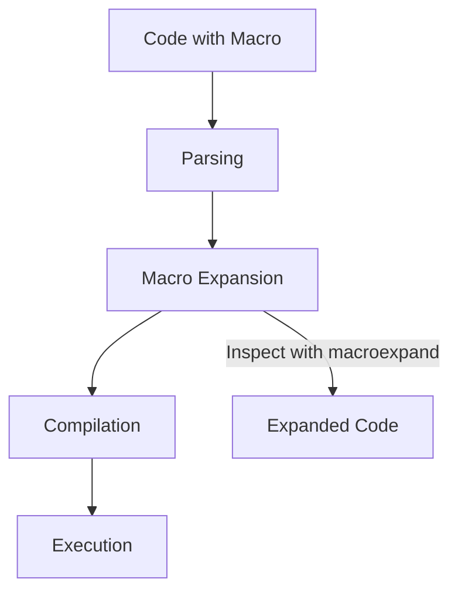

## 16.3 Macro Expansion and Debugging

In this section, we delve into the fascinating world of macro expansion and debugging in Clojure. Macros are a powerful feature of Clojure, allowing developers to extend the language by writing code that writes code. This capability can lead to more expressive and concise programs, but it also introduces complexity, especially when it comes to debugging. Let's explore how macro expansion works, how to use tools like `macroexpand`, and strategies for debugging macros effectively.

### Understanding Macro Expansion

Macros in Clojure are expanded at compile time, transforming code before it is evaluated. This process allows developers to introduce new syntactic constructs and abstractions, effectively extending the language. Understanding how macros are expanded is crucial for writing effective and bug-free macros.

#### The Macro Expansion Process

When a macro is invoked, Clojure performs the following steps:

1. **Parsing**: The code is parsed into an abstract syntax tree (AST).
2. **Macro Expansion**: The macro is expanded, replacing the macro call with its expanded form.
3. **Compilation**: The expanded code is compiled into bytecode.
4. **Execution**: The compiled bytecode is executed.

This process is akin to Java's compilation process, where source code is transformed into bytecode before execution. However, in Clojure, macros allow for transformation at the source level, providing a powerful tool for metaprogramming.

### Using `macroexpand`

To inspect how a macro expands, Clojure provides the `macroexpand` and `macroexpand-1` functions. These functions are invaluable for understanding and debugging macros.

#### `macroexpand-1`

The `macroexpand-1` function expands a macro call by one level. This is useful for seeing the immediate transformation a macro performs.

```clojure
(defmacro my-macro [x]
  `(+ ~x 1))

(macroexpand-1 '(my-macro 2))
;; => (+ 2 1)
```

In this example, `my-macro` simply adds 1 to the given argument. Using `macroexpand-1`, we can see that `(my-macro 2)` expands to `(+ 2 1)`.

#### `macroexpand`

The `macroexpand` function fully expands a macro call, recursively expanding any macros within the expanded form.

```clojure
(macroexpand '(my-macro 2))
;; => (+ 2 1)
```

For simple macros like `my-macro`, `macroexpand` and `macroexpand-1` yield the same result. However, for more complex macros that contain nested macro calls, `macroexpand` will continue expanding until no macros remain.

### Debugging Techniques

Debugging macros can be challenging due to their compile-time nature. Here are some strategies to help you debug macros effectively:

#### Step-by-Step Expansion

Use `macroexpand-1` to expand macros step by step. This approach allows you to inspect each transformation and identify where things might be going wrong.

```clojure
(defmacro complex-macro [x]
  `(let [y ~x]
     (println "Value of y:" y)
     (* y y)))

(macroexpand-1 '(complex-macro 3))
;; => (let* [y 3] (println "Value of y:" y) (* y y))
```

By expanding one step at a time, you can verify each part of the macro's logic.

#### Print Debugging

Incorporate print statements within your macros to output intermediate values during expansion. This technique can help you understand how data flows through the macro.

```clojure
(defmacro debug-macro [x]
  (println "Expanding with:" x)
  `(+ ~x 1))

(debug-macro 5)
;; Console Output: Expanding with: 5
;; => 6
```

#### Use `assert` for Validation

Use `assert` statements within macros to validate assumptions about input data. This can catch errors early in the expansion process.

```clojure
(defmacro safe-macro [x]
  (assert (number? x) "Argument must be a number")
  `(+ ~x 1))

(safe-macro "not-a-number")
;; AssertionError: Argument must be a number
```

### Common Pitfalls

Writing macros can be tricky, and there are several common pitfalls to be aware of:

#### Unintended Variable Capture

Macros can inadvertently capture variables from the surrounding context, leading to unexpected behavior. Use `gensym` to generate unique symbols and avoid this issue.

```clojure
(defmacro capture-macro [x]
  `(let [y# ~x] (* y# y#)))

(let [y 10]
  (capture-macro 3))
;; => 9
```

In this example, `y#` is a unique symbol generated by `gensym`, preventing variable capture.

#### Overuse of Macros

Avoid using macros when a function would suffice. Macros should be reserved for cases where compile-time code transformation is necessary.

#### Complex Logic

Keep macro logic simple and focused. Complex macros can be difficult to understand and debug. Consider breaking down complex macros into smaller, reusable components.

### Visual Aids

To better understand macro expansion, let's visualize the process using a flowchart.



**Figure 1**: The macro expansion process in Clojure.

### References and Links

- [Official Clojure Documentation on Macros](https://clojure.org/reference/macros)
- [ClojureDocs: macroexpand](https://clojuredocs.org/clojure.core/macroexpand)
- [Clojure Metaprogramming Guide](https://clojure.org/guides/macros)

### Knowledge Check

Let's reinforce what we've learned with some questions and exercises.

1. **What is the purpose of `macroexpand-1`?**
   - To expand a macro call by one level.

2. **How can you avoid unintended variable capture in macros?**
   - Use `gensym` to generate unique symbols.

3. **Why should macros be used sparingly?**
   - Overuse can lead to complex and hard-to-debug code.

### Try It Yourself

Experiment with the following code:

- Modify `my-macro` to subtract instead of add.
- Create a macro that takes two arguments and returns their product.
- Use `macroexpand` to inspect your new macro.

### Summary

In this section, we've explored the intricacies of macro expansion and debugging in Clojure. By understanding the macro expansion process and employing tools like `macroexpand`, you can write more effective and bug-free macros. Remember to keep macros simple, avoid common pitfalls, and leverage debugging techniques to ensure your macros work as intended.

## Quiz: Mastering Macro Expansion and Debugging in Clojure



### What is the primary purpose of macros in Clojure?

- [x] To perform compile-time code transformations
- [ ] To execute code at runtime
- [ ] To manage state changes
- [ ] To handle exceptions

> **Explanation:** Macros in Clojure are used for compile-time code transformations, allowing developers to extend the language.

### Which function expands a macro call by one level?

- [x] `macroexpand-1`
- [ ] `macroexpand`
- [ ] `expand-macro`
- [ ] `macro-debug`

> **Explanation:** `macroexpand-1` expands a macro call by one level, showing the immediate transformation.

### How can you prevent unintended variable capture in macros?

- [x] Use `gensym` to generate unique symbols
- [ ] Use global variables
- [ ] Avoid using variables
- [ ] Use `let` bindings

> **Explanation:** `gensym` generates unique symbols, preventing unintended variable capture in macros.

### What is a common pitfall when writing macros?

- [x] Unintended variable capture
- [ ] Overuse of functions
- [ ] Lack of comments
- [ ] Using too many libraries

> **Explanation:** Unintended variable capture is a common pitfall in macro writing, which can lead to unexpected behavior.

### Why should macros be used sparingly?

- [x] They can lead to complex and hard-to-debug code
- [ ] They are slower than functions
- [ ] They are deprecated
- [ ] They require more memory

> **Explanation:** Macros can lead to complex and hard-to-debug code if overused, so they should be used sparingly.

### Which function fully expands a macro call?

- [x] `macroexpand`
- [ ] `macroexpand-1`
- [ ] `expand-all`
- [ ] `macro-debug`

> **Explanation:** `macroexpand` fully expands a macro call, recursively expanding any nested macros.

### What is the role of `assert` in macros?

- [x] To validate assumptions about input data
- [ ] To execute code at runtime
- [ ] To handle exceptions
- [ ] To manage state changes

> **Explanation:** `assert` is used in macros to validate assumptions about input data, catching errors early in the expansion process.

### How can print statements be used in macros?

- [x] To output intermediate values during expansion
- [ ] To execute code at runtime
- [ ] To manage state changes
- [ ] To handle exceptions

> **Explanation:** Print statements can be used in macros to output intermediate values during expansion, aiding in debugging.

### What is the first step in the macro expansion process?

- [x] Parsing
- [ ] Compilation
- [ ] Execution
- [ ] Optimization

> **Explanation:** The first step in the macro expansion process is parsing the code into an abstract syntax tree (AST).

### True or False: Macros in Clojure are expanded at runtime.

- [ ] True
- [x] False

> **Explanation:** False. Macros in Clojure are expanded at compile time, not runtime.


