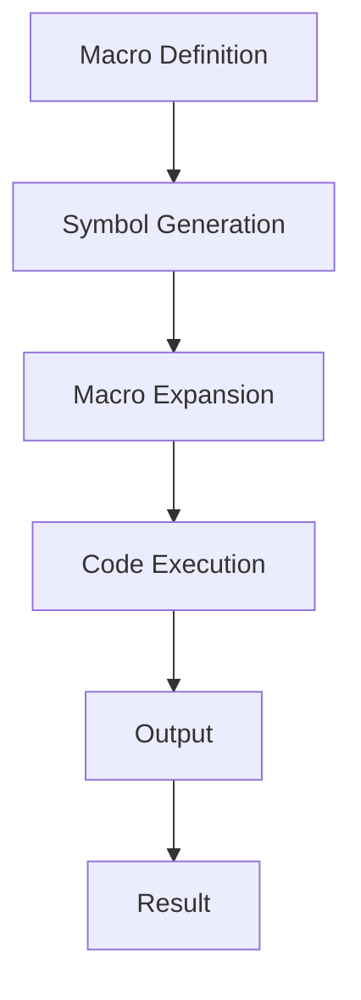

## 16.4 Advanced Macro Techniques

In this section, we delve into advanced macro techniques in Clojure, focusing on macro hygiene, variable capturing, and the intriguing concept of macros generating other macros. As experienced Java developers, you may be familiar with code generation and metaprogramming concepts, but Clojure's approach offers unique advantages and challenges. Let's explore these concepts in detail.

### Macro Hygiene

**Macro hygiene** is a critical concept in Clojure that ensures macros do not inadvertently capture or interfere with variables in the code where they are expanded. This is crucial for maintaining the integrity and predictability of code, especially in large-scale applications.

#### Understanding Macro Hygiene

In Clojure, macros are powerful tools that allow you to manipulate code as data. However, without proper hygiene, macros can introduce bugs by capturing variables unintentionally. Clojure addresses this issue by ensuring that symbols introduced within a macro do not clash with symbols in the macro's expansion context.

**Example:**

```clojure
(defmacro safe-inc [x]
  `(let [y ~x]
     (inc y)))

(let [y 10]
  (safe-inc y)) ; Returns 11, no variable capture occurs
```

In this example, the `safe-inc` macro introduces a local variable `y`. Thanks to macro hygiene, this `y` does not interfere with the `y` in the surrounding context.

#### How Clojure Prevents Variable Capture

Clojure uses a technique called **gensym** (generated symbols) to ensure macro hygiene. Gensyms are unique symbols generated at runtime, preventing name clashes.

**Example:**

```clojure
(defmacro hygienic-inc [x]
  (let [y (gensym "y")]
    `(let [~y ~x]
       (inc ~y))))

(let [y 10]
  (hygienic-inc y)) ; Returns 11, using a unique symbol for `y`
```

Here, `gensym` creates a unique symbol for `y`, ensuring that the macro's internal variable does not clash with any external variables.

### Unhygienic Macros

While macro hygiene is generally desirable, there are situations where **unhygienic macros** are necessary. These macros intentionally capture variables from their expansion context, allowing for more flexible and dynamic code generation.

#### When to Use Unhygienic Macros

Unhygienic macros are useful when you need to manipulate or interact with variables in the surrounding context. This can be beneficial in scenarios such as:

- **DSL Creation**: When creating domain-specific languages (DSLs) where the macro needs to interact with user-defined variables.
- **Code Injection**: When injecting code that must operate on specific variables in the caller's context.

**Example:**

```clojure
(defmacro capture-var [var]
  `(println "Captured variable:" ~var))

(let [x 42]
  (capture-var x)) ; Prints "Captured variable: 42"
```

In this example, the `capture-var` macro intentionally captures the variable `x` from its expansion context.

#### Handling Unhygienic Macros

When writing unhygienic macros, it's essential to document their behavior clearly and ensure that users understand the potential for variable capture. Additionally, consider providing alternative hygienic versions when possible.

### Variable Capturing and Gensyms

**Variable capturing** occurs when a macro unintentionally binds to a variable in its expansion context. To avoid this, Clojure provides the `gensym` function, which generates unique symbols.

#### Using Gensyms in Macros

Gensyms are particularly useful when you need to introduce temporary variables within a macro without risking name clashes.

**Example:**

```clojure
(defmacro with-temp-file [filename & body]
  (let [temp-file (gensym "temp-file")]
    `(let [~temp-file (java.io.File/createTempFile ~filename ".tmp")]
       (try
         ~@body
         (finally
           (.delete ~temp-file))))))
```

In this macro, `gensym` ensures that `temp-file` is unique, preventing any conflicts with variables in the macro's expansion context.

### Macros Generating Macros

One of the most powerful aspects of Clojure macros is their ability to generate other macros. This metaprogramming technique allows for highly dynamic and flexible code generation.

#### Writing Macros that Generate Macros

Macros that generate other macros can be used to create complex code structures or DSLs. This technique involves writing a macro that returns the code for another macro.

**Example:**

```clojure
(defmacro def-macro [name & body]
  `(defmacro ~name []
     ~@body))

(def-macro hello-world
  `(println "Hello, World!"))

(hello-world) ; Prints "Hello, World!"
```

In this example, the `def-macro` macro generates a new macro `hello-world`, which prints a message when invoked.

#### Use Cases for Macros Generating Macros

- **DSLs**: Creating DSLs that require dynamic macro definitions.
- **Code Generation**: Automating repetitive code patterns by generating specialized macros.
- **Frameworks**: Building frameworks that need to define macros based on user input or configuration.

### Visual Aids

To better understand these concepts, let's visualize the flow of data and symbol generation in macros using a diagram.



**Diagram Description:** This flowchart illustrates the process of defining a macro, generating symbols, expanding the macro, executing the generated code, and producing the final result.

### References and Links

- [Official Clojure Documentation on Macros](https://clojure.org/reference/macros)
- [ClojureDocs: Macro Examples](https://clojuredocs.org/clojure_core/clojure.core/defmacro)
- [GitHub: Clojure Macros Examples](https://github.com/clojure-examples/macros)

### Knowledge Check

To reinforce your understanding of advanced macro techniques, consider the following questions and exercises:

1. **What is macro hygiene, and why is it important in Clojure?**
2. **Explain the role of gensyms in preventing variable capture.**
3. **Describe a scenario where an unhygienic macro might be necessary.**
4. **Write a macro that generates another macro to automate a repetitive task.**

### Practice Problems

1. **Modify the `safe-inc` macro to include error handling for non-numeric inputs.**
2. **Create a macro that captures a variable and performs a calculation on it, demonstrating unhygienic behavior.**
3. **Write a macro that generates a series of macros for basic arithmetic operations (add, subtract, multiply, divide).**

### Summary

In this section, we've explored advanced macro techniques in Clojure, focusing on macro hygiene, variable capturing, and the powerful concept of macros generating other macros. By understanding these techniques, you can harness the full potential of Clojure's metaprogramming capabilities to build efficient, scalable applications. As you continue your journey, remember to experiment with these concepts and apply them to real-world scenarios.

---

## Advanced Macro Techniques Quiz



### What is macro hygiene in Clojure?

- [x] A technique to prevent variable capture in macros
- [ ] A method to clean up unused variables
- [ ] A way to optimize macro performance
- [ ] A process for debugging macros

> **Explanation:** Macro hygiene ensures that symbols introduced within a macro do not clash with symbols in the macro's expansion context, preventing variable capture.

### When might you need an unhygienic macro?

- [x] When creating a DSL that interacts with user-defined variables
- [ ] When optimizing code for performance
- [ ] When debugging a macro
- [ ] When cleaning up unused variables

> **Explanation:** Unhygienic macros are useful when you need to manipulate or interact with variables in the surrounding context, such as in DSL creation.

### What is the purpose of gensyms in macros?

- [x] To generate unique symbols and prevent name clashes
- [ ] To optimize macro performance
- [ ] To clean up unused variables
- [ ] To debug macros

> **Explanation:** Gensyms generate unique symbols at runtime, ensuring that temporary variables within a macro do not clash with external variables.

### How can macros generate other macros?

- [x] By returning the code for another macro
- [ ] By optimizing the macro's performance
- [ ] By cleaning up unused variables
- [ ] By debugging the macro

> **Explanation:** Macros can generate other macros by returning the code for a new macro, allowing for dynamic and flexible code generation.

### What is a common use case for macros generating macros?

- [x] Creating DSLs that require dynamic macro definitions
- [ ] Optimizing code for performance
- [ ] Cleaning up unused variables
- [ ] Debugging macros

> **Explanation:** Macros generating macros are often used in DSLs to define dynamic macro structures based on user input or configuration.

### Which function is used to create unique symbols in Clojure macros?

- [x] gensym
- [ ] defmacro
- [ ] let
- [ ] println

> **Explanation:** The `gensym` function is used to create unique symbols in Clojure macros, preventing variable capture.

### What is the result of using a gensym in a macro?

- [x] Unique symbols that prevent variable capture
- [ ] Optimized macro performance
- [ ] Cleaned up unused variables
- [ ] Debugged macros

> **Explanation:** Using a gensym in a macro results in unique symbols that prevent variable capture, ensuring macro hygiene.

### What is the primary benefit of macro hygiene?

- [x] Preventing variable capture and ensuring code integrity
- [ ] Optimizing macro performance
- [ ] Cleaning up unused variables
- [ ] Debugging macros

> **Explanation:** The primary benefit of macro hygiene is preventing variable capture, which ensures the integrity and predictability of code.

### How does Clojure ensure macro hygiene?

- [x] By using gensyms to generate unique symbols
- [ ] By optimizing macro performance
- [ ] By cleaning up unused variables
- [ ] By debugging macros

> **Explanation:** Clojure ensures macro hygiene by using gensyms to generate unique symbols, preventing name clashes.

### True or False: Macros in Clojure can only generate code, not other macros.

- [ ] True
- [x] False

> **Explanation:** False. Macros in Clojure can generate other macros, allowing for dynamic and flexible code generation.



---
