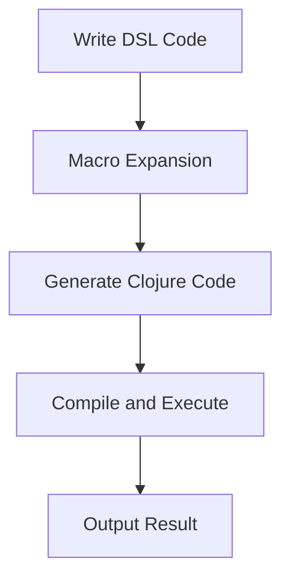

## 16.5 Creating Domain-Specific Languages

In this section, we will delve into the fascinating world of Domain-Specific Languages (DSLs) and how Clojure's powerful macro system can be leveraged to create expressive and concise DSLs. As experienced Java developers, you may be familiar with the concept of DSLs, but Clojure offers unique capabilities that make DSL creation both intuitive and powerful.

### Purpose of DSLs

**Domain-Specific Languages (DSLs)** are specialized mini-languages designed to express solutions in a specific domain more effectively than general-purpose programming languages. They provide a higher level of abstraction, allowing developers to write code that is closer to the problem domain, which can lead to increased productivity and reduced errors.

#### Why Create a DSL?

1. **Expressiveness**: DSLs allow you to express complex domain logic in a more readable and concise manner.
2. **Abstraction**: They abstract away low-level details, enabling focus on the domain-specific logic.
3. **Productivity**: By reducing boilerplate code, DSLs can significantly speed up development.
4. **Maintainability**: Code written in a DSL is often easier to understand and maintain, especially for domain experts.

#### When to Create a DSL?

- When the domain logic is complex and repetitive.
- When the domain experts are involved in the development process and need to understand the code.
- When you need to enforce domain-specific constraints and rules.

### Macros in DSLs

Clojure's macro system is a powerful tool for creating DSLs. Macros allow you to extend the language by defining new syntactic constructs, making it possible to create highly expressive DSLs.

#### How Macros Enhance DSLs

- **Syntax Extension**: Macros can introduce new syntax that is more natural for the domain.
- **Code Transformation**: They can transform code at compile time, optimizing or altering it for specific needs.
- **Abstraction**: Macros can encapsulate complex patterns, reducing boilerplate and enhancing readability.

Let's explore how macros can be used to create a DSL in Clojure.

### Examples of DSLs in Clojure

#### Testing Framework DSL

One of the most common uses of DSLs in Clojure is in testing frameworks. Let's create a simple testing DSL using macros.

```clojure
(defmacro deftest [name & body]
  `(defn ~name []
     (try
       ~@body
       (println "Test" '~name "passed")
       (catch Exception e
         (println "Test" '~name "failed:" (.getMessage e))))))

(defmacro is [test]
  `(if ~test
     (println "Assertion passed")
     (throw (Exception. "Assertion failed"))))

;; Usage
(deftest sample-test
  (is (= 1 1))
  (is (= (+ 1 2) 3)))

(sample-test)
```

In this example, we define a simple testing DSL with `deftest` and `is` macros. The `deftest` macro defines a test function, while the `is` macro performs assertions.

#### HTML Templating DSL

Another common application of DSLs is in HTML templating. Let's create a simple HTML DSL.

```clojure
(defmacro html [& body]
  `(str "<html>" ~@body "</html>"))

(defmacro head [& body]
  `(str "<head>" ~@body "</head>"))

(defmacro body [& body]
  `(str "<body>" ~@body "</body>"))

(defmacro p [content]
  `(str "<p>" ~content "</p>"))

;; Usage
(html
  (head
    "<title>My Page</title>")
  (body
    (p "Welcome to my page!")))
```

This DSL allows us to write HTML in a more structured and readable way, using macros to generate the necessary HTML tags.

### Design Considerations

When designing a DSL, several considerations must be taken into account to ensure its effectiveness and usability.

#### Readability

- **Clarity**: The DSL should be clear and intuitive, making it easy for developers and domain experts to understand.
- **Consistency**: Use consistent naming conventions and syntax to avoid confusion.

#### Learning Curve

- **Simplicity**: Keep the DSL simple and focused on the domain to minimize the learning curve.
- **Documentation**: Provide comprehensive documentation and examples to help users get started.

#### Performance

- **Efficiency**: Ensure that the DSL does not introduce significant performance overhead.
- **Optimization**: Use macros to optimize code where possible, transforming it into efficient Clojure code.

#### Extensibility

- **Flexibility**: Design the DSL to be easily extensible, allowing new features to be added as needed.
- **Modularity**: Structure the DSL in a modular way, enabling components to be reused and extended.

### Try It Yourself

To get hands-on experience with creating DSLs in Clojure, try modifying the examples above. For instance, extend the testing DSL to include setup and teardown functions, or add more HTML tags to the HTML templating DSL.

### Visual Aids

To better understand how macros transform code, let's visualize the process using a flowchart.



**Figure 1**: The flow of data through macro expansion and code generation in Clojure.

### References and Links

- [Clojure Macros Documentation](https://clojure.org/reference/macros)
- [ClojureDocs: Macros](https://clojuredocs.org/quickref#macros)
- [Building DSLs in Clojure](https://www.braveclojure.com/writing-macros/)

### Knowledge Check

- What are the benefits of using DSLs in software development?
- How do macros enhance the creation of DSLs in Clojure?
- What are some design considerations when creating a DSL?

### Exercises

1. Extend the testing DSL to include setup and teardown functions.
2. Create a DSL for defining RESTful API routes in Clojure.
3. Design a DSL for a simple game engine, allowing users to define game rules and logic.

### Summary

In this section, we've explored the creation of Domain-Specific Languages using Clojure's macro system. DSLs provide a powerful way to express domain logic more naturally and concisely, enhancing productivity and maintainability. By leveraging macros, we can create expressive DSLs that transform code at compile time, optimizing it for specific needs. As you continue your journey with Clojure, consider how DSLs can be used to simplify and enhance your code.

## Quiz: Mastering DSLs with Clojure Macros



### What is a primary benefit of using DSLs?

- [x] Increased expressiveness and readability
- [ ] Reduced code execution speed
- [ ] Increased complexity
- [ ] Decreased maintainability

> **Explanation:** DSLs provide increased expressiveness and readability by allowing developers to write code that is closer to the problem domain.

### How do macros contribute to DSL creation in Clojure?

- [x] By allowing syntax extension and code transformation
- [ ] By reducing the need for functions
- [ ] By increasing runtime performance
- [ ] By simplifying variable declarations

> **Explanation:** Macros allow syntax extension and code transformation, enabling the creation of expressive and concise DSLs.

### What is a key consideration when designing a DSL?

- [x] Readability and simplicity
- [ ] Maximizing the number of features
- [ ] Ensuring it is complex
- [ ] Making it language-specific

> **Explanation:** Readability and simplicity are key considerations to ensure the DSL is easy to understand and use.

### Which of the following is an example of a DSL application?

- [x] HTML templating
- [ ] Memory management
- [ ] Thread synchronization
- [ ] File I/O operations

> **Explanation:** HTML templating is a common application of DSLs, allowing for more structured and readable HTML code.

### What is the role of macros in optimizing DSL code?

- [x] Transforming code at compile time
- [ ] Increasing runtime complexity
- [ ] Simplifying syntax at runtime
- [ ] Reducing the need for functions

> **Explanation:** Macros transform code at compile time, optimizing it for specific needs and enhancing performance.

### What is a potential drawback of using DSLs?

- [x] Increased learning curve for new users
- [ ] Decreased code readability
- [ ] Reduced expressiveness
- [ ] Increased boilerplate code

> **Explanation:** DSLs can have an increased learning curve for new users, as they introduce new syntax and concepts.

### How can DSLs improve productivity?

- [x] By reducing boilerplate code
- [ ] By increasing code complexity
- [ ] By requiring more detailed documentation
- [ ] By enforcing strict typing

> **Explanation:** DSLs improve productivity by reducing boilerplate code, allowing developers to focus on domain-specific logic.

### What is a common use case for DSLs in Clojure?

- [x] Testing frameworks
- [ ] Memory management
- [ ] Low-level hardware control
- [ ] Network packet processing

> **Explanation:** Testing frameworks are a common use case for DSLs in Clojure, providing a more expressive way to define tests.

### What is the purpose of the `deftest` macro in the example?

- [x] To define a test function
- [ ] To perform assertions
- [ ] To generate HTML code
- [ ] To manage state

> **Explanation:** The `deftest` macro is used to define a test function, encapsulating test logic and assertions.

### True or False: Macros can only be used for DSL creation in Clojure.

- [ ] True
- [x] False

> **Explanation:** False. Macros in Clojure can be used for a variety of purposes, including but not limited to DSL creation.


