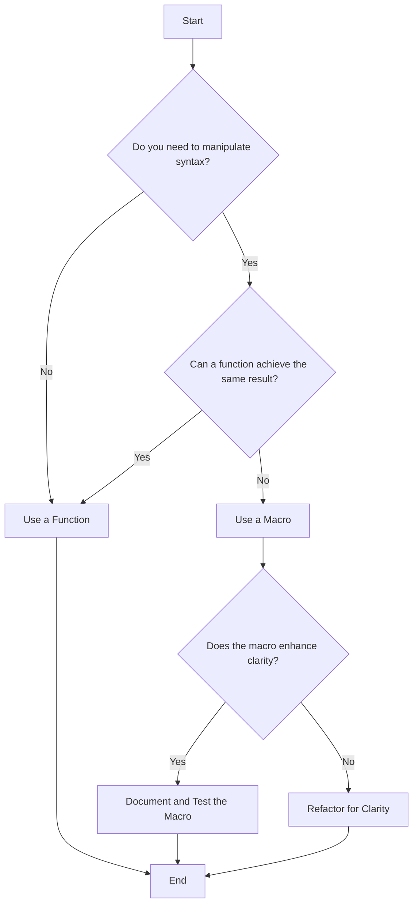

## 16.6 Best Practices for Using Macros

Macros in Clojure are a powerful tool that allows developers to extend the language by writing code that writes code. While this capability can lead to more expressive and flexible programs, it also introduces complexity and potential pitfalls. In this section, we will explore best practices for using macros effectively in Clojure, ensuring that they enhance rather than hinder your codebase.

### Use Sparingly

**Advise on using macros only when necessary, preferring functions when possible.**

Macros should be used judiciously. While they offer the ability to manipulate code at compile time, they can also obscure the logic of your program if overused or misapplied. As a general rule, prefer functions over macros unless you need to manipulate the syntax of your code directly.

#### When to Use Macros

1. **Code Generation**: Use macros when you need to generate repetitive code structures that cannot be abstracted with functions alone.
2. **Syntax Extension**: Employ macros to create new syntactic constructs that simplify complex patterns or enhance readability.
3. **Performance Optimization**: In some cases, macros can be used to optimize performance by eliminating runtime overhead.

#### Example: Avoiding Unnecessary Macros

Consider a scenario where you want to log messages with a timestamp. A function can suffice:

```clojure
(defn log-message [msg]
  (println (str (java.time.LocalDateTime/now) " - " msg)))

(log-message "Application started.")
```

Using a macro here would be unnecessary and could complicate the code without any added benefit.

### Clarity and Readability

**Emphasize writing macros that make code clearer, not more obscure.**

Macros should enhance the clarity of your code, not detract from it. When writing macros, ensure that their usage is intuitive and that they do not introduce unexpected behavior.

#### Guidelines for Clear Macros

- **Keep It Simple**: Write macros that are easy to understand and use. Avoid complex logic within macros that could confuse users.
- **Consistent Naming**: Use descriptive and consistent naming conventions for macros to indicate their purpose and usage.
- **Predictable Behavior**: Ensure that macros behave predictably and do not introduce side effects that could surprise users.

#### Example: A Clear and Readable Macro

Let's create a macro that simplifies the creation of a `let` binding with a default value:

```clojure
(defmacro let-default [bindings & body]
  `(let [~@(interleave (take-nth 2 bindings) 
                       (map #(list 'or %2 %1) 
                            (take-nth 2 bindings) 
                            (take-nth 2 (rest bindings))))]
     ~@body))

;; Usage
(let-default [x 10
              y (some-function)]
  (println x y))
```

This macro provides a clear and concise way to handle default values in `let` bindings, enhancing readability.

### Documentation

**Stress the importance of documenting macros thoroughly.**

Documentation is crucial for macros, as they can introduce new syntax and behavior that may not be immediately obvious to other developers. Comprehensive documentation helps ensure that macros are used correctly and effectively.

#### Key Documentation Elements

- **Purpose**: Clearly state the purpose of the macro and what problem it solves.
- **Usage Examples**: Provide examples of how to use the macro, including edge cases and common scenarios.
- **Parameters**: Document the parameters the macro accepts and any constraints or expectations.
- **Behavior**: Explain the behavior of the macro, including any side effects or special considerations.

#### Example: Documenting a Macro

```clojure
(defmacro unless [condition & body]
  "Executes the body unless the condition is true.
  
  Parameters:
  - condition: A boolean expression.
  - body: One or more expressions to execute if the condition is false.
  
  Usage:
  (unless false
    (println \"This will print.\"))
  "
  `(if (not ~condition)
     (do ~@body)))

;; Usage
(unless false
  (println "This will print."))
```

### Testing Macros

**Provide guidelines on how to test macros effectively.**

Testing macros can be challenging due to their compile-time nature. However, thorough testing is essential to ensure that macros function as intended and do not introduce bugs.

#### Strategies for Testing Macros

1. **Unit Tests**: Write unit tests for the code generated by the macro. This can be done by expanding the macro and testing the resulting code.
2. **Edge Cases**: Test edge cases and unusual inputs to ensure the macro handles them gracefully.
3. **Behavior Verification**: Verify that the macro behaves as expected in various scenarios, including error handling and boundary conditions.

#### Example: Testing a Macro

Suppose we have a macro that generates a simple arithmetic operation:

```clojure
(defmacro arithmetic [op a b]
  `(~op ~a ~b))

;; Testing the macro
(deftest test-arithmetic
  (is (= 5 (arithmetic + 2 3)))
  (is (= 6 (arithmetic * 2 3)))
  (is (= 1 (arithmetic - 3 2))))
```

By expanding the macro and testing the resulting expressions, we can ensure that it performs the desired operations correctly.

### Visual Aids

To further illustrate the concepts discussed, let's use a flowchart to depict the decision-making process for using macros:



**Caption**: This flowchart guides you through the decision-making process for using macros, emphasizing the importance of clarity and readability.

### References and Links

For further reading on macros and metaprogramming in Clojure, consider the following resources:

- [Official Clojure Documentation on Macros](https://clojure.org/reference/macros)
- [ClojureDocs: Macros](https://clojuredocs.org/quickref#Macros)
- [GitHub: Clojure Macros Examples](https://github.com/clojure-examples/macros)

### Knowledge Check

To reinforce your understanding of macros and their best practices, try answering the following questions:

## Mastering Macros in Clojure: Quiz



### When should you prefer functions over macros?

- [x] When the task can be accomplished without manipulating syntax.
- [ ] When you need to generate repetitive code structures.
- [ ] When you want to create new syntactic constructs.
- [ ] When optimizing performance by eliminating runtime overhead.

> **Explanation:** Functions should be preferred over macros when the task can be accomplished without manipulating syntax, as functions are simpler and more predictable.

### What is a key consideration when writing macros?

- [x] Ensuring the macro enhances code clarity.
- [ ] Making the macro as complex as possible.
- [ ] Avoiding documentation for simplicity.
- [ ] Using macros for every repetitive task.

> **Explanation:** A key consideration when writing macros is ensuring they enhance code clarity, making the codebase more understandable.

### How should macros be documented?

- [x] With clear explanations of purpose, usage, parameters, and behavior.
- [ ] With minimal information to keep it concise.
- [ ] Only with usage examples.
- [ ] Documentation is not necessary for macros.

> **Explanation:** Macros should be documented with clear explanations of their purpose, usage, parameters, and behavior to ensure they are used correctly.

### What is a recommended strategy for testing macros?

- [x] Writing unit tests for the code generated by the macro.
- [ ] Avoiding tests as macros are compile-time constructs.
- [ ] Testing only the macro's parameters.
- [ ] Using manual testing instead of automated tests.

> **Explanation:** Writing unit tests for the code generated by the macro is a recommended strategy to ensure it functions as intended.

### What should you do if a macro does not enhance clarity?

- [x] Refactor the macro for clarity.
- [ ] Use the macro as is.
- [ ] Remove the macro entirely.
- [ ] Document the macro more thoroughly.

> **Explanation:** If a macro does not enhance clarity, it should be refactored to ensure it contributes positively to the codebase.

### What is the primary purpose of using macros?

- [x] To manipulate code syntax at compile time.
- [ ] To replace all functions in a codebase.
- [ ] To avoid writing documentation.
- [ ] To make code more complex.

> **Explanation:** The primary purpose of using macros is to manipulate code syntax at compile time, allowing for more expressive and flexible programs.

### How can you ensure a macro behaves predictably?

- [x] By testing it in various scenarios, including edge cases.
- [ ] By avoiding tests and relying on manual checks.
- [ ] By using complex logic within the macro.
- [ ] By not documenting its behavior.

> **Explanation:** Ensuring a macro behaves predictably involves testing it in various scenarios, including edge cases, to verify its functionality.

### What is a potential pitfall of using macros excessively?

- [x] Making the codebase more difficult to understand.
- [ ] Simplifying the code too much.
- [ ] Reducing code flexibility.
- [ ] Improving performance unnecessarily.

> **Explanation:** Using macros excessively can make the codebase more difficult to understand, as they introduce complexity and can obscure logic.

### What should be included in macro documentation?

- [x] Purpose, usage examples, parameters, and behavior.
- [ ] Only the macro's name and parameters.
- [ ] A brief description without examples.
- [ ] Detailed implementation details without usage examples.

> **Explanation:** Macro documentation should include the purpose, usage examples, parameters, and behavior to ensure clarity and correct usage.

### True or False: Macros should always be used instead of functions.

- [ ] True
- [x] False

> **Explanation:** False. Macros should not always be used instead of functions; they should be used sparingly and only when necessary to manipulate syntax.



By following these best practices, you can harness the power of macros in Clojure to create more expressive and maintainable code. Remember to use macros sparingly, document them thoroughly, and test them rigorously to ensure they enhance your codebase effectively.
