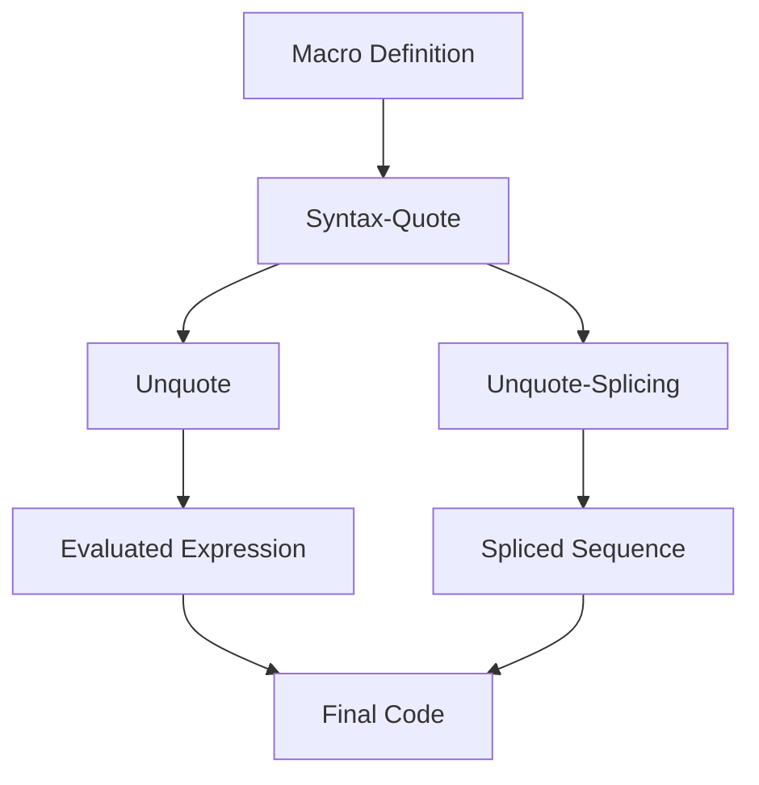

## 16.7 Quoting and Unquoting in Macro Definitions

In this section, we delve into the powerful concepts of quoting and unquoting within Clojure macro definitions. These tools are essential for creating dynamic and flexible code, allowing you to manipulate code as data—a core philosophy in Clojure. As experienced Java developers, you will find parallels in Java's reflection and metaprogramming capabilities, but Clojure offers a more seamless and integrated approach.

### Quoting Basics

**Quoting** in Clojure is a mechanism to prevent the evaluation of an expression. When you quote an expression, Clojure treats it as data rather than code to be executed. This is akin to Java's ability to treat code as strings or objects for later evaluation, but with more elegance and power.

#### Simple Quoting

In Clojure, you can quote an expression using the single quote (`'`). This tells Clojure to treat the following expression as a literal:

```clojure
;; Quoting a list
'(1 2 3) ; => (1 2 3)

;; Quoting a symbol
'my-symbol ; => my-symbol
```

In these examples, the quoted expressions are not evaluated. Instead, they are returned as data structures.

### Syntax-Quote

The **syntax-quote** (`` ` ``) is a more advanced form of quoting used primarily in macros. It not only quotes the expression but also resolves symbols to their fully qualified names, ensuring that they refer to the correct namespace. This is crucial in macros to avoid symbol clashes and ensure that the macro-generated code is correct.

#### Syntax-Quote Example

```clojure
;; Using syntax-quote
(defmacro my-macro []
  `(println "Hello, World!"))

;; Expands to
;; (clojure.core/println "Hello, World!")
```

In this example, the syntax-quote ensures that `println` is resolved to `clojure.core/println`, avoiding any ambiguity.

### Unquoting

**Unquoting** (`~`) allows you to evaluate parts of a syntax-quoted expression. This is similar to Java's string interpolation or template engines, where you can embed expressions within a template.

#### Unquoting Example

```clojure
(defmacro greet [name]
  `(println "Hello," ~name))

;; Usage
(greet "Alice") ; => Prints "Hello, Alice"
```

Here, `~name` is unquoted, meaning it is evaluated and its value is inserted into the syntax-quoted expression.

### Unquote-Splicing

**Unquote-splicing** (`~@`) is used to splice a sequence into a syntax-quoted list. This is particularly useful when you want to include multiple elements from a list or vector into a macro-generated list.

#### Unquote-Splicing Example

```clojure
(defmacro make-list [& elements]
  `(list ~@elements))

;; Usage
(make-list 1 2 3) ; => (1 2 3)
```

In this example, `~@elements` splices the elements into the list, resulting in a list containing 1, 2, and 3.

### Common Mistakes and How to Avoid Them

When working with quoting and unquoting, it's easy to make mistakes that can lead to unexpected behavior or errors. Here are some common pitfalls and how to avoid them:

1. **Forgetting to Unquote**: If you intend to evaluate a part of a syntax-quoted expression, ensure you use `~` or `~@` appropriately.

   ```clojure
   ;; Incorrect: The variable `name` is not unquoted
   `(println "Hello," name) ; => (clojure.core/println "Hello," name)

   ;; Correct: Use unquote
   `(println "Hello," ~name) ; => (clojure.core/println "Hello," "Alice")
   ```

2. **Misusing Unquote-Splicing**: Ensure that the expression following `~@` is a sequence. Otherwise, you may encounter runtime errors.

   ```clojure
   ;; Incorrect: Trying to splice a non-sequence
   `(list ~@1) ; => Error

   ;; Correct: Ensure it's a sequence
   `(list ~@(range 3)) ; => (0 1 2)
   ```

3. **Namespace Conflicts**: Always use syntax-quote in macros to avoid namespace issues. This ensures that symbols are resolved correctly.

   ```clojure
   ;; Without syntax-quote
   (defmacro my-macro []
     (list 'println "Hello"))

   ;; With syntax-quote
   (defmacro my-macro []
     `(println "Hello")) ; Ensures clojure.core/println is used
   ```

### Try It Yourself

To solidify your understanding, try modifying the examples above. Experiment with different expressions and see how quoting, unquoting, and unquote-splicing affect the output. For instance, try creating a macro that generates a function with a dynamic body based on input parameters.

### Visual Aids

To better understand the flow of quoting and unquoting, consider the following diagram illustrating how data flows through a macro definition using these concepts:



**Diagram Description**: This flowchart shows how a macro definition uses syntax-quote to handle namespaces, with unquote and unquote-splicing allowing for dynamic evaluation and sequence splicing, resulting in the final code.

### References and Links

For further reading and deeper understanding, consider the following resources:

- [Official Clojure Documentation on Macros](https://clojure.org/reference/macros)
- [ClojureDocs: Quoting and Unquoting](https://clojuredocs.org)
- [Clojure Programming by Chas Emerick, Brian Carper, and Christophe Grand](https://www.oreilly.com/library/view/clojure-programming/9781449310387/)

### Knowledge Check

To reinforce your learning, consider the following questions and exercises:

- What is the difference between quoting and syntax-quoting in Clojure?
- How does unquote-splicing differ from unquote?
- Create a macro that takes a list of numbers and generates a function that returns their sum.
- Experiment with namespace resolution in macros by creating a macro that uses a function from a different namespace.

### Summary

In this section, we've explored the powerful tools of quoting and unquoting in Clojure macro definitions. By mastering these concepts, you can create dynamic and flexible macros that leverage Clojure's code-as-data philosophy. Remember to experiment with the examples and apply these techniques to your own projects to fully grasp their potential.

## Quoting and Unquoting in Clojure Macros Quiz



### What is the primary purpose of quoting in Clojure?

- [x] To prevent evaluation of an expression
- [ ] To evaluate an expression
- [ ] To resolve namespaces
- [ ] To create a sequence

> **Explanation:** Quoting in Clojure is used to treat an expression as data rather than code to be executed.

### How does syntax-quote differ from a simple quote?

- [x] It resolves symbols to their fully qualified names
- [ ] It prevents evaluation of an expression
- [ ] It allows for string interpolation
- [ ] It creates a sequence

> **Explanation:** Syntax-quote resolves symbols to their fully qualified names, ensuring correct namespace resolution.

### What does the unquote (`~`) operator do in a syntax-quoted expression?

- [x] Evaluates the expression it precedes
- [ ] Prevents evaluation of the expression it precedes
- [ ] Splices a sequence into a list
- [ ] Creates a new namespace

> **Explanation:** The unquote operator evaluates the expression it precedes within a syntax-quoted expression.

### What is the role of unquote-splicing (`~@`) in a macro?

- [x] To splice a sequence into a list
- [ ] To evaluate an expression
- [ ] To prevent evaluation of an expression
- [ ] To resolve namespaces

> **Explanation:** Unquote-splicing is used to splice a sequence into a list within a syntax-quoted expression.

### Which of the following is a common mistake when using unquote-splicing?

- [x] Trying to splice a non-sequence
- [ ] Forgetting to quote an expression
- [ ] Using it outside of a macro
- [ ] Splicing into a vector

> **Explanation:** Unquote-splicing requires a sequence to be spliced; using a non-sequence will result in an error.

### What does the following macro expand to? `(defmacro my-macro [] `(println "Hello"))`

- [x] (clojure.core/println "Hello")
- [ ] (println "Hello")
- [ ] (my-macro)
- [ ] (clojure.core/print "Hello")

> **Explanation:** The syntax-quote ensures that `println` is resolved to `clojure.core/println`.

### How can you avoid namespace conflicts in macros?

- [x] Use syntax-quote to resolve symbols
- [ ] Use simple quote to prevent evaluation
- [ ] Use unquote to evaluate expressions
- [ ] Use unquote-splicing to splice sequences

> **Explanation:** Syntax-quote resolves symbols to their fully qualified names, avoiding namespace conflicts.

### What is the result of `(make-list 1 2 3)` if `make-list` is defined as `(defmacro make-list [& elements] `(list ~@elements))`?

- [x] (1 2 3)
- [ ] (list 1 2 3)
- [ ] (make-list 1 2 3)
- [ ] (clojure.core/list 1 2 3)

> **Explanation:** The macro expands to a list containing the elements 1, 2, and 3.

### Which operator would you use to include a dynamic value in a syntax-quoted expression?

- [x] Unquote (`~`)
- [ ] Quote (`'`)
- [ ] Syntax-quote (`` ` ``)
- [ ] Unquote-splicing (`~@`)

> **Explanation:** Unquote (`~`) is used to include a dynamic value in a syntax-quoted expression.

### True or False: Syntax-quote automatically resolves all symbols to their fully qualified names.

- [x] True
- [ ] False

> **Explanation:** Syntax-quote resolves symbols to their fully qualified names, ensuring correct namespace usage.



By mastering quoting and unquoting in Clojure macros, you can harness the full power of Clojure's metaprogramming capabilities, creating robust and dynamic code structures. Keep experimenting and applying these concepts to become proficient in Clojure macro development.
