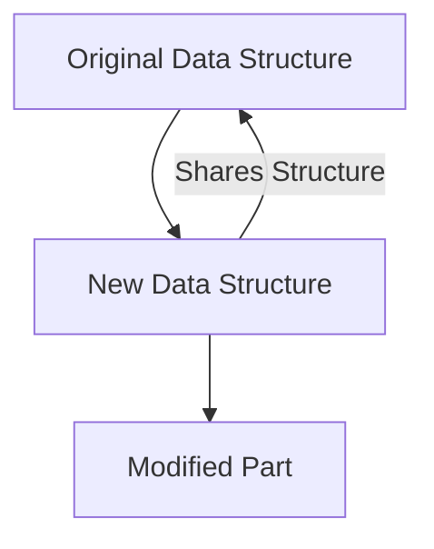
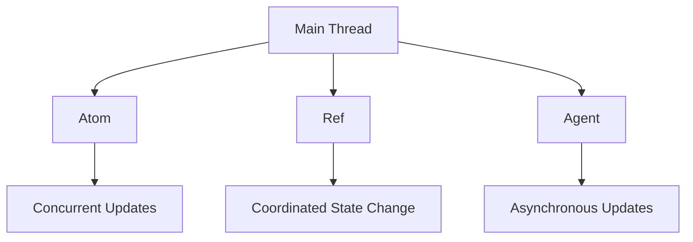

## 17.1 Understanding Performance in Functional Programs

As experienced Java developers, you are likely familiar with the intricacies of performance optimization in object-oriented programming. Transitioning to functional programming with Clojure introduces new paradigms that impact performance in unique ways. In this section, we will explore the performance characteristics of functional programming, focusing on immutability, benchmarking, garbage collection, and real-world scenarios. By understanding these concepts, you can make informed decisions when building scalable applications with Clojure.

### Functional Performance Characteristics

Functional programming offers several advantages, such as easier reasoning about code, reduced side effects, and enhanced concurrency. However, these benefits come with trade-offs that can impact performance. Let's delve into the key characteristics of functional programming that influence performance.

#### Immutability Overhead

Immutability is a cornerstone of functional programming, ensuring that data structures cannot be modified after creation. While this leads to safer and more predictable code, it can introduce performance overhead due to the need to create new data structures rather than modifying existing ones.

**Clojure's Approach to Immutability:**

Clojure optimizes for immutability using **persistent data structures**, which share structure between versions to minimize copying. This technique, known as **structural sharing**, allows for efficient updates and access times comparable to mutable structures.

```clojure
;; Example of a persistent vector in Clojure
(def original-vector [1 2 3 4 5])

;; Adding an element to the vector
(def updated-vector (conj original-vector 6))

;; original-vector remains unchanged
(println original-vector)  ; Output: [1 2 3 4 5]
(println updated-vector)   ; Output: [1 2 3 4 5 6]
```

**Comparison with Java:**

In Java, immutability is often achieved through defensive copying, which can be costly in terms of performance. Clojure's persistent data structures provide a more efficient alternative by reusing existing data.

**Try It Yourself:**

Experiment with different data structures in Clojure, such as maps and sets, to observe how structural sharing impacts performance. Compare the time complexity of operations like adding or removing elements.

#### Benchmarking Importance

Accurate benchmarking is crucial for understanding performance bottlenecks in functional programs. It helps identify areas where optimizations can be made and ensures that changes lead to actual improvements.

**Benchmarking in Clojure:**

Clojure provides tools like `criterium` for precise benchmarking. This library accounts for JVM warm-up time and garbage collection, offering reliable performance measurements.

```clojure
(require '[criterium.core :refer [quick-bench]])

;; Benchmarking a simple function
(quick-bench (reduce + (range 1000)))
```

**Best Practices:**

- **Isolate Code:** Benchmark isolated pieces of code to pinpoint specific bottlenecks.
- **Repeat Measurements:** Perform multiple runs to account for variability.
- **Consider Environment:** Ensure consistent testing environments to avoid skewed results.

**Real-World Application:**

Use benchmarking to compare different implementations of a function, such as recursive vs. iterative approaches, to determine the most efficient solution.

#### Garbage Collection Effects

Functional programs often generate more garbage due to the creation of new data structures. Understanding how garbage collection (GC) affects performance is vital for optimizing functional applications.

**GC in Functional Programming:**

Functional programs can lead to frequent garbage collection pauses, impacting latency and throughput. However, Clojure's use of persistent data structures can mitigate some of these effects by reducing the need for full copies.

**Java vs. Clojure:**

In Java, developers often manage memory manually to optimize performance. Clojure abstracts this complexity, but understanding GC behavior remains important for performance tuning.

**Strategies for Mitigation:**

- **Optimize Data Structures:** Use appropriate data structures to minimize garbage generation.
- **Profile GC Activity:** Use tools like VisualVM or JProfiler to monitor GC activity and identify problematic areas.
- **Tune JVM Settings:** Adjust JVM parameters to optimize garbage collection for your specific workload.

**Try It Yourself:**

Profile a Clojure application to observe garbage collection patterns. Experiment with different JVM settings to see how they affect performance.

### Real-World Scenarios

Functional programming can both improve and hinder performance, depending on the context. Let's explore scenarios where functional paradigms shine and where they may introduce challenges.

#### Performance Benefits

1. **Concurrency and Parallelism:**

   Functional programming's emphasis on immutability and pure functions makes it well-suited for concurrent and parallel processing. Clojure's concurrency primitives, such as atoms and refs, facilitate safe state management in multithreaded environments.

   ```clojure
   ;; Example of using an atom for concurrency
   (def counter (atom 0))

   (defn increment-counter []
     (swap! counter inc))

   ;; Increment counter concurrently
   (future (increment-counter))
   (future (increment-counter))
   ```

2. **Simplified Code Maintenance:**

   Functional code is often more concise and easier to reason about, reducing the likelihood of bugs and simplifying maintenance. This can lead to indirect performance benefits by enabling faster development cycles and easier debugging.

#### Performance Challenges

1. **Algorithm Complexity:**

   Some algorithms may not translate efficiently to a functional style, leading to increased complexity and performance overhead. It's important to evaluate the suitability of functional paradigms for specific tasks.

2. **Memory Usage:**

   The creation of new data structures can lead to increased memory usage, particularly in memory-constrained environments. Developers must balance the benefits of immutability with the potential for higher memory consumption.

**Decision-Making Framework:**

When deciding whether to use functional programming for a particular task, consider the following:

- **Task Complexity:** Evaluate whether the task benefits from functional paradigms, such as immutability and pure functions.
- **Performance Requirements:** Assess the performance requirements and whether functional programming can meet them.
- **Development Efficiency:** Consider the impact on development speed and code maintainability.

### Visual Aids

To enhance understanding, let's incorporate some diagrams that illustrate key concepts.

#### Immutability and Structural Sharing



**Diagram Description:** This diagram illustrates how Clojure's persistent data structures share structure between versions, minimizing copying and enhancing performance.

#### Concurrency Model



**Diagram Description:** This diagram depicts Clojure's concurrency model, highlighting the use of atoms, refs, and agents for managing state in concurrent applications.

### References and Links

For further reading and deeper dives into the topics covered, consider exploring the following resources:

- [Official Clojure Documentation](https://clojure.org/)
- [ClojureDocs](https://clojuredocs.org/)
- [Criterium GitHub Repository](https://github.com/hugoduncan/criterium)
- [VisualVM](https://visualvm.github.io/)
- [JProfiler](https://www.ej-technologies.com/products/jprofiler/overview.html)

### Knowledge Check

To reinforce your understanding of performance in functional programs, consider the following questions:

1. How does Clojure optimize for immutability?
2. What are the benefits of using persistent data structures?
3. Why is benchmarking important in functional programming?
4. How can garbage collection impact the performance of functional programs?
5. In what scenarios might functional programming improve performance?

### Encouraging Tone

Now that we've explored the performance characteristics of functional programming, you're well-equipped to make informed decisions when building scalable applications with Clojure. Remember, the key to mastering performance optimization is experimentation and continuous learning. Don't hesitate to dive deeper into the resources provided and apply these concepts to your projects.

### Best Practices for Tags

- "Clojure"
- "Functional Programming"
- "Performance Optimization"
- "Immutability"
- "Garbage Collection"
- "Benchmarking"
- "Java Interoperability"
- "Concurrency"

---

## Quiz: Understanding Performance in Functional Programs



### How does Clojure optimize for immutability?

- [x] By using persistent data structures with structural sharing
- [ ] By copying data structures entirely for each change
- [ ] By using mutable data structures
- [ ] By avoiding data structures altogether

> **Explanation:** Clojure uses persistent data structures with structural sharing to optimize for immutability, minimizing the need for full copies.

### What is the primary benefit of persistent data structures in Clojure?

- [x] Efficient updates and access times
- [ ] Increased memory usage
- [ ] Simplified syntax
- [ ] Reduced code readability

> **Explanation:** Persistent data structures provide efficient updates and access times by sharing structure between versions.

### Why is benchmarking important in functional programming?

- [x] To identify performance bottlenecks and ensure optimizations are effective
- [ ] To increase code complexity
- [ ] To avoid using functional paradigms
- [ ] To reduce the need for testing

> **Explanation:** Benchmarking helps identify performance bottlenecks and ensures that optimizations lead to actual improvements.

### How can garbage collection affect the performance of functional programs?

- [x] By causing pauses that impact latency and throughput
- [ ] By eliminating the need for memory management
- [ ] By improving code readability
- [ ] By reducing the need for data structures

> **Explanation:** Garbage collection can cause pauses that impact latency and throughput, especially in functional programs that generate more garbage.

### In what scenarios might functional programming improve performance?

- [x] In concurrent and parallel processing
- [ ] In tasks requiring mutable state
- [ ] In memory-constrained environments
- [ ] In tasks with high algorithm complexity

> **Explanation:** Functional programming's emphasis on immutability and pure functions makes it well-suited for concurrent and parallel processing.

### What is a potential drawback of functional programming in terms of performance?

- [x] Increased memory usage due to new data structures
- [ ] Simplified code maintenance
- [ ] Enhanced concurrency
- [ ] Reduced side effects

> **Explanation:** The creation of new data structures can lead to increased memory usage, particularly in memory-constrained environments.

### How can developers mitigate the impact of garbage collection in functional programs?

- [x] By optimizing data structures and tuning JVM settings
- [ ] By avoiding the use of data structures
- [ ] By increasing code complexity
- [ ] By reducing the use of pure functions

> **Explanation:** Developers can mitigate the impact of garbage collection by optimizing data structures and tuning JVM settings.

### What is a key consideration when deciding to use functional programming for a task?

- [x] Task complexity and performance requirements
- [ ] The availability of mutable data structures
- [ ] The need for manual memory management
- [ ] The desire to increase code complexity

> **Explanation:** It's important to evaluate task complexity and performance requirements when deciding to use functional programming.

### How does Clojure's use of persistent data structures benefit concurrency?

- [x] By facilitating safe state management in multithreaded environments
- [ ] By increasing the need for locks
- [ ] By reducing code readability
- [ ] By eliminating the need for data structures

> **Explanation:** Clojure's persistent data structures facilitate safe state management in multithreaded environments, enhancing concurrency.

### True or False: Functional programming always improves performance.

- [ ] True
- [x] False

> **Explanation:** While functional programming offers several performance benefits, it may not always improve performance, especially in scenarios with high algorithm complexity or memory constraints.




