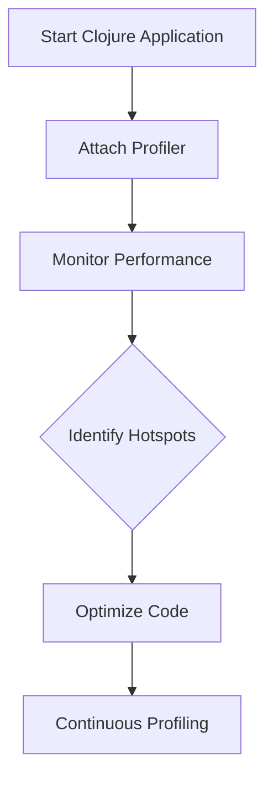

## 17.2 Profiling Clojure Applications

Profiling is an essential step in optimizing the performance of Clojure applications. As experienced Java developers, you are likely familiar with the importance of profiling to identify bottlenecks and improve application efficiency. In this section, we will explore various tools and techniques for profiling Clojure applications, including VisualVM, YourKit Java Profiler, and clj-async-profiler. We'll also delve into identifying performance hotspots, analyzing CPU and memory usage, and implementing continuous profiling in production environments.

### Profiling Tools

#### VisualVM

[VisualVM](https://visualvm.github.io/) is a powerful tool for monitoring and profiling Java applications, and it can be effectively used with Clojure applications as well. It provides a visual interface for analyzing heap dumps, thread activity, and CPU usage.

#### YourKit Java Profiler

[YourKit Java Profiler](https://www.yourkit.com/) offers advanced profiling capabilities, including CPU and memory profiling, thread analysis, and more. It is known for its user-friendly interface and detailed insights into application performance.

#### clj-async-profiler

[clj-async-profiler](https://github.com/clojure-goes-fast/clj-async-profiler) is a Clojure-specific tool that leverages the async-profiler, a low-overhead sampling profiler for Java. It is particularly useful for profiling Clojure applications due to its ability to handle Clojure's dynamic nature and provide detailed flame graphs.

### Setting Up Profilers

#### Integrating VisualVM with Clojure Projects

1. **Install VisualVM**: Download and install VisualVM from the [official website](https://visualvm.github.io/).
2. **Start Your Clojure Application**: Run your Clojure application using the `lein run` or `clj` command.
3. **Attach VisualVM**: Open VisualVM, and you should see your Clojure application listed under the "Local" tab. Click on it to start profiling.
4. **Monitor Performance**: Use the "Monitor" tab to observe CPU, memory, and thread usage in real-time.

#### Integrating YourKit Java Profiler

1. **Install YourKit**: Download and install YourKit Java Profiler from [yourkit.com](https://www.yourkit.com/).
2. **Start Your Application with YourKit Agent**: Add the YourKit agent to your application's JVM options. For example:
   ```shell
   java -agentpath:/path/to/yourkit/libyjpagent.so -jar your-clojure-app.jar
   ```
3. **Connect YourKit**: Launch YourKit and connect to your running application.
4. **Profile and Analyze**: Use the various tabs to analyze CPU usage, memory allocation, and more.

#### Setting Up clj-async-profiler

1. **Add Dependency**: Include clj-async-profiler in your `project.clj` or `deps.edn` file.
   ```clojure
   ;; project.clj
   :dependencies [[clj-async-profiler "0.5.1"]]
   ```
2. **Start Profiling**: Use the provided functions to start and stop profiling within your Clojure code.
   ```clojure
   (require '[clj-async-profiler.core :as prof])

   (prof/start)
   ;; Run your code
   (prof/stop)
   ```
3. **Generate Flame Graphs**: Analyze the generated flame graphs to identify performance bottlenecks.

### Identifying Hotspots

Profiling results can reveal performance hotspots in your code. These are areas where the application spends the most time or consumes the most resources. Identifying these hotspots is crucial for targeted optimization.

#### Interpreting Profiling Results

- **CPU Usage**: Look for methods or functions with high CPU time. These are potential candidates for optimization.
- **Memory Allocation**: Identify objects that consume significant memory. Consider optimizing data structures or using more efficient algorithms.
- **Thread Activity**: Analyze thread states to detect contention or deadlocks.

### CPU and Memory Analysis

Understanding CPU and memory usage is vital for optimizing Clojure applications. Profiling tools provide insights into how your application utilizes these resources.

#### Analyzing CPU Usage

- **Method Call Frequency**: Determine how often methods are called and their execution time.
- **Hot Methods**: Focus on methods with high CPU usage for optimization.
- **Parallel Execution**: Consider parallelizing tasks to improve CPU utilization.

#### Analyzing Memory Allocation

- **Heap Usage**: Monitor heap size and garbage collection activity.
- **Object Retention**: Identify objects that remain in memory longer than necessary.
- **Memory Leaks**: Use heap dumps to detect memory leaks and optimize memory management.

### Continuous Profiling

Continuous profiling involves monitoring application performance in production environments. This approach provides ongoing insights into application behavior and helps identify issues before they impact users.

#### Implementing Continuous Profiling

- **Automated Monitoring**: Set up automated tools to collect profiling data continuously.
- **Alerting**: Configure alerts for unusual CPU or memory usage patterns.
- **Data Analysis**: Regularly analyze collected data to identify trends and potential issues.

### Visual Aids

#### Profiling Workflow Diagram



*Figure 1: Profiling Workflow for Clojure Applications*

### References and Links

- [VisualVM Official Website](https://visualvm.github.io/)
- [YourKit Java Profiler](https://www.yourkit.com/)
- [clj-async-profiler GitHub Repository](https://github.com/clojure-goes-fast/clj-async-profiler)
- [ClojureDocs](https://clojuredocs.org/)

### Knowledge Check

1. What are the primary tools for profiling Clojure applications?
2. How can you integrate VisualVM with a Clojure project?
3. What is the purpose of continuous profiling in production environments?

### Exercises

1. **Exercise 1**: Set up VisualVM with a sample Clojure application and identify a performance hotspot.
2. **Exercise 2**: Use clj-async-profiler to generate a flame graph for a Clojure application and analyze the results.

### Summary

Profiling is a critical aspect of performance optimization in Clojure applications. By leveraging tools like VisualVM, YourKit Java Profiler, and clj-async-profiler, you can gain valuable insights into CPU and memory usage, identify performance hotspots, and implement continuous profiling for ongoing performance improvements. As you apply these techniques, you'll be better equipped to build efficient, scalable Clojure applications.

## Quiz: Mastering Profiling in Clojure Applications



### Which tool is specifically designed for profiling Clojure applications?

- [ ] VisualVM
- [ ] YourKit Java Profiler
- [x] clj-async-profiler
- [ ] JProfiler

> **Explanation:** clj-async-profiler is tailored for Clojure applications, providing detailed insights into their performance.

### What is the primary benefit of continuous profiling?

- [x] Ongoing performance insights
- [ ] Reducing code complexity
- [ ] Enhancing security
- [ ] Simplifying deployment

> **Explanation:** Continuous profiling provides ongoing insights into application performance, helping to identify issues before they affect users.

### How can you start profiling a Clojure application with VisualVM?

- [x] Attach VisualVM to the running application
- [ ] Modify the application code
- [ ] Use a command-line tool
- [ ] Install a browser extension

> **Explanation:** VisualVM can be attached to a running application to start profiling without modifying the code.

### What should you focus on when analyzing CPU usage?

- [x] Method call frequency and execution time
- [ ] Network latency
- [ ] Disk I/O
- [ ] User interface responsiveness

> **Explanation:** Analyzing method call frequency and execution time helps identify CPU-intensive operations.

### Which of the following is a sign of a memory leak?

- [x] Increasing heap usage over time
- [ ] High CPU usage
- [ ] Slow network requests
- [ ] Frequent disk writes

> **Explanation:** Memory leaks often manifest as increasing heap usage over time, leading to potential application crashes.

### What is the role of flame graphs in profiling?

- [x] Visualizing performance hotspots
- [ ] Debugging syntax errors
- [ ] Monitoring network traffic
- [ ] Managing user sessions

> **Explanation:** Flame graphs provide a visual representation of performance hotspots, making it easier to identify bottlenecks.

### How can you optimize memory allocation in a Clojure application?

- [x] Identify and optimize data structures
- [ ] Increase CPU cores
- [ ] Reduce network bandwidth
- [ ] Simplify user interface

> **Explanation:** Optimizing data structures can reduce memory allocation and improve application performance.

### What is a common method for detecting thread contention?

- [x] Analyzing thread states
- [ ] Checking network logs
- [ ] Reviewing user feedback
- [ ] Monitoring disk usage

> **Explanation:** Analyzing thread states helps detect contention, which can lead to performance issues.

### Which profiler provides a user-friendly interface for detailed insights?

- [ ] VisualVM
- [x] YourKit Java Profiler
- [ ] clj-async-profiler
- [ ] NetBeans Profiler

> **Explanation:** YourKit Java Profiler is known for its user-friendly interface and detailed insights into application performance.

### True or False: Continuous profiling is only useful during the development phase.

- [ ] True
- [x] False

> **Explanation:** Continuous profiling is valuable in production environments as well, providing ongoing insights into application performance.


