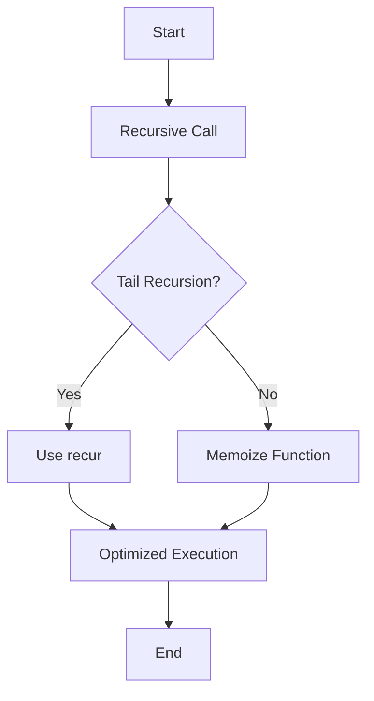

## 17.3 Optimizing Recursive Functions

In the realm of functional programming, recursion is a fundamental concept that allows us to solve problems by breaking them down into smaller, more manageable sub-problems. However, recursion can sometimes lead to performance issues, particularly when dealing with deep recursive calls. In this section, we will explore various techniques to optimize recursive functions in Clojure, ensuring they are both efficient and robust.

### Tail Recursion for Efficiency

Tail recursion is a powerful optimization technique that can significantly improve the performance of recursive functions. In Clojure, the `recur` special form is used to implement tail recursion, allowing recursive calls to be optimized by the compiler to avoid stack overflow errors.

#### Understanding Tail Recursion

Tail recursion occurs when a function's recursive call is the last operation performed before returning a result. This allows the compiler to optimize the recursive call by reusing the current function's stack frame, effectively transforming the recursion into iteration.

**Example of Tail Recursion in Clojure:**

```clojure
(defn factorial [n]
  (letfn [(fact-helper [n acc]
            (if (zero? n)
              acc
              (recur (dec n) (* acc n))))]
    (fact-helper n 1)))

;; Usage
(factorial 5) ; => 120
```

In this example, `fact-helper` is a tail-recursive function that calculates the factorial of a number. The `recur` form ensures that the recursive call is the last operation, allowing the function to execute efficiently without growing the call stack.

#### Avoiding Stack Overflows

One of the primary benefits of tail recursion is its ability to prevent stack overflow errors, which can occur in deep recursive calls. By reusing the current stack frame, tail recursion ensures that the stack does not grow with each recursive call.

**Comparison with Non-Tail Recursive Function:**

```clojure
(defn non-tail-recursive-factorial [n]
  (if (zero? n)
    1
    (* n (non-tail-recursive-factorial (dec n)))))

;; Usage
(non-tail-recursive-factorial 5) ; => 120
```

While the non-tail-recursive version of the factorial function works for small inputs, it can lead to stack overflow errors for larger inputs due to the accumulation of stack frames.

### Memoization Techniques

Memoization is a technique used to cache the results of expensive function calls and reuse them when the same inputs occur again. This can significantly improve the performance of recursive functions, especially when they involve repeated calculations.

#### Implementing Memoization in Clojure

Clojure provides a built-in `memoize` function that can be used to memoize any function. This is particularly useful for recursive functions that perform redundant calculations.

**Example of Memoized Recursive Function:**

```clojure
(defn fib [n]
  (if (<= n 1)
    n
    (+ (fib (dec n)) (fib (- n 2)))))

(def memoized-fib (memoize fib))

;; Usage
(memoized-fib 40) ; => 102334155
```

In this example, the `fib` function calculates Fibonacci numbers recursively. By memoizing `fib`, we avoid redundant calculations, significantly improving performance for larger inputs.

#### Benefits of Memoization

- **Improved Performance**: By caching results, memoization reduces the number of recursive calls, leading to faster execution times.
- **Reduced Redundancy**: Memoization eliminates redundant calculations, making recursive functions more efficient.

### Iterative Alternatives

While recursion is a natural fit for many problems, there are cases where iterative solutions may be more efficient. In Clojure, we can use loops or higher-order functions to convert recursive solutions into iterative ones.

#### Converting Recursion to Iteration

In some cases, converting a recursive function to an iterative one can improve performance by eliminating the overhead of recursive calls.

**Example of Iterative Factorial Function:**

```clojure
(defn iterative-factorial [n]
  (loop [i n acc 1]
    (if (zero? i)
      acc
      (recur (dec i) (* acc i)))))

;; Usage
(iterative-factorial 5) ; => 120
```

In this example, the `iterative-factorial` function uses a `loop` construct to calculate the factorial iteratively, avoiding the overhead of recursive calls.

#### Using Higher-Order Functions

Higher-order functions such as `reduce` can also be used to implement iterative solutions in a functional style.

**Example Using `reduce`:**

```clojure
(defn factorial-using-reduce [n]
  (reduce * (range 1 (inc n))))

;; Usage
(factorial-using-reduce 5) ; => 120
```

The `factorial-using-reduce` function leverages `reduce` to calculate the factorial, providing a concise and efficient solution.

### Practical Examples

Let's explore some practical examples that demonstrate the optimization of recursive functions in Clojure.

#### Optimizing a Recursive Fibonacci Function

**Before Optimization:**

```clojure
(defn fib [n]
  (if (<= n 1)
    n
    (+ (fib (dec n)) (fib (- n 2)))))

;; Usage
(fib 10) ; => 55
```

**After Optimization with Memoization:**

```clojure
(def memoized-fib (memoize fib))

;; Usage
(memoized-fib 40) ; => 102334155
```

By memoizing the Fibonacci function, we avoid redundant calculations, resulting in a significant performance boost.

#### Optimizing a Recursive Sum Function

**Before Optimization:**

```clojure
(defn sum [coll]
  (if (empty? coll)
    0
    (+ (first coll) (sum (rest coll)))))

;; Usage
(sum [1 2 3 4 5]) ; => 15
```

**After Optimization with Tail Recursion:**

```clojure
(defn tail-recursive-sum [coll]
  (letfn [(sum-helper [coll acc]
            (if (empty? coll)
              acc
              (recur (rest coll) (+ acc (first coll)))))]
    (sum-helper coll 0)))

;; Usage
(tail-recursive-sum [1 2 3 4 5]) ; => 15
```

By using tail recursion, we optimize the sum function to handle larger collections without risking stack overflow.

### Visualizing Recursive Optimization

To better understand the flow of data and the optimization techniques discussed, let's visualize the process using a flowchart.



**Diagram Description:** This flowchart illustrates the decision-making process for optimizing recursive functions. If a function is tail-recursive, we use `recur` to optimize it. Otherwise, we consider memoization to cache results and improve performance.

### References and Further Reading

- [Clojure Documentation on Recursion](https://clojure.org/reference/recursion)
- [ClojureDocs: recur](https://clojuredocs.org/clojure.core/recur)
- [Memoization in Clojure](https://clojure.org/reference/memoization)

### Knowledge Check

To reinforce your understanding of recursive optimization techniques, try answering the following questions:

1. What is tail recursion, and how does it improve performance in recursive functions?
2. How does memoization enhance the efficiency of recursive functions?
3. When might it be beneficial to convert a recursive solution to an iterative one?
4. How does the `recur` special form help prevent stack overflow errors?

### Exercises

1. **Exercise 1:** Optimize the following recursive function using tail recursion:

   ```clojure
   (defn reverse-list [lst]
     (if (empty? lst)
       '()
       (conj (reverse-list (rest lst)) (first lst))))
   ```

2. **Exercise 2:** Implement a memoized version of a recursive function that calculates the nth triangular number.

3. **Exercise 3:** Convert the following recursive function to an iterative one using `loop`:

   ```clojure
   (defn count-elements [coll]
     (if (empty? coll)
       0
       (inc (count-elements (rest coll)))))
   ```

### Summary

In this section, we've explored various techniques to optimize recursive functions in Clojure, including tail recursion, memoization, and iterative alternatives. By applying these techniques, you can enhance the performance and robustness of your recursive functions, ensuring they are well-suited for real-world applications.

---

## Quiz: Mastering Recursive Function Optimization in Clojure



### What is the primary benefit of using tail recursion in Clojure?

- [x] It prevents stack overflow errors by reusing the current stack frame.
- [ ] It makes the code more readable.
- [ ] It automatically memoizes the function.
- [ ] It allows for parallel execution.

> **Explanation:** Tail recursion optimizes recursive calls by reusing the current stack frame, preventing stack overflow errors.

### How does memoization improve the performance of recursive functions?

- [x] By caching results of previous calls to avoid redundant calculations.
- [ ] By converting recursion to iteration.
- [ ] By increasing the stack size.
- [ ] By using parallel processing.

> **Explanation:** Memoization caches results of previous function calls, reducing redundant calculations and improving performance.

### When should you consider converting a recursive solution to an iterative one?

- [x] When the recursive solution is inefficient or causes stack overflow.
- [ ] When the function is already tail-recursive.
- [ ] When the function is memoized.
- [ ] When the function is pure.

> **Explanation:** Converting to iteration can improve efficiency and prevent stack overflow in non-tail-recursive functions.

### Which Clojure construct is used to implement tail recursion?

- [x] recur
- [ ] loop
- [ ] reduce
- [ ] map

> **Explanation:** The `recur` special form is used in Clojure to implement tail recursion.

### What is a potential downside of using memoization?

- [x] Increased memory usage due to cached results.
- [ ] Slower execution time.
- [ ] Increased stack size.
- [ ] Reduced code readability.

> **Explanation:** Memoization can increase memory usage because it caches results of function calls.

### What is the purpose of the `loop` construct in Clojure?

- [x] To create iterative loops with local bindings.
- [ ] To memoize functions.
- [ ] To implement tail recursion.
- [ ] To handle exceptions.

> **Explanation:** The `loop` construct is used to create iterative loops with local bindings in Clojure.

### How can you prevent stack overflow in deep recursive calls?

- [x] Use tail recursion with `recur`.
- [ ] Use memoization.
- [ ] Use higher-order functions.
- [ ] Use exception handling.

> **Explanation:** Tail recursion with `recur` prevents stack overflow by reusing the current stack frame.

### What is the role of higher-order functions in optimizing recursive solutions?

- [x] They can replace recursion with iteration.
- [ ] They automatically memoize functions.
- [ ] They increase the stack size.
- [ ] They handle exceptions.

> **Explanation:** Higher-order functions like `reduce` can replace recursion with iteration, optimizing performance.

### Which of the following is a higher-order function in Clojure?

- [x] reduce
- [ ] recur
- [ ] loop
- [ ] memoize

> **Explanation:** `reduce` is a higher-order function that can be used to implement iterative solutions.

### True or False: Tail recursion can be used to optimize any recursive function.

- [ ] True
- [x] False

> **Explanation:** Tail recursion can only be used when the recursive call is the last operation in the function.



By mastering these optimization techniques, you can write efficient and scalable recursive functions in Clojure, leveraging the power of functional programming to build robust applications.
