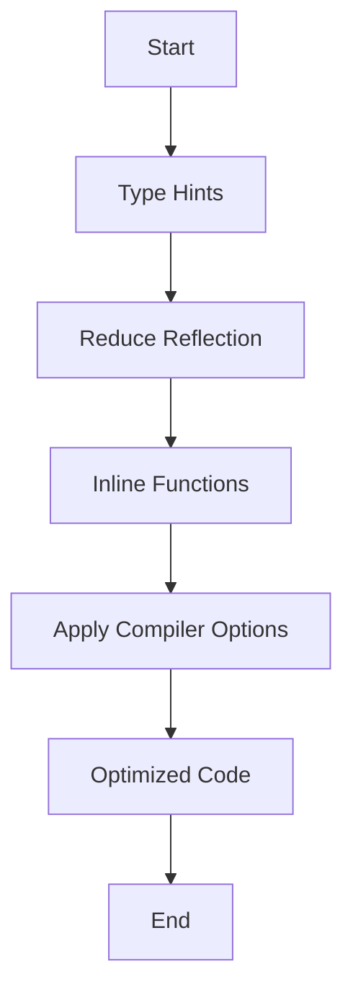

## 17.5 Leveraging Compiler Optimizations and Hints

In this section, we delve into the intricacies of optimizing Clojure code by leveraging compiler optimizations and hints. As experienced Java developers, you are likely familiar with the importance of performance tuning and the role of the compiler in optimizing code execution. Clojure, being a dynamic language that runs on the JVM, provides several mechanisms to enhance performance, including type hints, avoiding reflection, inlining functions, and utilizing compiler options. Let's explore these concepts in detail.

### Type Hints: Reducing Reflection and Improving Performance

Type hints in Clojure are annotations that inform the compiler about the expected types of expressions. By providing type hints, you can significantly reduce the overhead of reflection, which is the process of inspecting and invoking methods at runtime. Reflection can be costly in terms of performance, especially in tight loops or frequently called functions.

#### Understanding Type Hints

Type hints are added using metadata, which is a map associated with a symbol. In Clojure, you can add type hints using the `^` symbol followed by the type. For instance, if you know that a particular variable will always hold a `String`, you can hint it as follows:

```clojure
(defn greet [^String name]
  (str "Hello, " name))
```

In this example, the `^String` hint tells the compiler that `name` is expected to be a `String`, allowing it to generate more efficient bytecode.

#### Benefits of Type Hints

- **Reduced Reflection**: By specifying types, the compiler can bypass reflection, leading to faster method invocations.
- **Improved Performance**: Type hints can lead to significant performance improvements, particularly in computationally intensive code.
- **Enhanced Readability**: While Clojure is dynamically typed, type hints can serve as documentation, making the code easier to understand.

#### Example: Type Hints in Action

Consider the following example where we calculate the sum of a list of numbers:

```clojure
(defn sum-numbers [numbers]
  (reduce + numbers))

;; Adding type hints
(defn sum-numbers-optimized [^java.util.List numbers]
  (reduce + numbers))
```

In the optimized version, we hint that `numbers` is a `java.util.List`, which can help the compiler generate more efficient bytecode.

### Avoiding Reflection: Identifying and Eliminating Reflective Calls

Reflection in Clojure can be a performance bottleneck. Fortunately, Clojure provides tools to identify and eliminate reflective method calls.

#### Using `reflect` and Compiler Warnings

The `reflect` library in Clojure can be used to inspect Java classes and methods, helping you understand where reflection might occur. Additionally, you can enable compiler warnings to alert you to reflective calls:

```clojure
(set! *warn-on-reflection* true)
```

By setting `*warn-on-reflection*` to `true`, the compiler will emit warnings whenever reflection is used, allowing you to address these issues proactively.

#### Example: Eliminating Reflection

Let's consider a scenario where we need to access a method on a Java object:

```clojure
(defn get-length [s]
  (.length s))

;; With reflection warning
(set! *warn-on-reflection* true)
(defn get-length-reflective [s]
  (.length s))
```

In the reflective version, the compiler will warn us about the use of reflection. By adding a type hint, we can eliminate this warning:

```clojure
(defn get-length-optimized [^String s]
  (.length s))
```

### Inlining Functions: Enhancing Performance with Small Functions

Inlining is a compiler optimization technique where small functions are expanded inline, reducing the overhead of function calls. In Clojure, the compiler can automatically inline certain functions, especially those marked with the `:inline` metadata.

#### Benefits of Inlining

- **Reduced Function Call Overhead**: Inlining eliminates the need for a function call, which can be beneficial in performance-critical code.
- **Improved Execution Speed**: By expanding functions inline, the compiler can optimize the generated bytecode more effectively.

#### Example: Inlining Functions

Consider a simple function that adds two numbers:

```clojure
(defn add [a b]
  (+ a b))

;; Inlined version
(defn add-inlined [a b]
  (let [result (+ a b)]
    result))
```

In the inlined version, the addition operation is expanded inline, potentially improving performance.

### Compiler Options: Flags for Optimization

Clojure provides several compiler options that can be used to optimize code execution. Two notable options are `:elide-meta` and `:direct-linking`.

#### Using `:elide-meta`

The `:elide-meta` option allows you to specify metadata keys that should be omitted from the compiled code. This can reduce the size of the generated bytecode and improve performance.

```clojure
;; Example of using :elide-meta
(def ^{:private true} secret-value 42)

;; Compiler option
{:elide-meta [:private]}
```

In this example, the `:private` metadata is elided, reducing the size of the compiled code.

#### Using `:direct-linking`

The `:direct-linking` option enables direct method calls, bypassing the dynamic dispatch mechanism. This can lead to significant performance improvements, especially in large codebases.

```clojure
;; Compiler option
{:direct-linking true}
```

By enabling `:direct-linking`, you instruct the compiler to generate direct method calls, improving execution speed.

### Example Implementations: Demonstrating Compiler Optimizations

Let's put these concepts into practice with a comprehensive example. We'll implement a function that processes a list of numbers, applying various optimizations.

```clojure
(ns performance-optimization
  (:require [clojure.reflect :as reflect]))

;; Original function
(defn process-numbers [numbers]
  (map #(+ % 1) numbers))

;; Optimized with type hints
(defn process-numbers-optimized [^java.util.List numbers]
  (map #(+ % 1) numbers))

;; Enable reflection warnings
(set! *warn-on-reflection* true)

;; Optimized with inlining
(defn process-numbers-inlined [^java.util.List numbers]
  (map (fn [^Integer n] (let [result (+ n 1)] result)) numbers))

;; Using compiler options
(defn process-numbers-final [^java.util.List numbers]
  (map (fn [^Integer n] (let [result (+ n 1)] result)) numbers))

;; Compiler options
{:elide-meta [:private]
 :direct-linking true}
```

In this example, we start with a basic function that increments each number in a list. We then apply type hints, enable reflection warnings, inline the addition operation, and use compiler options to optimize performance.

### Visual Aids: Understanding Compiler Optimizations

To better understand the flow of data and the impact of compiler optimizations, let's visualize the process using a flowchart.



**Figure 1**: Flowchart illustrating the process of optimizing Clojure code using compiler optimizations and hints.

### References and Links

- [Official Clojure Documentation](https://clojure.org/reference)
- [ClojureDocs](https://clojuredocs.org/)
- [Clojure Reflect Library](https://clojure.github.io/clojure/clojure.reflect-api.html)

### Knowledge Check

To reinforce your understanding of compiler optimizations in Clojure, consider the following questions:

1. What are type hints, and how do they improve performance in Clojure?
2. How can you enable compiler warnings for reflective calls?
3. What is the benefit of inlining functions in Clojure?
4. Describe the purpose of the `:elide-meta` compiler option.
5. How does `:direct-linking` enhance performance in Clojure applications?

### Exercises

1. **Experiment with Type Hints**: Modify the provided code examples to include additional type hints. Observe the impact on performance by measuring execution time.
2. **Identify Reflective Calls**: Enable reflection warnings in your Clojure project and identify any reflective calls. Refactor the code to eliminate these calls.
3. **Apply Compiler Options**: Use the `:elide-meta` and `:direct-linking` options in a sample project. Compare the performance before and after applying these options.

### Summary

In this section, we've explored how to leverage compiler optimizations and hints to enhance the performance of Clojure applications. By understanding and applying type hints, avoiding reflection, inlining functions, and utilizing compiler options, you can significantly improve the efficiency of your code. As you continue to develop in Clojure, keep these techniques in mind to build scalable and performant applications.

## Quiz: Mastering Compiler Optimizations in Clojure



### What is the primary benefit of using type hints in Clojure?

- [x] Reducing reflection overhead
- [ ] Increasing code readability
- [ ] Enabling dynamic typing
- [ ] Simplifying syntax

> **Explanation:** Type hints reduce reflection overhead by informing the compiler about expected types, allowing for more efficient bytecode generation.

### How can you enable compiler warnings for reflective calls in Clojure?

- [x] Set `*warn-on-reflection*` to `true`
- [ ] Use the `:warn-reflection` compiler option
- [ ] Add `^reflect` metadata to functions
- [ ] Enable `:reflection-warnings` in project settings

> **Explanation:** Setting `*warn-on-reflection*` to `true` enables compiler warnings for reflective calls, helping identify performance bottlenecks.

### What is the purpose of inlining functions in Clojure?

- [x] To reduce function call overhead
- [ ] To increase code modularity
- [ ] To enable dynamic dispatch
- [ ] To simplify debugging

> **Explanation:** Inlining functions reduces function call overhead by expanding small functions inline, improving execution speed.

### Which compiler option allows for direct method calls in Clojure?

- [x] `:direct-linking`
- [ ] `:inline-methods`
- [ ] `:method-calls`
- [ ] `:direct-methods`

> **Explanation:** The `:direct-linking` option enables direct method calls, bypassing dynamic dispatch and enhancing performance.

### What does the `:elide-meta` compiler option do?

- [x] Omits specified metadata from compiled code
- [ ] Enables metadata reflection
- [ ] Adds metadata to all functions
- [ ] Inlines metadata into bytecode

> **Explanation:** The `:elide-meta` option specifies metadata keys to be omitted from compiled code, reducing bytecode size.

### Which of the following is a benefit of avoiding reflection in Clojure?

- [x] Improved performance
- [ ] Enhanced code readability
- [ ] Simplified syntax
- [ ] Increased dynamic typing

> **Explanation:** Avoiding reflection improves performance by reducing the overhead associated with runtime method inspection and invocation.

### How can you identify reflective calls in your Clojure code?

- [x] Enable `*warn-on-reflection*` and check compiler warnings
- [ ] Use the `:reflective-calls` compiler option
- [ ] Add `^reflect` metadata to variables
- [ ] Enable `:reflection-check` in project settings

> **Explanation:** Enabling `*warn-on-reflection*` provides compiler warnings for reflective calls, allowing you to identify and address them.

### What is the impact of using type hints on code readability?

- [x] Type hints can serve as documentation
- [ ] Type hints obscure code logic
- [ ] Type hints simplify syntax
- [ ] Type hints enable dynamic typing

> **Explanation:** While Clojure is dynamically typed, type hints can serve as documentation, making the code easier to understand.

### Which compiler option is used to optimize metadata handling in Clojure?

- [x] `:elide-meta`
- [ ] `:meta-optimize`
- [ ] `:optimize-meta`
- [ ] `:meta-handling`

> **Explanation:** The `:elide-meta` option optimizes metadata handling by omitting specified metadata keys from compiled code.

### True or False: Inlining functions always improves performance in Clojure.

- [x] True
- [ ] False

> **Explanation:** Inlining functions generally improves performance by reducing function call overhead, especially for small functions.


