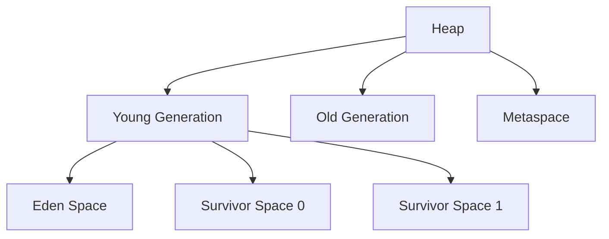

## 17.6 Managing Memory and Garbage Collection

As experienced Java developers, you are likely familiar with the intricacies of the Java Virtual Machine (JVM) and its memory management capabilities. In this section, we will delve into how these concepts apply to Clojure, a functional language that runs on the JVM. We will explore the JVM memory model, techniques for monitoring and optimizing memory usage, and strategies for tuning garbage collection to enhance the performance of your Clojure applications.

### JVM Memory Model

The JVM memory model is a crucial aspect of understanding how Clojure applications manage memory. The JVM divides memory into several areas, with the heap being the primary area for object storage. The heap is further divided into the young and old generations, each serving a specific purpose in memory management.

#### Heap Structure

- **Young Generation**: This is where new objects are allocated. It is divided into three spaces: Eden, and two Survivor spaces (S0 and S1). Most objects are created in the Eden space, and those that survive garbage collection are moved to the Survivor spaces.
  
- **Old Generation**: Objects that have survived multiple garbage collection cycles in the young generation are promoted to the old generation. This space is typically larger and is where long-lived objects reside.

- **Permanent Generation (Metaspace in Java 8+)**: This area stores metadata about classes and methods. In Java 8 and later, the permanent generation has been replaced by Metaspace, which is not part of the heap.



*Diagram: JVM Heap Structure*

### Monitoring Memory Usage

Monitoring memory usage is essential for identifying potential bottlenecks and optimizing application performance. Tools like VisualVM and JConsole provide insights into memory consumption and garbage collection activity.

#### Using VisualVM

VisualVM is a powerful tool for monitoring and profiling Java applications. It provides a graphical interface to view heap usage, garbage collection activity, and thread activity.

- **Heap Dump Analysis**: VisualVM allows you to take heap dumps, which can be analyzed to identify memory leaks and excessive object creation.
- **Garbage Collection Monitoring**: VisualVM provides real-time graphs of garbage collection activity, helping you understand how often collections occur and their impact on application performance.

#### Using JConsole

JConsole is another tool that comes with the JDK, offering a simpler interface for monitoring Java applications.

- **Memory Tab**: The Memory tab in JConsole shows the current heap usage and allows you to perform garbage collection manually.
- **Threads Tab**: This tab provides information about thread activity, which can be useful for identifying concurrency issues.

### Tuning the Garbage Collector

Selecting and tuning the right garbage collector (GC) is crucial for optimizing the performance of Clojure applications. The JVM offers several garbage collectors, each with its strengths and trade-offs.

#### Garbage Collector Options

- **G1 Garbage Collector**: The G1 GC is designed for applications with large heaps and aims to provide predictable pause times. It divides the heap into regions and performs garbage collection incrementally.

- **Z Garbage Collector (ZGC)**: ZGC is a low-latency garbage collector that aims to keep pause times below 10ms. It is suitable for applications requiring minimal disruption due to garbage collection.

- **Shenandoah GC**: Similar to ZGC, Shenandoah is designed for low pause times and is available in OpenJDK.

#### Tuning Strategies

- **Heap Size Configuration**: Adjusting the initial and maximum heap size can help manage memory usage and garbage collection frequency. Use the `-Xms` and `-Xmx` flags to set these values.

- **GC Logging**: Enable GC logging to gain insights into garbage collection activity. Use flags like `-XX:+PrintGCDetails` and `-XX:+PrintGCTimeStamps` to log detailed information.

- **Pause Time Goals**: For G1 GC, you can set pause time goals using the `-XX:MaxGCPauseMillis` flag to influence how the collector prioritizes pause times.

### Reducing Object Creation

Minimizing unnecessary object creation is a key strategy for reducing garbage collection pressure. In Clojure, this can be achieved through several techniques:

#### Use of Persistent Data Structures

Clojure's persistent data structures are designed to minimize object creation by sharing structure between versions. This reduces the need for copying entire data structures when making modifications.

```clojure
;; Example of using a persistent vector
(def original-vector [1 2 3])
(def modified-vector (conj original-vector 4))

;; Both vectors share structure, minimizing object creation
```

#### Avoiding Intermediate Collections

When processing collections, avoid creating unnecessary intermediate collections. Use transducers or lazy sequences to process data efficiently.

```clojure
;; Using transducers to avoid intermediate collections
(def xf (comp (filter even?) (map inc)))
(transduce xf conj [] (range 10))
```

### Memory Leaks Detection

Memory leaks occur when objects are no longer needed but are not garbage collected due to lingering references. Detecting and fixing memory leaks is crucial for maintaining application performance.

#### Identifying Memory Leaks

- **Heap Dumps**: Analyze heap dumps using tools like VisualVM to identify objects that are consuming excessive memory.
- **Reference Chains**: Use tools to trace reference chains to objects that should be collected but are not.

#### Fixing Memory Leaks

- **Weak References**: Use weak references for objects that should not prevent garbage collection. Clojure provides `clojure.lang.WeakReference` for this purpose.
- **Clearing References**: Ensure that references to objects are cleared when they are no longer needed.

### Try It Yourself

Experiment with the concepts discussed by modifying the following code examples:

1. **Heap Size Adjustment**: Run a Clojure application with different heap size settings and observe the impact on performance.
2. **Garbage Collector Selection**: Switch between different garbage collectors and compare their performance using VisualVM.
3. **Persistent Data Structures**: Modify a Clojure program to use persistent data structures and measure the reduction in object creation.

### Knowledge Check

Let's reinforce your understanding with a quiz on memory management and garbage collection in Clojure.

## Memory Management and Garbage Collection Quiz



### What is the primary purpose of the young generation in the JVM heap?

- [x] To allocate new objects
- [ ] To store long-lived objects
- [ ] To manage class metadata
- [ ] To handle garbage collection

> **Explanation:** The young generation is where new objects are allocated. It is designed to handle short-lived objects efficiently.

### Which tool provides a graphical interface for monitoring Java applications?

- [x] VisualVM
- [ ] JConsole
- [ ] Eclipse
- [ ] IntelliJ IDEA

> **Explanation:** VisualVM provides a graphical interface for monitoring and profiling Java applications, including heap usage and garbage collection.

### What is the main advantage of using the G1 garbage collector?

- [x] Predictable pause times
- [ ] Minimal memory usage
- [ ] Fast object allocation
- [ ] High throughput

> **Explanation:** The G1 garbage collector is designed to provide predictable pause times, making it suitable for applications with large heaps.

### How can you reduce object creation in Clojure?

- [x] Use persistent data structures
- [ ] Increase heap size
- [ ] Enable GC logging
- [ ] Use weak references

> **Explanation:** Persistent data structures in Clojure share structure between versions, reducing the need for creating new objects.

### What is a common cause of memory leaks in applications?

- [x] Lingering references
- [ ] Insufficient heap size
- [ ] Frequent garbage collection
- [ ] High CPU usage

> **Explanation:** Memory leaks often occur due to lingering references that prevent objects from being garbage collected.

### Which flag is used to set the maximum heap size in the JVM?

- [x] -Xmx
- [ ] -Xms
- [ ] -XX:+PrintGCDetails
- [ ] -XX:MaxGCPauseMillis

> **Explanation:** The `-Xmx` flag is used to set the maximum heap size for a JVM application.

### What is the purpose of weak references in memory management?

- [x] To allow objects to be garbage collected
- [ ] To increase object creation speed
- [ ] To improve CPU performance
- [ ] To manage thread activity

> **Explanation:** Weak references allow objects to be garbage collected even if they are still referenced, helping to prevent memory leaks.

### Which garbage collector is known for low pause times?

- [x] ZGC
- [ ] G1
- [ ] CMS
- [ ] Serial

> **Explanation:** ZGC is designed for low pause times, making it suitable for applications requiring minimal disruption due to garbage collection.

### How can you analyze heap dumps to identify memory leaks?

- [x] Use VisualVM
- [ ] Use JConsole
- [ ] Use Eclipse
- [ ] Use IntelliJ IDEA

> **Explanation:** VisualVM allows you to take and analyze heap dumps to identify memory leaks and excessive object creation.

### True or False: The old generation in the JVM heap is where new objects are allocated.

- [ ] True
- [x] False

> **Explanation:** False. The old generation is where long-lived objects reside, while new objects are allocated in the young generation.



By understanding and applying these memory management and garbage collection strategies, you can optimize the performance of your Clojure applications, ensuring they run efficiently and effectively on the JVM.
