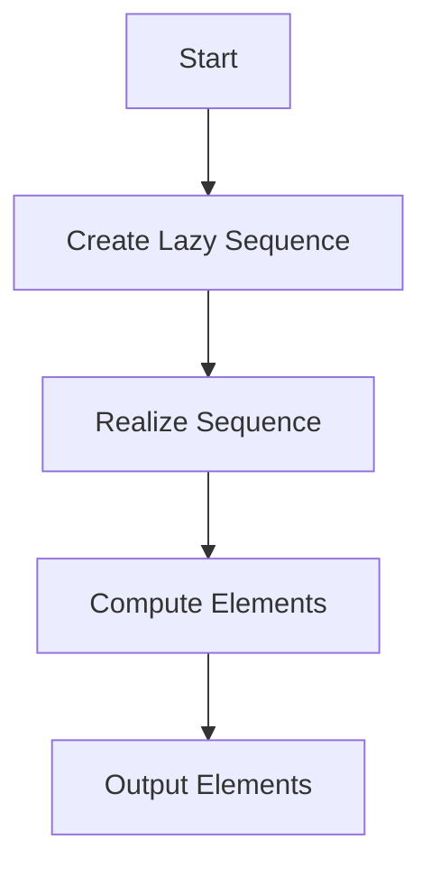
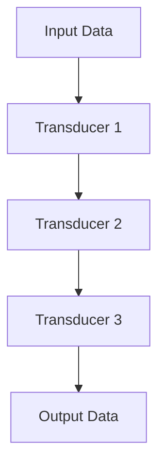

## 17.7 Performance Considerations with Lazy Sequences

Lazy sequences are a powerful feature in Clojure that allow you to work with potentially infinite data structures without incurring the cost of generating all elements upfront. However, they come with their own set of performance considerations that are crucial to understand for building efficient applications. In this section, we will explore these considerations, drawing parallels with Java where applicable, and provide strategies for optimizing performance when using lazy sequences.

### Realization Overhead

Lazy sequences in Clojure are not realized until they are needed. This deferred computation can lead to performance overhead if not managed properly. Each time a lazy sequence is realized, the computation required to generate its elements is executed. If a sequence is realized multiple times, this can lead to redundant computations, impacting performance.

#### Example: Realization Overhead

Consider the following Clojure code snippet:

```clojure
(defn expensive-computation [x]
  (println "Computing..." x)
  (* x x))

(def lazy-seq (map expensive-computation (range 5)))

;; Realizing the sequence multiple times
(doseq [x lazy-seq] (println x))
(doseq [x lazy-seq] (println x))
```

In this example, the `expensive-computation` function is called twice for each element in the sequence because the sequence is realized twice. This can be inefficient if the computation is costly.

#### Java Comparison

In Java, similar behavior can occur when using streams. Java streams are also lazy, and operations on them are only executed when a terminal operation is invoked. However, Java streams are typically realized once, whereas Clojure's lazy sequences can be realized multiple times if not handled carefully.

### Chunked Sequences

Clojure's lazy sequences are often chunked for performance reasons. This means that elements are realized in chunks rather than one at a time. While this can improve performance by reducing the overhead of realizing each element individually, it can also lead to unexpected behavior if you're not aware of it.

#### Example: Chunked Sequences

```clojure
(defn print-and-return [x]
  (println "Processing" x)
  x)

(def chunked-seq (map print-and-return (range 10)))

;; Only the first chunk is realized
(take 3 chunked-seq)
```

In this example, even though we only take the first three elements, the entire chunk (usually 32 elements) is realized. This can lead to unnecessary computations if you're working with large datasets.

#### Performance Implications

Chunking can be beneficial for performance, but it can also lead to increased memory usage if large chunks are realized unnecessarily. Understanding when and how chunking occurs can help you write more efficient Clojure code.

### Avoiding Holding Onto Head of Sequence

One common pitfall when working with lazy sequences is holding onto the head of the sequence, which can prevent garbage collection of realized elements. This can lead to memory leaks and increased memory usage.

#### Example: Holding Onto Head

```clojure
(defn process-sequence [seq]
  (let [head (first seq)]
    ;; Do something with head
    (println "Head:" head)
    ;; Process the rest of the sequence
    (doseq [x (rest seq)] (println x))))

(def my-seq (range 1000000))
(process-sequence my-seq)
```

In this example, holding onto the head of the sequence prevents the rest of the sequence from being garbage collected, leading to increased memory usage.

#### Best Practices

To avoid this issue, ensure that you do not retain references to the head of a sequence longer than necessary. Use local bindings or functions that do not retain the head to process sequences efficiently.

### Eager Evaluation When Necessary

While laziness can be beneficial, there are times when eager evaluation is more appropriate. Functions like `doall` and `into` can be used to realize a sequence eagerly, which can be useful when you need to ensure that all elements are computed and stored in memory.

#### Example: Eager Evaluation

```clojure
(defn eager-process [seq]
  (let [realized-seq (doall seq)]
    (doseq [x realized-seq] (println x))))

(eager-process (map expensive-computation (range 5)))
```

In this example, `doall` is used to realize the sequence eagerly, ensuring that all elements are computed before processing.

#### When to Use Eager Evaluation

Use eager evaluation when you need to ensure that all elements are computed upfront, such as when performing side-effecting operations or when working with finite datasets that fit in memory.

### Transducers as an Alternative

Transducers provide a way to process sequences efficiently without creating intermediate collections. They allow you to compose sequence operations in a way that minimizes memory usage and improves performance.

#### Introduction to Transducers

Transducers are composable algorithmic transformations. They are independent of the context of their input and output, making them versatile and efficient for processing data.

#### Example: Using Transducers

```clojure
(defn transduce-example []
  (let [xf (comp (map inc) (filter even?))]
    (transduce xf conj [] (range 10))))

(transduce-example) ;; => [2 4 6 8 10]
```

In this example, a transducer is used to increment and filter elements in a sequence without creating intermediate collections.

#### Benefits of Transducers

- **Efficiency**: Transducers reduce the need for intermediate collections, lowering memory usage.
- **Composability**: They allow you to compose multiple operations into a single transformation.
- **Flexibility**: Transducers can be used with various data sources, not just sequences.

### Visualizing Lazy Sequences and Transducers

To better understand the flow of data through lazy sequences and transducers, let's visualize these concepts using Mermaid.js diagrams.

#### Lazy Sequence Realization



**Caption**: This diagram illustrates the process of realizing a lazy sequence, where elements are computed only when needed.

#### Transducer Data Flow



**Caption**: This diagram shows how data flows through a series of transducers, transforming the input data into the desired output without intermediate collections.

### References and Links

- [Official Clojure Documentation](https://clojure.org/reference/sequences)
- [ClojureDocs on Lazy Sequences](https://clojuredocs.org/clojure.core/lazy-seq)
- [Transducers in Clojure](https://clojure.org/reference/transducers)

### Knowledge Check

To reinforce your understanding of lazy sequences and their performance considerations, try answering the following questions and challenges.

1. What is the primary benefit of using lazy sequences in Clojure?
2. How does chunking affect the realization of lazy sequences?
3. Why is it important to avoid holding onto the head of a sequence?
4. When should you consider using eager evaluation functions like `doall`?
5. How do transducers improve performance when processing sequences?

### Exercises

1. Modify the `expensive-computation` example to use a transducer instead of a lazy sequence. Compare the performance.
2. Create a lazy sequence that generates the Fibonacci sequence. Ensure that it does not hold onto the head of the sequence.
3. Use `doall` to eagerly realize a sequence of random numbers and calculate their sum.

### Summary

Lazy sequences are a powerful tool in Clojure, enabling efficient data processing with deferred computation. However, understanding their performance implications is crucial for writing efficient code. By managing realization overhead, understanding chunking, avoiding memory leaks, and leveraging transducers, you can optimize your Clojure applications for performance.

Now that we've explored the performance considerations of lazy sequences, let's apply these concepts to build scalable and efficient applications in Clojure.

## Quiz: Mastering Lazy Sequences in Clojure



### What is a key benefit of lazy sequences in Clojure?

- [x] Deferred computation
- [ ] Immediate computation
- [ ] Increased memory usage
- [ ] Simplified syntax

> **Explanation:** Lazy sequences allow for deferred computation, meaning elements are only computed when needed, which can save resources.

### How does chunking affect lazy sequences?

- [x] Realizes elements in chunks
- [ ] Realizes elements one by one
- [ ] Prevents realization
- [ ] Increases memory usage

> **Explanation:** Chunking realizes elements in groups (chunks), which can improve performance but may lead to unnecessary computations.

### Why should you avoid holding onto the head of a sequence?

- [x] To prevent memory leaks
- [ ] To increase computation speed
- [ ] To simplify code
- [ ] To ensure all elements are computed

> **Explanation:** Holding onto the head of a sequence can prevent garbage collection of realized elements, leading to memory leaks.

### When is eager evaluation appropriate?

- [x] When all elements need to be computed upfront
- [ ] When elements should be computed lazily
- [ ] When memory usage is a concern
- [ ] When performance is not an issue

> **Explanation:** Eager evaluation is useful when you need all elements computed upfront, such as for side-effecting operations.

### What is a benefit of using transducers?

- [x] Reduces intermediate collections
- [ ] Increases memory usage
- [ ] Simplifies syntax
- [ ] Prevents lazy evaluation

> **Explanation:** Transducers reduce the need for intermediate collections, improving memory efficiency and performance.

### How can you visualize the flow of data through transducers?

- [x] Using diagrams
- [ ] Using code comments
- [ ] Using print statements
- [ ] Using logs

> **Explanation:** Diagrams can effectively illustrate how data flows through transducers, showing transformations without intermediate collections.

### What is a common pitfall when using lazy sequences?

- [x] Holding onto the head
- [ ] Using eager evaluation
- [ ] Using transducers
- [ ] Using chunking

> **Explanation:** Holding onto the head of a lazy sequence can prevent garbage collection, leading to memory issues.

### How do transducers differ from lazy sequences?

- [x] They do not create intermediate collections
- [ ] They are always eager
- [ ] They are always lazy
- [ ] They increase memory usage

> **Explanation:** Transducers transform data without creating intermediate collections, unlike lazy sequences which may do so.

### What function can be used for eager evaluation in Clojure?

- [x] `doall`
- [ ] `map`
- [ ] `filter`
- [ ] `reduce`

> **Explanation:** `doall` is used to realize a lazy sequence eagerly, computing all elements upfront.

### True or False: Transducers can only be used with sequences.

- [ ] True
- [x] False

> **Explanation:** Transducers are versatile and can be used with various data sources, not just sequences.


