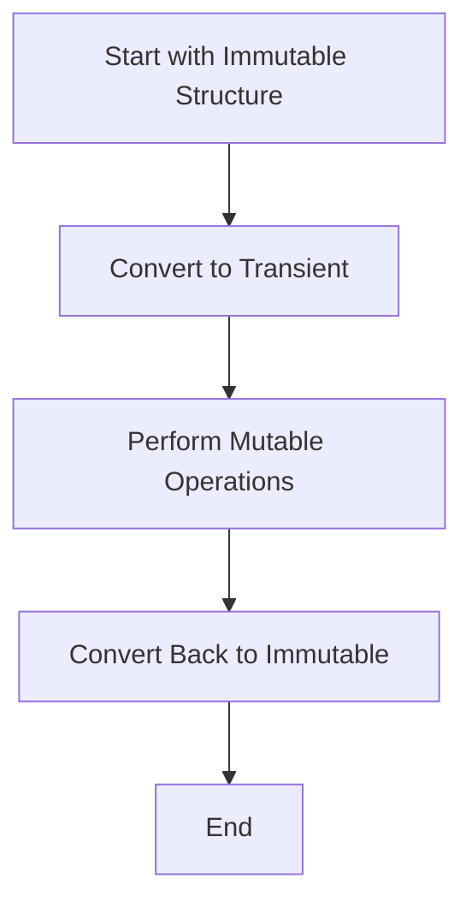

## 17.8 Using Transients for Performance

In this section, we delve into the concept of transients in Clojure, a powerful feature that allows for mutable operations on persistent data structures. This capability is particularly beneficial for performance-critical code where efficiency is paramount. As experienced Java developers, you will appreciate how transients can offer a bridge between the immutable world of functional programming and the mutable operations often used in Java for performance optimization.

### Understanding Transients

Transients in Clojure provide a mechanism to perform mutable operations on otherwise immutable persistent data structures. This feature is crucial when dealing with performance-sensitive applications where the overhead of immutability can become a bottleneck. By using transients, you can achieve the efficiency of mutable operations while maintaining the benefits of immutability in your functional code.

#### What Are Transients?

Transients are a special type of data structure in Clojure that allow for temporary mutability. They are designed to be used in a controlled manner, providing a way to perform multiple updates efficiently before converting back to an immutable structure. This approach minimizes the overhead associated with creating new immutable structures for each update.

#### How Transients Work

Transients work by allowing a series of mutable operations to be performed on a data structure, such as a vector or map, before being converted back to an immutable form. This process involves:

1. **Creating a Transient**: You start with an immutable data structure and convert it to a transient.
2. **Performing Mutations**: You can perform multiple mutations on the transient structure.
3. **Converting Back**: Once all mutations are complete, you convert the transient back to an immutable structure.

This workflow ensures that the mutable operations are confined to a specific scope, maintaining the overall immutability of your program.

### Performance Benefits

The primary advantage of using transients is the significant performance improvement they offer for bulk operations. In scenarios where you need to perform a large number of updates to a data structure, transients can reduce the overhead associated with immutability.

#### When to Use Transients

Transients are particularly useful in the following scenarios:

- **Batch Updates**: When you need to perform a series of updates to a data structure, such as adding multiple elements to a vector or updating several keys in a map.
- **Performance-Critical Code**: In sections of your code where performance is critical, and the overhead of immutability is a concern.
- **Algorithm Optimization**: When implementing algorithms that require frequent updates to data structures, such as sorting or filtering operations.

#### Example: Using Transients for Performance

Let's consider an example where we need to add a large number of elements to a vector. Using transients can significantly improve performance compared to using immutable operations.

```clojure
(defn add-elements [n]
  (loop [i 0
         v (transient [])]
    (if (< i n)
      (recur (inc i) (conj! v i))
      (persistent! v))))

;; Usage
(def large-vector (add-elements 1000000))
```

In this example, we use a transient vector to add one million elements. The `conj!` function is used to add elements to the transient vector, and `persistent!` is called to convert it back to an immutable vector once all elements are added.

### Safety Considerations

While transients offer performance benefits, they come with certain constraints that must be adhered to for safe usage.

#### Scope of Use

Transients should only be used within a limited scope. Once a transient is converted back to an immutable structure using `persistent!`, it should not be used again. Attempting to use a transient outside its intended scope can lead to undefined behavior.

#### Thread Safety

Transients are not thread-safe and should not be shared between threads. They are designed for single-threaded use, and concurrent modifications can result in data corruption.

#### Immutable Guarantees

When using transients, it's important to ensure that the overall immutability of your program is not compromised. Transients should be used judiciously and only in performance-critical sections of your code.

### Usage Patterns

To effectively leverage transients for performance, it's important to understand common usage patterns and how to convert immutable operations to transient-based ones.

#### Converting Immutable Operations to Transients

Consider a scenario where you need to update a map with a large number of key-value pairs. Using transients can make this operation more efficient.

```clojure
(defn update-map [n]
  (loop [i 0
         m (transient {})]
    (if (< i n)
      (recur (inc i) (assoc! m i (* i i)))
      (persistent! m))))

;; Usage
(def large-map (update-map 1000000))
```

In this example, we use a transient map to associate one million key-value pairs. The `assoc!` function is used for updates, and `persistent!` is called to convert the map back to an immutable form.

#### Benchmarks

To illustrate the performance improvements offered by transients, let's compare the time taken to perform bulk operations using immutable and transient data structures.

```clojure
;; Benchmarking immutable vector updates
(time
 (let [v (vec (range 1000000))]
   (reduce conj [] v)))

;; Benchmarking transient vector updates
(time
 (let [v (vec (range 1000000))]
   (persistent! (reduce conj! (transient []) v))))
```

In this benchmark, we compare the time taken to add one million elements to a vector using both immutable and transient operations. The transient version is significantly faster due to reduced overhead.

### Visual Aids

To better understand how transients work, let's visualize the process using a flowchart.



**Figure 1**: Flowchart illustrating the transient workflow.

### References and Links

For further reading on transients and performance optimization in Clojure, consider the following resources:

- [Official Clojure Documentation on Transients](https://clojure.org/reference/transients)
- [ClojureDocs: Transients](https://clojuredocs.org/clojure.core/transient)
- [GitHub: Clojure Transients Examples](https://github.com/clojure-examples/transients)

### Knowledge Check

To reinforce your understanding of transients, consider the following questions and exercises:

1. **What are transients, and how do they differ from immutable data structures?**
2. **Describe a scenario where using transients would be beneficial.**
3. **What are the safety considerations when using transients?**
4. **Convert an immutable map update operation to use transients for improved performance.**

### Exercises

1. **Modify the `add-elements` function to add elements in reverse order.**
2. **Implement a function that uses transients to remove elements from a vector.**
3. **Benchmark the performance of a transient-based map update against an immutable update.**

### Summary

In this section, we've explored how transients can be used to enhance performance in Clojure by allowing mutable operations on persistent data structures. By understanding the benefits and constraints of transients, you can effectively optimize performance-critical sections of your code while maintaining the overall immutability of your program.

---

## Quiz: Mastering Transients for Performance in Clojure



### What is the primary advantage of using transients in Clojure?

- [x] They allow for efficient mutable operations on persistent data structures.
- [ ] They provide thread-safe mutable operations.
- [ ] They eliminate the need for immutability in Clojure.
- [ ] They automatically parallelize operations.

> **Explanation:** Transients allow for efficient mutable operations on persistent data structures, which is their primary advantage.

### When should transients be used in Clojure?

- [x] In performance-critical code where batch updates are needed.
- [ ] In any code where immutability is not required.
- [ ] For thread-safe operations.
- [ ] For operations that require parallel processing.

> **Explanation:** Transients should be used in performance-critical code where batch updates are needed to reduce the overhead of immutability.

### What is a key constraint of using transients?

- [x] They should not be used outside their scope or after persistence.
- [ ] They can be used across multiple threads safely.
- [ ] They automatically handle concurrency issues.
- [ ] They replace the need for immutable data structures.

> **Explanation:** Transients should not be used outside their scope or after being converted back to an immutable structure.

### How do you convert a transient back to an immutable structure?

- [x] Using the `persistent!` function.
- [ ] Using the `immutable!` function.
- [ ] Using the `finalize!` function.
- [ ] Using the `complete!` function.

> **Explanation:** The `persistent!` function is used to convert a transient back to an immutable structure.

### Which function is used to add elements to a transient vector?

- [x] `conj!`
- [ ] `conj`
- [ ] `add!`
- [ ] `insert!`

> **Explanation:** The `conj!` function is used to add elements to a transient vector.

### Are transients thread-safe?

- [ ] Yes
- [x] No

> **Explanation:** Transients are not thread-safe and should be used in a single-threaded context.

### What happens if you use a transient after calling `persistent!`?

- [x] It leads to undefined behavior.
- [ ] It continues to work as a transient.
- [ ] It becomes thread-safe.
- [ ] It automatically converts back to a transient.

> **Explanation:** Using a transient after calling `persistent!` leads to undefined behavior.

### Which of the following is a benefit of using transients?

- [x] Improved performance for bulk operations.
- [ ] Automatic concurrency handling.
- [ ] Simplified code structure.
- [ ] Enhanced thread safety.

> **Explanation:** Transients improve performance for bulk operations by reducing the overhead of immutability.

### What is the purpose of the `assoc!` function in transients?

- [x] To update key-value pairs in a transient map.
- [ ] To add elements to a transient vector.
- [ ] To remove elements from a transient map.
- [ ] To finalize a transient structure.

> **Explanation:** The `assoc!` function is used to update key-value pairs in a transient map.

### Transients are designed for use in which type of context?

- [x] Single-threaded
- [ ] Multi-threaded
- [ ] Distributed systems
- [ ] Real-time processing

> **Explanation:** Transients are designed for use in a single-threaded context.


