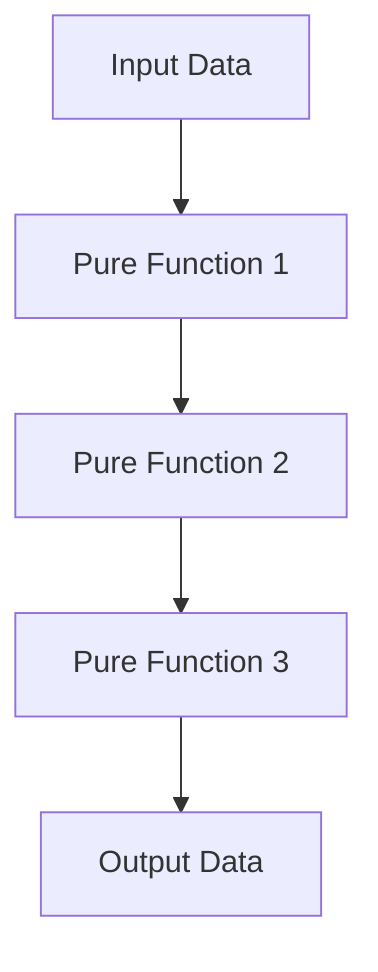

## 18.1 Benefits of Testing in Functional Programming

Testing is a cornerstone of software development, ensuring that applications behave as expected and remain robust over time. In the realm of functional programming, testing takes on a unique significance due to the inherent properties of functional code. In this section, we will explore the benefits of testing in functional programming, with a focus on Clojure, a powerful functional language. We will delve into the predictability of pure functions, the simplification of test cases, the facilitation of refactoring, the role of tests as documentation, and the assurance of software quality.

### Predictability of Pure Functions

One of the most compelling aspects of functional programming is the concept of pure functions. A pure function is a function where the output is determined solely by its input values, without observable side effects. This predictability makes testing pure functions straightforward and reliable.

#### Understanding Pure Functions

In Clojure, pure functions are a fundamental building block. They are deterministic, meaning that given the same input, they will always produce the same output. This property is in stark contrast to imperative programming, where functions may depend on external state or produce side effects, making them harder to test.

**Example of a Pure Function in Clojure:**

```clojure
(defn add [x y]
  (+ x y))
```

This simple function `add` is pure because it relies only on its input parameters `x` and `y` and does not modify any external state.

#### Testing Pure Functions

Testing pure functions is straightforward because you can focus solely on the input-output relationship. You don't need to worry about setting up complex environments or managing state changes.

**Example Test for a Pure Function:**

```clojure
(deftest test-add
  (is (= 5 (add 2 3)))
  (is (= 0 (add -1 1))))
```

In this test, we verify that the `add` function behaves as expected for various inputs. The simplicity of this test is a direct result of the function's purity.

#### Predictability in Java vs. Clojure

In Java, functions often interact with mutable state, making them less predictable. Consider a Java method that modifies a class field:

```java
public class Counter {
    private int count = 0;

    public int increment() {
        return ++count;
    }
}
```

Testing this method requires managing the state of the `count` field, which can introduce complexity. In contrast, Clojure encourages immutability and pure functions, simplifying the testing process.

### Simplified Test Cases

Functional programming often leads to simpler test cases because functional code typically requires fewer mocks and stubs. This is due to the emphasis on immutability and the use of higher-order functions.

#### Immutability and Testing

In Clojure, data structures are immutable by default. This immutability ensures that data cannot be altered once created, eliminating a whole class of bugs related to state changes.

**Example of Immutable Data in Clojure:**

```clojure
(def my-list [1 2 3])
(def new-list (conj my-list 4))
```

In this example, `my-list` remains unchanged, and `new-list` is a new list with the added element. Testing functions that operate on immutable data is straightforward because the data remains consistent throughout the test.

#### Higher-Order Functions and Testing

Higher-order functions, which take other functions as arguments or return them as results, are prevalent in functional programming. They enable powerful abstractions and reduce the need for boilerplate code.

**Example of a Higher-Order Function in Clojure:**

```clojure
(defn apply-twice [f x]
  (f (f x)))
```

Testing higher-order functions involves verifying the behavior of the function passed as an argument, which is often simpler than testing complex object interactions in object-oriented programming.

**Example Test for a Higher-Order Function:**

```clojure
(deftest test-apply-twice
  (is (= 16 (apply-twice #(* % %) 2))))
```

Here, we test that `apply-twice` correctly applies the squaring function twice to the input `2`.

### Facilitating Refactoring

A robust test suite is invaluable when refactoring code. In functional programming, the emphasis on pure functions and immutability makes refactoring safer and more predictable.

#### Refactoring with Confidence

When you have a comprehensive set of tests, you can refactor code with confidence, knowing that any changes that introduce errors will be caught by the tests. This is particularly important in functional programming, where functions are often composed and reused in various contexts.

**Example of Refactoring in Clojure:**

Suppose we have a function that calculates the sum of squares:

```clojure
(defn sum-of-squares [numbers]
  (reduce + (map #(* % %) numbers)))
```

We decide to refactor this function to improve readability:

```clojure
(defn square [x]
  (* x x))

(defn sum-of-squares [numbers]
  (reduce + (map square numbers)))
```

With a robust test suite, we can ensure that the refactored code behaves identically to the original.

#### Refactoring in Java vs. Clojure

In Java, refactoring can be more challenging due to mutable state and side effects. Consider a Java method that modifies a list:

```java
public void addSquares(List<Integer> numbers) {
    for (int i = 0; i < numbers.size(); i++) {
        numbers.set(i, numbers.get(i) * numbers.get(i));
    }
}
```

Refactoring this method requires careful consideration of how the list is modified. In Clojure, immutability simplifies the process, allowing for more aggressive refactoring without fear of unintended side effects.

### Documentation Through Tests

Tests can serve as executable documentation, providing a clear and precise description of how code is expected to behave. This is particularly valuable in functional programming, where functions are often small and composable.

#### Tests as Documentation

In Clojure, tests can be written in a way that clearly communicates the intent of the code. By examining the tests, developers can understand the expected behavior of functions without needing to read through extensive documentation.

**Example of Tests as Documentation:**

```clojure
(deftest test-max-value
  (is (= 5 (max-value [1 2 3 4 5])))
  (is (= 10 (max-value [10 9 8 7 6]))))
```

These tests document the behavior of the `max-value` function, providing examples of its expected output for various inputs.

#### Documentation in Java vs. Clojure

In Java, documentation is often provided through comments and external documentation tools. While these are valuable, they can become outdated or inconsistent with the code. In Clojure, tests provide a living document that evolves with the codebase.

### Quality Assurance

Testing plays a critical role in ensuring the reliability and robustness of software. In functional programming, the emphasis on pure functions, immutability, and higher-order functions contributes to a more predictable and testable codebase.

#### Ensuring Software Reliability

By rigorously testing functional code, developers can catch errors early in the development process, reducing the likelihood of bugs in production. This is especially important in functional programming, where functions are often composed and reused.

**Example of Quality Assurance in Clojure:**

```clojure
(deftest test-calculate-total
  (is (= 15 (calculate-total [1 2 3 4 5])))
  (is (= 0 (calculate-total []))))
```

These tests ensure that the `calculate-total` function behaves correctly for both non-empty and empty input lists.

#### Quality Assurance in Java vs. Clojure

In Java, ensuring software reliability often involves extensive use of mocks and stubs to simulate complex interactions. In Clojure, the emphasis on pure functions and immutability simplifies the testing process, allowing for more comprehensive and reliable tests.

### Visual Aids

To enhance understanding, let's incorporate a diagram that illustrates the flow of data through a series of pure functions in a Clojure program.



**Diagram Description:** This flowchart represents the transformation of input data through a series of pure functions, resulting in output data. Each function operates independently, ensuring predictability and testability.

### References and Links

For further reading on testing in functional programming, consider the following resources:

- [Official Clojure Documentation](https://clojure.org/reference/documentation)
- [ClojureDocs](https://clojuredocs.org/)
- [Functional Programming in Clojure on GitHub](https://github.com/clojure)

### Knowledge Check

To reinforce your understanding, consider the following questions:

- How do pure functions contribute to the predictability of tests?
- Why is immutability important in simplifying test cases?
- How can a robust test suite facilitate refactoring?
- In what ways can tests serve as documentation?
- What role does testing play in ensuring software quality?

### Encouraging Tone

Now that we've explored the benefits of testing in functional programming, let's apply these concepts to create more reliable and maintainable Clojure applications. By leveraging the predictability of pure functions, the simplicity of immutable data, and the power of higher-order functions, we can build robust software that stands the test of time.

### Best Practices for Tags

- "Clojure"
- "Functional Programming"
- "Testing"
- "Pure Functions"
- "Refactoring"
- "Quality Assurance"
- "Documentation"
- "Software Reliability"

## Quiz: Testing in Functional Programming



### What is a key benefit of testing pure functions in functional programming?

- [x] Predictability due to deterministic behavior
- [ ] Complexity due to side effects
- [ ] Difficulty in setting up test environments
- [ ] Increased need for mocks and stubs

> **Explanation:** Pure functions are deterministic, meaning they produce the same output for the same input, making them predictable and easy to test.


### How does immutability simplify test cases in functional programming?

- [x] By ensuring data consistency throughout tests
- [ ] By allowing data to be modified during tests
- [ ] By requiring complex state management
- [ ] By increasing the need for mocks

> **Explanation:** Immutability ensures that data remains consistent, eliminating the need for complex state management and simplifying test cases.


### What is the role of a robust test suite in refactoring?

- [x] It allows for confident code changes
- [ ] It complicates the refactoring process
- [ ] It increases the risk of introducing errors
- [ ] It discourages code changes

> **Explanation:** A robust test suite provides assurance that refactored code behaves as expected, allowing for confident code changes.


### How can tests serve as documentation in functional programming?

- [x] By providing executable examples of code behavior
- [ ] By requiring extensive comments
- [ ] By being separate from the codebase
- [ ] By being difficult to understand

> **Explanation:** Tests provide clear, executable examples of how code is expected to behave, serving as documentation.


### What is a key advantage of testing in Clojure compared to Java?

- [x] Simplified testing due to immutability and pure functions
- [ ] Increased complexity due to mutable state
- [ ] Greater reliance on mocks and stubs
- [ ] More challenging refactoring process

> **Explanation:** Clojure's emphasis on immutability and pure functions simplifies testing compared to Java's mutable state and side effects.


### Why is testing important for software reliability?

- [x] It catches errors early in development
- [ ] It increases the likelihood of bugs
- [ ] It complicates the development process
- [ ] It is unnecessary for functional programming

> **Explanation:** Testing helps identify and fix errors early, reducing the likelihood of bugs in production and ensuring software reliability.


### How do higher-order functions impact testing in functional programming?

- [x] They enable powerful abstractions and reduce boilerplate
- [ ] They increase the need for complex test setups
- [ ] They complicate the testing process
- [ ] They require extensive mocking

> **Explanation:** Higher-order functions allow for powerful abstractions, reducing boilerplate code and simplifying testing.


### What is a benefit of using tests as documentation?

- [x] They provide a living document that evolves with the code
- [ ] They require separate maintenance from the code
- [ ] They are often outdated
- [ ] They are difficult to understand

> **Explanation:** Tests serve as a living document that evolves with the codebase, providing up-to-date documentation of code behavior.


### How does functional programming facilitate refactoring?

- [x] By emphasizing pure functions and immutability
- [ ] By relying on mutable state
- [ ] By discouraging code changes
- [ ] By requiring complex state management

> **Explanation:** Functional programming's emphasis on pure functions and immutability makes refactoring safer and more predictable.


### True or False: In functional programming, tests are often more complex due to the need for mocks and stubs.

- [ ] True
- [x] False

> **Explanation:** In functional programming, tests are often simpler due to the emphasis on pure functions and immutability, reducing the need for mocks and stubs.


