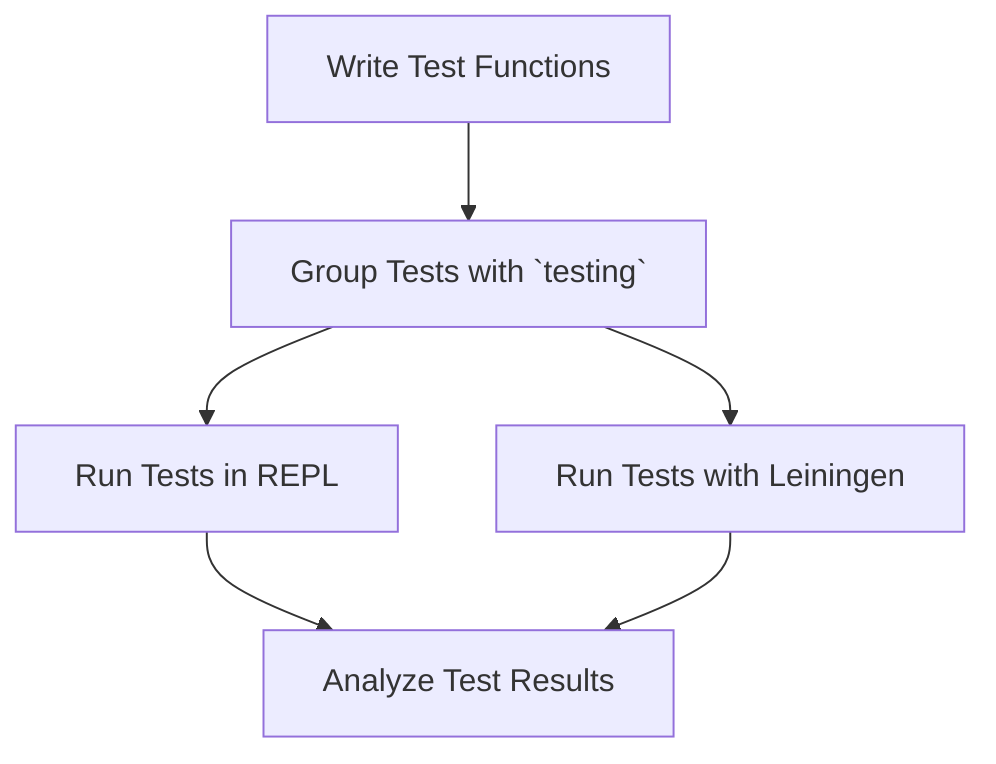

## 18.2 Writing Unit Tests with `clojure.test`

Unit testing is a crucial aspect of software development, ensuring that individual components of your application work as expected. In Clojure, the `clojure.test` library provides a robust framework for writing and running unit tests. This section will guide you through the core features of `clojure.test`, demonstrating how to write, organize, and execute tests effectively.

### Getting Started with `clojure.test`

Clojure's `clojure.test` is a built-in library that offers a simple yet powerful way to write tests. It is designed to integrate seamlessly with Clojure's functional programming paradigm, allowing you to test pure functions and manage side effects efficiently.

#### Core Features of `clojure.test`

- **Simplicity**: `clojure.test` is straightforward and easy to use, making it accessible for developers familiar with other testing frameworks.
- **Integration**: It integrates well with Clojure's REPL and build tools like Leiningen, enabling interactive and automated testing.
- **Extensibility**: You can extend `clojure.test` with custom assertions and test runners to suit your specific needs.

### Writing Test Functions

To write a test in `clojure.test`, you define test functions using the `deftest` macro and perform assertions with the `is` macro.

#### Using `deftest` and `is`

The `deftest` macro is used to define a test function. Within this function, you use the `is` macro to assert that expressions evaluate to true.

```clojure
(ns myapp.core-test
  (:require [clojure.test :refer :all]
            [myapp.core :refer :all]))

(deftest test-addition
  (is (= 4 (add 2 2)))
  (is (= 0 (add -1 1))))
```

In this example, we define a test function `test-addition` that checks the `add` function from `myapp.core`. The `is` macro asserts that the result of `add` is as expected.

#### Assertions with `is`

The `is` macro is versatile and can be used for various types of assertions:

- **Equality**: `(is (= expected actual))`
- **Boolean**: `(is (boolean-expression))`
- **Exception**: `(is (thrown? ExceptionType (expression)))`

```clojure
(deftest test-division
  (is (= 2 (divide 4 2)))
  (is (thrown? ArithmeticException (divide 1 0))))
```

Here, we test the `divide` function, asserting both the result and the exception thrown for division by zero.

### Grouping Tests

Organizing tests into logical groups enhances readability and maintainability. The `testing` macro allows you to group related assertions within a test function.

```clojure
(deftest test-math-operations
  (testing "Addition"
    (is (= 5 (add 2 3)))
    (is (= 0 (add -2 2))))
  (testing "Subtraction"
    (is (= 1 (subtract 3 2)))
    (is (= -1 (subtract 2 3)))))
```

In this example, we use `testing` to group assertions related to addition and subtraction, making the test output more informative.

### Running Tests

Running tests in Clojure can be done interactively in the REPL or automatically using build tools like Leiningen.

#### Running Tests in the REPL

To run tests in the REPL, load your test namespace and use the `run-tests` function:

```clojure
(require '[clojure.test :refer :all])
(run-tests 'myapp.core-test)
```

This command executes all tests in the `myapp.core-test` namespace, providing immediate feedback.

#### Integrating with Leiningen

Leiningen is a popular build tool for Clojure that simplifies project management and automation. To run tests with Leiningen, use the `lein test` command:

```shell
lein test
```

This command runs all tests in your project, displaying results in the console.

### Best Practices for Writing Unit Tests

Writing clear and maintainable unit tests is essential for long-term project success. Here are some best practices to consider:

- **Keep Tests Small and Focused**: Each test should verify a single behavior or aspect of your code.
- **Use Descriptive Names**: Test function names should clearly describe the behavior being tested.
- **Avoid Dependencies**: Tests should be independent and not rely on external systems or states.
- **Mock External Interactions**: Use mocking to isolate the unit under test from external dependencies.
- **Regularly Run Tests**: Integrate tests into your development workflow to catch issues early.

### Try It Yourself

Experiment with the following code by modifying the `add` and `divide` functions to introduce errors, then observe how the tests catch these issues.

```clojure
(defn add [a b]
  (+ a b))

(defn divide [a b]
  (/ a b))
```

### Visual Aids

To better understand the flow of data and test execution, consider the following diagram illustrating the process of writing and running tests in Clojure:



This flowchart outlines the steps from writing test functions to analyzing results, emphasizing the iterative nature of testing.

### References and Links

- [Official Clojure Documentation](https://clojure.org/reference/documentation)
- [ClojureDocs](https://clojuredocs.org/)
- [Leiningen](https://leiningen.org/)

### Knowledge Check

- What is the primary purpose of the `deftest` macro?
- How does the `is` macro facilitate assertions in tests?
- Why is it beneficial to group tests using the `testing` macro?
- What are the advantages of running tests in the REPL?
- How can you integrate `clojure.test` with Leiningen for automated testing?

### Exercises

1. Write a test for a function that calculates the factorial of a number. Ensure it handles edge cases like zero and negative numbers.
2. Modify the `add` function to introduce a bug, then write a test to catch it.
3. Create a test suite for a simple banking application, covering deposit, withdrawal, and balance inquiry operations.

### Summary

In this section, we've explored the essentials of writing unit tests in Clojure using the `clojure.test` framework. By leveraging the power of `deftest`, `is`, and `testing`, you can ensure your code is robust and reliable. Remember to keep tests small, focused, and independent, and integrate them into your development workflow for maximum effectiveness.

## Quiz: Mastering Unit Testing in Clojure with `clojure.test`



### What is the primary purpose of the `deftest` macro in Clojure?

- [x] To define a test function
- [ ] To perform assertions
- [ ] To group related tests
- [ ] To run tests

> **Explanation:** The `deftest` macro is used to define a test function in Clojure.

### How does the `is` macro facilitate assertions in tests?

- [x] By evaluating expressions to true
- [ ] By defining test functions
- [ ] By grouping related tests
- [ ] By running tests

> **Explanation:** The `is` macro is used to assert that expressions evaluate to true in tests.

### Why is it beneficial to group tests using the `testing` macro?

- [x] To enhance readability and maintainability
- [ ] To define test functions
- [ ] To perform assertions
- [ ] To run tests

> **Explanation:** Grouping tests with the `testing` macro enhances readability and maintainability by organizing related assertions.

### What are the advantages of running tests in the REPL?

- [x] Immediate feedback and interactive testing
- [ ] Automated test execution
- [ ] Integration with build tools
- [ ] Enhanced readability

> **Explanation:** Running tests in the REPL provides immediate feedback and allows for interactive testing.

### How can you integrate `clojure.test` with Leiningen for automated testing?

- [x] By using the `lein test` command
- [ ] By defining test functions
- [ ] By performing assertions
- [ ] By grouping related tests

> **Explanation:** The `lein test` command is used to run tests automatically with Leiningen.

### What is a best practice for writing unit tests?

- [x] Keep tests small and focused
- [ ] Use complex test names
- [ ] Rely on external systems
- [ ] Avoid running tests regularly

> **Explanation:** Keeping tests small and focused ensures they verify a single behavior or aspect of your code.

### What should test function names do?

- [x] Clearly describe the behavior being tested
- [ ] Be as short as possible
- [ ] Include implementation details
- [ ] Be randomly generated

> **Explanation:** Test function names should clearly describe the behavior being tested for clarity and maintainability.

### Why should tests avoid dependencies?

- [x] To ensure tests are independent and reliable
- [ ] To make tests more complex
- [ ] To increase execution time
- [ ] To require more setup

> **Explanation:** Avoiding dependencies ensures that tests are independent and reliable, reducing the chance of false positives or negatives.

### What is the role of mocking in unit tests?

- [x] To isolate the unit under test from external dependencies
- [ ] To increase test complexity
- [ ] To reduce test coverage
- [ ] To make tests less readable

> **Explanation:** Mocking is used to isolate the unit under test from external dependencies, ensuring that tests focus on the code being tested.

### True or False: `clojure.test` is only suitable for testing pure functions.

- [ ] True
- [x] False

> **Explanation:** `clojure.test` can be used to test both pure functions and functions with side effects, though testing pure functions is generally simpler.


