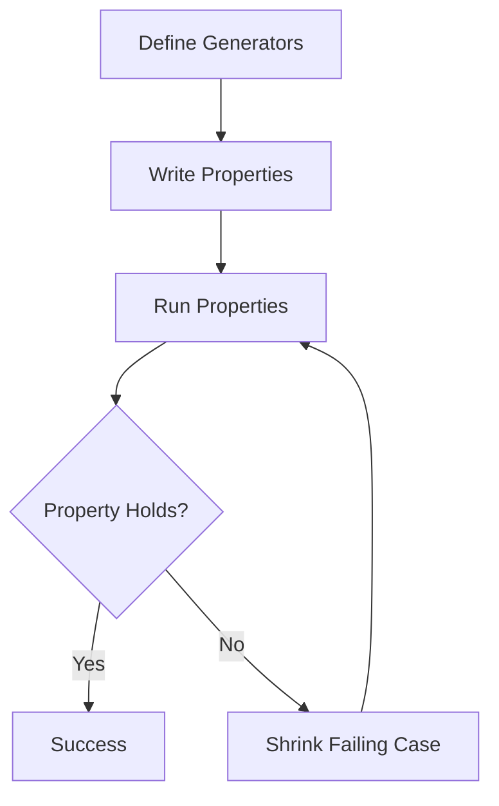

## 18.3 Property-Based Testing with `test.check`

In the realm of software testing, property-based testing offers a powerful approach to ensure the robustness and correctness of your code. Unlike traditional example-based testing, which checks specific input-output pairs, property-based testing focuses on the properties that should hold true for a wide range of inputs. In this section, we'll explore how to leverage `test.check`, a property-based testing library in Clojure, to enhance your testing strategy.

### Exploring Generative Testing

Property-based testing is a paradigm where you define properties that your code should satisfy for all possible inputs. `test.check` automates this process by generating random inputs and checking if the properties hold. This approach is particularly useful for uncovering edge cases that you might not have considered.

#### Why Property-Based Testing?

- **Comprehensive Coverage**: By generating a wide range of inputs, property-based testing can uncover edge cases that example-based tests might miss.
- **Focus on Properties**: Instead of writing tests for specific cases, you define properties that should always be true, leading to more robust code.
- **Automated Test Case Generation**: `test.check` automatically generates test cases, saving time and effort in writing individual tests.

### Defining Generators

Generators are at the heart of property-based testing. They produce random values of a specific type, which are then used to test your properties. `test.check` provides a variety of built-in generators and allows you to compose custom ones.

#### Built-in Generators

`test.check` includes a range of built-in generators for common data types:

- **`gen/int`**: Generates random integers.
- **`gen/boolean`**: Generates random boolean values.
- **`gen/string`**: Generates random strings.
- **`gen/vector`**: Generates vectors of random elements.

Here's an example of using a built-in generator to create random integers:

```clojure
(require '[clojure.test.check.generators :as gen])

(def int-gen (gen/int))
```

#### Composing Custom Generators

You can compose custom generators by combining existing ones. For instance, to generate a vector of random integers, you can use the `gen/vector` generator:

```clojure
(def vector-of-ints-gen (gen/vector int-gen))
```

To create more complex generators, you can use `gen/fmap` to transform generated values:

```clojure
(def positive-int-gen
  (gen/fmap #(Math/abs %) int-gen))
```

### Writing Properties

Once you have defined your generators, the next step is to write properties that your code should satisfy. A property is a function that takes generated inputs and returns a boolean indicating whether the property holds.

#### Defining a Simple Property

Let's define a simple property for a function that reverses a list. The property we want to test is that reversing a list twice should yield the original list:

```clojure
(require '[clojure.test.check.properties :as prop])

(def reverse-property
  (prop/for-all [v (gen/vector int-gen)]
    (= v (reverse (reverse v)))))
```

#### Running the Property

To run the property, use the `clojure.test.check` library:

```clojure
(require '[clojure.test.check :as tc])

(tc/quick-check 100 reverse-property)
```

This will run the property 100 times with different random inputs.

### Shrinking Failing Cases

One of the powerful features of `test.check` is its ability to shrink failing test cases to minimal examples. When a property fails, `test.check` attempts to simplify the input that caused the failure, making it easier to debug.

#### Understanding Shrinking

Shrinking is the process of reducing a failing input to its simplest form while still causing the test to fail. This helps you quickly identify the root cause of the issue.

For example, if a property fails with a large vector, `test.check` will try to find the smallest vector that still causes the failure.

#### Example of Shrinking

Consider a property that checks if the sum of a list is always positive:

```clojure
(def sum-positive-property
  (prop/for-all [v (gen/vector positive-int-gen)]
    (pos? (reduce + v))))
```

If this property fails, `test.check` will shrink the vector to the smallest size that still causes the failure, helping you pinpoint the problem.

### Practical Examples

Let's explore some practical examples of property-based testing with `test.check`.

#### Example 1: Testing a Sorting Function

Suppose we have a sorting function and we want to test its correctness. We can define properties such as:

- The output list should be sorted.
- The output list should have the same elements as the input list.

```clojure
(def sort-property
  (prop/for-all [v (gen/vector int-gen)]
    (let [sorted-v (sort v)]
      (and (= (count v) (count sorted-v))
           (apply <= sorted-v)))))
```

#### Example 2: Testing a String Manipulation Function

Consider a function that converts a string to uppercase. We can define a property that checks if the length of the string remains unchanged:

```clojure
(def uppercase-property
  (prop/for-all [s gen/string]
    (= (count s) (count (clojure.string/upper-case s)))))
```

### Try It Yourself

Now that we've explored property-based testing with `test.check`, try modifying the examples to test different properties or use different generators. Experiment with creating custom generators and see how they can be used to test more complex properties.

### Visual Aids

To better understand the flow of data through property-based testing, let's visualize the process using a flowchart:



**Figure 1**: Flowchart illustrating the process of property-based testing with `test.check`.

### References and Links

For further reading and deeper dives into property-based testing and `test.check`, consider exploring the following resources:

- [Official Clojure Documentation](https://clojure.org/)
- [ClojureDocs](https://clojuredocs.org/)
- [test.check GitHub Repository](https://github.com/clojure/test.check)

### Knowledge Check

To reinforce your understanding of property-based testing with `test.check`, consider the following questions and exercises:

- What are the advantages of property-based testing over example-based testing?
- How can you compose custom generators in `test.check`?
- Write a property-based test for a function that calculates the factorial of a number.
- Experiment with shrinking by creating a property that fails and observe how `test.check` simplifies the failing input.

### Encouraging Tone

Property-based testing with `test.check` is a powerful tool in your testing arsenal. By focusing on properties and leveraging automated test case generation, you can ensure the robustness and correctness of your code. Embrace this approach to uncover edge cases and improve the quality of your software.

### Summary

In this section, we've explored the fundamentals of property-based testing with `test.check` in Clojure. We've covered how to define generators, write properties, and leverage shrinking to simplify failing cases. By incorporating property-based testing into your development workflow, you can achieve more comprehensive test coverage and build more reliable applications.

## Quiz: Mastering Property-Based Testing with `test.check`



### What is the primary advantage of property-based testing?

- [x] It generates a wide range of inputs to uncover edge cases.
- [ ] It focuses on specific input-output pairs.
- [ ] It requires less code than example-based testing.
- [ ] It is easier to implement than example-based testing.

> **Explanation:** Property-based testing generates a wide range of inputs, which helps uncover edge cases that might be missed by example-based testing.

### How do you define a generator for random integers in `test.check`?

- [x] `(gen/int)`
- [ ] `(gen/random-int)`
- [ ] `(gen/number)`
- [ ] `(gen/integer)`

> **Explanation:** `gen/int` is the built-in generator for random integers in `test.check`.

### What is the purpose of shrinking in property-based testing?

- [x] To simplify failing inputs to minimal examples for easier debugging.
- [ ] To increase the complexity of test cases.
- [ ] To reduce the number of test cases.
- [ ] To optimize the performance of tests.

> **Explanation:** Shrinking simplifies failing inputs to minimal examples, making it easier to identify the root cause of the failure.

### Which function is used to run a property in `test.check`?

- [x] `tc/quick-check`
- [ ] `tc/run-property`
- [ ] `tc/test-property`
- [ ] `tc/check-property`

> **Explanation:** `tc/quick-check` is used to run a property in `test.check`.

### What is a key benefit of using custom generators?

- [x] They allow you to generate complex data structures for testing.
- [ ] They reduce the need for built-in generators.
- [ ] They simplify the testing process.
- [ ] They eliminate the need for property definitions.

> **Explanation:** Custom generators allow you to generate complex data structures, enabling more comprehensive testing of your code.

### True or False: Property-based testing focuses on specific input-output pairs.

- [ ] True
- [x] False

> **Explanation:** Property-based testing focuses on properties that should hold true for a wide range of inputs, rather than specific input-output pairs.

### What is the role of `prop/for-all` in `test.check`?

- [x] It defines a property that should hold true for all generated inputs.
- [ ] It generates random inputs for testing.
- [ ] It shrinks failing test cases.
- [ ] It runs the property test.

> **Explanation:** `prop/for-all` is used to define a property that should hold true for all generated inputs.

### How can you test a sorting function using property-based testing?

- [x] Define properties such as the output list should be sorted and have the same elements as the input list.
- [ ] Write tests for specific input-output pairs.
- [ ] Use example-based testing.
- [ ] Focus on performance testing.

> **Explanation:** To test a sorting function, you can define properties like the output list should be sorted and have the same elements as the input list.

### What is the benefit of using `gen/fmap` in custom generators?

- [x] It allows you to transform generated values.
- [ ] It increases the randomness of generated values.
- [ ] It simplifies the generator definition.
- [ ] It reduces the number of generated values.

> **Explanation:** `gen/fmap` is used to transform generated values, allowing for more complex custom generators.

### True or False: `test.check` automatically shrinks failing test cases.

- [x] True
- [ ] False

> **Explanation:** `test.check` automatically shrinks failing test cases to their simplest form, aiding in debugging.



By mastering property-based testing with `test.check`, you can significantly enhance the robustness and reliability of your Clojure applications. Keep experimenting with different properties and generators to fully leverage the power of this testing approach.
