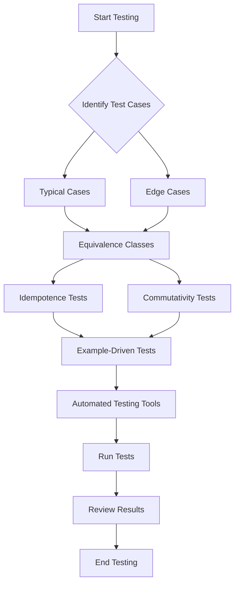

## 18.4 Testing Pure Functions Effectively

Testing is a crucial aspect of software development, ensuring that code behaves as expected and remains robust over time. In functional programming, pure functions are central, offering predictable behavior that simplifies testing. This section will guide you through effective strategies for testing pure functions in Clojure, leveraging your Java experience to ease the transition.

### Understanding Pure Functions

Before diving into testing strategies, let's briefly revisit what makes a function pure. A pure function is one that:

- **Always produces the same output** for the same input.
- **Has no side effects**, meaning it doesn't alter any state or interact with the outside world (e.g., no I/O operations).

These characteristics make pure functions inherently easier to test compared to impure functions, as they are deterministic and isolated.

### Test Coverage Strategies

#### Importance of Testing Typical and Edge Cases

To ensure comprehensive test coverage, it's essential to test both typical and edge cases. Typical cases cover the expected range of inputs, while edge cases test the boundaries and limits of input data. This approach helps uncover potential issues that might not be apparent with typical inputs alone.

**Example:**

Consider a function that calculates the factorial of a number. Typical cases might include small positive integers, while edge cases could include zero, negative numbers, and very large numbers.

```clojure
(defn factorial [n]
  (reduce * (range 1 (inc n))))

;; Typical case
(assert (= 120 (factorial 5)))

;; Edge cases
(assert (= 1 (factorial 0)))  ; Factorial of zero
(assert (thrown? IllegalArgumentException (factorial -1)))  ; Negative input
```

#### Equivalence Classes

Equivalence class testing involves dividing input data into classes where each class is expected to produce similar results. Testing one representative from each class can provide confidence that the function handles all inputs correctly.

**Example:**

For a function that checks if a number is even, equivalence classes might include even numbers, odd numbers, and non-integer values.

```clojure
(defn is-even? [n]
  (zero? (mod n 2)))

;; Equivalence classes
(assert (true? (is-even? 4)))  ; Even number
(assert (false? (is-even? 3))) ; Odd number
(assert (thrown? ClassCastException (is-even? "two"))) ; Non-integer
```

### Testing Idempotence and Commutativity

Some functions exhibit properties like idempotence and commutativity, which can be leveraged in testing.

#### Idempotence

A function is idempotent if applying it multiple times has the same effect as applying it once. Testing for idempotence ensures that repeated applications do not alter the outcome.

**Example:**

Consider a function that normalizes a string by trimming whitespace and converting it to lowercase.

```clojure
(defn normalize [s]
  (-> s clojure.string/trim clojure.string/lower-case))

;; Idempotence test
(let [normalized (normalize "  Hello World  ")]
  (assert (= normalized (normalize normalized))))
```

#### Commutativity

A function is commutative if the order of its arguments does not affect the result. Testing for commutativity is crucial for functions where this property is expected.

**Example:**

A function that adds two numbers should be commutative.

```clojure
(defn add [a b]
  (+ a b))

;; Commutativity test
(assert (= (add 3 5) (add 5 3)))
```

### Example-Driven Tests

Example-driven tests focus on clear and concise test cases that demonstrate expected behavior. This approach not only verifies correctness but also serves as documentation for how the function should be used.

**Example:**

For a function that calculates the greatest common divisor (GCD), example-driven tests might look like this:

```clojure
(defn gcd [a b]
  (if (zero? b)
    a
    (recur b (mod a b))))

;; Example-driven tests
(assert (= 6 (gcd 54 24)))  ; GCD of 54 and 24
(assert (= 1 (gcd 17 13)))  ; GCD of two primes
(assert (= 5 (gcd 5 0)))    ; GCD with zero
```

### Automated Testing Tools

Automated testing tools can streamline the testing process, making it easier to write, run, and maintain tests. In Clojure, tools like [Speclj](http://speclj.com/) offer behavior-driven development (BDD) capabilities, allowing you to write expressive and readable tests.

#### Using Speclj

Speclj provides a syntax similar to RSpec in Ruby, making it intuitive for those familiar with BDD. Here's how you can use Speclj to test a simple function:

1. **Install Speclj**: Add Speclj to your `project.clj` dependencies.

```clojure
:dependencies [[speclj "3.3.2"]]
:test-paths ["spec"]
```

2. **Write a Spec**: Create a spec file in the `spec` directory.

```clojure
(ns myapp.core-spec
  (:require [speclj.core :refer :all]
            [myapp.core :refer :all]))

(describe "factorial"
  (it "returns 1 for 0"
    (should= 1 (factorial 0)))

  (it "returns 120 for 5"
    (should= 120 (factorial 5)))

  (it "throws an exception for negative numbers"
    (should-throw IllegalArgumentException (factorial -1))))
```

3. **Run the Tests**: Use the Speclj command-line tool to run your tests.

```shell
lein spec
```

### Visual Aids

To better understand the flow of testing strategies, let's visualize the process using a flowchart.



**Figure 1**: Flowchart illustrating the testing process for pure functions.

### Knowledge Check

To reinforce your understanding, consider the following questions:

1. What are the key characteristics of a pure function?
2. Why is it important to test both typical and edge cases?
3. How can equivalence class testing improve test coverage?
4. What properties should you test for in idempotent functions?
5. How does Speclj facilitate behavior-driven development in Clojure?

### Exercises

1. **Exercise 1**: Write a function that checks if a string is a palindrome. Test it using typical and edge cases.
2. **Exercise 2**: Implement a function that calculates the power of a number. Write tests to verify idempotence and commutativity where applicable.
3. **Exercise 3**: Use Speclj to write tests for a function that sorts a list of integers.

### Summary

Testing pure functions effectively involves a combination of strategies, including comprehensive test coverage, equivalence class testing, and verifying properties like idempotence and commutativity. Tools like Speclj can enhance the testing process, making it more efficient and expressive. By mastering these techniques, you can ensure that your Clojure applications are robust, reliable, and maintainable.

## Quiz: Mastering Testing of Pure Functions in Clojure



### What is a key characteristic of a pure function?

- [x] It always produces the same output for the same input.
- [ ] It can modify global state.
- [ ] It performs I/O operations.
- [ ] It depends on external variables.

> **Explanation:** A pure function always produces the same output for the same input and has no side effects.

### Why is it important to test edge cases?

- [x] To uncover potential issues at the boundaries of input data.
- [ ] To test only the most common inputs.
- [ ] To ensure the function runs faster.
- [ ] To avoid writing too many tests.

> **Explanation:** Testing edge cases helps uncover potential issues that might not be apparent with typical inputs alone.

### What does equivalence class testing involve?

- [x] Dividing input data into classes where each class is expected to produce similar results.
- [ ] Testing every possible input value.
- [ ] Only testing the most common input values.
- [ ] Ignoring edge cases.

> **Explanation:** Equivalence class testing involves dividing input data into classes where each class is expected to produce similar results, allowing for more efficient testing.

### What property should you test for in idempotent functions?

- [x] Applying the function multiple times has the same effect as applying it once.
- [ ] The function's output changes with each application.
- [ ] The function modifies global state.
- [ ] The function performs I/O operations.

> **Explanation:** An idempotent function should have the same effect when applied multiple times as when applied once.

### Which tool is used for behavior-driven development in Clojure?

- [x] Speclj
- [ ] JUnit
- [ ] Mockito
- [ ] TestNG

> **Explanation:** Speclj is a tool used for behavior-driven development in Clojure, providing a syntax similar to RSpec in Ruby.

### What is the benefit of example-driven tests?

- [x] They demonstrate expected behavior clearly and concisely.
- [ ] They require less code to write.
- [ ] They are faster to execute.
- [ ] They eliminate the need for edge case testing.

> **Explanation:** Example-driven tests focus on clear and concise test cases that demonstrate expected behavior, serving as both verification and documentation.

### How can you verify commutativity in a function?

- [x] By ensuring the order of arguments does not affect the result.
- [ ] By checking if the function modifies global state.
- [ ] By testing only typical cases.
- [ ] By using only automated testing tools.

> **Explanation:** Verifying commutativity involves ensuring that the order of arguments does not affect the result of the function.

### What is a typical case in testing?

- [x] An input that represents the expected range of values.
- [ ] An input that is unlikely to occur.
- [ ] An input that tests the boundaries of data.
- [ ] An input that causes the function to fail.

> **Explanation:** A typical case in testing represents the expected range of values that the function will handle.

### What does the `factorial` function return for an input of 0?

- [x] 1
- [ ] 0
- [ ] -1
- [ ] Throws an exception

> **Explanation:** The factorial of 0 is defined as 1.

### True or False: Pure functions can have side effects.

- [ ] True
- [x] False

> **Explanation:** Pure functions cannot have side effects; they are deterministic and do not alter any state or interact with the outside world.


